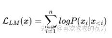
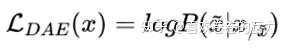
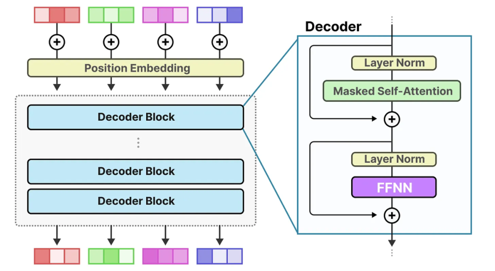
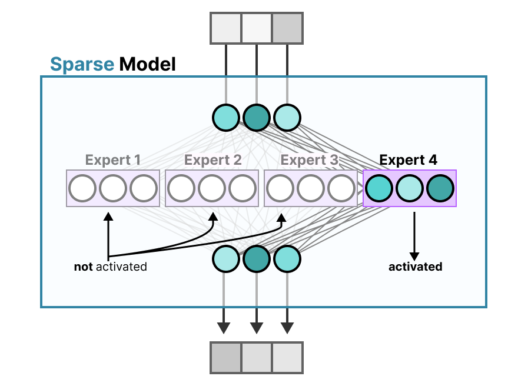
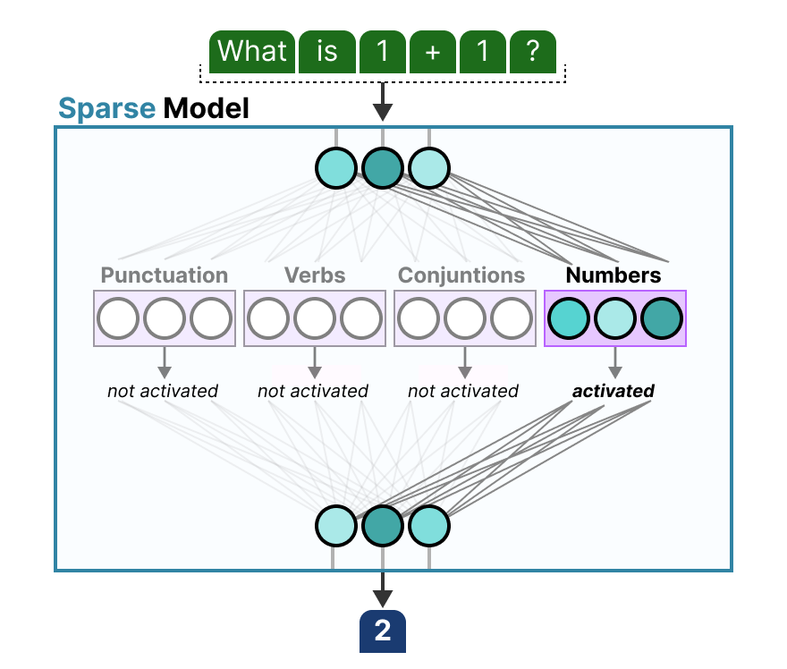

# sturcture

首先回顾 Transformer 的结构如下所示，**主要分为编码器 Encoder 和解码器 Decoder 两部分，且都是多层叠加**

* **Encoder：MHA + FFN + LN\&Add，采用双向注意力机制，前后的token都能看到**

* **Decoder：**&#x5148;是 **Masked MHA + LN\&Add，单向注意力，当前token只能看到自己之前的token，防止未来信息泄露，预测下一个token只能利用之前的信息**，然后接&#x4E0A;**&#x20;Cross MHA（Encoder-Decoder Attention Layer），通过编码器输出的上下文信息来关注解码器这里的序列的相关部分，最后解码器生成与输入匹配的输出序列**

## Dense Model 稠密模型

**Dense 模型**是相&#x5BF9;**&#x20;MoE（混合专家来说的）**，一般常见的模型大部分都是稠密参数模型，**每次推理都会激活全部的参数**

### Decoder-only

模型仅包含解码器，采用 “自回归生成” 模式，生成每个 token 时只能依赖前面已生成的 token，无法看到后面的内容，符合语言的时序逻辑。

- 注意力机制方式：**从左到右的单向注意力**
- 特点：[自回归语言模型](https://zhida.zhihu.com/search?content_id=242564340&content_type=Article&match_order=1&q=自回归语言模型&zhida_source=entity)，预训练和下游应用是完全一致的，严格遵守只有后面的token才能看到前面的 token的规则
- 适用任务：文本生成任务效果好
- 优点：训练效率高，[zero-shot 能力](https://zhida.zhihu.com/search?content_id=242564340&content_type=Article&match_order=1&q=zero-shot+能力&zhida_source=entity)更强，具有涌现能力
- 代表模型：LLaMA-7B、LLaMa 衍生物

### &#x20;         **Prefix Decoder**

- 核心逻辑：在模型输入前添加 “前缀序列”，**通过前缀编码引导模型生成特定风格、格式或内容的输出**，生成部分仍采用自回归方式。
- 关键特征：前缀与生成内容分离，**前缀负责 “指令 / 条件约束”**，生成部分遵循因果掩码（只能看到前面的 token）。
- 典型代表：Prefix Tuning 优化后的模型、部分可控生成大模型（如用于特定领域文案生成的定制模型）。
- 适用场景：需要强可控性的任务，比如固定格式的报告生成、特定风格的文案创作、按规则回复的客服对话。
- 注意力机制方式：输入双向注意力，输出单向注意力
- 特点：prefix部分的token互相能看到，属于causal Decoder 和 Encoder-Decoder 折中
- 代表模型：ChatGLM、ChatGLM2、U-PaLM
- 缺点：训练效率低

### &#x20;       **Encoder-Decoder**

- 注意力机制方式：**输入双向注意力，输出单向注意力**
- 特点：在**输入上采用双向注意力**，对问题的编码理解更充分
- 适用任务：在偏**理解**的 NLP 任务上效果好
- 缺点：在长文本**生成任务上效果差，训练效率低**
- 代表模型：T5、Flan-T5、BART

**Encoder-Decoder和Decoder-only示意图**

### ** 训练目标**

这里提供两种常见的目标，一种是最通用的语言模型目标，一种是[去噪自编码器](https://zhida.zhihu.com/search?content_id=242564340&content_type=Article&match_order=1&q=去噪自编码器&zhida_source=entity)。

**1. 语言模型**

根据已有词预测下一个词，训练目标为最大似然函数，公式如下

训练效率：Prefix Decoder < Causal Decoder

**Causal Decoder 结构会在 所有 token 上计算损失，而 Prefix Decoder 只会在 输出上 计算损失**。

**2. 去噪自编码器**

随机替换掉一些文本段，训练语言模型去恢复被打乱的文本段。目标函数为:

**去噪自编码器的实现难度更高**。采用去噪自编码器作为训练目标的任务有GLM-130B、T5。

## [MOE](https://newsletter.maartengrootendorst.com/p/a-visual-guide-to-mixture-of-experts)

Mixture of Experts混合专家

**混合专家（MoE）**是一种利用多个不同的子模型（专家）来提升LLM质量的技术。**每个混合专家（MoE）层的组成形式通常是 𝑁 个「专家网络」{𝑓\_1, ... , 𝑓\_𝑁} 搭配一个「门控网络」G。MoE 层的放置位置是在 Transformer 模块内，作用是选取前向网络（FFN），通常位于自注意力子层之后。这种放置方式很关键，因为随着模型增大，FFN 的计算需求也会增加。**举个例子，在参数量达到 5400 亿的 PaLM 模型中，90% 的参数都位于其 FFN 层中

* **专家 Expert：**每个前馈神经网络（FFN）层都有一组“专家”，可以选择其中的一部分。这些“专家”通常也是FFN

* **路由或门控网络 Router/Gate：**这个门控网络的形式通常是一个使用**softmax 激活函数的线性网络**，其作用是将输入引导至合适的专家网络，也就是决定哪些token发送到哪些专家

**典型模型：Deepseek V2/V3、Mistral 8x7B**

**MoE模型路由示意图**

需要注意的是，“专家”并不专注于特定领域，如“心理学”或“生物学”，**专家的专长是在特定上下文中处理特定token**

**密集层（Dense层）**

* **FFN**使模型能够利用由注意力机制创建的上下文信息，进一步学习捕捉数据中更复杂的关系

* 然而，FFN的规模会迅速增长。**为了学习这些复杂关系，它通常会扩展接收到的输入（中间层维度扩展）**

* 密集模型的**输入激活了所有参数**

> **稀疏层（Sparse层）**
>
> * 稀疏模型**仅激活其总参数的一部分**，与混合专家密切相关
>
> * 可以将**密集模型分割成片段**（即专家），重新训练，在**给定时间仅激活一部分专家**
>
> * 其基本思想是**每个专家在训练过程中学习不同的信息。然后，在运行推理时，仅使用与特定任务最相关的专家**

### **专家学习的内容**

# Decoder