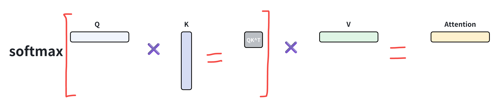
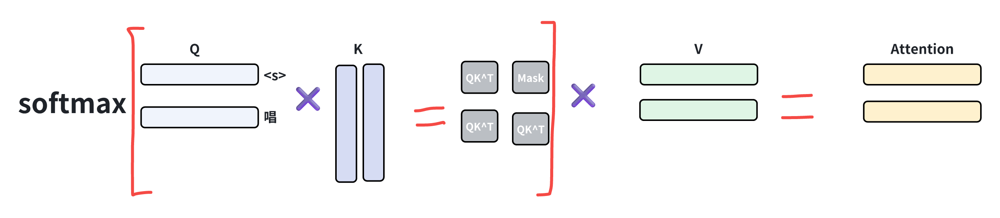
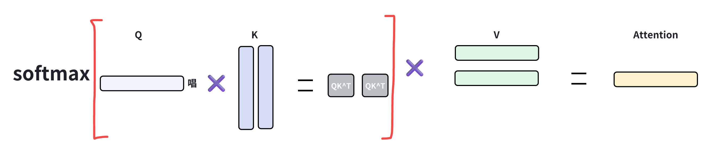

# **1.3.1 Attention介绍**

## **Attention核心思想及理解**

> **Attention机制处理时序问题**，核心思想是在处理序列数据时，**网络应该更关注输入中的重要部分，而忽略不重要的部分**，通过学习不同部分的权重，将输入的序列中的**重要部分显式地加权**，从而使得模型可以更好地关注与输出有关的信息。传统的**循环神经网络（RNN）或卷积神经网络（CNN）在处理整个序列时，难以捕捉到序列中不同位置的重要程度**，可能导致信息传递不够高效，特别是在处理长序列时表现更明显
>
> **Transformer**中使用的 **Scaled Dot-Product Attention 缩放点积注意力 公式及计算示意图，**&#x5176;中 **Q 和 K 用来产生重要性权重，然后加权 V 做聚合输出**


> ### **Attention思想理解**
>
> Attention机制核心组件**Query、Key以及Value**
>
> * **`Query`:  寻找的信息**
>
> * **`Key`:  包含的信息**
>
> * **`Value`：需要进行加权的值，**&#x8DDF;key类似
>
> 序列当中**某个位置的Query点积序列中其他所有位置的Keys，产生了相应的权重**，然后**了解有关特定token的更多信息**，对于序列中其他token则较少的了解和关注
>
> 一个很形象的例子，第N个token，再经过vocab embed和position embed之后，我知道我有什么信息，我知道我在哪，基于此生成query即我需要什么样的信息，key的维度里面就是表示自己的信息和位置（对应的地方值会较大）。当在embed空间里面进行点乘的时候，这些查询和键对应的地方就会得到很大的值，（不对应则会产生很小的值）也就是对于我来说，我最终会聚合更多的这个key的信息在我的输出中，然后从这个相关性高的里面学习更多信息&#x20;
>
> > 我是一个元音，我在第八个位置, 我正在寻找直到当前位置的任何辅音
>
> 最终的weights表示，我从各个token中聚合了多少信息

> ### **Attention为什么要除以$$sqrt(d_k)$$？**
>
> **Scaled是指对注意力权重进行缩放，以确保数值的稳定性，通过除以** $$sqrt(d_k)$$**实现**
>
> **当Query和Key向量的维度&#x20;**$$d_k$$**&#x20;较大时，两个向量的长度比较长时，两个向量的相对差距就会变大。值最大的那个值做出来的softmax会更加靠近1，剩下的会更加靠近0。值的分布会更加向两端靠拢，此时计算梯度的时候，梯度比较小，就会跑不动。联想给数据乘以更大的正数，softmax会更接近onehot，这样初始的时候就去聚集一个不准的节点的信息是不利于学习的。Scale相当于控制初始化的时候的方差**
>
> > 刚开始训练的时候，梯度较小不是一个好的情况。因为训练初期，模型还没找到一个合适的参数空间，梯度较小表明模型还没有开始学习，需要更多的训练才能得到好的结果；当模型的初始参数已经非常接近最优解，此时的梯度可能会很小，因为模型已经处于一个相对平坦的区域，此时小梯度可以帮助模型更稳定地收敛到最优解，避免出现震荡和过拟合的情况

# **1.3.2 Transformer中的Attention**


## **Encoder和Decoder中的Self-Attention**

> **&#x20;QKV来自同样的原始序列的**， 只希望关注自己节点的互相交流的信息，查询、键和值都来自同一个输入序列。主要目的是**捕捉输入序列内部的依赖关系**。在Transformer的编码器（Encoder）和解码器（Decoder）的每一层都有自注意力，它允许输入序列的每个部分关注序列中的其他部分，区别在于：**Encoder中的self-attention是当前位置的token与序列全部token计算，Decoder中的self-attention是当前位置的token只与在他之前的token计算（Masked Attention/Casual Attention），为了避免解码过程中的信息泄漏**

```plain&#x20;text
获取输入的原始数据 X = input
转换为Embedding并加上位置编码 X = emb(X) + pe(X)
然后从X获取Q、K、V向量 Q, K, V = Qlinear(X) + Klinear(X) + Vlinear(X)
计算Attention输出 Attention = softmax(QK^T / sqrt(d)) * V
```

## **Decoder中的Cross-Attention：**

> **QKV来自不同的序列，**&#x6709;一些其他的节点，我们希望把他们的信息融合到自己的节点上。**查询来自一个输入序列，而键和值来自另一个输入序列**。主要出现在Transformer的解码器。它允许解码器关注编码器的输出。**交叉注意力的思想是使一个序列能够“关注”另一个序列。在许多场景中，这可能很有用，例如在机器翻译中，将输入序列（源语言）的部分与输出序列（目标语言）的部分对齐是有益的**
>
> > 对于decoder来说，第一个attention模块是Masked Self-Attention，第二个则是 Cross-Attention模块

```plain&#x20;text
获取输入的原始数据 X = input
转换为Embedding并加上位置编码 X = emb(X) + pe(X)
# KV：encoder_output，Q：X
然后从X获取Q向量 Q= Qlinear(X)，KV则是直接从Encoder输出拿
计算Attention输出 Attention = softmax(QK^T / sqrt(d)) * V
```

# **1.3.3 Attention计算复杂度的优化**

Self Attention的时间复杂度是$$O(N^2)
$$的，它要对序列中的**任意两个向量都要计算相关度**，得到一个$$N^2$$大小的相关度矩阵，图示如下：


## **Sparse Attention**

> **主要原理是空洞attention和local attention的mixture**
>
> 从注意力矩阵上看**除了相对距离不超过k的、相对距离为k,2k,3k,…的注意力都设为0**，这样一来Attention就具有“**局部紧密相关和远程稀疏相关**”的特性，这对很多任务来说可能是一个不错的先验，因为真正需要密集的长程关联的任务事实上是很少的。
>
> 但是很明显，这种思路有两个**不足之处**:
>
> 1. 如何选择要保留的注意力区域，这是人工主观决定的，带有很大的不智能性
>
> 2. 它需要从编程上进行特定的设计优化，才能得到一个高效的实现，所以它不容易推广


```python
# 只计算Window内的attention，这里只意会一下原理
def apply_sparse_attention(self, attention):   
    N, heads, query_len, key_len = attention.shape                  
    for i in range(N):             
        for j in range(heads):                 
            for q in range(query_len):                     
                start = max(0, q - self.window_size)                     
                end = min(key_len, q + self.window_size + 1)                     
                attention[i, j, q, :start] = 0                     
                attention[i, j, q, end:] = 0
    return attention
# 完整的Sparse Attention实现可以参考 https://github.com/openai/sparse_attention/blob/master/attention.py
```

## **Linear Attention**

> **主要思想就是将softmax拿掉，然后先算K转置V，这样算法复杂度从$$O(N^2d)
> $$变为$$O(Nd^2)
> $$的接近线性**
>
> Softmax是为了从 $$QK^T$$得到非负的权重值，如果有其他方法也可以得到，那么就可以去掉softmax，从而根据矩阵运算规律去先算 $$K^TV$$
>
> > 注意 $$QKV$$向量的矩阵都是 $$N\times d$$的，矩阵 $$A∈R^{m×n}, B∈R^{n×k}$$，矩阵乘法 $$A \times B$$的复杂度为 $$O(mnk)$$
>
> 可以使用**核函数形式**的线性attention，使用两个非负的激活函数处理：
>
> $$Attention(Q, K, V)_i = \frac{\sum_{j = 1}^{n} \text{sim}(q_i, k_j)v_j}{\sum_{j = 1}^{n} \text{sim}(q_i, k_j)}$$
>
> $$sim(q_i, k_j) = \phi(q_i)^{\top} \phi(k_j)$$
>
> 如果“Q在d那一维是归一化的、并且K在n那一维是归一化的”，那么 $$QK^T$$就是自动满足归一化了：
>
> $$Attention(\boldsymbol{Q},\boldsymbol{K},\boldsymbol{V})=softmax_{2}\left(\boldsymbol{Q}\right)softmax_{1}(\boldsymbol{K})^{\top}\boldsymbol{V}$$
>
> 其中`softmax1`、`softmax2`分别指在第一个 $$n$$、第二个维度 $$d$$进行Softmax运算。也就是说，这时候我们是各自给 $$QK$$加`Softmax`，而不是算完 $$QK^T$$之后才加Softmax
>
> 如果直接取 $$\phi(\boldsymbol{q}_i)=softmax(\boldsymbol{q}_i),\varphi(\boldsymbol{k}_j)=softmax(\boldsymbol{k}_j)$$。另外这个设计在CV中出现过不止一次，比如[A2-Nets](https://papers.nips.cc/paper/7318-a2-nets-double-attention-networks.pdf)也包含了同样的做法


一种实现方式，完整代码在：https://github.com/lucidrains/linear-attention-transformer

```python
def linear_attn(q, k, v, kv_mask = None):
    dim = q.shape[-1]

    if exists(kv_mask):
        mask_value = max_neg_value(q)
        mask = kv_mask[:, None, :, None]
        k = k.masked_fill_(~mask, mask_value)
        v = v.masked_fill_(~mask, 0.)
        del mask

    q = q.softmax(dim=-1)
    k = k.softmax(dim=-2)

    q = q * dim ** -0.5

    context = einsum('bhnd,bhne->bhde', k, v)
    attn = einsum('bhnd,bhde->bhne', q, context)
    return attn.reshape(*q.shape)
```

# **1.3.4 KV Cache 键值缓存**

> **一句话总结**：`k`和`v`指的分别是`attention`机制中的`key`和`value`的状态值，`kv cache`只出现在`transformer`结构的自回归的`decoder`中，其是为了避免`scaled dot-product attention`过程中的重复计算。

## **KV Cache 原理**

> **KVCache：**&#x4E3B;流的自回归LLM所用的**Causal Attention**，在token by token递归**推理生成**时，每次计算当前token的attention的时候，**都需要用到序列前面的所有token的K和V**，因此为了避免重新再计算一遍这部分，可以将之前序列token计算过的KV缓存下来用，这就是**KVCache技术**
>
> 下图所示，第三行仅根据第三个Q和前三个KV向量确定，后续token不会影响它
>
> **前置条件**：矩阵可以分块，那么将矩阵A拆分为`[:s], [s]`两部分，分别和矩阵B相乘，那么最终结果可以直接拼接，该结果与不分拆结果一致


* **不使用KV Cache的生成流程**

如果模型的输出目标是“唱跳篮球”，我们看生成第一个字“唱”时，Attention的计算流程：



当模型生成第二个“跳”字时，input="\<s>唱", Attention的计算如下：



写详细一点如下，softmaxed 表示已经按行进行了softmax

&#x20;                                $$Att_{step2}(Q, K, V) = softmax\begin{bmatrix} Q_1K_1^T & -\infty \\ Q_2K_1^T & Q_2K_2^T \end{bmatrix} \begin{bmatrix} \vec{V_1} \\ \vec{V_2} \end{bmatrix} \\  = \begin{bmatrix} softmaxed(Q_1K_1^T) & softmaxed(-\infty) \\ softmaxed(Q_2K_1^T) & softmaxed(Q_2K_2^T) \end{bmatrix} \begin{bmatrix} \vec{V_1} \\ \vec{V_2} \end{bmatrix} \\ = \begin{bmatrix} softmaxed(Q_1K_1^T) & 0 \\ softmaxed(Q_2K_1^T) & softmaxed(Q_2K_2^T) \end{bmatrix} \begin{bmatrix} \vec{V_1} \\ \vec{V_2} \end{bmatrix} \\ = \begin{bmatrix} softmaxed(Q_1K_1^T) \times \vec{V_1} + 0 \times \vec{V_2} \\ softmaxed(Q_2K_1^T) \times \vec{V_1} + softmaxed(Q_2K_2^T) \times \vec{V_2} \end{bmatrix} \\ = \begin{bmatrix} softmaxed(Q_1K_1^T) \times \vec{V_1} \\ softmaxed(Q_2K_1^T) \times \vec{V_1} + softmaxed(Q_2K_2^T) \times \vec{V_2} \end{bmatrix}$$

假设 `Att1(Q,K,V)` 表示 `Attention` 的第一行， `Att2(Q,K,V) `表示 `Attention` 的第二行，则根据上面推导:

&#x20;                           $$Att_{1}(Q,K,V) = \text{softmaxed}(Q_{1}K_{1}^{T})\vec{V_{1}} \\
Att_{2}(Q,K,V) = \text{softmaxed}(Q_{2}K_{1}^{T})\vec{V_{1}} + \text{softmaxed}(Q_{2}K_{2}^{T})\vec{V_{2}}$$

* **使用KV Cache的情况**

1. 第一步和不使用KV Cache完全一致。

2. 对于第二步，假设 $$Att_1$$  表示 Attention 的第一行， $$Att_2$$ 表示 Attention 的第二行，则根据上面推导，其计算公式为：

$$Att_1(Q,K,V) = softmax(Q_1, K_1^T)V_1$$

$$Att_2(Q,K,V) = softmax(Q_2, K_1^T,)V_1+softmax(Q_2, K_2^T)V_2$$

会发现，由于 $$Q_1K_2^T$$这个值会被mask掉，$$Q_1$$在第二步参与的计算与第一步是一样的，而且第二步生成的 $$V_1$$也仅仅依赖于 $$Q_1$$。 $$V_2$$的计算也仅仅会依赖于 $$Q_2$$，与 $$Q_1$$无关。

所以第二步可简化为下图，后面的token以此类推



* **Hugging face的KV Cache实现**

```python
if layer_past is not None:
        past_key, past_value = layer_past
        key = torch.cat((past_key, key), dim=-2)
        value = torch.cat((past_value, value), dim=-2)
    
    if use_cache is True:
        present = (key, value)
    else:
        present = None
    
    if self.reorder_and_upcast_attn:
        attn_output, attn_weights = self._upcast_and_reordered_attn(query, key, value, attention_mask, head_mask)
    else:
        attn_output, attn_weights = self._attn(query, key, value, attention_mask, head_mask)
```

> ### **KV Cache 占用显存分析**
>
> 存储 kv\_length 个 KV value，形状为 `[b, head_num, kv_seq_len, head_dim]`，假设输入序列的长度为 s ，输出序列的长度为 n ，以 FP16 来保存KV cache，那么KV cache的峰值显存占用大小为 $$b(s+n)h∗l∗2∗2=4blh(s+n)$$，这里第一个2表示K/V cache，第二个2表示 FP16 占2个bytes，以 GPT3 (175B) 为例，对比 KV cache 与模型参数占用显存的大小。GPT3模型weight占用显存大小为350GB (FP16)，层数 $$l$$为96，维度 $$h$$ 为12888

## **KV Cache 优化方法**

> 1. **共用 KV cache：MQA，GQA 见1.3.5章 [ 1.3 Attention 注意力](https://kcnd4kn8i6ap.feishu.cn/wiki/SUHDwvtwLiyigUkbMk5c49sPnHW#share-RkpNd6VnmoeP3MxuYdvcKuZWnGb)**
>
> 2. **窗口优化：**
>
>    KV cache 的作用是计算 attention，当推理时的文本长度 T 大于训练时的最大长度 L 时，一个自然的想法就是**滑动窗口**。这里又有三种方式：
>
>    * **固定窗口长度**（图 b），典型代表即 Longformer，该方法实现简单，而空间复杂度只有 O(TL) ，但是精度下降比较大
>
>    * **KV 重计算**（图 c），该方法需要每次计算都重新计算长度为L的 KV cache，由于重计算的存在，其精度可以保证，但是性能损失比较大
>
>    * **箭型 attention 窗口**，在 [LM-Infinit](https://arxiv.org/pdf/2308.16137.pdf) 中就已经被提出了，其基本原理和 [StreamingLLM](https://arxiv.org/pdf/2309.17453.pdf) 是一致的
>
> 3. **量化与稀疏：**&#x5F53;前主流推理框架都在逐步支持 KV Cache 量化，一个典型的案例是 [lmdeploy](https://github.com/InternLM/lmdeploy)
>
> 4. **存储与计算优化：**
>
>    * [vLLM](https://github.com/vllm-project/vllm) 的 PagedAttention，简单来说就是允许在非连续的内存空间中存储连续的 K 和 V
>
>    * FlashDecoding 是在 FlashAttention 的基础上针对 inference 的优化主要分为三步：
>
>      * 长文本下将KV分成更小且方便并行的chunk
>
>      * 对每个chunk的KV，Q和他们进行之前一样的FlashAttention获取这个chunk的结果
>
>      * 对每个chunk的结果进行reduce


**窗口优化示意图**


**FlashDecoding示意图**

# **1.3.5 缓存与效果的取舍：MHA到MLA**


## **Multi-head Attention**

原始transformer中的attention也是MHA，每一个`head`的`head_size`将变为原始`embed_size`的`1/num_head`，类似group卷积，类似于**建立了很多个交流通道，每个交流通道关注的信息细节不一样，也就是每一个头可以关注到序列中不同子空间的特征**


* **手撕MHA代码：**

**这部分代码在代码子文档，记得在在文档首页去点击链接下载**


```python
import torch
from torch import nn
class MutiHeadAttention(torch.nn.Module):
    def __init__(self, hidden_size, num_heads):
        super(MutiHeadAttention, self).__init__()
        self.num_heads = num_heads
        self.head_dim = hidden_size // num_heads
        
        ## 初始化Q、K、V投影矩阵
        self.q_linear = nn.Linear(hidden_size, hidden_size)
        self.k_linear = nn.Linear(hidden_size, hidden_size)
        self.v_linear = nn.Linear(hidden_size, hidden_size)
        ## 输出线性层
        self.o_linear = nn.Linear(hidden_size, hidden_size)
        
    def forward(self, hidden_state, attention_mask=None):
        batch_size = hidden_state.size()[0]
        
        query = self.q_linear(hidden_state)
        key = self.k_linear(hidden_state)
        value = self.v_linear(hidden_state)
        
        query = self.split_head(query)
        key = self.split_head(key)
        value = self.split_head(value)
        
        ## 计算注意力分数
        attention_scores = torch.matmul(query, key.transpose(-1, -2)) / torch.sqrt(torch.tensor(self.head_dim))
        
        if attention_mask != None:
            attention_scores = attention_scores.masked_fill(attention_mask == 0, float('-inf'))
        ## 对注意力分数进行归一化
        attention_probs = torch.softmax(attention_scores, dim=-1)
        
        output = torch.matmul(attention_probs, value)
        ## 对注意力输出进行拼接
        output = output.transpose(1, 2).contiguous().view(batch_size, -1, self.head_dim * self.num_heads)
        
        output = self.o_linear(output)
        return output

    def split_head(self, x):
        batch_size = x.size()[0]
        return x.view(batch_size, -1, self.num_heads, self.head_dim).transpose(1,2)
```

## **Multi-query Attention**

**所有的query head 共享KV，MQA对KV Cache的压缩太严重，以至于会影响模型的学习效率以及最终效果**

* **手撕MQA代码：**

```python
 ## 多查询注意力
import torch
from torch import nn
class MutiQueryAttention(torch.nn.Module):
    def __init__(self, hidden_size, num_heads):
        super(MutiQueryAttention, self).__init__()
        self.num_heads = num_heads
        self.head_dim = hidden_size // num_heads
        
        ## 初始化Q、K、V投影矩阵
        self.q_linear = nn.Linear(hidden_size, hidden_size)
        self.k_linear = nn.Linear(hidden_size, self.head_dim) ###
        self.v_linear = nn.Linear(hidden_size, self.head_dim) ###
        
        ## 输出线性层
        self.o_linear = nn.Linear(hidden_size, hidden_size)
        
    def forward(self, hidden_state, attention_mask=None):
        batch_size = hidden_state.size()[0]
        
        query = self.q_linear(hidden_state)
        key = self.k_linear(hidden_state)
        value = self.v_linear(hidden_state)
        
        query = self.split_head(query)
        key = self.split_head(key, 1)
        value = self.split_head(value, 1)
        
        key = key.expand(-1, self.num_heads, -1, -1)        
        value = value.expand(-1, self.num_heads, -1, -1) 
        
        ## 计算注意力分数
        attention_scores = torch.matmul(query, key.transpose(-1, -2)) / torch.sqrt(torch.tensor(self.head_dim))
        
        if attention_mask != None:
            attention_scores = attention_scores.masked_fill(attention_mask == 0, float('-inf'))
        
        ## 对注意力分数进行归一化
        attention_probs = torch.softmax(attention_scores, dim=-1)
        
        output = torch.matmul(attention_probs, value)
        
        output = output.transpose(1, 2).contiguous().view(batch_size, -1, self.head_dim * self.num_heads)
        
        output = self.o_linear(output)
        
        return output       
        
    def split_head(self, x, head_num=None):
        
        batch_size = x.size()[0]
        
        if head_num == None:
            return x.view(batch_size, -1, self.num_heads, self.head_dim).transpose(1,2)
        else:
            return x.view(batch_size, -1, head_num, self.head_dim).transpose(1,2)
```

## **Grouped-query Attention**

**将query分成g组，每组的query共享KV，平衡效果和缓存**

* **手撕GQA代码：**

```python
import torch
import torch.nn as nn
import torch.nn.functional as F

class GroupQueryAttention(nn.Module):
    def __init__(self, embed_dim=512, num_heads=8, groups=2, dropout=0.1):
        super().__init__()
        # assert embed_dim % num_heads == 0, "embed_dim must be divisible by num_heads"
        # assert num_heads % groups == 0, "num_heads must be divisible by groups"
        
        self.embed_dim = embed_dim
        self.num_heads = num_heads
        self.groups = groups
        self.head_dim = embed_dim // num_heads
        self.group_heads = num_heads // groups  # 每个组的头数

        # 注意KV的投影维度是groups * head_dim
        self.q_proj = nn.Linear(embed_dim, embed_dim)
        self.k_proj = nn.Linear(embed_dim, self.groups * self.head_dim)
        self.v_proj = nn.Linear(embed_dim, self.groups * self.head_dim)
        
        self.out_proj = nn.Linear(embed_dim, embed_dim)
        self.dropout = nn.Dropout(dropout)

    def forward(self, x, key_padding_mask=None):
        # x: (batch_size, seq_len, embed_dim)
        batch_size, seq_len, _ = x.size()
        
        # 投影QKV
        q = self.q_proj(x)  # (batch, seq_len, embed_dim)
        k = self.k_proj(x)  # (batch, seq_len, groups*head_dim)
        v = self.v_proj(x)  # (batch, seq_len, groups*head_dim)
        
        # 调整维度，为注意力计算做准备
        q = q.view(batch_size, seq_len, self.num_heads, self.head_dim).transpose(1, 2)
        k = k.view(batch_size, seq_len, self.groups, self.head_dim).permute(0, 2, 3, 1)  # (batch, groups, head_dim, seq_len)
        v = v.view(batch_size, seq_len, self.groups, self.head_dim).transpose(1, 2)  # (batch, groups, seq_len, head_dim)
        
        # 扩展KV以匹配组的头数
        k = k.unsqueeze(2).expand(-1, -1, self.group_heads, -1, -1).contiguous()
        k = k.view(batch_size, self.num_heads, self.head_dim, seq_len)
        v = v.unsqueeze(2).expand(-1, -1, self.group_heads, -1, -1).contiguous()
        v = v.view(batch_size, self.num_heads, seq_len, self.head_dim)
        
        # 计算注意力分数
        attn_scores = torch.matmul(q, k)  # (batch, num_heads, seq_len, seq_len)
        attn_scores = attn_scores / (self.head_dim ** 0.5)
        
        if key_padding_mask is not None:
            # 处理padding mask (batch, seq_len)
            mask = key_padding_mask.view(batch_size, 1, 1, seq_len)
            attn_scores = attn_scores.masked_fill(mask == 0, float('-inf'))
        
        attn_weights = F.softmax(attn_scores, dim=-1)
        attn_weights = self.dropout(attn_weights)
        
        # 加权求和
        output = torch.matmul(attn_weights, v)  # (batch, num_heads, seq_len, head_dim)
        output = output.transpose(1, 2).contiguous().view(batch_size, seq_len, -1)
        
        return self.out_proj(output)

# 测试用例
if __name__ == "__main__":
    batch_size = 2
    seq_len = 10
    d_model = 512
    num_heads = 8
    groups = 2
    
    gqa = GroupQueryAttention(d_model, num_heads, groups)
    x = torch.randn(batch_size, seq_len, d_model)
    output = gqa(x)
    print(output.shape)  # 应该保持 (2, 10, 512)
```

* **带KVCache版本的手撕：**


```python
import torch
import torch.nn as nn
import math
import torch.nn.functional as F
from typing import *

class Attention(nn.Module):
    def __init__(self, args):
        super(GroupedQueryAttention, self).__init__()
        assert d_model % num_heads == 0
        assert num_heads % num_groups == 0
        self.num_heads = num_heads
        self.head_dim = d_model // num_heads
        self.num_groups = num_groups
        self.group_dim = self.head_dim * num_groups
        self.d_model = d_model        
        # Linear layers for Query, Key, and Value
        self.wq = nn.Linear(d_model, d_model)
        self.wk = nn.Linear(d_model, self.group_dim)  # Shared Key per group
        self.wv = nn.Linear(d_model, self.group_dim)  # Shared Value per group        
        self.fc = nn.Linear(d_model, d_model)  
        self.cache_k = torch.zeros(
            (args.max_batch_size, args.max_seq_len, self.n_local_heads, self.head_dim)
        ).cuda()
        self.cache_v = torch.zeros(
            (args.max_batch_size, args.max_seq_len, self.n_local_heads, self.head_dim)
        ).cuda()

    def forward(self, x: torch.Tensor, start_pos: int, freqs_cis: torch.Tensor, mask: Optional[torch.Tensor] = None):
        bsz, seqlen, _ = x.shape
        xq, xk, xv = self.wq(x), self.wk(x), self.wv(x)

        xq = xq.view(bsz, seqlen, self.n_local_heads, self.head_dim)
        xk = xk.view(bsz, seqlen, self.n_local_heads, self.head_dim)
        xv = xv.view(bsz, seqlen, self.n_local_heads, self.head_dim)

        xq, xk = apply_rotary_emb(xq, xk, freqs_cis=freqs_cis)

        self.cache_k = self.cache_k.to(xq)
        self.cache_v = self.cache_v.to(xq)

        self.cache_k[bsz, start_pos : start_pos + seqlen] = xk
        self.cache_v[bsz, start_pos : start_pos + seqlen] = xv

        keys = self.cache_k[bsz, : start_pos + seqlen]
        values = self.cache_v[bsz, : start_pos + seqlen]


    def forward(self, x, mask=None):
        batch_size = x.size(0)      
        # Linear projections
        q = self.wq(x)  # (batch_size, seq_len, d_model)
        k = self.wk(x)  # (batch_size, seq_len, group_dim)
        v = self.wv(x)  # (batch_size, seq_len, group_dim)  
        
        self.cache_k = self.cache_k.to(q.device)
        self.cache_v = self.cache_v.to(q.device)

        self.cache_k[bsz, start_pos : start_pos + seqlen] = k
        self.cache_v[bsz, start_pos : start_pos + seqlen] = v

        k = self.cache_k[bsz, : start_pos + seqlen]
        v = self.cache_v[bsz, : start_pos + seqlen]    
        # Split Query into heads
        q = self.split_heads(q, batch_size)  # (batch_size, num_heads, seq_len, head_dim)        
        # Split Key and Value into groups and expand within the group
        k = k.view(batch_size, -1, self.num_groups, self.head_dim)
        v = v.view(batch_size, -1, self.num_groups, self.head_dim)        
        k = k.repeat(1, 1, 1, self.num_heads // self.num_groups)
        v = v.repeat(1, 1, 1, self.num_heads // self.num_groups)      
        k = k.view(batch_size, -1, self.num_heads, self.head_dim)
        v = v.view(batch_size, -1, self.num_heads, self.head_dim)        
        # Scaled Dot-Product Attention
        scores = torch.matmul(q, k.transpose(-1, -2)) / math.sqrt(self.head_dim)  # (batch_size, num_heads, seq_len, seq_len)
        if mask is not None:
            scores = scores.masked_fill(mask == 0, -1e9)        
        attention_weights = F.softmax(scores, dim=-1)  # (batch_size, num_heads, seq_len, seq_len)
        output = torch.matmul(attention_weights, v)  # (batch_size, num_heads, seq_len, head_dim)      
        # Concatenate heads
        output = output.permute(0, 2, 1, 3).contiguous()  # (batch_size, seq_len, num_heads, head_dim)
        output = output.view(batch_size, -1, self.d_model)  # (batch_size, seq_len, d_model)       
        # Final linear layer
        output = self.fc(output)  # (batch_size, seq_len, d_model        
        return output, attention_weights
```

## **Multi-head Latent Attention**

### **MLA原理**

> **DeepseekV2**提出的优化MQA方法，**解决的核心问题是使用kv cache时，随着序列长度变长导致显存不足的问题**
>
> * **参考：**&#x68;ttps://arxiv.org/pdf/2405.04434，[【自然语言处理】【大模型】DeepSeek-V2论文解析\_deepseek v2-CSDN博客](https://blog.csdn.net/bqw18744018044/article/details/138751458)
>
> * **具体工程实现参考：**&#x68;ttps://zhuanlan.zhihu.com/p/714761319


> ### **MLA原理**
>
> 一般的MHA会把QKV分成 $$n_h$$个头：
>
> $$
> \begin{bmatrix}
> q_{t,1}; q_{t,2}; \ldots; q_{t,n_h}
> \end{bmatrix} = q_t
> \\
>
> \begin{bmatrix}
> k_{t,1}; k_{t,2}; \ldots; k_{t,n_h}
> \end{bmatrix} = k_t
>
> \\
> \begin{bmatrix}
> v_{t,1}; v_{t,2}; \ldots; v_{t,n_h}
> \end{bmatrix} = v_t
>
> \\
> o_{t,i} = \sum_{j = 1}^{t} \text{Softmax}_j \left( \frac{q_{t,i}^T k_{j,i}}{\sqrt{d_h}} \right) v_{j,i}
> \\
> u_t = W^o \begin{bmatrix}
> o_{t,1}; o_{t,2}; \ldots; o_{t,n_h}
> \end{bmatrix}
>  $$
>
> 在推理过程中，所有的key和value都需要被cache以加速推理，因此**MHA需要为每个token缓存 $$2n_h d_h l$$个元素，**&#x5728;模型部署时，这种**大量的KV Cache是一个瓶颈，它限制了最大batch size和序列长度**
>
> * **低秩KV压缩：** $$c_t^{KV} \in \mathbb{R}^{d_c} $$是hidden state压缩了的隐层向量，其中 $$d_c << d_hn_h$$是KV压缩维度， $$W^{DKV} \in\mathbb{R}^{d_c \times d} $$是降采样矩阵， $$W^{UK}, W^{UV} \in \mathbb{R}^{d_hn_h\times d_c} $$是KV的上投影矩阵
>
>   $$c_t^{KV} = W^{DKV} h_t \\
>    k_t^C = W^{UK} c_t^{KV} \\
>    v_t^C = W^{UV} c_t^{KV} $$
>
>   在推理的过程中，**MLA只需要缓存 $$c_t^{KV}$$，只有 $$d_cl$$个元素， $$l$$为层数；同时 $$W^{UK}, W^{UV}$$可以被融入 $$W^Q,W^O$$（query和output的矩阵），所以并不需要单独再计算KV**
>
>   同时MLA也对query做了低秩压缩，来减少训练中的激活值显存：
>
>   $$c_t^Q = W^{DQ} {h}_t  \\
>    q_t^C = {W}^{UQ} {c}_t^Q \\
>   c_t^Q \in \mathbb{R}^{d_c'}, W^{DQ}\in\mathbb{R}^{d_c'\times d},W^{UQ}\in\mathbb{R}^{d_nn_h\times d_c'}$$
>
> * **解耦的RoPE：RoPE与低秩KV Cache并不兼容**，前面的压缩的时候可以将 $$W^{UK}$$融进 $$W^{Q}$$但是在加上RoPE的情况下不行，回忆一下RoPE： $$(R_{m}q)^T (R_{n}k) = q^T R_{m}^T R_{n} k = q^T R_{m - n} k $$，query和key中间有一个跟位置相关的矩阵，那么$$W^{UK}R_{m-n}W^{Q}$$就不能合并成一个固定的投影矩阵了。
>
>   MLA给出的解决方案是用**额外的多头queries和共享的key去结合RoPE**：
>
>   $$
>\left [q_{t,1}^R; q_{t,2}^R; \ldots; q_{t,n_h}^R \right] = q_t^R = \text{RoPE}(W^{QR} c_t^Q)
>   
>\\
>   
>k_t^R = \text{RoPE}(W^{KR} h_t)
>   
>\\
>   
>q_{t,i} = [q_{t,i}^C; q_{t,i}^R]
>   
>\\
>   
>k_{t,i} = [k_{t,i}^C; k_{t}^R]
>   
>\\
>   
>o_{t,i} = \sum_{j = 1}^{t} \text{Softmax}_j \left( \frac{q_{t,i}^T k_{j,i}}{\sqrt{d_h + d_{h}^R}} \right) v_{j,i}^C
>   
>\\
>   
>u_t = W^O [o_{t,1}; o_{t,2}; \ldots; o_{t,n_h}]
>   $$
>    
>其中 $$d_n^R$$是单个head的维度， $$        W^{QR} \in \mathbb{R}^{d_{h} n_{h} \times d_{c}'}, W^{KR} \in \mathbb{R}^{d_{h} \times d}  $$是用来生成额外的解耦多头queries和共享key的矩阵，推理的时候需要把额外的共享key也缓存了，所以总共的缓存元素为 $$(d_c+d_n^R)l$$个


> ### **训练和推理阶段的MLA计算**
>
> * **训练阶段，dc'=3dc**
>
> $$
> \boldsymbol{o}_t=\left[\boldsymbol{o}_t^{(1)},\boldsymbol{o}_t^{(2)},\cdots,\boldsymbol{o}_t^{(h)}\right]\\
> \boldsymbol{o}_t^{(s)}=\text{Attention}\left(\boldsymbol{q}_t^{(s)},\boldsymbol{k}_{\leq t}^{(s)},\boldsymbol{v}_{\leq t}^{(s)}\right)\triangleq\frac{\sum_{i\leq t}\exp\left(\boldsymbol{q}_t^{(s)}\boldsymbol{k}_i^{(s)\top}\right)\boldsymbol{v}_i^{(s)}}{\sum_{i\leq t}\exp\left(\boldsymbol{q}_t^{(s)}\boldsymbol{k}_i^{(s)\top}\right)}\\
> \boldsymbol{q}_i^{(s)}=\left[\boldsymbol{c}_i'\boldsymbol{W}_{qc}^{(s)},\boldsymbol{c}_i'\boldsymbol{W}_{qr}^{(s)}\mathcal{R}_i\right]\in\mathbb{R}^{d_k + d_r},\boldsymbol{W}_{qc}^{(s)}\in\mathbb{R}^{d_c'\times d_k},\boldsymbol{W}_{qr}^{(s)}\in\mathbb{R}^{d_c'\times d_r}\\
> \boldsymbol{k}_i^{(s)}=\left[\boldsymbol{c}_i\boldsymbol{W}_{kc}^{(s)},\boldsymbol{x}_i\boldsymbol{W}_{kr}^{}\mathcal{R}_i\right]\in\mathbb{R}^{d_k + d_r},\boldsymbol{W}_{kc}^{(s)}\in\mathbb{R}^{d_c\times d_k},\boldsymbol{W}_{kr}^{}\in\mathbb{R}^{d\times d_r}\\
> \boldsymbol{v}_i^{(s)}=\boldsymbol{c}_i\boldsymbol{W}_v^{(s)}\in\mathbb{R}^{d_v},\boldsymbol{W}_v^{(s)}\in\mathbb{R}^{d_c\times d_v}\\
> \boldsymbol{c}_i'=\boldsymbol{x}_i\boldsymbol{W}_c'\in\mathbb{R}^{d_c'},\boldsymbol{W}_c'\in\mathbb{R}^{d\times d_c'}\\
> \boldsymbol{c}_i=\boldsymbol{x}_i\boldsymbol{W}_c\in\mathbb{R}^{d_c},\boldsymbol{W}_c\in\mathbb{R}^{d\times d_c}
>  $$
>
> * **推理阶段：MLA变为MQA形式**
>
> $$
> \boldsymbol{o}_t=\left[\boldsymbol{o}_t^{(1)}\boldsymbol{W}_v^{(1)},\boldsymbol{o}_t^{(2)}\boldsymbol{W}_v^{(2)},\cdots,\boldsymbol{o}_t^{(h)}\boldsymbol{W}_v^{(h)}\right]\\
> \boldsymbol{o}_t^{(s)}=\text{Attention}\left(\boldsymbol{q}_t^{(s)},\boldsymbol{k}_{\leq t}^{},\boldsymbol{c}_{\leq t}\right)\triangleq\frac{\sum_{i\leq t}\exp\left(\boldsymbol{q}_t^{(s)}\boldsymbol{k}_i^{\top}\right)\boldsymbol{c}_i}{\sum_{i\leq t}\exp\left(\boldsymbol{q}_t^{(s)}\boldsymbol{k}_i^{\top}\right)}\\
> \boldsymbol{q}_i^{(s)}=\left[\boldsymbol{c}_i'\boldsymbol{W}_{qc}^{(s)}\boldsymbol{W}_{kc}^{(s)\top},\boldsymbol{c}_i'\boldsymbol{W}_{qr}^{(s)}\mathcal{R}_i\right]\in\mathbb{R}^{d_c + d_r}\\
> \boldsymbol{k}_i^{}=\left[\boldsymbol{c}_i,\boldsymbol{x}_i\boldsymbol{W}_{kr}^{}\mathcal{R}_i\right]\in\mathbb{R}^{d_c + d_r}\\
> \boldsymbol{W}_{qc}^{(s)}\in\mathbb{R}^{d_c'\times d_k},\boldsymbol{W}_{kc}^{}\in\mathbb{R}^{d_c\times d_k},\boldsymbol{W}_{qr}^{(s)}\in\mathbb{R}^{d_c'\times d_r},\boldsymbol{W}_{kr}^{(s)}\in\mathbb{R}^{d\times d_r}\\
> \boldsymbol{c}_i'=\boldsymbol{x}_i\boldsymbol{W}_c'\in\mathbb{R}^{d_c'},\boldsymbol{W}_c'\in\mathbb{R}^{d\times d_c'}\\
> v_i=\boldsymbol{c}_i=\boldsymbol{x}_i\boldsymbol{W}_c\in\mathbb{R}^{d_c},\boldsymbol{W}_c\in\mathbb{R}^{d\times d_c}
>  $$

### **MLA代码解析**

直接看 **DeepseekV2Attention&#x20;**&#x7684;代码，贴一张论文附录的公式，方便对照代码注释看

**核心配置参数：**

```python
"hidden_size": 5120,
"kv_lora_rank": 512,
"moe_intermediate_size": 1536,  #V2是一个MoE模型
"q_lora_rank": 1536,
"qk_nope_head_dim": 128,
"qk_rope_head_dim": 64
```

**结论：**&#x76EE;前DeepseekV2官方实现在存储KV Cache的时候并不是存储隐向量，而是把隐向量都解压缩变成了标准的MHA的KV Cache，实际上是完全不能节省显存的（只是V2Attention中的实现）


```python
# Copied from transformers.models.llama.modeling_llama.LlamaAttention with Llama->DeepseekV2
class DeepseekV2Attention(nn.Module):
    """Multi-headed attention from 'Attention Is All You Need' paper"""

    def __init__(self, config: DeepseekV2Config, layer_idx: Optional[int] = None):
        super().__init__()

        self.attention_dropout = config.attention_dropout
        self.hidden_size = config.hidden_size
        self.num_heads = config.num_attention_heads

        self.max_position_embeddings = config.max_position_embeddings
        self.rope_theta = config.rope_theta
        # 对应 query 压缩后的隐向量的维度 d'_c
        self.q_lora_rank = config.q_lora_rank
        # 对应$d_h^R$， 表示应用了rope的 queries 和 key 的一个 head 的维度。
        self.qk_rope_head_dim = config.qk_rope_head_dim
        # 对应 key-value 压缩后的隐向量维度 d_c
        self.kv_lora_rank = config.kv_lora_rank
        # value 的一个注意力头的隐藏层为度
        self.v_head_dim = config.v_head_dim
        # 表示query和key的隐藏向量中应用rope部分的维度
        self.qk_nope_head_dim = config.qk_nope_head_dim
        # 每一个注意力头的维度应该是两部分只和
        self.q_head_dim = config.qk_nope_head_dim + config.qk_rope_head_dim

        self.is_causal = True
                         
        # MLA 中对 Q 投影矩阵也做了一个低秩分解，对应生成 q_a_proj 和 q_b_proj 两个矩阵。
        # 其中 q_a_proj 大小为 [hidden_size, q_lora_rank] = [5120, 1536]，
        # 对应上面公式中的W^DQ
        self.q_a_proj = nn.Linear(
            self.hidden_size, config.q_lora_rank, bias=config.attention_bias
        )
        self.q_a_layernorm = DeepseekV2RMSNorm(config.q_lora_rank)
        # q_b_proj 大小为 [q_lora_rank, num_heads * q_head_dim] = 
        # [q_lora_rank, num_attention_heads * (qk_nope_head_dim + qk_rope_head_dim)] = [1536, 128*(128+64)] = [1536, 24576] 
        # 对应上述公式中的W^UQ和W^QR合并后的大矩阵
        self.q_b_proj = nn.Linear(
            config.q_lora_rank, self.num_heads * self.q_head_dim, bias=False
        )
                # 与Q向量类似，KV向量的生成也是先投影到一个低维的 compressed_kv 向量（对应c_t^{KV}）
                # 再升维展开。具体的代码涉及 kv_a_proj_with_mqa 和 kv_b_proj 两个参数矩阵。
                # 其中 kv_a_proj_with_mqa 大小为 [hidden_size， kv_lora_rank + qk_rope_head_dim]
                # = [5120, 512 + 64] = [5120, 576]，对应上述公式中的W^{DKV}和W^{KR}。
        self.kv_a_proj_with_mqa = nn.Linear(
            self.hidden_size,
            config.kv_lora_rank + config.qk_rope_head_dim,
            bias=config.attention_bias,
        )
        self.kv_a_layernorm = DeepseekV2RMSNorm(config.kv_lora_rank)
     # kv_b_proj 大小为 [kv_lora_rank， num_heads * (q_head_dim - qk_rope_head_dim + v_head_dim)] 
     # = [512, 128*((128+64)-64+128)] = [512, 32768]，对应上述公式中的W^{UK}和W^{UV}。
     # 由于 W^{UK} 只涉及 non rope 的部分所以维度中把 qk_rope_head_dim 去掉了。
        self.kv_b_proj = nn.Linear(
            config.kv_lora_rank,
            self.num_heads
            * (self.q_head_dim - self.qk_rope_head_dim + self.v_head_dim),
            bias=False,
        )
                         # 对应完整公式的第 47 行
        self.o_proj = nn.Linear(
            self.num_heads * self.v_head_dim,
            self.hidden_size,
            bias=config.attention_bias,
        )
        
    def forward(
        self,
        hidden_states: torch.Tensor,
        attention_mask: Optional[torch.Tensor] = None,
        position_ids: Optional[torch.LongTensor] = None,
        past_key_value: Optional[Cache] = None,
        output_attentions: bool = False,
        use_cache: bool = False,
        **kwargs,
    ) -> Tuple[torch.Tensor, Optional[torch.Tensor], Optional[Tuple[torch.Tensor]]]:
        if "padding_mask" in kwargs:
            warnings.warn(
                "Passing `padding_mask` is deprecated and will be removed in v4.37. Please make sure use `attention_mask` instead.`"
            )
        # hidden_states对应公式中的h_t，的shape是(batch_size, seq_length,         
        # hidden_size)，其中 hidden_size 具体为 5120，假设batch_size和seq_length都为1
        bsz, q_len, _ = hidden_states.size()

        # 计算Q：对应完整公式中的 37-39 行，先降维再升维，好处是相比直接使用大小为 [5120, 24576] 的矩阵
       # [5120, 1536] * [1536, 24576] 这样的低秩分解在存储空间和计算量上都大幅度降低
        q = self.q_b_proj(self.q_a_layernorm(self.q_a_proj(hidden_states)))
        q = q.view(bsz, q_len, self.num_heads, self.q_head_dim).transpose(1, 2)
        # 切分 rope 和非 rope 部分，完整公式中 40 行反过来
        q_nope, q_pe = torch.split(
            q, [self.qk_nope_head_dim, self.qk_rope_head_dim], dim=-1
        )

        # 对应公式中的 41 和 43 行只是还没有加 rope
        # 一个优化的 MLA KVCache 实现只需要缓存这个 compressed_kv 就行
        # kv_a_proj_with_mqa shape 为[hidden_size， kv_lora_rank + qk_rope_head_dim]
                # = [5120, 512 + 64] = [5120, 576]
            # 所以compressed_kv的shape就是[1, 1, 576]
        compressed_kv = self.kv_a_proj_with_mqa(hidden_states)
        # 对应完整公式的 44 行反过来
        compressed_kv, k_pe = torch.split(
            compressed_kv, [self.kv_lora_rank, self.qk_rope_head_dim], dim=-1
        )
        # 这里的 k_pe 和 上面的 q_pe 要扔给 RoPE模块，所以需要重整下shape
        k_pe = k_pe.view(bsz, q_len, 1, self.qk_rope_head_dim).transpose(1, 2)
        # 对应公式中的 42 和 45 行，将 MLA 展开成标准 MHA 的形式
        kv = (
            self.kv_b_proj(self.kv_a_layernorm(compressed_kv))
            .view(bsz, q_len, self.num_heads, self.qk_nope_head_dim + self.v_head_dim)
            .transpose(1, 2)
        )
                         # 因为 kv_b_proj 打包了 W^{UK} 和 W^{UV} 把他们分离出来
        k_nope, value_states = torch.split(
            kv, [self.qk_nope_head_dim, self.v_head_dim], dim=-1
        )
        # 获取key/value的序列长度
        kv_seq_len = value_states.shape[-2]
        if past_key_value is not None:
            if self.layer_idx is None:
                raise ValueError(
                    f"The cache structure has changed since version v4.36. If you are using {self.__class__.__name__} "
                    "for auto-regressive decoding with k/v caching, please make sure to initialize the attention class "
                    "with a layer index."
                )
            kv_seq_len += past_key_value.get_usable_length(kv_seq_len, self.layer_idx)
        # 给需要 rope 的部分加 rope
        cos, sin = self.rotary_emb(value_states, seq_len=kv_seq_len)
        q_pe, k_pe = apply_rotary_pos_emb(q_pe, k_pe, cos, sin, position_ids)

        # 更新和拼接历史 KVCache，可以看到这里存储的是展开后的 MHA KVCache
        # 其中 q_head_dim 等于 qk_nope_head_dim + qk_rope_head_dim
        query_states = k_pe.new_empty(bsz, self.num_heads, q_len, self.q_head_dim)
        query_states[:, :, :, : self.qk_nope_head_dim] = q_nope
        query_states[:, :, :, self.qk_nope_head_dim :] = q_pe

        key_states = k_pe.new_empty(bsz, self.num_heads, q_len, self.q_head_dim)
        key_states[:, :, :, : self.qk_nope_head_dim] = k_nope
        key_states[:, :, :, self.qk_nope_head_dim :] = k_pe
        # Transformers库中标准的 KV Cache 更新代码
        if past_key_value is not None:
            cache_kwargs = {"sin": sin, "cos": cos}  # Specific to RoPE models
            key_states, value_states = past_key_value.update(
                key_states, value_states, self.layer_idx, cache_kwargs
            )

        # 后续就是标准的多头自注意力计算了，为了篇幅，忽略这部分代码
        ...
```

# **1.3.6 DCA(Dual Chunk Attention)**

## **DCA原理**

> **论文：*Training-Free Long-Context Scaling of Large Language Models***
>
> **链接：**&#x68;ttps://arxiv.org/pdf/2402.17463
>
> DCA的核心思想是**将长文本分割成多个较小的“块”(chunks)**，然后分别在这些块内和块之间应用注意力机制。具体步骤如下：
>
> 通过这种方式，DCA能够有效地处理长文本，同时保持较高的计算效率和较低的内存占用


## **DCA代码**

论文中给出的代码链接：https://github.com/HKUNLP/ChunkLlama/blob/main/chunkqwen\_attn\_replace.py

简单的DCA实现，两个chunk

```python
import torch
import torch.nn as nn

class DualChunkAttention(nn.Module):
    def __init__(self, embed_size, num_heads, chunk_size):
        super(DualChunkAttention, self).__init__()
        self.embed_size = embed_size
        self.num_heads = num_heads
        self.chunk_size = chunk_size
        # 定义线性层
        self.query = nn.Linear(embed_size, embed_size)
        self.key = nn.Linear(embed_size, embed_size)
        self.value = nn.Linear(embed_size, embed_size)
        # 输出线性层
        self.out = nn.Linear(embed_size, embed_size)
    def split_into_chunks(self, x):
        # 切分输入x为多个块（chunk），每个块大小为chunk_size
        batch_size, seq_len, embed_size = x.shape
        num_chunks = seq_len // self.chunk_size
        chunks = x.view(batch_size, num_chunks, self.chunk_size, embed_size)
        return chunks
    def cross_block_attention(self, Q_chunks, K_chunks, V_chunks):
        # 跨块注意力计算
        batch_size, num_chunks, chunk_size, embed_size = Q_chunks.shape
        cross_attn_out = []
        # 计算每个块之间的注意力（查询块与所有键块）
        for i in range(num_chunks):
            # 取出查询块
            q_chunk = Q_chunks[:, i, :, :]  # (batch_size, chunk_size, embed_size)
            
            # 计算该查询块与所有键块之间的注意力
            attn_scores = torch.matmul(q_chunk, K_chunks.transpose(2, 3)) / (self.embed_size ** 0.5)  # (batch_size, chunk_size, num_chunks, chunk_size)
            attn_probs = torch.nn.functional.softmax(attn_scores, dim=-1)  # (batch_size, chunk_size, num_chunks, chunk_size)
            
            # 将注意力加权到值块上
            cross_attn_out.append(torch.matmul(attn_probs, V_chunks[:, i, :, :]))  # (batch_size, chunk_size, embed_size)
        
        # 拼接所有块之间的跨块注意力输出
        cross_attn_out = torch.cat(cross_attn_out, dim=1)  # (batch_size, num_chunks * chunk_size, embed_size)
        return cross_attn_out
    def forward(self, x):
        batch_size, seq_len, embed_size = x.shape
        
        # 获取查询、键和值的表示
        Q = self.query(x)
        K = self.key(x)
        V = self.value(x)

        # 将Q, K, V分块
        Q_chunks = self.split_into_chunks(Q)
        K_chunks = self.split_into_chunks(K)
        V_chunks = self.split_into_chunks(V)
        
        # 计算每个块内的注意力（自注意力）
        attn_out = []
        for q_chunk, k_chunk, v_chunk in zip(Q_chunks, K_chunks, V_chunks):
            # 计算每个块内的注意力
            attn_scores = torch.matmul(q_chunk, k_chunk.transpose(-1, -2)) / (self.embed_size ** 0.5)
            attn_probs = torch.nn.functional.softmax(attn_scores, dim=-1)
            attn_out.append(torch.matmul(attn_probs, v_chunk))
        
        # 拼接块内注意力结果
        attn_out = torch.cat(attn_out, dim=2)  # (batch_size, seq_len, embed_size)
        
        # 计算跨块注意力
        cross_attn_out = self.cross_block_attention(Q_chunks, K_chunks, V_chunks)
        
        # 将跨块的注意力和块内的注意力融合
        combined_out = attn_out + cross_attn_out  # 可以进行加权求和或拼接
        # 通过输出层
        out = self.out(combined_out)        
        return out
```

# **1.3.7 S2-Attention(Shifted Sparse Attention)**

> **论文： *LONGLORA: EFFICIENT FINE-TUNING OF LONG CONTEXT LARGE LANGUAGE MODELS***
>
> **链接：**&#x68;ttps://arxiv.org/pdf/2309.12307
>
> **源码地址：**&#x68;ttps://github.com/dvlab-research/LongLoRA
>
> 将上下文长度分成几个组，并在每个组中单独计算注意力。在半注意力头中，将token按半组大小进行移位，这保证了相邻组之间的信息流动。例如，使用组大小为2048的S2-Attn来近似总共8192个上下文长度训练
>
> 1. 首先，它将沿头部维度的特征分成两大块 ( 比如8行4列，8行相当于8个token，4列可以认为是有4个头，然后竖着一切为二 )
>
> 2. 其次，其中一个块中的标记被移动组大小的一半，**第2个part的第8个token的后一半表示(也即原始inputs第8个token的后两个heads)移动到第2个part的第1行，而第2个part中原来的「第1-7个token的后一半表示」整体往下移动一行**
>
> 3. 最后，将token分组并重塑为批量维度，注意力只在每个组内计算，信息通过移位在不同组之间流动。虽然移位可能会引入潜在的信息泄漏，但这可以通过对注意力掩码进行微调来避免


