# **1.6.1 大模型结构**

> 首先回顾 Transformer 的结构如下所示，**主要分为编码器 Encoder 和解码器 Decoder 两部分，且都是多层叠加**
>
> * **Encoder：MHA + FFN + LN\&Add，采用双向注意力机制，前后的token都能看到**
>
> * **Decoder：**&#x5148;是 **Masked MHA + LN\&Add，单向注意力，当前token只能看到自己之前的token，防止未来信息泄露，预测下一个token只能利用之前的信息**，然后接&#x4E0A;**&#x20;Cross MHA（Encoder-Decoder Attention Layer），通过编码器输出的上下文信息来关注解码器这里的序列的相关部分，最后解码器生成与输入匹配的输出序列**
>
>

## **Dense Model 稠密模型**

**Dense 模型**是相&#x5BF9;**&#x20;MoE（混合专家来说的）**，一般常见的模型大部分都是稠密参数模型，**每次推理都会激活全部的参数**

**Casual Decoder/Decoder-only**

&#x20;         **Prefix LM**

&#x20;       **Encoder-Decoder**

> ### **LLM的四种结构**
>
> LLM的结构可以分为四种：**Decoder-only、Encoder-only、Encoder-Decoder、Prefix LM**(可以看成特殊的Encoder-Decoder)

> ### **Encoder-only**
>
> * **特点：双向注意力**理解上下文
>
> * **应用：**&#x76EE;标是生成语言模型，提取表征用的，广泛应用于**自然语言理解（NLU）任务**，例如文本分类、命名实体识别
>
> * **模型：BERT**
>
> * **优势：**&#x6DF1;入理解上下文信息
>
> * **缺点：**&#x4E0D;适**生成任务**

> ### **Decoder-only**
>
> * **特点：**&#x4ECE;左到右的**单向注意力**，**自回归语言模型，Next Token Prediction**
>
> * **应用：**&#x5E7F;泛应用于**自然语言生成（NLG）任务**，例如对话系统、文本生成
>
> * **模型：GPT、Llama、BLOOM、OPT**
>
> * **优势：**&#x9884;训练和下游应用完全一致，文本生产效果好。训练效率高，**zero-shot能力强，可以兼顾理解与生成**

> ### **Encoder-Decoder**
>
> **特点：输入双向注意力，输出单向注意力**
>
> **应用：Sequnce to sequnce（序列到序列任务）**，例如翻译任务
>
> **模型：T5、Flan-T5、BART**
>
> **优势：**&#x5BF9;问题的编码理解更充分，在偏理解的任务上表现较好，
>
> **缺点：**&#x4F46;是训练效率低，文本生成任务表现差

> ### **Prefix Decoder**
>
> **Encoder-Deocder和Deocder-only的折中方案，通过特殊的Mask实现输入前缀部分双向注意力**，后续生成部分单向注意力，**典型模型：GLM、U-PaLm**

> ### **选择Decoder-only的原因**
>
> 以Next Token Prediction范式为基础，利用prompt转换可以实现多种任务、问题的统一训练，且适应于长度变化的文本生成

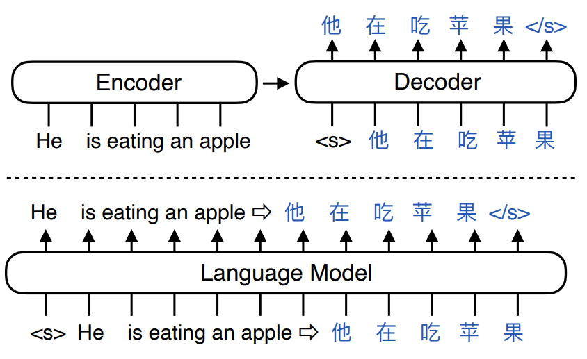

**Encoder-Decoder和Decoder-only示意图**

## **MoE Model 混合专家模型**

#### **专家模型**

> ### **MoE（Mixture of Experts）混合专家**
>
> **参考链接：**&#x68;ttps://newsletter.maartengrootendorst.com/p/a-visual-guide-to-mixture-of-experts
>
> **混合专家（MoE）**&#x662F;一种利用多个不同的子模型（专家）来提升LLM质量的技术。**每个混合专家（MoE）层的组成形式通常是 𝑁 个「专家网络」{𝑓\_1, ... , 𝑓\_𝑁} 搭配一个「门控网络」G。MoE 层的放置位置是在 Transformer 模块内，作用是选取前向网络（FFN），通常位于自注意力子层之后。这种放置方式很关键，因为随着模型增大，FFN 的计算需求也会增加。**&#x4E3E;个例子，在参数量达到 5400 亿的 PaLM 模型中，90% 的参数都位于其 FFN 层中
>
> * **专家 Expert：**&#x6BCF;个前馈神经网络（FFN）层都有一组“专家”，可以选择其中的一部分。这些“专家”通常也是FFN
>
> * **路由或门控网络 Router/Gate：**&#x8FD9;个门控网络的形式通常是一个使&#x7528;**&#x20;softmax 激活函数的线性网络**，其作用是将输入引导至合适的专家网络，也就是决定哪些token发送到哪些专家
>
> **典型模型：Deepseek V2/V3、Mistral 8x7B**

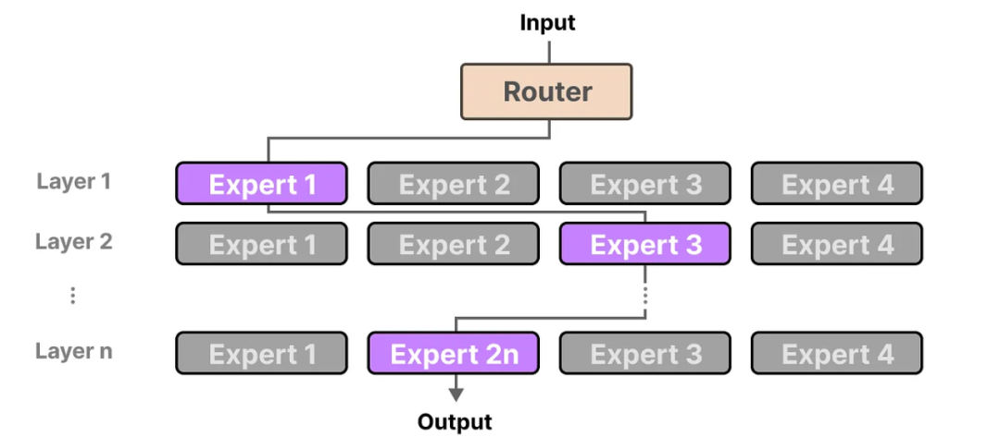

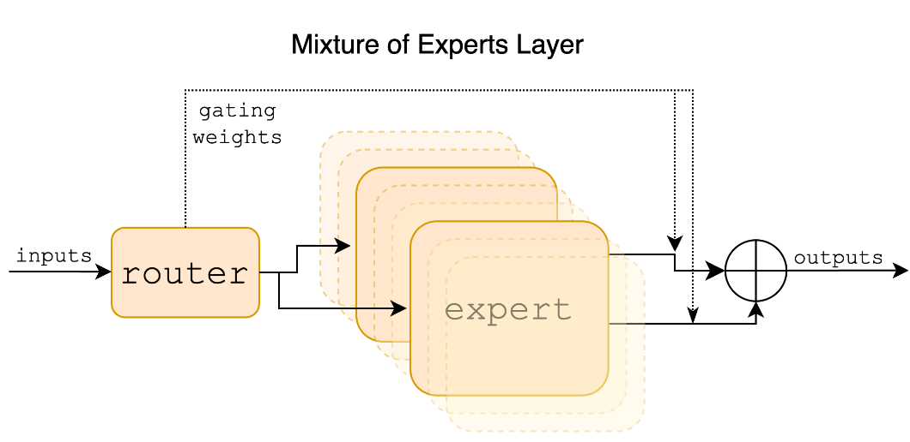

**MoE模型路由示意图**

> 需要注意的是，“专家”并不专注于特定领域，如“心理学”或“生物学”。专家在学习过程中最多只能掌握关于单词层面的句法信息，更具体地说，专家的专长是在特定上下文中处理特定token

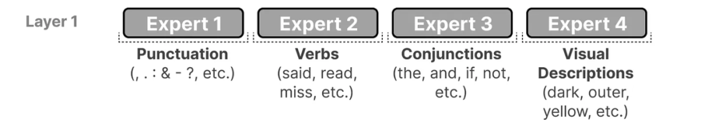

> **密集层（Dense层）**
>
> * **FFN**使模型能够利用由注意力机制创建的上下文信息，进一步学习捕捉数据中更复杂的关系
>
> * 然而，FFN的规模会迅速增长。**为了学习这些复杂关系，它通常会扩展接收到的输入（中间层维度扩展）**
>
> * 密集模型的**输入激活了所有参数**

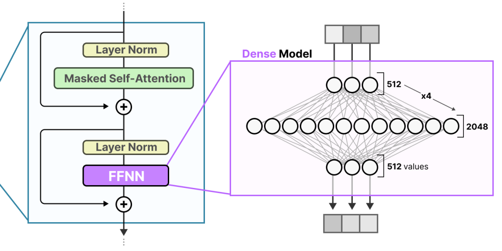

> **稀疏层（Sparse层）**
>
> * 稀疏模型**仅激活其总参数的一部分**，与混合专家密切相关
>
> * 可以将密集模型分割成片段（即专家），重新训练，在给定时间仅激活一部分专家
>
> * 其基本思想是**每个专家在训练过程中学习不同的信息。然后，在运行推理时，仅使用与特定任务最相关的专家**

> ### **专家学习的内容**
>
> **Encoder-Decoder MoE**
>
> **论文：ST-MOE: DESIGNING STABLE AND TRANSFERABLE  SPARSE EXPERT MODELS**
>
> **链接：https://arxiv.org/pdf/2202.08906**
>
> * **Encoder专家呈现专业化：**&#x5728;每一层中，至少有一位专家专门研究**代表空白填充的token**。此外，一些专家表现出清晰的专业化，一些专家主要专注在**标点符号，动词，专有名称，计数**等方面
>
> * **Decoder专家缺少专业化：**&#x76F8;比之下，在解码器专家中，**代表空白填充的token**不仅在某种程度上均匀地路由，而且解码器专家**也没有观察到有意义的专业化（语义或语法）**

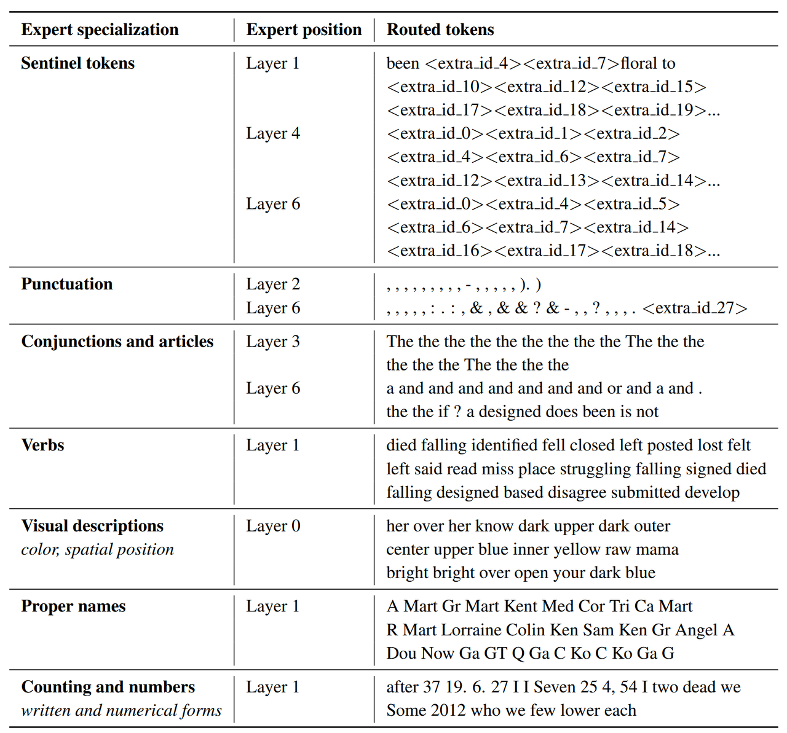

**Encoder专家专业化示意图**

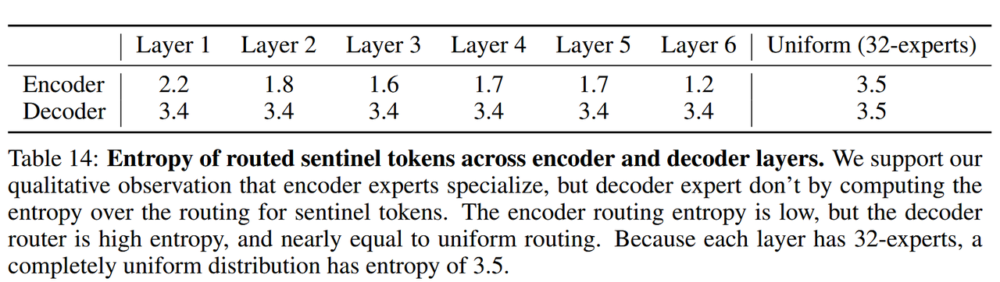

**Decoder均匀（随机）路由示意图**

> 此外该论文还整理了部分**MoE相关的专业术语**如下：

| 术语                   | 定义                                                                                                                                                                                                                 |
| -------------------- | ------------------------------------------------------------------------------------------------------------------------------------------------------------------------------------------------------------------ |
| Expert               | 通常是一个 MLP 网络，每个 Expert 的权重独立                                                                                                                                                                                       |
| Router               | 计算每个 token 发送到每个 Expert 的概率的网络                                                                                                                                                                                     |
| Top-n Routing        | 是一个路由算法，每个 token 被发送到 n 个 Expert                                                                                                                                                                                   |
| Load Balancing Loss  | 鼓励每一组 token 被均匀分发给各个 Expert 的辅助损失函数，有利于加速器并行处理数据块来提高硬件效率                                                                                                                                                           |
| Group Size           | 全局批量大小被分成更小的 Group。每个 Group 被考虑用于 Expert 之间的负载平衡。增加它会增加内存、计算和通信&#xA;比如 Batch Size 为 B，Group 数量为 G，则每个组有 B/G token                                                                                                  |
| Capacity Factor (CF) | 每个 Expert 只能处理固定数量的 token，Capacity 常是通过均匀地划分 Expert、token 的数量来设置的：Capacity=token/Expert。但是有些时候可以通过设置 CF 来改变 Capacity，使之变为：CF×token/Expert&#xA;如果 CF 增加，会创建一些额外的 Buffer，当负载不平衡时丢弃更少的 token。但是，增加 CF 也会带来额外的内存和计算的开销 |

> **Decoder MoE**
>
> **论文：Mixtral of Experts**
>
> **链接：https://arxiv.org/pdf/2401.04088**
>
> * 虽然Decoder专家似乎并没有同样类型的专业化，但这**并不意味着所有专家都是平等的（相同的能力）**
>
> * **Mistral 8x7B**论文中的例&#x5B50;**，**&#x8868;明 router 确实表现出一些结构化的句法行为。如下图所示，途中显示了来自**不同 domain（Python代码，数学和英语）的文本的示例。**&#x8BF8;如**python中的“self”、英语中的“Question”之类的经常被路由到相同的专家。同样，在代码中，缩进token始终分配给同一专家**，尤其是在隐藏状态与模型的输入和输出更相关的第一层和最后一层
>
> * **专家往往专注于句法而非特定领域**，因此，尽管解码器专家似乎没有专业化，但它们似乎在特定类型的token上使用得相对一致

**Decoder专家路由示例**

> ### **专家架构**
>
> * 专家通常是**完整的FFN块**
>
> * LLM有多个Decoder Block，给定的文本在**生成之前会经过多个专家**
>
> * **选择的专家可能因token而异，产生不同的路径**

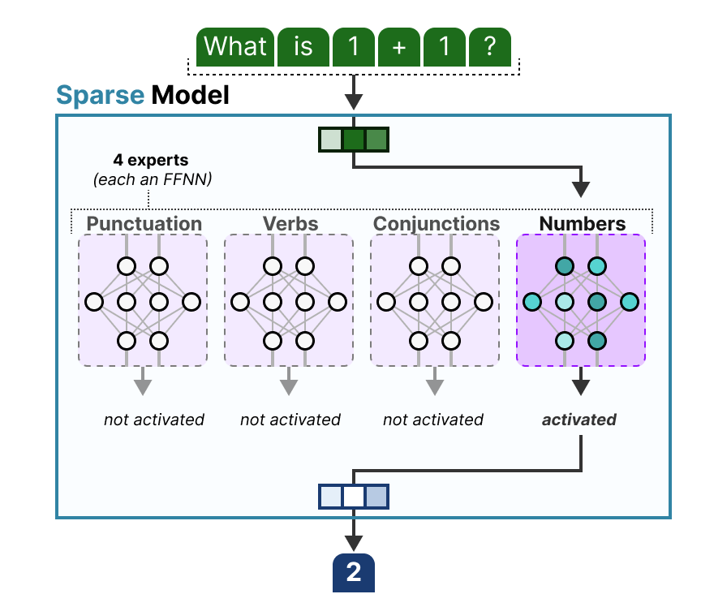

**完整的FFN专家**

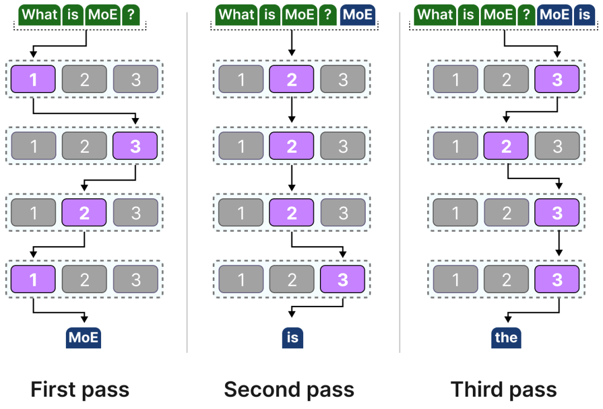

**每个token的路径不尽相同**

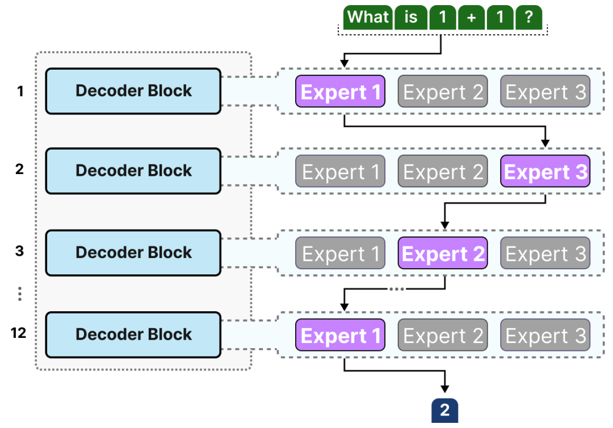

**生成token前经过多个专家**

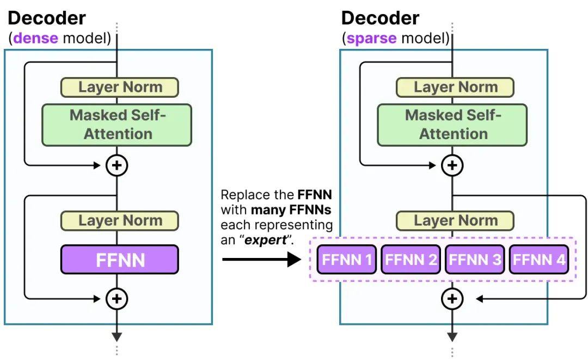

**包含多个FFN块的Decoder Block**

#### 路由机制

> ### **路由器Router**
>
> 在专家层之前添加一个路由Router（也称为门控网络Gate），专门**训练用来选择针对特定token的专家。**&#x8DEF;由（或门控网络）也是一个**FFN**，可以输出概率，选择最匹配的专家。专家层**返回所选专家的输出，乘以门控值（选择概率），**&#x8DEF;由与专家共同构成**MoE层**

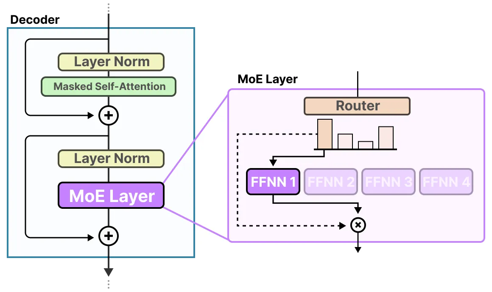

**MoE Layer**

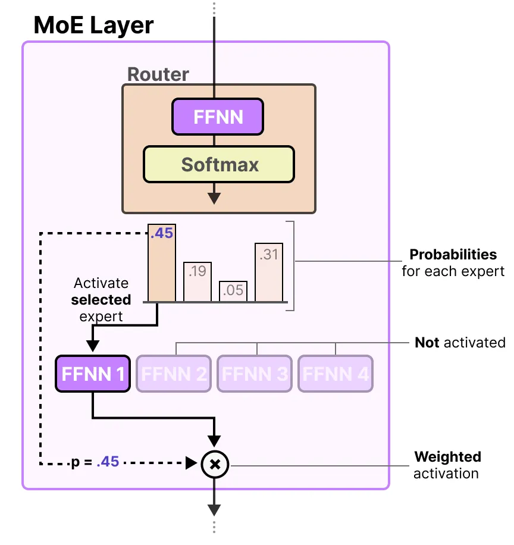

**Router 选择专家**

> ### **MoE层的类型**
>
> * **稀疏混合专家：**&#x7A00;疏MoE仅选择少数专家
>
> * **密集混合专家：**&#x5BC6;集MoE则选择所有专家，但可能在不同的分布中。目前常见的MoE模型通常指的是稀疏MoE，这在计算上更为经济

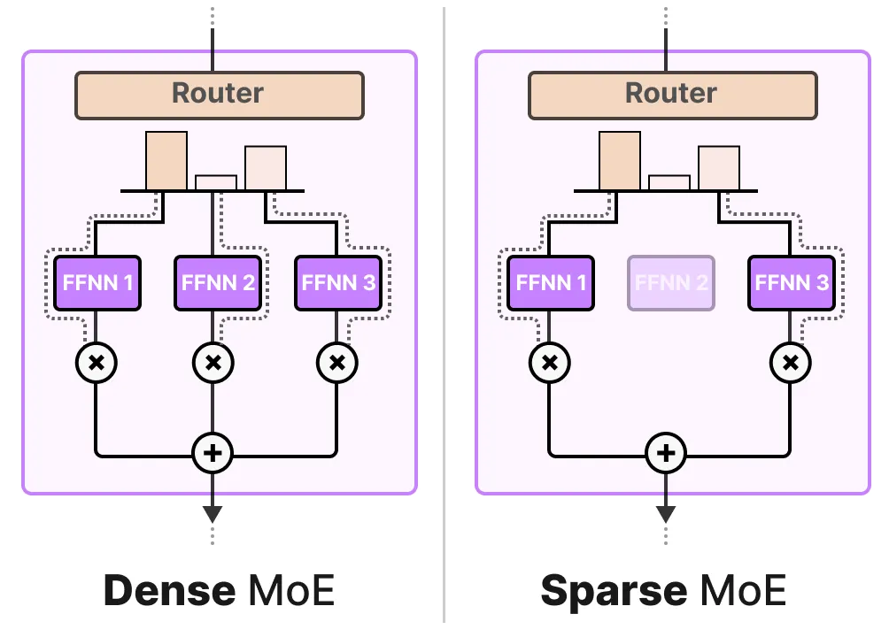

> ### **路由函数的种类**
>
> 根据对每个输入的处理方法，Router（Gate）可分为三种类型：**稀疏式、密集式和 soft 式**。其中**前两种上面讲到了，soft 式则包括完全可微方法，包括输入 token 融合和专家融合**

**多种门控函数（路由函数）示意图**

> ### **专家的选择**
>
> **Router**（门控网络Gate）不仅决定**推理期间选择哪些专家，还决定训练时的选择**
>
> 1. 输入 **x&#x20;**&#x4E58;以路由权重矩阵 **W&#x20;**&#x5F97;到输&#x51FA;**&#x20;H(x)**
>
> 2. 然后对输出应用**SoftMax**，创建每个专家的概率分布**G(x)**
>
> 3. **Router**使用这个概率分布来选择最匹配的专家
>
> 4. 最后将**每个路由的输出与每个选定的专家相乘，并将结果相加**

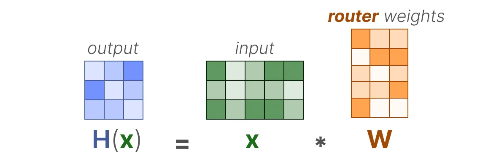

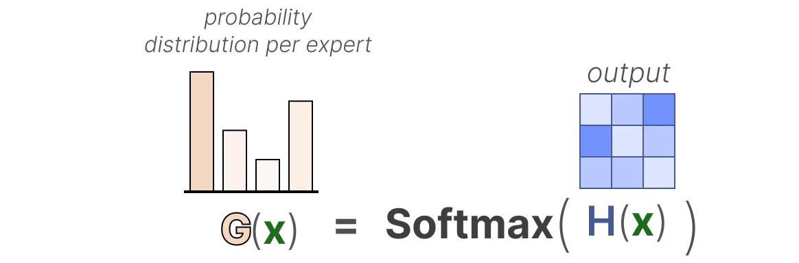

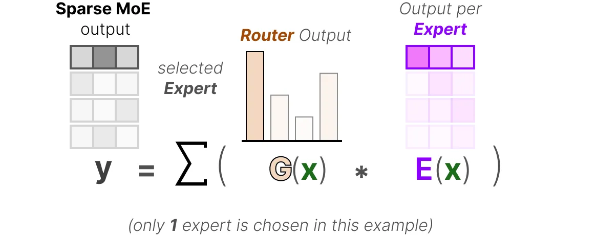

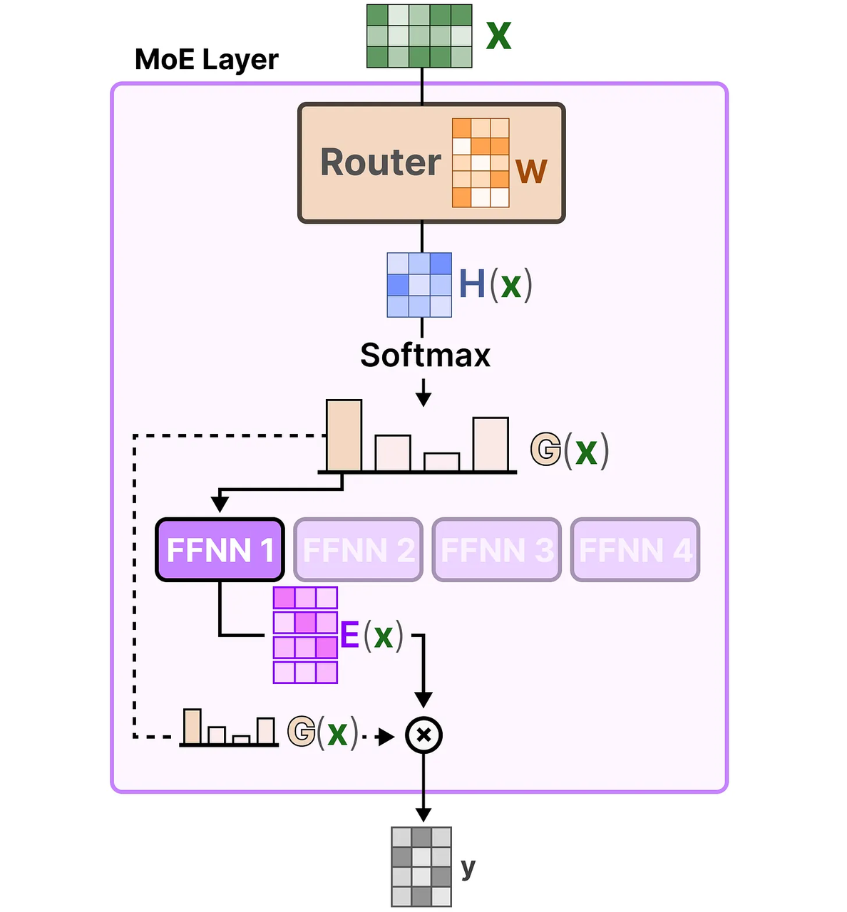

> ### 路由的复杂性
>
> 然而，这个简单的函数通常导致**路由器选择相同的专家**，因为某些专家可能学习得比其他专家更快。这不仅会导致**选择的专家分布不均，而且一些专家几乎无法受到训练。这在训练和推理期间都会产生问题**
>
> 相反，我们希望在**训练和推理期间让专家之间保持均等的重要性**，这称为**负载均衡**。这样可以防止对同一专家的过度拟合

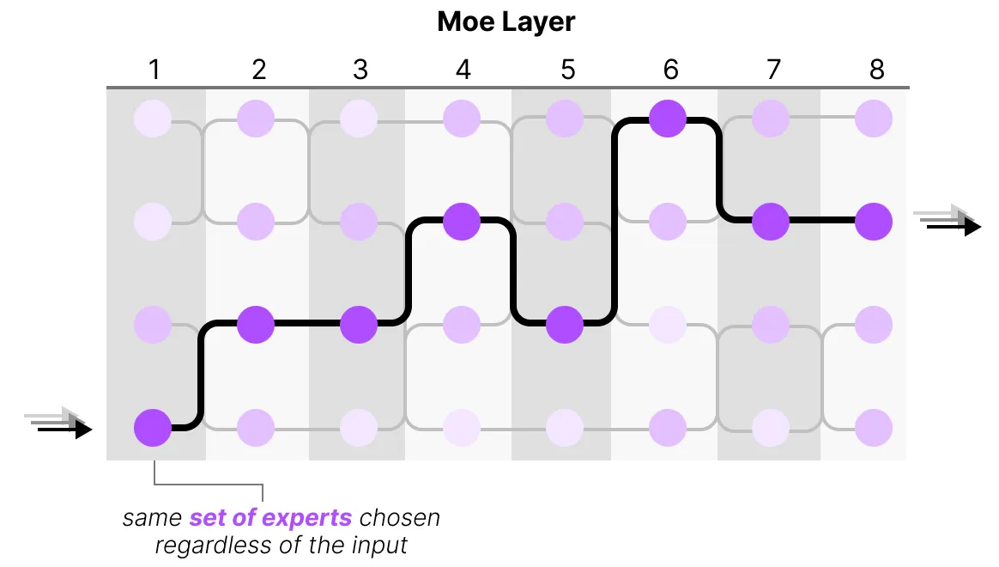

#### 负载均衡

> ### **KeepTopK**
>
> **论文： OUTRAGEOUSLY LARGE NEURAL NETWORKS:  THE SPARSELY-GATED MIXTURE-OF-EXPERTS LAYER**
>
> **链接：https://arxiv.org/pdf/1701.06538**
>
> **KeepTopK 扩展通过引入可训练的（高斯）噪声，可以避免重复选择相同的专家**。除了想要激活的前k个专家之外，其余专家的权重将被设置为-∞。通过将这些权重设置为-∞，这些权重上的SoftMax输出所产生的概率将会是0。KeepTopK 也可以在不添加额外噪声的情况下使用

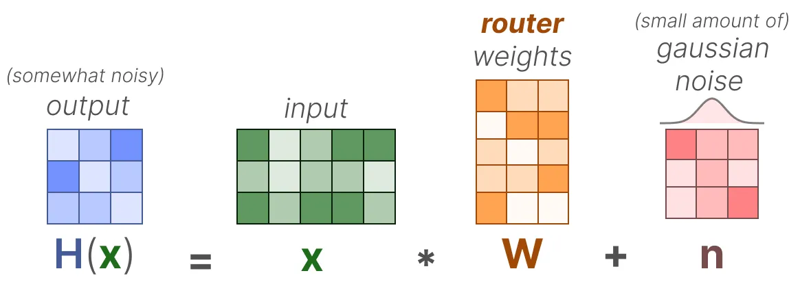

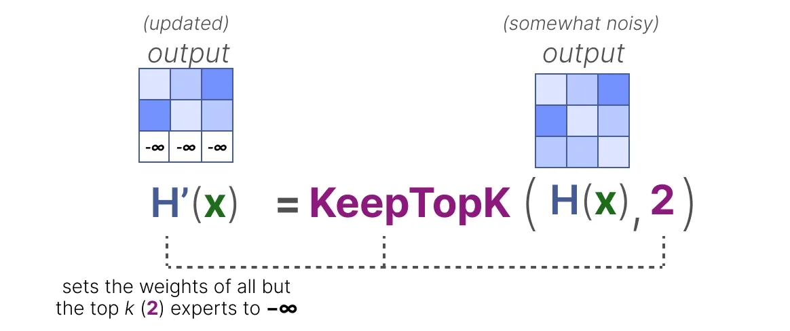

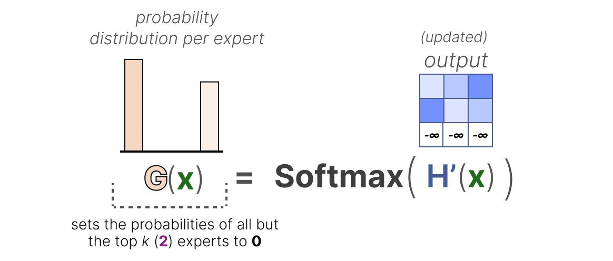

> ### **Token Choice**
>
> KeepTopK 策略将每个 token 路由到少数选定的专家。这种方法称为 **Token Choice**，它允许将给定的词元发送给一个专家（top-1路由），或者发送给多个专家（top-k路由）。一个主要的好处是它允许权衡和整合专家各自的贡献

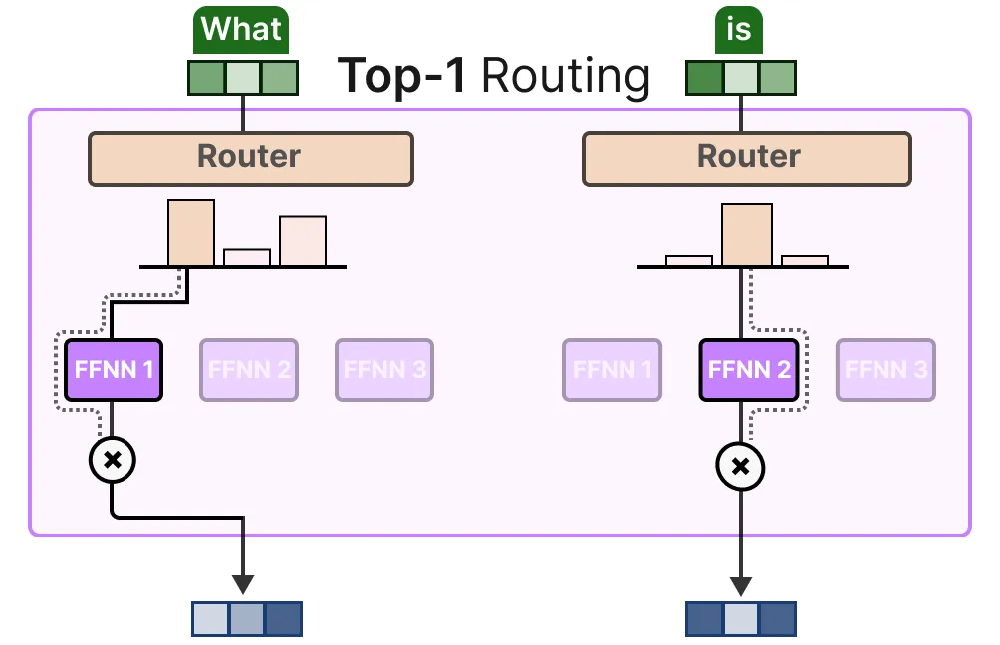

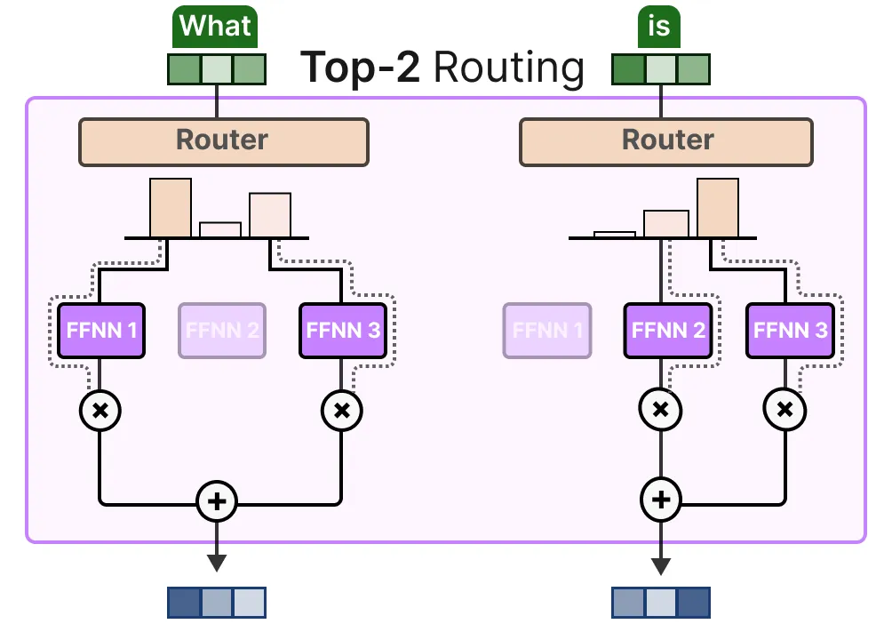

> ### **辅助损失 Auxiliary Loss**
>
> 为了在训练期间使专家的分布更加均匀，辅助损失（也称为负载均衡损失）会被添加到常规损失中。它增加了一个约束条件，迫使专家具有同等的重要性
>
> 辅助损失的第一个组成部分**是对整个批次中每个专家的路由值进行求和，**&#x5F97;到每个专家的重要性得分，它代表了在任何输入下，给定专家被选中的可能性。可以用这个来计算**变异系数（CV）**，表示专家之间的重要性得分有多大差异：
>
> $$Coefficient Variation (CV) = (\frac{\text{standard deviation }(\sigma)}{\text{mean }(\mu)})$$
>
> * 例如，如果重要性得分有很大差异，变异系数就会很高
>
> * 相反，如果所有专家的重要性得分相似，变异系数就会很低（这是我们的目标）
>
> 利用变异系数得分可以在训练期间更新辅助损失，使其**目标是尽可能降低变异系数得分（从而给予每个专家同等的重要性）**，最后辅助损失被单独添加进来，作为一个独立的损失项在训练期间进行优化

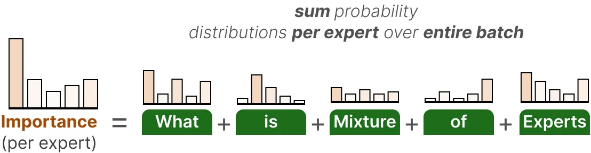

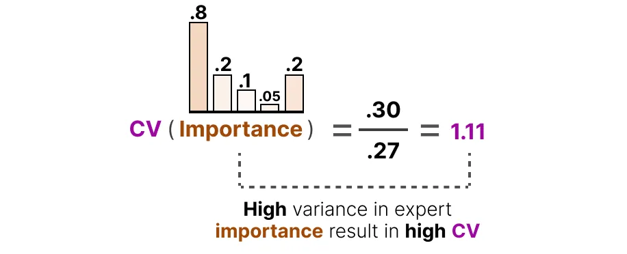

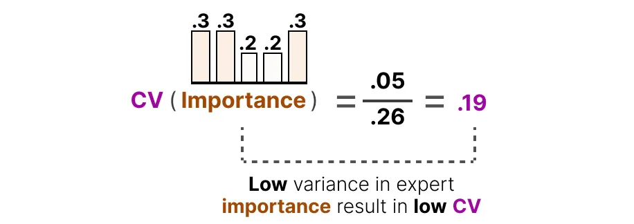

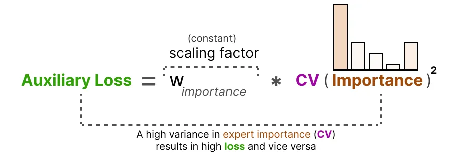

#### 专家容量

> ### **Token分布的不平衡**
>
> **不平衡现象不仅存在于被选中的专家中，还存在于发送给专家的token分布中**
>
> 例如，**如果输入的token在分配给不同专家时比例失调，过多地发送给一个专家而较少地发送给另一个专家，那么可能会出现训练不足的问题。**&#x95EE;题不仅仅在于使用了哪些专家，还在于对它们的使用程度
>
> 一个解决方案是**限制给定专家可以处理的token数量，即专家容量**。当一位专家达到其容量时，后续的token 将被发送给下一位专家。如果所有专家都达到了他们的容量，那么该token将不会被任何专家处理，而是被发送到下一层。这被称为**token溢出（token overflow）**

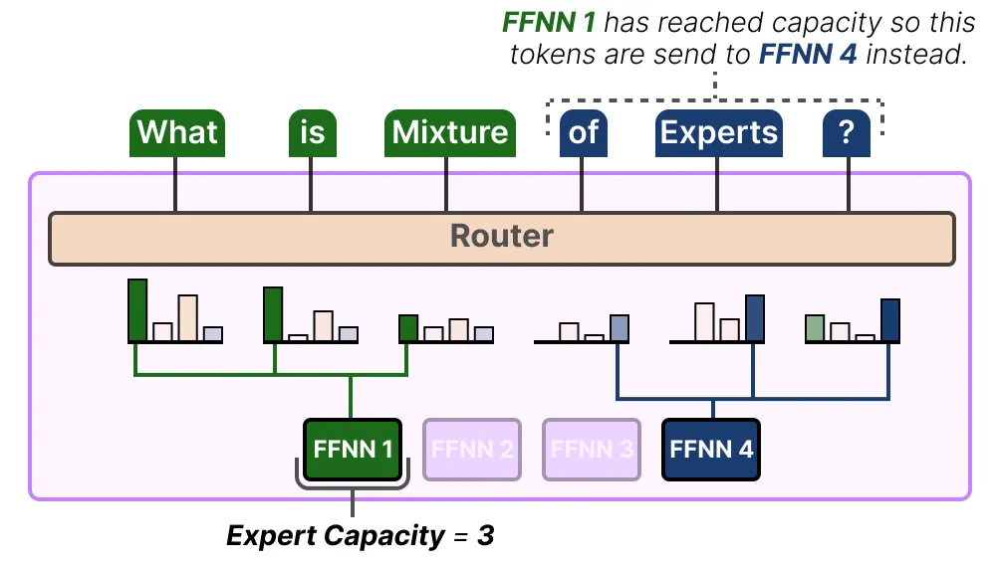

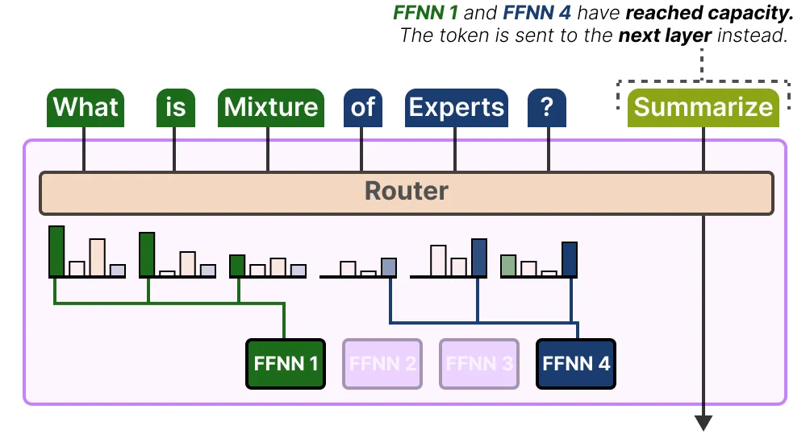

#### Switch Transformer

> ### **简化MoE**
>
> 首批解决了基于Transformer的MoE（例如负载均衡等）**训练不稳定性问题**的模型之一是**Switch Transformer**。它极大地简化了架构和训练过程，同时提高了训练的稳定性。
>
> **论文：Switch Transformers: Scaling to Trillion Parameter Models  with Simple and E cient Sparsity**
>
> **链接：https://arxiv.org/pdf/2101.03961**
>
> * **切换层：**&#x53;witch Transformer是一个T5模型（Encoder-Decoder），用切换层取代了传统的FFN层。切换层是一个稀疏的MoE层，每个token选择一个专家（Top-1路由），路由计算是简单计算[ 1.6 Structure & Decoding 结构和解码](https://kcnd4kn8i6ap.feishu.cn/wiki/Os2swulnTiJuqEkVoarcSZKFnfh#share-CLxAdxfVVoBteaxyc8cct4wZntc)。
>
> * **容量因子：**&#x53;witch Transformer引入了一个容量因子，对专家容量产生直接影响。
>
>   $$\text{expert capacity} = \left(\frac{\text{tokens per batch}}{\text{number of experts}}\right) * \text{capacity factor}$$
>
>   如增加容量因子，每个专家将能够处理更多的token。然而，如果容量因子太大，会浪费计算资源。相反，如果容量因子太小，由于token溢出，模型性能将会下降
>
> * **辅助损失：**&#x5F15;入了一个简化版的辅助损失。损失并非去计算变异系数，而是依据每个专家的路由概率所占的比例，来对分配给各个专家的词元的比例进行权衡。由于**目标是在N个专家之间实现token的均匀路由，我们希望向量P和f的值为 1/N**，α是一个常规的loss系数超参数
>
>

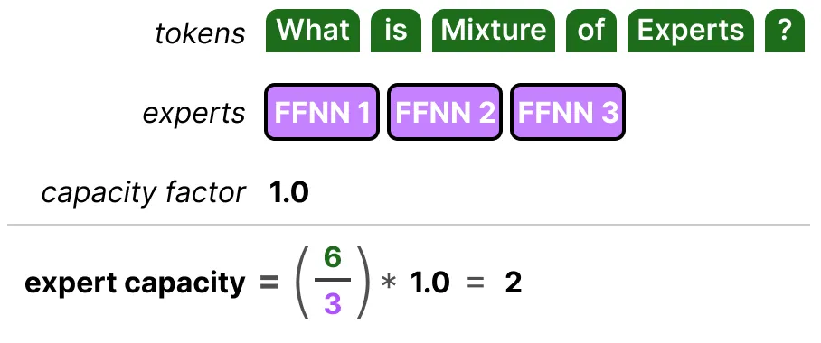

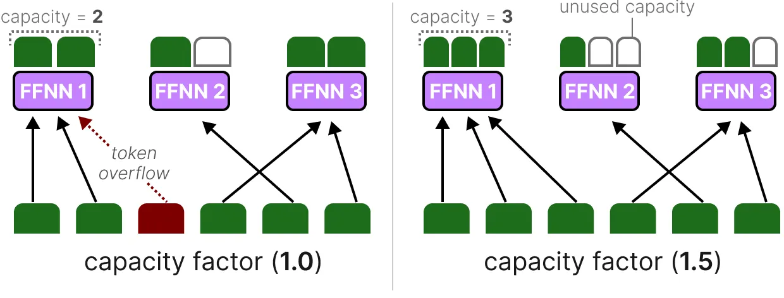

**容量因子示意图**

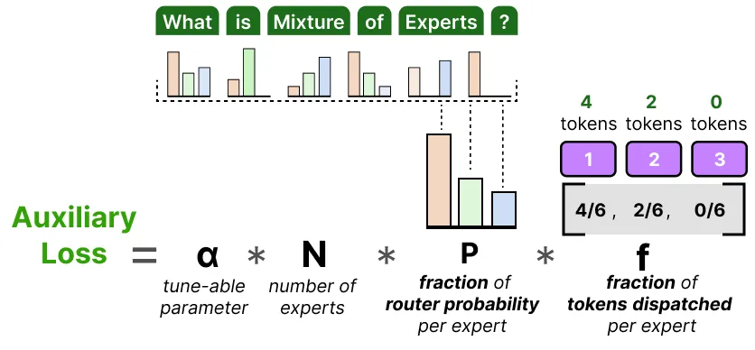

**简化的辅助损失示意图**

#### Mixtral 8x7B的活跃参数与稀疏参数

> ### **MoE激活参数**
>
> 混合专家在给定时间只使用一部分专家，所以可以访问比实际使用更多的参数。虽然给**定混合专家模型有更多的参数要加载（稀疏参数），但在推理期间只使用一些专家，所以激活的参数较少（活跃参数）**。虽然仍然需要将整个模型（包括所有专家）加载到设备上（稀疏参数），但进行推理时只需要使用一部分（活跃参数）。混合专家模型需要更多的显存（VRAM）来加载所有专家，但在推理期间运行得更快
>
> 以**Mixtral 8x7B&#x20;**&#x4E3A;例，可以看到**每个专家的大小是5.6B，而不是7B（尽管有8个专家）**。**加载8×5.6B（46.7B）的参数（以及所有共享参数），但在推理时我们只需要使用2×5.6B（12.8B）的参数**。
>
> > 图中的Sparse Parameters理解为全部的参数就行

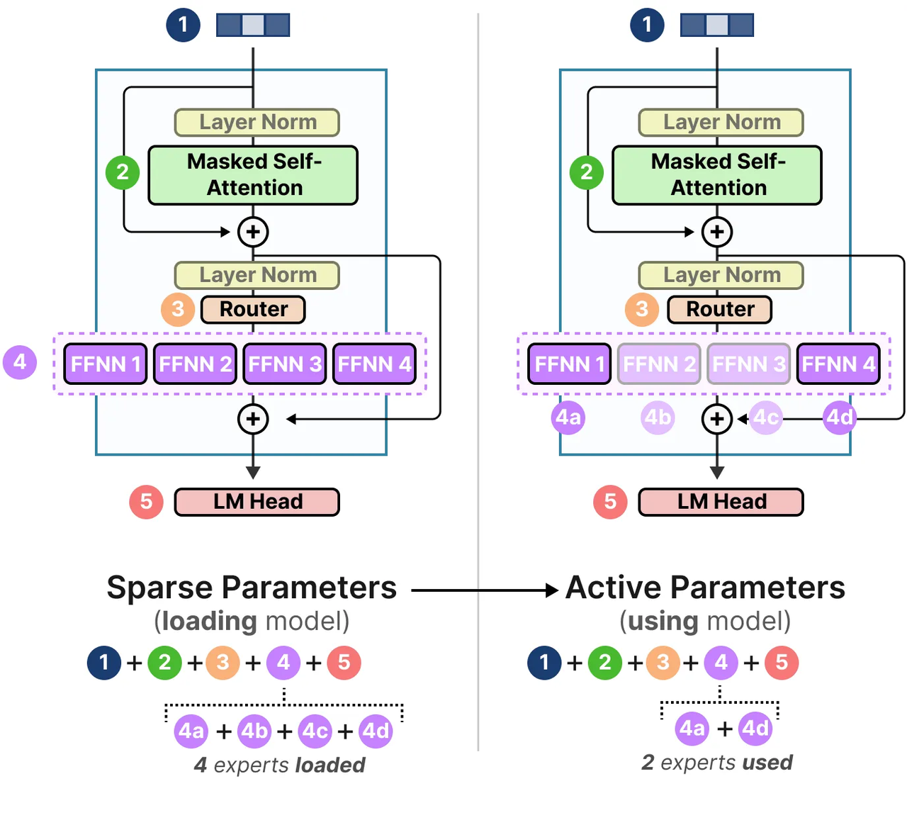

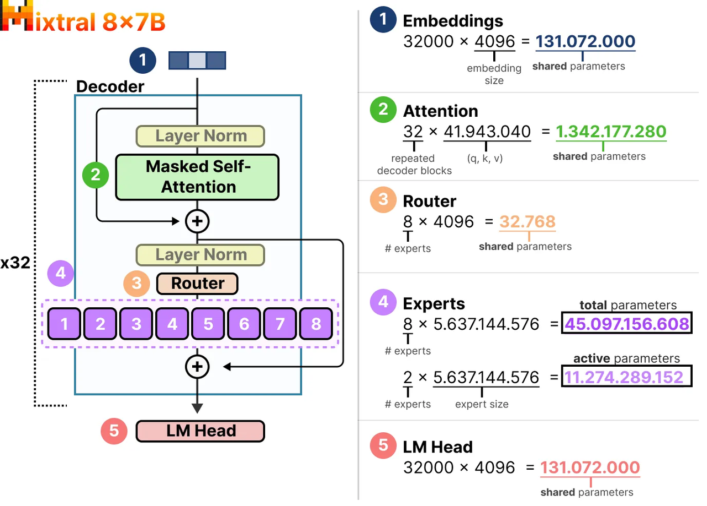

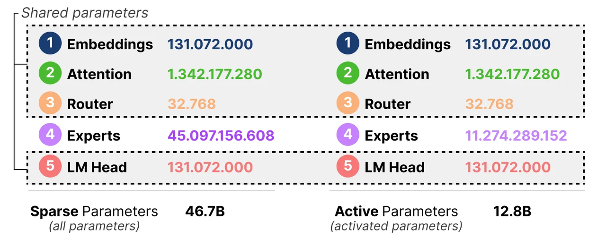

# **1.6.2 解码采样策略**

**大模型在输出token的时候的几种解码策略**

## **Greedy Search**

> 贪心的**每次选择概率最大的token（词）**，简单高效，但是可能会导致生成的**文本过于单调和重复**

## **Beam Search**

> **维护一个大小为 k 的候选序列集合**，每一步从每个候选序列的概率分布中选择概率最高的 k 个单词，然后保留总概率最高的 k 个候选序列。这种方法可以平衡生成的质量和多样性，但是可能会**导致生成的文本过于保守和不自然**

## **Top-K Sampling**

> **从排名前 k 的 token 中进行抽样**，允许其他分数或概率较高的token 也有机会被选中。在很多情况下，这种抽样带来的随机性有助于提高生成质量。但是将采样池限制为固定大小 *K* 可能会在**分布比较尖锐的时候产生胡言乱语**，而在**分布比较平坦的时候限制模型的创造力**

## **Top-P Sampling**

> 在**累积概率超过设定值P的最小单词集中采样**

## **Temperature Sampling**

> 加在Softmax上的温度系数，用来调节大模型输出token的概率分布的平坦程度，**越大概率分布越平坦，输出越随机，越小概率分布越极端，输出越稳定**

## **KPT 联合采样**

> 联合采&#x6837;**（top-k & top-p & Temperature）** ，先后进&#x884C;**&#x20;top-k->top-p->Temperature 采样**
>
> 根据 top-k，保留概率最高的 k 个 token，接下来，使用 top-p 保留概率的累计和达到 p 的单词，接着使用 Temperature 进行归一化，最后可以从剩下的分布中进行随机采样，选取一个 token 作为最终的生成结果

## **Best-of-N**

> 通过让大模型输出N个回答，然后通过不论**是Verifier、ORM（结果奖励模型）还是PRM（过程奖励模型，PRM可以给出步骤奖励加权和作为整个回答的分数）给出每个回答的分数，然后选择其中最高的（Best）作为最后的回答**

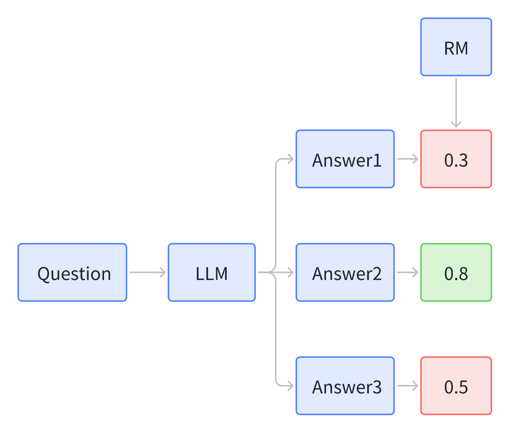

## **Majority Vote & Self-consistency**

> * **Majority Vote 多数投票：**&#x8F93;出多个回答，选择答案一致性最多的作为最终答案
>
> * **Self-consistency 自一致性：**&#x6700;早出现在论文 ***SELF-CONSISTENCY IMPROVES CHAIN OF THOUGHT REASONING IN LANGUAGE MODELS*** 中，通过让大模型**输出多个CoT推理路径，得到多个答案，然后通过多数投票的方式选出最终答案，**&#x505A;法类似于多数投票

