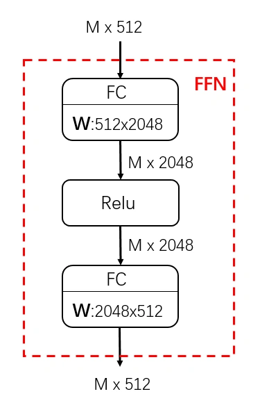

FFN

## **FFN 前馈层**

其实就是fc->ReLu->fc,升维再降维,从而获取特征

## Add

resnet残差,防止过拟合

## Layer Norm

一般来说，**Batch Norm适用于CV**，**Layer Norm适用于NLP**。因为

1. cv的图片大小通常是固定的(resize从而可以使得输入大小一致,但是NLP每句话的输入长度不一致,因此bn不太好用)
2. CV中Batch Norm是对一个图像的不同channel（比如RGB通道）各自进行归一化，本身CV任务不需要channel之间的信息交互，归一化后仅保留各channel的分布信息作后续判断即可
3. `['搜推yyds', 'LLM大法好', 'CV永不为奴']`三句话做normalization，假设一个词是一个token，Batch Norm效果是`['搜', 'L', 'C']`, `['推', 'L', 'V']` ...做归一化；Layer Norm是三句话分别各自归一化；**前者归一到同一分布后变无法保留一个句子里的分布信息了**（比如`'搜推yyds'`用Batch Norm后就变了），而Layer Norm可以成功保留上下文分布信息

### **多种Norm方法示意图**

* **H（Height）：**高度，垂直维度

* **W（Width）：**宽度，水平维度

* **C（Channel）：**通道，通常指图像或特征图中的颜色通道（如 RGB ,深度）或特征通道（例如在卷积神经网络中间的不同特征图）

* **N（Number of samples）：**样本数量，通常指批次中的样本数量（例如在 Batch Norm 中）或实例数量（例如在 Instance Norm 中）

这些维度在不同的归一化操作中有不同的处理方式：

* **Batch Norm：**在批次（N）维度上进行归一化，通常用于深度学习中的批量归一化

* **Layer Norm：**在通道（C）维度上进行归一化，通常用于对层的输入进行归一化

* **Instance Norm：**在通道（C）和样本（N）维度上进行归一化，通常用于风格迁移等任务

* **Group Norm：**在通道（C）维度上进行分组归一化，通常用于替代 Batch Norm 以避免批次大小对模型性能的影响

# **[Layer Norm的位置和计算](https://spaces.ac.cn/archives/8620)**

## **Layer Norm的位置影响**

下图分别为
**Post-norm(先做残差连接，再对结果归一化)**
**Pre-norm(先对输入归一化，再做残差连接)**
**Sandwich-norm(Attention、FFN 的前后都执行 Layer Norm)**

梯度期望:

### **Norm出现在各个位置的影响**

* **Post-norm：深层的梯度范数逐渐增大，容易不稳定,warm up可以缓解**
  * 对参数的正则化效果更强，收敛性好；但深层易出现梯度消失 / 爆炸（需 warm-up 缓解）。

  * 训练完成后效果更优，因为**突出残差分支的作用**，但初期训练难度大。

  * Post norm的**不稳定性主要来自于梯度消失**，以及初始化时候更新太大陷入局部最优
* **Pre-norm：每层的梯度范数近似相等，训练比较稳定，但是牺牲了深度**
  * 每层梯度范数近似，训练更稳定，能避免梯度爆炸 / 消失，因此大模型训练中更常用。

  * 代价是**牺牲了模型的 “有效深度”**（等效层数不如 Post-LN），反而增加了模型宽度，同深度的最终效果通常弱于 Post-LN。
* **Sandwich-norm：平衡，有效控制每一层的激活值，避免它们过大，模型能够更好地学习数据特征，但是训练不稳定,可能导致崩溃**
* **Post-Norm和Pre- Norm的异同：**
  * 一般认为，**Post-Norm在残差之后做归一化，对参数正则化的效果更强，进而模型的收敛性也会更好；而Pre-Norm有一部分参数直接加在了后面，没有对这部分参数进行正则化，可以在反向时防止梯度爆炸或者梯度消失**，大模型的训练难度大，因而使**用Pre-Norm较多**。
  * Pre-Norm结构**无形地增加了模型的宽度而降低了模型的深度**，而深度通常比宽度更重要，所以是无形之中的降低深度导致最终效果变差了。而Post-Norm刚刚相反，它每Norm一次就削弱一次恒等分支的权重，所以Post Norm反而是更突出残差分支的，因此Post-Norm中一旦训练好之后效果更优，但是因为残差支路被削弱了，所以一开始不好训练，需要**warmup**

post-norm为什么不容易train

Pre-norm的优势

## 各种**Layer Norm的计算**

### **[LayerNorm](code\4LayerNorm.py) **

对每个样本的所有特征做归一化，这消除了不同样本间的大小关系，但是保留了一个样本内不同特征之间的大小关系。LayerNorm 适用于 NLP 领域，这时输入尺寸为 $$b\times l\times d$$(批量大小 x 序列长度 x 嵌入维度)，公式如下，&#x5176;&#x4E2D;***$$\gamma$$和 $$\beta$$是可学习的缩放和偏移参数**

$$\mu = E(X) \leftarrow \frac{1}{H} \sum_{i = 1}^{H} x_i$$

$$\sigma \leftarrow \sqrt{\operatorname{Var}(x)}=\sqrt{\frac{1}{H} \sum_{i = 1}^{H}\left(x_{i}-\mu\right)^{2}+\epsilon}$$

$$y=\frac{x - E(x)}{\sqrt{\operatorname{Var}(X)}} \cdot \gamma+\beta$$

### **RMS Norm**

均方根Norm，全称为root mean square layer normalization，与layer norm相比，RMS Norm **去除掉计算均值进行平移的部分**，理解是把均值看成0了，计算速度更快效果基本相当

Layer norm通过对输入进行归一化，使其均值和方差保持不变。**LayerNorm成功的一个著名解释是其重新居中和缩放不变性**属性。前者使得模型对于输入和权重上的偏移噪声不敏感，而后者在输入和权重都被随机缩放时保持输出表示不变，**RMS Norm作者假设LN的成功是缩放不变性而不是重新居中**

$$
RMS(x) = \sqrt{\frac{1}{H} \sum_{i = 1}^{H} x_i^2}

\\
x = \frac{x}{RMS(x)} \cdot \gamma
$$

一个直观的猜测是，center操作($ x-E(X) $)，类似于全连接层的bias项，储存到的是关于预训练任务的一种先验分布信息，而把这种先验分布信息直接储存在模型中，反而可能会导致模型的迁移能力下降。所以T5不仅去掉了Layer Normalization的center操作，它把每一层的bias项也都去掉了

RMS测量输入的平方均值，它**将加权和输入强制缩放到一个 $$\sqrt{n}$$倍的单位球中**。通过这样做，**输出分布不受输入和权重分布的缩放影响，有利于层激活的稳定性**。虽然欧几里得范数与RMS仅差一个 $$\sqrt{n}$$的因子，已经成功应用于一些领域，但经验证明，欧几里得范数在层归一化中并不奏效

### **Deep Norm**

可以**缓解 Transformer 过深导致爆炸式模型更新**训练不稳定的问题，把**模型更新限制在常数**，使得模型训练过程更稳定。Deep Norm方法在**执行Layer Norm之前，up-scale了残差连接(alpha>1)另外，在初始化阶段down-scale了模型参数(beta<1)**

1. 使用 DeepNorm 时，拿它来替换 Post-LN

2. DeepNorm 其实就是 LN，只是在执行层归一化之前 up-scale 了残差连接。 $$x∗α + f(x) $$里面的 $$f(x)$$ 代表 Self-Attention 等等的 Token-mixer，x 代表 Token-mixer 的输出，α 是常数

3. `torch.nn.init.xavier_normal_(tensor, gain=1)`是 xavier 高斯初始化，参数由0均值，标准差为`  gain × sqrt(2 / (fan_in + fan_out))  `的正态分布产生，其中`fan_in` 和 `fan_out `是分别权值张量的输入和输出元素数目。 这种初始化同样是为了保证**输入输出的方差不变**

$$std=gain×\sqrt{\frac{2}{fan\_in+fan\_out}}$$

* DeepNorm 还在初始化期间 down-scale 了参数。值得注意的是，对于 `ffn，v_proj，out_proj`和 `q_proj，k_proj`的初始化，是不一样的

* 不同架构的 α 和 β 值不一样

> **导致训练不稳定的原因**
>
> 1. 训练的**起始阶段模型参数更新非常快**，它使模型陷入一个坏的局部最优，这反过来增加了每个 LN 的输入
>
> 2. Pre-LN在底层的梯度往往大于顶层

## **[Batch Norm的计算](code\4BatchNorm.py) **

> * **BatchNorm**是对整个 batch 样本内的每个特征做归一化，这消除了不同特征之间的大小关系，但是保留了不同样本间的大小关系。BatchNorm 适用于 CV 领域，这时输入尺寸为  $$b\times c\times h\times w$$ (批量大小x通道x长x宽)，图像的每个通道 c 看作一个特征，BN 可以把各通道特征图的数量级调整到差不多，同时保持不同图片相同通道特征图间的相对大小关系
>
> * 在train模式下参数会随着网络的反向传播进行梯度更新，计算每一个batch里的方差和平均值，在eval模式，模型不可能等到预测样本数量达到一个batch时，再进行归一化，而是直接使用train模式得到的统计量

##  FFN-GLU计算和激活函数

* 现在大模型**通常使用SwiGLU替换掉传统的FFN结构**

**GLU**

* **一般激活函数计的FFN块算公式：** $$FFN(x) = ReLU(xW_1+b1)W_2+b_2$$

* **GLU线性门控单元的FFN块计算公式：**

  $$GLU(x) = xV \cdot \sigma(xW + b)\ \ \ 
  FFN_{GLU} = (xV \cdot \sigma(xW_1 + b))W_2$$

  输出两个线性变换，然后对一个做sigmoid，乘以线性变换的，**相当于做了门控机制**，选择哪些过，哪些不过，**进行了信息过滤，处理信息时更有针对性，增强表达能力**

  **SwiGLU、GeGLU**就是用**Swish、GeLU激活函数**分别去**替换GLU中的sigmoid激活函数。一个例子**：在LLaMA2-7B中，FFN的原始输入维度为4096，一般而言**中间层是输入维度的4倍等于16384**，由于SwiGLU的原因**FFN从2个矩阵变成3个矩阵**，为了使得模型的参数量大体保持不变，**中间层维度做了缩减，缩减为原来的2/3即10922，进一步为了使得中间层是256的整数倍，又做了取模再还原的操作，最终中间层维度为11008**

为了提升门控的灵活性，研究者用更优的激活函数替换了 GLU 中的 sigmoid：

* **Swish激活函数：** $$Swish(x) = x \times sigmoid(\beta * x)$$

* **GeLU激活函数：** $$GeLU(x) \approx 0.5x\left(1 + tanh\left(\sqrt{\frac{2}{\pi}}\left(x + 0.044715x^{3}\right)\right)\right)$$

  

## **常见激活函数公式及图示**

### **Sigmoid**

> **缺点：**
>
> * **输入较大或较小时候梯度接近于0，容易导致梯度消失**
>
> * **函数输出不是以 0 为中心的，梯度可能就会向特定方向移动，从而降低权重更新的效率**
>
> * **Sigmoid 函数执行指数运算，计算机运行得较慢，比较消耗计算资源**
>
>   $$f(x) = \frac{1}{1+e^{-x}}\\
>   f'(x) = f(x)f(1-x)$$

### **Tanh**

> **优点：tanh**是“零为中心”的。因此在实际应用中，tanh会比sigmoid更好一些
>
> **缺点：**
>
> * **仍然存在梯度饱和的问题**
>
> * **依然进行的是指数运算**
>
> $$f(x)=\frac{e^{x}-e^{-x}}{e^{x}+e^{-x}}$$

### **ReLU**

> **优点：**
>
> * **ReLU解决了梯度消失的问题，当输入值为正时，神经元不会饱和**
>
> * **由于ReLU线性、非饱和的性质，在SGD中能够快速收敛**
>
> * **计算复杂度低，不需要进行指数运算**
>
> **缺点：**
>
> * **与Sigmoid一样，其输出不是以0为中心的**
>
> * **Dead ReLU 问题。当输入为负时，梯度为0。这个神经元及之后的神经元梯度永远为0，不再对任何数据有所响应，导致相应参数永远不会被更新**
>
> $$f(x) = \max(0,x)$$

### **Leaky ReLU**

> **优点：**
>
> * **解决了ReLU输入值为负时神经元出现的死亡的问题**
>
> * **Leaky ReLU线性、非饱和的性质，在SGD中能够快速收敛**
>
> * **计算复杂度低，不需要进行指数运算**
>
> **缺点：**
>
> * **函数中的α，需要通过先验知识人工赋值（一般设为0.01）**
>
> * **有些近似线性，导致在复杂分类中效果不好**
>
> $$f(x)=\max(\alpha x, x)$$

### **ELU**

> **优点：**
>
> * **ELU试图将激活函数的输出均值接近于零，使正常梯度更接近于单位自然梯度，从而加快学习速度**
>
> * **ELU 在较小的输入下会饱和至负值，从而减少前向传播的变异和信息**
>
> **缺点：**
>
> * **计算的时需要计算指数，计算效率低**
>
> $$f(\alpha,x)=\begin{cases}
> \alpha(e^{x}-1), & \text{for } x \leq 0 \\
> x, & \text{for } x > 0
> \end{cases}$$

### **Swish**

> **优点：**
>
> **Swish相较于传统的ReLU激活函数，具有光滑的非单调特性，其无界性有助于防止慢速训练期间，梯度逐渐接近 0 并导致饱和**；同时，有界性也是有优势的，因为**有界激活函数可以具有很强的正则化**(防止过拟合， 进而增强泛化能力)，并且**较大的负输入问题也能解决**。Swish激活函数在x=0附近更为平滑，而非单调的特性增强了输入数据和要学习的权重的表达能力
>
> $$f(x) = x * \text{sigmoid}(\beta x)$$
>
> * 当 $$\beta \rightarrow0$$时，Swish接近于线性函数
>
> * 当 $$\beta \rightarrow \infty$$时，它接近ReLU
>
> * 当 $$\beta=1$$时，Swish与SiLU等价
>
> Swish的优势在于其对负值的输入有一定的激活

### **Softmax**

> **Softmax**函数常在神经网络输出层充当激活函数，将输出层的值通过激活函数映射到0-1区间，将神经元输出构造成概率分布，用于多分类问题中，Softmax激活函数映射值越大，则真实类别可能性越大
>
> $$f(x) = \frac{e^x}{\sum_i^Ne^{x_i}}$$

# [位置编码](https://www.zhihu.com/tardis/zm/art/675243992)

**transformer**中token位置不影响attention分数(i think therefore i am 两个 i 的注意力分数一致),因此需要引入时序信息,即位置编码

一个好的位置编码的要求:

1. 每个位置输出一个**唯一**的编码
2. 具备良好的**外推性**
3. 任何位置之间的**相对距离**在不同长度的句子中应该是**一致**的

位置编码通常有两种:**相对**位置编码和**绝对**位置编码,且又分**可学习**和**不可学习**两种 ,下面给出相关示例

## 绝对位置编码

### **Transformer的位置编码** (Sinusoidal)

> **Transformer的位置编码加在embedding上**，但是由于使用的是**sin cos 交替**，可以通过**线性变换矩阵得到其他位置的表示**，所以可以期望他包含了**相对位置的信息**，而且由于**三角函数有显示的生成规律，所以可以期望有外推性质**
>
> * **相对位置计算公式：**
>   $$
>   PE_t = [\sin(w_0t), \cos(w_0t), \sin(w_1t), \cos(w_1t), \ldots, \sin(w_{\frac{d_{model}}{2}-1}t), \cos(w_{\frac{d_{model}}{2}-1}t)]
>   $$
>
>   $$
>   \begin{pmatrix}
>   \sin(t + \triangle t) \\
>   \cos((t + \triangle t))
>   \end{pmatrix} =
>   \begin{pmatrix}
>   \cos \triangle t & \sin \triangle t \\
>   -\sin \triangle t & \cos \triangle t
>   \end{pmatrix}
>   \begin{pmatrix}
>   \sin t \\
>   \cos t
>   \end{pmatrix}
>   $$
>
> * **可视化：**&#x4E0B;图是长度为100，编码维度为512的序列的位置编码可视化，可以发现，由于sin/cos函数的性质，位置向量的每一个值都位于\[-1, 1]之间。同时，纵向来看，图的右半边几乎都是黄色的，这是因为**越往后的位置，频率越小，波长越长**，所以不同的t对最终的结果影响不大。而越往左边走，颜色交替的频率越频繁

> * **Transformer位置编码的缺点：**由于**位置编码点积的无向性**， $$  P E_t^T * P E_{t+\Delta t} = P E_t^T * P E_{t - \Delta t}  $$ 即两个位置编码的乘积仅取决于 $$\Delta T$$，**距离是成对分布的，不能用来表示位置的方向性**。当随着input embedding被喂入attention的时候会出现**距离意识被破坏的现象**，即**正弦位置编码的相对位置表达能力被投影矩阵破坏掉了**，所以在后续BERT的改进中，采用了可学习的位置编码

距离意识被破坏:实际的Attention计算中还需要与attention的权重W相乘，即 $PE_t^T{W}_q^{T}{W}_kPE_{t+k}$,**内积结果不能反映相对距离**

### **BERT的可学习位置编码**

直接将**位置编码当作可训练参数**，比如最大长度为512，编码维度为768，那么就**初始化一个512×768的矩阵作为位置向量**，让它随着训练过程更新。对于这种训练式的绝对位置编码，一般的认为它的**缺点是没有长度外推性**，即如果预训练最大长度为512的话，那么最多就只能处理长度为512的句子，**再长就处理不了**了。当然，也可以将超过512的位置向量随机初始化，然后继续微调

### **RNN 位置编码**

**递归式的绝对位置编码，**input后面接一层RNN，可以用RNN学每个位置的位置编码。**优点是外推、灵活，缺点是丧失transformed的并行处理性质**

# **1.5.3 [相对位置编码**RPR](https://zhuanlan.zhihu.com/p/397269153)

[wenet](https://zhida.zhihu.com/search?content_id=176412419&content_type=Article&match_order=1&q=wenet&zhida_source=entity)和**vits**使用了**Relative Position Representation**,
