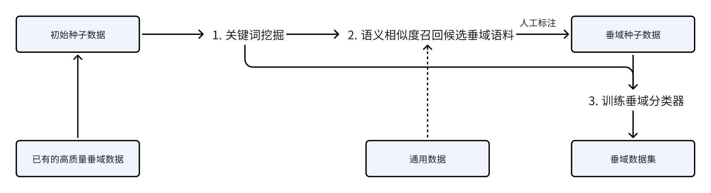

> **整个预训练阶段最重要的就是数据的获取和处理。**&#x9884;训练的数据量级在10T tokens，继续预训练则至少在100B tokens 的量级

# **2.2.1 数据来源**


**通用预训练数据分布**

> **预训练阶段涉及学习大量数据，以全面了解世界及其各种复杂性**。现有的大语言模型主要将各种**公开的文本数据进行混合作为预训练语料**。预训练数据可以分为**通用文本数据和专用文本数据**，其中通用文本数据规模较大，涵盖了**网页、书籍和对话**等内容，用以增强模型的语言建模能力；专用文本数据则是为了进一步提升大语言模型在特定任务上的表现，如**多语言数据、科学数据、math数据、code数据和逻辑推理**等高级技能数据，所以需要收集大量的多领域的语料，目前一些常见的数据来源有以下几种：
>
> * **Common Crawl**：这是一个开放的数据共享平台，里面是大量的网页数据
>
> * **GitHub：**&#x4ECE; GitHub 上收集代码相关的数据
>
> * **网页文本：**&#x6536;集与代码相关和与数学相关的网络文本，如选择代码论坛、库网站、数学网站等
>
> * **电子书、教育材料和论文资料：**&#x8FD9;些资源涵盖丰富的知识内容，有助于提升模型在不同领域的理解和生成能力
>
> * **内部数据：**&#x505A;大模型的公司组织的内部相关数据，可能是业务上的垂域数据
>
> 一般用到的总体数据量会达到**10T tokens**的量级，此外对于通用base模型来说，**不同语种的语料**也都要收集，主要是中英文，小语种看具体需求收集
>
> 网上的开源数据集已经很多了**FineWeb、pile、Skypile、RedPajama**，凑活着差不多能当启动资金来用。从另一个角度讲，世界上没有免费的午餐，所有开源出来的中文大模型数据集，质量多少都有点问题

> **论文：Datasets for Large Language Models: A  Comprehensive Survey**
>
> **链接：https://arxiv.org/pdf/2402.18041**
>
> 论文总结了444个大模型的数据集，这里展示预训练的相关的部分，其余的可以自行阅读查找

| **开源通用数据数据名**                          | **地址**                                                                                                                                           |
| -------------------------------------- | ------------------------------------------------------------------------------------------------------------------------------------------------ |
| **Skywork/SkyPile-150B**               | https://huggingface.co/datasets/Skywork/SkyPile-150B                                                                                             |
| **wikipedia-cn-20230720-filtered**     | https://huggingface.co/datasets/pleisto/wikipedia-cn-20230720-filtered                                                                           |
| **C4**                                 | https://github.com/allenai/allennlp/discussions/5056                                                                                             |
| **RedPajama**                          | https://huggingface.co/datasets/togethercomputer/RedPajama-Data-V2                                                                               |
| **EleutherAI/the\_pile\_deduplicated** | [https://huggingface.co/datasets/EleutherAI/the\\\_pile\\\_deduplicated](https://huggingface.co/datasets/EleutherAI/the%5C_pile%5C_deduplicated) |
| **WuDaoCorporaText**                   | https://data.baai.ac.cn/details/WuDaoCorporaText                                                                                                 |
| **YeungNLP/firefly-pretrain-dataset**  | https://huggingface.co/datasets/YeungNLP/firefly-pretrain-dataset                                                                                |


> **实际做继续预训练的一个例子：通用数据70B tokens，总共继续预训练数据100B tokens**

| 分类     | 数据集                  | 采样后Tokens  | 备注                                                                     |
| ------ | -------------------- | ---------- | ---------------------------------------------------------------------- |
| 中文语料   | **cc**               | **4.024**  | **单位：B****英 : 中 : 代码=70:20:10****参考 Yi 的预训练数据配比** |
|        | **tdata**            | **1.6118** |                                                                        |
|        | **baidu\_baike\_v3** | **0.804**  |                                                                        |
|        | **wiki\_zw**         | **0.1602** |                                                                        |
|        | **qikan**            | **0.1602** |                                                                        |
|        | **recipe**           | **0.0182** |                                                                        |
|        | **roots\_zw**        | **0.08**   |                                                                        |
|        | **ch\_ebooks4**      | **0.1602** |                                                                        |
|        | **zlibrary\_ch4**    | **0.4002** |                                                                        |
|        | **novel\_zw**        | **0.1602** |                                                                        |
|        | **ebook\_zw**        | **0.2402** |                                                                        |
|        | **zdata**            | **0.1602** |                                                                        |
|        | **xhs**              | **0.08**   |                                                                        |
|        | **cc\_22\_v1**       | **4.8788** |                                                                        |
|        | **wanjuan**          | **1.08**   |                                                                        |
| 英文语料   | **c4**               | **32.675** |                                                                        |
|        | **arxiv\_v2**        | **3.2652** |                                                                        |
|        | **se\_v2**           | **1.6326** |                                                                        |
|        | **roots\_en**        | **1.6326** |                                                                        |
|        | **wiki\_en**         | **3.6792** |                                                                        |
|        | **novel\_en**        | **0.4142** |                                                                        |
|        | **zlibrary\_en3**    | **3.2652** |                                                                        |
|        | **reddit**           | **2.4364** |                                                                        |
| Code语料 | **code**             | **4.9042** |                                                                        |
|        | **md**               | **0.8788** |                                                                        |
|        | **github70v1**       | **1.2168** |                                                                        |

# **2.2.2 数据爬取**

> 有些高质量的数据，比如论文书籍，往往还都是 pdf 格式，这时候还需要去调用效果较好的 pdf 服务。不要指望着靠 python 库来解析，稍微涉及一点公式、表格的 pdf，解析效果都一塌糊涂。用 GPT4 等大模型进行解析，大概率价格会远高于 pdf 解析服务。当然，自己训一个 OCR 模型也是可用的候选方案，前提是有足够高质量的 pdf-text 对齐数据
>
> 爬虫主要可分为：
>
> 1. **定向网站爬取**
>
> 2. **根据关键词从指定网站爬取**
>
> 3. **基于搜索引擎爬取**

## **定向网站爬取代码示例**

```python
# -*- coding: utf-8 -*-
import io
import requests
from bs4 import BeautifulSoup
import urllib
import ssl
import pandas as pd
import tqdm
ssl._create_default_https_context = ssl._create_unverified_context

def download_pdf(save_path, pdf_name, pdf_url):
    headers = {
        'User-Agent': 'Mozilla/5.0 (Windows NT 10.0; Win64; x64) AppleWebKit/537.36 (KHTML, like Gecko) '
                      'Chrome/88.0.4324.146 Safari/537.36'
    }
    response = requests.get(pdf_url, headers=headers)
    bytes_io = io.BytesIO(response.content)
    with open("./事故报告_pdf/" + "%s.pdf" % pdf_name, mode='wb') as f:
        f.write(bytes_io.getvalue())
        print('%s.pdf,下载成功！' % (pdf_name))

def request_douban(url):
    headers = {
        'User-Agent': 'Mozilla/5.0 (Windows NT 10.0; Win64; x64) AppleWebKit/537.36 (KHTML, like Gecko) '
                      'Chrome/88.0.4324.146 Safari/537.36'
    }

    try:
        response = requests.get(url=url, headers=headers, allow_redirects=False)
        response.encoding = response.apparent_encoding
        if response.status_code == 200:
            return response.text
    except requests.RequestException:
        return None

def askURL(url):
    head = { 
   "User-Agent":"Mozilla/5.0 (Windows NT 10.0; Win64; x64) AppleWebKit/537.36 (KHTML, like Gecko) Chrome/78.0.3904.97 Safari/537.36"}
    request=urllib.request.Request(url,headers=head)
    html=""
    try:
        response=urllib.request.urlopen(request)
        html=response.read().decode("utf-8")
        # print(html)
    except urllib.error.URLError as e:
        if hasattr(e,"code"):
            print(e.code)
        if hasattr(e,"reason"):
            print(e.reason)

    return html

if __name__ == '__main__':
    save_path = './事故报告'
    urls = []
    for i in range(1, 117):
        urls.append(f"https://openstd.samr.gov.cn/bzgk/gb/std_list_type?r=0.03316401348913578&page={i}&pageSize=10&p.p1=1&p.p6=13&p.p90=circulation_date&p.p91=desc")

    names = []
    nums = []
    dodates = []
    # q = tqdm(urls, desc='Processing')
    for idx, url in enumerate(urls):
        html = askURL(url)
        bs = BeautifulSoup(html, 'html.parser')
        contents = bs.find('table', class_='table result_list table-striped table-hover').find_all('tr')
        for content in contents:
            try:
                th = content.find_all('td')
                nums.append(th[1].text.strip())
                names.append(th[3].text.strip())
                dodates.append(th[6].text.strip()[:10])
            except:
                pass
        print(f"完成第{idx}篇")

    df = pd.DataFrame(columns=["编号","名称", "实施日期"])
    for i in range(len(nums)):
        df.loc[i] = [nums[i], names[i], dodates[i]]
    
    df.to_csv('result.csv', index=False)
```

## **基于关键词爬取指定网站**

**参考项目（可以自行去github下载）： https://github.com/NanmiCoder/MediaCrawler**

* 基本配置建议

```python
# 基础配置
PLATFORM = "xhs"
KEYWORDS = "法律文件"  # 关键词搜索配置，以英文逗号分隔
LOGIN_TYPE = "qrcode"  # qrcode or phone or cookie
COOKIES = ""
# 具体值参见media_platform.xxx.field下的枚举值，暂时只支持小红书
SORT_TYPE = "popularity_descending"
# 具体值参见media_platform.xxx.field下的枚举值，暂时只支持抖音
PUBLISH_TIME_TYPE = 0
CRAWLER_TYPE = (
    "search"  # 爬取类型，search(关键词搜索) | detail(帖子详情)| creator(创作者主页数据)
)
# 自定义User Agent（暂时仅对XHS有效）
UA = 'Mozilla/5.0 (Macintosh; Intel Mac OS X 10_15_7) AppleWebKit/537.36 (KHTML, like Gecko) Chrome/131.0.0.0 Safari/537.36 Edg/131.0.0.0'

# 是否开启 IP 代理
ENABLE_IP_PROXY = False

# 未启用代理时的最大爬取间隔，单位秒（暂时仅对XHS有效）
CRAWLER_MAX_SLEEP_SEC = 2

# 代理IP池数量
IP_PROXY_POOL_COUNT = 2

# 代理IP提供商名称
IP_PROXY_PROVIDER_NAME = "kuaidaili"

# 设置为True不会打开浏览器（无头浏览器）
# 设置False会打开一个浏览器
# 小红书如果一直扫码登录不通过，打开浏览器手动过一下滑动验证码
# 抖音如果一直提示失败，打开浏览器看下是否扫码登录之后出现了手机号验证，如果出现了手动过一下再试。
HEADLESS = False

# 是否保存登录状态
SAVE_LOGIN_STATE = True

# 数据保存类型选项配置,支持三种类型：csv、db、json, 最好保存到DB，有排重的功能。
SAVE_DATA_OPTION = "json"  # csv or db or json

# 用户浏览器缓存的浏览器文件配置
USER_DATA_DIR = "%s_user_data_dir"  # %s will be replaced by platform name

# 爬取开始页数 默认从第一页开始
START_PAGE = 1

# 爬取视频/帖子的数量控制
CRAWLER_MAX_NOTES_COUNT = 200

# 并发爬虫数量控制
MAX_CONCURRENCY_NUM = 2

# 是否开启爬图片模式, 默认不开启爬图片
ENABLE_GET_IMAGES = False

# 是否开启爬评论模式, 默认开启爬评论
ENABLE_GET_COMMENTS = False

# 爬取一级评论的数量控制(单视频/帖子)
CRAWLER_MAX_COMMENTS_COUNT_SINGLENOTES = 10

# 是否开启爬二级评论模式, 默认不开启爬二级评论
# 老版本项目使用了 db, 则需参考 schema/tables.sql line 287 增加表字段
ENABLE_GET_SUB_COMMENTS = False

# 已废弃⚠️⚠️⚠️指定小红书需要爬虫的笔记ID列表
# 已废弃⚠️⚠️⚠️ 指定笔记ID笔记列表会因为缺少xsec_token和xsec_source参数导致爬取失败
# XHS_SPECIFIED_ID_LIST = [
#     "66fad51c000000001b0224b8",
#     # ........................
# ]

# 指定小红书需要爬虫的笔记URL列表, 目前要携带xsec_token和xsec_source参数
XHS_SPECIFIED_NOTE_URL_LIST = [
    "https://www.xiaohongshu.com/explore/66fad51c000000001b0224b8?xsec_token=AB3rO-QopW5sgrJ41GwN01WCXh6yWPxjSoFI9D5JIMgKw=&xsec_source=pc_search"
    # ........................
]

# 指定抖音需要爬取的ID列表
DY_SPECIFIED_ID_LIST = [
    "7280854932641664319",
    "7202432992642387233",
    # ........................
]

# 指定快手平台需要爬取的ID列表
KS_SPECIFIED_ID_LIST = ["3xf8enb8dbj6uig", "3x6zz972bchmvqe"]

# 指定B站平台需要爬取的视频bvid列表
BILI_SPECIFIED_ID_LIST = [
    "BV1d54y1g7db",
    "BV1Sz4y1U77N",
    "BV14Q4y1n7jz",
    # ........................
]

# 指定微博平台需要爬取的帖子列表
WEIBO_SPECIFIED_ID_LIST = [
    "4982041758140155",
    # ........................
]

# 指定weibo创作者ID列表
WEIBO_CREATOR_ID_LIST = [
    "5533390220",
    # ........................
]

# 指定贴吧需要爬取的帖子列表
TIEBA_SPECIFIED_ID_LIST = []

# 指定贴吧名称列表，爬取该贴吧下的帖子
TIEBA_NAME_LIST = [
    # "盗墓笔记"
]

TIEBA_CREATOR_URL_LIST = [
    "https://tieba.baidu.com/home/main/?id=tb.1.7f139e2e.6CyEwxu3VJruH_-QqpCi6g&fr=frs",
    # ........................
]

# 指定小红书创作者ID列表
XHS_CREATOR_ID_LIST = [
    "63e36c9a000000002703502b",
    # ........................
]

# 指定Dy创作者ID列表(sec_id)
DY_CREATOR_ID_LIST = [
    "MS4wLjABAAAATJPY7LAlaa5X-c8uNdWkvz0jUGgpw4eeXIwu_8BhvqE",
    # ........................
]

# 指定bili创作者ID列表(sec_id)
BILI_CREATOR_ID_LIST = [
    "20813884",
    # ........................
]

# 指定快手创作者ID列表
KS_CREATOR_ID_LIST = [
    "3x4sm73aye7jq7i",
    # ........................
]

# 指定知乎创作者主页url列表
ZHIHU_CREATOR_URL_LIST = [
    "https://www.zhihu.com/people/yd1234567",
    # ........................
]

# 指定知乎需要爬取的帖子ID列表
ZHIHU_SPECIFIED_ID_LIST = [
    "https://www.zhihu.com/question/826896610/answer/4885821440", # 回答
    "https://zhuanlan.zhihu.com/p/673461588", # 文章
    "https://www.zhihu.com/zvideo/1539542068422144000" # 视频
]

# 词云相关
# 是否开启生成评论词云图
ENABLE_GET_WORDCLOUD = False
# 自定义词语及其分组
# 添加规则：xx:yy 其中xx为自定义添加的词组，yy为将xx该词组分到的组名。
CUSTOM_WORDS = {
    "零几": "年份",  # 将“零几”识别为一个整体
    "高频词": "专业术语",  # 示例自定义词
}

# 停用(禁用)词文件路径
STOP_WORDS_FILE = "./docs/hit_stopwords.txt"

# 中文字体文件路径
FONT_PATH = "./docs/STZHONGS.TTF"

```

* **运行脚本示例**

```plain&#x20;text
python main.py --platform zhihu --lt qrcode --type search
```

# **2.2.3 数据清洗**

> **数据清洗是预训练处理数据最重要的环节**，得到的数据的质量、多样性决定了模型的通用能力效果
>
> 这部分建议多看各家的技术报告学习，比如**deepseek-math的技术报告，其中的数据处理Pipeline可以好好研读，详解在第8.2章[ 8.2 技术报告详解](https://kcnd4kn8i6ap.feishu.cn/wiki/Ini5wfy20imsnGkYxYdcgW1lnUf#share-KZgddpAndoiEfLxMY2UcPk52nEb)**

## **URL 过滤（llama 3.1）**

> 通过制定 URL 黑名单(成人网站等)和计算 URL 分数来决定内容是否保留，为了区分于人工精心构建的数据集，像 Arxiv、WikiPedia 这些前缀网站的内容也将被过滤

```python
#!/usr/bin/env python3

#@> IMPORTING ALL THE DEPENDENCIES
import re
import argparse
from urllib.parse import urlparse
from sys import stdin, stdout, exit

#@> PROCESSING COMMAND LINE ARGUMENTS
parser = argparse.ArgumentParser(epilog="\tExample:\nwaybackurls sub.domain.tld | parshu")
parser._optionals.title = "OPTIONS"

#@> OPTIONS
parser.add_argument('-x', dest='xss', action='store_true', help="Filter all URLS where you check for xss.")
parser.add_argument('-r', dest='redirect', action='store_true', help="Filter all URLS where you check for open-redirect.")
parser.add_argument('-l', dest='lfi', action='store_true', help="Filter all URLS where you check for lfi.")
parser.add_argument('-s', dest='sql', action='store_true', help="Filter all URLS where you check for sqli.")
parser.add_argument('-t', dest='ssti', action='store_true', help="Filter all URLS where you check for ssti.")
parser.add_argument('-f', dest='ssrf', action='store_true', help="Filter all URLS where you check for ssrf.")
parser.add_argument('-c', dest='rce', action='store_true', help="Filter all URLS where you check for rce.")
parser.add_argument('-q', dest='query', action='store_true', help="Filter all URLS which contains query parameters.")

cmd = parser.parse_args()

#@> REGEX PATTERNS
PATTERN = "(\.asp|\.aspx|\.bat|\.cfm|\.cgi|\.css|\.dll|\.exe|\.htm|\.html|\.inc|\.jhtml|\.js|\.jsa|\.jsp|\.log|\.mdb|\.nsf|\.pcap|\.php|\.php2|\.php3|\.php4|\.php5|\.php6|\.php7|\.phps|\.pht|\.phtml|\.pl|\.reg|\.sh|\.shtml|\.sql|\.swf|\.txt|\.xml|\.ini|\,xml|\.bat|\.LOG|\.tn|\.bak|\.sql)"
XSS_REGEX = "(api=|api_key=|begindate=|callback=|=|categoryid=|csrf_token=|email=|emailto=|enddate=|id=|imagine=|immagine=|item=|jsonp=|key=|keyword=|keywords=|l=|lang=|list_type=|month=|name=|p=|page=|page_id=|password=|pid=|pp=|q=|query=|s=|search=|terms=|token=|type=|unsubscribe_token=|url=|username=|view=|year=)"
RED_REGEX = "(Lmage_url=|Open=|callback=|cgi-bin/redirect.cgi|cgi-bin/redirect.cgi?|checkout=|checkout_url=|continue=|data=|dest=|destination=|dir=|domain=|feed=|file=|file_name=|file_url=|folder=|folder_url=|forward=|from_url=|go=|goto=|host=|html=|image_url=|img_url=|load_file=|load_url=|login?to=|login_url=|logout=|navigation=|next=|next_page=|out=|page=|page_url=|path=|port=|redir=|redirect=|redirect_to=|redirect_uri=|redirect_url=|reference=|return=|returnTo=|return_path=|return_to=|return_url=|rt=|rurl=|show=|site=|target=|to=|uri=|url=|val=|validate=|view=|window=)"
SQL_REGEX = "(id=|select=|report=|role=|update=|query=|user=|name=|sort=|where=|search=|params=|process=|row=|view=|table=|from=|sel=|results=|sleep=|fetch=|order=|keyword=|column=|field=|delete=|string=|number=|filter=)"
STI_REGEX = "(template=|preview=|id=|view=|activity=|name=|content=|redirect=)"
SRF_REGEX = "(access=|admin=|dbg=|debug=|edit=|grant=|test=|alter=|clone=|create=|delete=|disable=|enable=|exec=|execute=|load=|make=|modify=|rename=|reset=|shell=|toggle=|adm=|root=|cfg=|dest=|redirect=|uri=|path=|continue=|url=|window=|next=|data=|reference=|site=|html=|val=|validate=|domain=|callback=|return=|page=|feed=|host=|port=|to=|out=|view=|dir=|show=|navigation=|open=|file=|document=|folder=|pg=|php_path=|style=|doc=|img=|filename=)"
LFI_REGEX = "(file=|document=|folder=|root=|path=|pg=|style=|pdf=|template=|php_path=|doc=|page=|name=|cat=|dir=|action=|board=|date=|detail=|download=|prefix=|include=|inc=|locate=|show=|site=|type=|view=|content=|layout=|mod=|conf=|url=)"
RCE_REGEX = "(daemon=|upload=|dir=|download=|log=|ip=|cli=|cmd=|exec=|command=|execute=|ping=|query=|jump=|code=|reg=|do=|func=|arg=|option=|load=|process=|step=|read=|function|req=|feature=|exe=|module=|payload=|run=|print=)"

try:
    if stdin.isatty():
        exit(0)
        
    if cmd.xss:
        for URL in stdin.readlines():
            """
            STDOUT all the URLS which contains xss parameters.
            """
            link = str(URL.strip())
            if re.search(XSS_REGEX, link):
                stdout.write(re.sub(r"'|(|)", "", link) + '\n')

    elif cmd.redirect:
        for URL in stdin.readlines():
            """
            STDOUT all the URLS which contains open-redirect parameters.
            """
            link = str(URL.strip())
            if re.search(RED_REGEX, link):
                stdout.write(re.sub(r"'|(|)", "", link) + '\n')
    
    elif cmd.lfi:
        for URL in stdin.readlines():
            """
            STDOUT all the URLS which contains lfi parameters.
            """
            link = str(URL.strip())
            if re.search(LFI_REGEX, link):
                stdout.write(re.sub(r"'|(|)", "", link) + '\n')
    
    elif cmd.sql:
        for URL in stdin.readlines():
            """
            STDOUT all the URLS which contains sql parameters.
            """
            link = str(URL.strip())
            if re.search(SQL_REGEX, link):
                stdout.write(re.sub(r"'|(|)", "", link) + '\n')
    
    elif cmd.ssti:
        for URL in stdin.readlines():
            """
            STDOUT all the URLS which contains ssti parameters.
            """
            link = str(URL.strip())
            if re.search(STI_REGEX, link):
                stdout.write(re.sub(r"'|(|)", "", link) + '\n')
    
    elif cmd.ssrf:
        for URL in stdin.readlines():
            """
            STDOUT all the URLS which contains ssrf parameters.
            """
            link = str(URL.strip())
            if re.search(SRF_REGEX, link):
                stdout.write(re.sub(r"'|(|)", "", link) + '\n')
    
    elif cmd.rce:
        for URL in stdin.readlines():
            """
            STDOUT all the URLS which contains rce parameters.
            """
            link = str(URL.strip())
            if re.search(RCE_REGEX, link):
                stdout.write(re.sub(r"'|(|)", "", link) + '\n')

    elif cmd.query:
        for URL in stdin.readlines():
            """
            STDOUT all the URLS which contains query parameters.
            """
            link = str(URL.strip())
            if re.search("(=|&)", link):
                stdout.write(re.sub(r"'|(|)", "", link) + '\n')
    
    else:
        for URL in stdin.readlines():
            """
            STDOUT all the URLS except which contains query parameters and files.
            """
            links = re.split('/', urlparse(URL.strip()).path)[-1]

            if re.search(PATTERN, links):
                output = re.sub(r"([^/\\]+)(\.php|\.p|\%|\.asp|\.aspx|\.bat|\.cfm|\.cgi|\.css|\.dll|\.exe|\.htm|\.html|\.inc|\.jhtml|\.js|\.jsa|\.jsp|\.log|\.mdb|\.nsf|\.pcap|\.php2|\.php3|\.php4|\.php5|\.php6|\.php7|\.phps|\.pht|\.phtml|\.pl|\.reg|\.sh|\.shtml|\.sql|\.swf|\.txt|\.xml|\.ini|\,xml|\.bat|\.LOG|\.tn|\.bak|\.sql).*", "", str(URL.strip()))
                stdout.write(re.sub(r"'|(|)", "", output) + '\n')

            elif re.search(r"(&|=|\?|\%)", URL.strip()):
                pass

            else:
                link= urlparse(URL.strip()).scheme + "://" + urlparse(URL.strip()).netloc + urlparse(URL.strip()).path
                output = re.sub(r"([^/\\]+)(\.php|\.p|\%).*", "", link)
                stdout.write(str(re.sub(r"'|(|)", "", output)) + '\n')
except KeyboardInterrupt:
    exit(0)
except:
    pass
```

## **内容抽取**

> 在获得过滤后的 URL 集合后，我们需要获取到这些 URL 中的「文本信息」，需要过滤并丢弃「目录」、「标题」、「广告」等无关的内容，使&#x7528;**&#x20;`trafilatura` 库**来进行内容抓取，`trafilatura` 的使用方法也比较简单：

```python
# load necessary components
>>> from trafilatura import fetch_url, extract
# download a web page
>>> url = 'https://github.blog/2019-03-29-leader-spotlight-erin-spiceland/'
>>> downloaded = fetch_url(url)
>>> downloaded is None  
# assuming the download was successfulFalse# extract information from HTML
>>> result = extract(downloaded)
>>> print(result)
```

## **语言识别**

> 1. 使用`FastText`训练一个语言识别模型，去掉那些语言阈值得分低于 0.65 的文章
>
> 2. 使用`langid`识别语言种类
>
> 3. 使用`data_juicer/ops/filter/language_id_score_filter.py`进行识别

```python
import langid
text = "Tudo bem?"
language = langid.classify(text)[0]
print(language)

def compute_stats_single(self, sample):
    # check if it's computed already
    if StatsKeys.lang in sample[
            Fields.stats] and StatsKeys.lang_score in sample[Fields.stats]:
        return sample

    text = sample[self.text_key].lower().replace('\n', ' ')
    ft_model = get_model(self.model_key)
    if ft_model is None:
        err_msg = 'Model not loaded. Please retry later.'
        logger.error(err_msg)
        raise ValueError(err_msg)
    pred = ft_model.predict(text)
    lang_id = pred[0][0].replace('__label__', '')
    lang_score = pred[1][0]

    sample[Fields.stats][StatsKeys.lang] = lang_id
    sample[Fields.stats][StatsKeys.lang_score] = lang_score

    return sample
```

## **低质过滤**

> * **篇章级别过滤：**&#x9996;先，去除一些文章内一直重复同一段内容的文章，以及一些包含错误信息的文章（例如：抓取超时等）；其次，对每一篇文章，通过判断文章整体长度、标点符号占文章长度的比例等，来过滤掉那些不正规的文章
>
> * **句子级别过滤：**&#x8FC7;滤掉文章中的一些无用的句子，这种句子通常没有具体含义，但话术繁多，又难以穷举。因此，通过设定以下策略来过滤掉这些语句（某些规则只适用于英语）：
>
>   1. 句子中主要由大写字符组成（丢弃）
>
>   2. 句子由纯数字组成（丢弃）
>
>   3. 命中特定关键词，如\['关注', '转发', '点赞']（丢弃）
>
>   4. 如果句子长度小于 10，且命中以下模版：\* 句子以（登录、注册）开头。\* 句子以（展开、更多）结尾
>
> * **利用启发式规则进行 pretrain 数据质量筛选：**&#x901A;过精心设计的规则有针对性地识别和剔除低质量数据
>
>   **具体的例子：**
>
>   1. 为了训练特定目标语言的模型可以**过滤掉其他语言的文本**
>
>   2. 数据长度是否少于某个值，数据中某个 token 的比例超过某个阈值，数据的中文占比、英文占比、数字占比，数据是否有“http”字段，数据是否包含了“新冠”、“疫情”等低质量关键词，数据是否包含某些反动词汇，数据是否包含某些黄色字眼等。用规则清洗或者过滤数据的时候，一定不要把数据搞成分布有偏的数据
>
>   3. 还可以利用困惑度（Perplexity）等文本生成评估指标来检测和删除表达不自然的句子
>
>   4. 制定精准的清洗规则，结合关键词集合进行过滤
>
> > 可以看到，数据处理真的是一个非常精细的工作。一些论文里也有提到：尽管通过训练模型可以加快速度，但考虑到模型训练会出现输出偏好，所以作者依旧保持使用规则来清理数据

## 模型打分

> 利用**模型对 pretrain 数据的质量进行打分**，已经成了数据清洗工作的标配，llama3、qwen2 的技术报告都有提及。同 size 下，**BERT 结构的模型的表征能力是强于 transformer-decoder 模型的**，因此打分模型可以使用BERT类型的模型进行训练，或者利用**强闭源模型**来对训练数据进行打分，比如GPT4o
>
> 训练文本分类器进行数据清洗。具体来说，可以选取部分代表性的数据进行质量标注以训练分类器，例如将维基百科等高质量数据作为正样本、将筛选出含有不良内容或低质量数据的样本作为负样本
>
> 训打分器这个工作的难点是要学会放低心态，不要执着于打分器 100% 的准确率，凑合能用就行了，有打分器总比没打分器强，但你要花一个月来训打分器，那就还不如没打分器。此外要学会变通，你有 32K 的语料不代表你要训 32K 的打分器，训个 4K 就差不多了，你非要纠结存在“前 4K 低质量，后 28K 高质量”这种特殊情况，我只能说算你牛逼。一般用**Bert-base/FastText**做微调就行，具体的训练流程可以参考 Deepseek-Math [**&#x20;8.2 技术报告详解**](https://kcnd4kn8i6ap.feishu.cn/wiki/Ini5wfy20imsnGkYxYdcgW1lnUf#share-KZgddpAndoiEfLxMY2UcPk52nEb)


## 数据去重

> 在预训练过程中的数据重复，大体可以分为三类：
>
> * **训练数据集中的重复：**&#x7528;于训练的多个类型、来源的数据集内部和之间的重复。其一，数据集内部的重复，包括单个文档内部重复的lines、paragraphs、n-grams等（说明文档本身质量较低）、多个文档之间的重复（基于完全匹配或者模糊匹配）；其二，数据集之间的重复，主要指多个数据集基于同一个来源但是进行了不同的预处理之后产出的数据，一个典型的例子是LLaMa等模型会同时使用基于CommonCrawl预处理过的数据以及之前T5模型基于当时CommonCrawl处理的C4数据，两者定然是有一定重复的
>
> * **训练迭代设置的重复：**&#x5728;给定数据集上人为设定的重复轮次（Epochs），一般来说针对不同类型、来源、质量的数据采样训练的Epochs并不一致
>
> * **训练与测试集的重复：**&#x4F8B;如，预训练过程中预留的观测Language Modeling Loss的测试集、用于评测效果的Benchmarks等，都应该从训练集合中去除相似的数据

| **阶段** | **重点**                         | **描述**                                                                                                                                                                                                                                  |
| ------ | ------------------------------ | --------------------------------------------------------------------------------------------------------------------------------------------------------------------------------------------------------------------------------------- |
| 第一步    | 确定Unit是什么                      | 根据给定数据的来源、性质、特征，确定基本处理单元，例如，数据集是否由成百上千的文件组成？文件中的基本单位是什么？如LLaMa中，针对CommonCrawl，在Line-level进行去重（[cc\_net pipeline](https://github.com/facebookresearch/cc_net)）；针对Books3，在Book-level进行覆盖超过90%即去重；针对Github代码数据，在File-level进行完全匹配去重。《LLaMa》 |
| 第二步    | Unit自身的去重                      | 对于给定的Unit，分析其内部是否包含很高比例的重复lines、paragraphs、n-grams，如果是，说明Unit本身质量低，直接丢弃整个Unit。（这一步本质上属于质量过滤）《Gopher》                                                                                                                                    |
| 第三步    | Unit之间的去重                      | 基于完全匹配和模糊匹配来对比两个文档的重合度，去除其中一个，最终获得Unique Units的集合。《Gopher》                                                                                                                                                                              |
| 第四步    | 测试集和训练集的去重（Test-set Filtering） | 去除训练集中和测试集相似的文档                                                                                                                                                                                                                         |

> 常用的指标包括了`simhash、minhash`，利用**minhash等技术进行文本去重**，要先**确定需要多少训练数据**，**再确定去重的粒度**。需要 10T 训练数据，就卡相似度在 80% 的阈值进行去重

## 数据多样性探索

> 数据多样性有多个方面：有**任务的多样性，有语义的多样性，有语种的多样性，数据来源的多样性等等**。在大模型建设的各个环节，数据的质量和多样性一直是大家比较关注的问题，预训练阶段，收集不同来源的数据行业中共识是sft阶段用到的数据应该是高质量、多样性的，maybe only 0.5% data is needed论文中提出利用聚类的思想筛选sft样本的做法，方案包括 **向量化 -> 聚类 -> 核心样本采样三步**
>
> ***参考文献：LIMA: Less Is More for Alignment；maybe only 0.5% data is needed***


> 使用**simbert进行embedding，质量权重可以由单独的质量打分模型得到**
>
> **方案1:** 基于**k-means聚类的多样性采样**。缺点：**质量差的样本采样概率提高**
>
> **方案2:** 基于**聚类簇的多样性权重和质量权重的加权采样**。缺点：样本聚类之后，会**存在有些簇间样本对之间的相似度比簇内样本对之间的相似度还要高**
>
> **方案3: KNN聚类，类内平均样本相似度作为多样性权重（反过来），结合质量权重，最后根据权重采样**。对比阈值相似度80%以内的样本数量作为多样性权重，分布更接近正态分布
>
> 预训练注重的是知识注入，相似语义的两句话也是知识的一种
>
> ***参考文献：D4: Improving LLM Pretraining via Document De-Duplication and Diversification***

## **实际垂域经验**



> 主要参考的也还是 DeepseekMath的做法
>
> 1. **爬取尽可能多的数据文档**，作为初始种子数据语料库
>
> 2. 基于聚类方法，从中文语料数据库中，筛选出**垂域**数据，即召回**互联网开源书籍/百科数据/网页资料等的相关垂域文档，扩充种子数据**
>
>    pipeline：**关键词初筛通用数据 -> 召回与种子数据相似度top10的数据 -> 人工筛选**
>
>    1. **关键词初筛通用数据**
>
>       1. 首先，对种子文本细化处理，保留文档段落信息，以不同标题段落内容，划分知识文档数据
>
>       2. 基于jieba分词挖掘内部种子文本的关键词：参考链接：[138自然语言处理通关手册--新词挖掘](https://www.jianshu.com/p/923e2ae4432c)
>
>       3. 挖掘到的关键词再经过一次人工筛选，最后整理到关键词表
>
>       4. 从通用数据中，筛选出命中N个关键词表的数据
>
>    2. **召回与种子数据相似度top10的数据**
>
>       1. 这里取通用数据的前 512 tokens 计算相似度
>
>    3. **人工筛选**
>
>       1. 标注前面得到的通用数据，选择垂域相关的数据，作为扩充种子数据
>
> 3. 训练一个中文领域数据分类器
>
>    1. **训练数据** 正例由垂域种子文档（这里使用划分后的数据），及第2步筛选出来的扩充种子数据（每个文档取前1k tokens）。而负例为第2步被标注为“不是垂域”的数据
>
>    2. **模型选择** 1024长度的BERT中文模型
>
>    3. **模型效果&#x20;**&#x6700;后，得到一个高精度（95%+）的中文领域分类模型，并从中文语料数据库（预测时，取每个文档的前 1k tokens进行识别）中，筛选出 0.5 B的垂直语料

# **2.2.4 数据配比和顺序**

> ### **指导思想**
>
> 按照任务类型进行划分，分得越细越好，最好精细到3级类别。比如一级 **中文、英文，code**。训练一个数据分类器，对每一个 document 进行类别判断，不用特别精准，把数据划分成**百科、code、markdown、等类目**即可，分类器模型依然可以选择使用 BERT 家族。数据量级在2w条左右
>
> 大部分的开源大模型技术报告里，都提及**训练的数据是如何配比的**，基本上都&#x662F;**“知识 + 代码 + 逻辑”**&#x4E09;个大类目，其中知识数据分文中文知识和英文知识，逻辑数据则可以认为是 math 数据和 cot 数据的混合体。整体上，大部分中文模型的配比都差不多为 **中：英：code = 4:4:2**
>
> 中文大模型中文尽量占一半以上，英文质量会更高，也不能太少，如果想要模型推理能力能强，math和code数据要尽可能多

> ### **大厂做法**
>
> * 进一步到领域专项模型等训练的话会加入领域数据做进一步配比，对 continue pretraining，如果要让模型不丢失通用能力，比如 summarization，qa 等
>
> * 领域数据 continue pretraining 时，一定更要混合大量通用数据。「**领域数据**比例要在`15%`以下」，一旦超过这个阈值，模型通用能力会下降很明显。这个阈值和不同的预训练模型相关，有些模型比如llama需要控制的阈值更低。阈值其实是经验主义结论，范围都在 **10%-15%** 左右。而且阈值和预训练模型的大小，预训练时原始数据的比例等条件都息息相关，需要在实践中反复修正
>
> * sft 比例可提高不少，`领域数据`:`通用数据`=`1:1`，如果sft数据量少，混不混数据差别就不太大了
>
> * 上述的数据配比一般是先在小模型上实验，然后利用scaling law去推算应用到大模型上的效果，因此一般会在小模型上做多组数据配比实验，观测loss情况

> ### **课程学习**
>
> 大模型在大量预训练数据上学习的时候一般会采用**课程学习**的方式，就是先学什么，再学什么，考虑到大模型在训练过程中会出现遗忘的情况，**数据的训练顺序也很重要**，这部分也需要先在小模型上进行实验。下面以三种常见能力为例，介绍具体的数据课程在**继续预训练**中的应用：

> ### **代码能力**
>
> 为了提高模型的代码生成能力，研究人员基于 LLaMA-2 开发了 CodeLLaMA，采用的数据课程为：2T 通用 token  → 500B 代码密集型 token 。CodeLLaMA 还提供了一个面向 Python 语言的特定代码大模型 CodeLLaMA-Python，采用的数据课程为：2T 通用 token  → 500B 代码相关 token  → 100B Python 代码相关 token&#x20;

> ### **数学能力**
>
> Llemma 选择 CodeLLaMA 作为基座，进一步在包含论文、数学和代码的混合数据集合上进行继续预训练，采用的数据课程为：2T 通用 token  → 500B 代码相关 token  → 50∼200B 数学相关 token 。特别地，Llemma 在继续预训练数据中还包含 5％的通用领域数据，这可以看做一种模型能力的“正则化”技术，加强对于基座模型通用能力的保持

> ### **长文本能力**
>
> 很多工作通过继续预训练有效扩展了大语言模型的上下文窗口，主要是针对 RoPE 中的位置嵌入编码进行修改。例如 CodeLLaMA 将 LLaMA-2 的上下文窗口从 4K 扩展到了 100K，采用的数据课程为：4K 上下文窗口的 2.5T  token  → 16K 上下文窗口的 20B  token&#x20;
>
>
