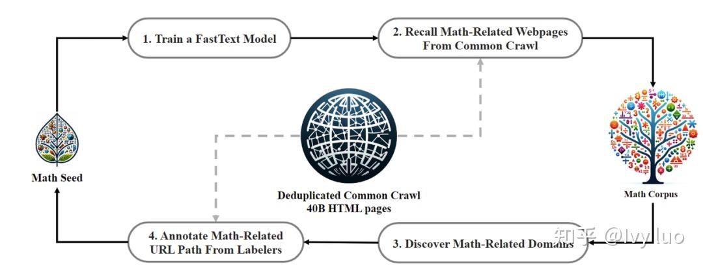

# 本章节理论较多,且代码部分较少,建议作为八股观看

# 1_Why_pretrain

，使模型能够**捕捉到数据的通用特征和模式**，从而提升其在各种任务上的性能和泛化能力，同时减少对标注数据的依赖，让模型掌握通用能力，产生一个base模型，并加速模型在新任务上的训练和适应过程。比如在预训练期间，模型会接触大量未标记的文本数据，例如书籍、文章和网站，目标是捕获文本语料库中存在的底层模式、结构和语义知识

* **数据稀缺性：**&#x5728;现实世界的应用中，收集并标注大量数据往往是一项既耗时又昂贵的任务。 特别是在某些专业领域，如医学图像识别或特定领域的文本分类，标记数据的获取更是困难重重。预训练技术使得模型能够从未标记的大规模数据中学习通用特征，从而减少对标记数据的依赖。这使得在有限的数据集上也能训练出性能良好的模型

* **先验知识问题：**&#x5728;深度学习中，模型通常从随机初始化的参数开始学习。然而，对于许多任务来说，具备一些基本的先验知识或常识会更有帮助。预训练模型通过在大规模数据集上进行训练，已经学习到了许多有用的先验知识，如语言的语法规则、视觉的底层特征等。这些先验知识为模型在新任务上的学习提供了有力的支撑

大模型预训练采用的方法是在**大量无标签语料**上进行**自监督学习**（区别于聚类等无监督学习，NTP利用下一个token作为标签进行自监督学习），具体训练目标是**Next Token Prediction loss：**

$$L=-\sum_{n=1}^N \log p\left(x_n \mid x_1, x_2, \ldots, x_{n-1} ; \theta\right)$$

其**基本思想是，模型根据上下文预测下一个最可能的单词，Next Token Prediction Loss 通过计算每个预测的对数似然损失，帮助训练模型进行更准确的下一个单词预测**

# 2_Pretrain_data

### **2_1通用预训练数据分布**

> **预训练阶段涉及学习大量数据，以全面了解世界及其各种复杂性**。现有的大语言模型主要将各种**公开的文本数据进行混合作为预训练语料**。预训练数据可以分为**通用文本数据和专用文本数据**，其中通用文本数据规模较大，涵盖了**网页、书籍和对话**等内容，用以增强模型的语言建模能力；专用文本数据则是为了进一步提升大语言模型在特定任务上的表现，如**多语言数据、科学数据、math数据、code数据和逻辑推理**等高级技能数据，所以需要收集大量的多领域的语料，目前一些常见的数据来源有以下几种：
>
> * **Common Crawl**：这是一个开放的数据共享平台，里面是大量的网页数据
>
> * **GitHub：**&#x4ECE; GitHub 上收集代码相关的数据
>
> * **网页文本：**&#x6536;集与代码相关和与数学相关的网络文本，如选择代码论坛、库网站、数学网站等
>
> * **电子书、教育材料和论文资料：**&#x8FD9;些资源涵盖丰富的知识内容，有助于提升模型在不同领域的理解和生成能力
>
> * **内部数据：**&#x505A;大模型的公司组织的内部相关数据，可能是业务上的垂域数据
>
> 一般用到的总体数据量会达到**10T tokens**的量级，此外对于通用base模型来说，**不同语种的语料**也都要收集，主要是中英文，小语种看具体需求收集

**论文：Datasets for Large Language Models: A  Comprehensive Survey**

**链接：https://arxiv.org/pdf/2402.18041**

论文总结了444个大模型的数据集，这里展示预训练的相关的部分，其余的可以自行阅读查找

| **开源通用数据数据名**                 | **地址**                                                     |
| -------------------------------------- | ------------------------------------------------------------ |
| **Skywork/SkyPile-150B**               | https://huggingface.co/datasets/Skywork/SkyPile-150B         |
| **wikipedia-cn-20230720-filtered**     | https://huggingface.co/datasets/pleisto/wikipedia-cn-20230720-filtered |
| **C4**                                 | https://github.com/allenai/allennlp/discussions/5056         |
| **RedPajama**                          | https://huggingface.co/datasets/togethercomputer/RedPajama-Data-V2 |
| **EleutherAI/the\_pile\_deduplicated** | [https://huggingface.co/datasets/EleutherAI/the\\\_pile\\\_deduplicated](https://huggingface.co/datasets/EleutherAI/the%5C_pile%5C_deduplicated) |
| **WuDaoCorporaText**                   | https://data.baai.ac.cn/details/WuDaoCorporaText             |
| **YeungNLP/firefly-pretrain-dataset**  | https://huggingface.co/datasets/YeungNLP/firefly-pretrain-dataset |

### **2_2 数据爬取**

有些高质量的数据，比如论文书籍，往往还都是 pdf 格式，这时候还需要去调用效果较好的 pdf 服务。不要指望着靠 python 库来解析，稍微涉及一点公式、表格的 pdf，解析效果都一塌糊涂。用 GPT4 等大模型进行解析，大概率价格会远高于 pdf 解析服务。当然，自己训一个 OCR 模型也是可用的候选方案，前提是有足够高质量的 pdf-text 对齐数据

爬虫主要可分为：

1. **定向网站爬取**

2. **根据关键词从指定网站爬取**

3. **基于搜索引擎爬取**


具体

#### **基于关键词爬取指定网站**

**参考项目（可以自行去github下载）： https://github.com/NanmiCoder/MediaCrawler**

* 基本配置建议

```python
# 基础配置
PLATFORM = "xhs"
KEYWORDS = "法律文件"  # 关键词搜索配置，以英文逗号分隔
LOGIN_TYPE = "qrcode"  # qrcode or phone or cookie
COOKIES = ""
# 具体值参见media_platform.xxx.field下的枚举值，暂时只支持小红书
SORT_TYPE = "popularity_descending"
# 具体值参见media_platform.xxx.field下的枚举值，暂时只支持抖音
PUBLISH_TIME_TYPE = 0
CRAWLER_TYPE = (
    "search"  # 爬取类型，search(关键词搜索) | detail(帖子详情)| creator(创作者主页数据)
)
# 自定义User Agent（暂时仅对XHS有效）
UA = 'Mozilla/5.0 (Macintosh; Intel Mac OS X 10_15_7) AppleWebKit/537.36 (KHTML, like Gecko) Chrome/131.0.0.0 Safari/537.36 Edg/131.0.0.0'

# 是否开启 IP 代理
ENABLE_IP_PROXY = False

# 未启用代理时的最大爬取间隔，单位秒（暂时仅对XHS有效）
CRAWLER_MAX_SLEEP_SEC = 2

# 代理IP池数量
IP_PROXY_POOL_COUNT = 2

# 代理IP提供商名称
IP_PROXY_PROVIDER_NAME = "kuaidaili"

# 设置为True不会打开浏览器（无头浏览器）
# 设置False会打开一个浏览器
# 小红书如果一直扫码登录不通过，打开浏览器手动过一下滑动验证码
# 抖音如果一直提示失败，打开浏览器看下是否扫码登录之后出现了手机号验证，如果出现了手动过一下再试。
HEADLESS = False

# 是否保存登录状态
SAVE_LOGIN_STATE = True

# 数据保存类型选项配置,支持三种类型：csv、db、json, 最好保存到DB，有排重的功能。
SAVE_DATA_OPTION = "json"  # csv or db or json

# 用户浏览器缓存的浏览器文件配置
USER_DATA_DIR = "%s_user_data_dir"  # %s will be replaced by platform name

# 爬取开始页数 默认从第一页开始
START_PAGE = 1

# 爬取视频/帖子的数量控制
CRAWLER_MAX_NOTES_COUNT = 200

# 并发爬虫数量控制
MAX_CONCURRENCY_NUM = 2

# 是否开启爬图片模式, 默认不开启爬图片
ENABLE_GET_IMAGES = False

# 是否开启爬评论模式, 默认开启爬评论
ENABLE_GET_COMMENTS = False

# 爬取一级评论的数量控制(单视频/帖子)
CRAWLER_MAX_COMMENTS_COUNT_SINGLENOTES = 10

# 是否开启爬二级评论模式, 默认不开启爬二级评论
# 老版本项目使用了 db, 则需参考 schema/tables.sql line 287 增加表字段
ENABLE_GET_SUB_COMMENTS = False

# 已废弃⚠️⚠️⚠️指定小红书需要爬虫的笔记ID列表
# 已废弃⚠️⚠️⚠️ 指定笔记ID笔记列表会因为缺少xsec_token和xsec_source参数导致爬取失败
# XHS_SPECIFIED_ID_LIST = [
#     "66fad51c000000001b0224b8",
#     # ........................
# ]

# 指定小红书需要爬虫的笔记URL列表, 目前要携带xsec_token和xsec_source参数
XHS_SPECIFIED_NOTE_URL_LIST = [
    "https://www.xiaohongshu.com/explore/66fad51c000000001b0224b8?xsec_token=AB3rO-QopW5sgrJ41GwN01WCXh6yWPxjSoFI9D5JIMgKw=&xsec_source=pc_search"
    # ........................
]

# 指定抖音需要爬取的ID列表
DY_SPECIFIED_ID_LIST = [
    "7280854932641664319",
    "7202432992642387233",
    # ........................
]

# 指定快手平台需要爬取的ID列表
KS_SPECIFIED_ID_LIST = ["3xf8enb8dbj6uig", "3x6zz972bchmvqe"]

# 指定B站平台需要爬取的视频bvid列表
BILI_SPECIFIED_ID_LIST = [
    "BV1d54y1g7db",
    "BV1Sz4y1U77N",
    "BV14Q4y1n7jz",
    # ........................
]

# 指定微博平台需要爬取的帖子列表
WEIBO_SPECIFIED_ID_LIST = [
    "4982041758140155",
    # ........................
]

# 指定weibo创作者ID列表
WEIBO_CREATOR_ID_LIST = [
    "5533390220",
    # ........................
]

# 指定贴吧需要爬取的帖子列表
TIEBA_SPECIFIED_ID_LIST = []

# 指定贴吧名称列表，爬取该贴吧下的帖子
TIEBA_NAME_LIST = [
    # "盗墓笔记"
]

TIEBA_CREATOR_URL_LIST = [
    "https://tieba.baidu.com/home/main/?id=tb.1.7f139e2e.6CyEwxu3VJruH_-QqpCi6g&fr=frs",
    # ........................
]

# 指定小红书创作者ID列表
XHS_CREATOR_ID_LIST = [
    "63e36c9a000000002703502b",
    # ........................
]

# 指定Dy创作者ID列表(sec_id)
DY_CREATOR_ID_LIST = [
    "MS4wLjABAAAATJPY7LAlaa5X-c8uNdWkvz0jUGgpw4eeXIwu_8BhvqE",
    # ........................
]

# 指定bili创作者ID列表(sec_id)
BILI_CREATOR_ID_LIST = [
    "20813884",
    # ........................
]

# 指定快手创作者ID列表
KS_CREATOR_ID_LIST = [
    "3x4sm73aye7jq7i",
    # ........................
]

# 指定知乎创作者主页url列表
ZHIHU_CREATOR_URL_LIST = [
    "https://www.zhihu.com/people/yd1234567",
    # ........................
]

# 指定知乎需要爬取的帖子ID列表
ZHIHU_SPECIFIED_ID_LIST = [
    "https://www.zhihu.com/question/826896610/answer/4885821440", # 回答
    "https://zhuanlan.zhihu.com/p/673461588", # 文章
    "https://www.zhihu.com/zvideo/1539542068422144000" # 视频
]

# 词云相关
# 是否开启生成评论词云图
ENABLE_GET_WORDCLOUD = False
# 自定义词语及其分组
# 添加规则：xx:yy 其中xx为自定义添加的词组，yy为将xx该词组分到的组名。
CUSTOM_WORDS = {
    "零几": "年份",  # 将“零几”识别为一个整体
    "高频词": "专业术语",  # 示例自定义词
}

# 停用(禁用)词文件路径
STOP_WORDS_FILE = "./docs/hit_stopwords.txt"

# 中文字体文件路径
FONT_PATH = "./docs/STZHONGS.TTF"

```

* **运行脚本示例**

```plain&#x20;text
python main.py --platform zhihu --lt qrcode --type search
```

### **2_3 数据清洗**

**数据清洗是预训练处理数据最重要的环节**，得到的**数据的质量、多样性**决定了模型的通用能力效果

这部分建议多看各家的技术报告学习，比如**deepseek-math的技术报告，其中的数据处理Pipeline可以好好研读，详解在第8.2章[ 8.2 技术报告详解](https://kcnd4kn8i6ap.feishu.cn/wiki/Ini5wfy20imsnGkYxYdcgW1lnUf#share-KZgddpAndoiEfLxMY2UcPk52nEb)**

#### **URL 过滤（llama 3.1）**

> 通过制定 **URL 黑名单**(成人网站等)和计算 URL 分数来决定内容是否保留，为了区分于人工精心构建的数据集，像 Arxiv、WikiPedia 这些前缀网站的内容也将被过滤

```python
#!/usr/bin/env python3

#@> IMPORTING ALL THE DEPENDENCIES
import re
import argparse
from urllib.parse import urlparse
from sys import stdin, stdout, exit

#@> PROCESSING COMMAND LINE ARGUMENTS
parser = argparse.ArgumentParser(epilog="\tExample:\nwaybackurls sub.domain.tld | parshu")
parser._optionals.title = "OPTIONS"

#@> OPTIONS
parser.add_argument('-x', dest='xss', action='store_true', help="Filter all URLS where you check for xss.")
parser.add_argument('-r', dest='redirect', action='store_true', help="Filter all URLS where you check for open-redirect.")
parser.add_argument('-l', dest='lfi', action='store_true', help="Filter all URLS where you check for lfi.")
parser.add_argument('-s', dest='sql', action='store_true', help="Filter all URLS where you check for sqli.")
parser.add_argument('-t', dest='ssti', action='store_true', help="Filter all URLS where you check for ssti.")
parser.add_argument('-f', dest='ssrf', action='store_true', help="Filter all URLS where you check for ssrf.")
parser.add_argument('-c', dest='rce', action='store_true', help="Filter all URLS where you check for rce.")
parser.add_argument('-q', dest='query', action='store_true', help="Filter all URLS which contains query parameters.")

cmd = parser.parse_args()

#@> REGEX PATTERNS
PATTERN = "(\.asp|\.aspx|\.bat|\.cfm|\.cgi|\.css|\.dll|\.exe|\.htm|\.html|\.inc|\.jhtml|\.js|\.jsa|\.jsp|\.log|\.mdb|\.nsf|\.pcap|\.php|\.php2|\.php3|\.php4|\.php5|\.php6|\.php7|\.phps|\.pht|\.phtml|\.pl|\.reg|\.sh|\.shtml|\.sql|\.swf|\.txt|\.xml|\.ini|\,xml|\.bat|\.LOG|\.tn|\.bak|\.sql)"
XSS_REGEX = "(api=|api_key=|begindate=|callback=|=|categoryid=|csrf_token=|email=|emailto=|enddate=|id=|imagine=|immagine=|item=|jsonp=|key=|keyword=|keywords=|l=|lang=|list_type=|month=|name=|p=|page=|page_id=|password=|pid=|pp=|q=|query=|s=|search=|terms=|token=|type=|unsubscribe_token=|url=|username=|view=|year=)"
RED_REGEX = "(Lmage_url=|Open=|callback=|cgi-bin/redirect.cgi|cgi-bin/redirect.cgi?|checkout=|checkout_url=|continue=|data=|dest=|destination=|dir=|domain=|feed=|file=|file_name=|file_url=|folder=|folder_url=|forward=|from_url=|go=|goto=|host=|html=|image_url=|img_url=|load_file=|load_url=|login?to=|login_url=|logout=|navigation=|next=|next_page=|out=|page=|page_url=|path=|port=|redir=|redirect=|redirect_to=|redirect_uri=|redirect_url=|reference=|return=|returnTo=|return_path=|return_to=|return_url=|rt=|rurl=|show=|site=|target=|to=|uri=|url=|val=|validate=|view=|window=)"
SQL_REGEX = "(id=|select=|report=|role=|update=|query=|user=|name=|sort=|where=|search=|params=|process=|row=|view=|table=|from=|sel=|results=|sleep=|fetch=|order=|keyword=|column=|field=|delete=|string=|number=|filter=)"
STI_REGEX = "(template=|preview=|id=|view=|activity=|name=|content=|redirect=)"
SRF_REGEX = "(access=|admin=|dbg=|debug=|edit=|grant=|test=|alter=|clone=|create=|delete=|disable=|enable=|exec=|execute=|load=|make=|modify=|rename=|reset=|shell=|toggle=|adm=|root=|cfg=|dest=|redirect=|uri=|path=|continue=|url=|window=|next=|data=|reference=|site=|html=|val=|validate=|domain=|callback=|return=|page=|feed=|host=|port=|to=|out=|view=|dir=|show=|navigation=|open=|file=|document=|folder=|pg=|php_path=|style=|doc=|img=|filename=)"
LFI_REGEX = "(file=|document=|folder=|root=|path=|pg=|style=|pdf=|template=|php_path=|doc=|page=|name=|cat=|dir=|action=|board=|date=|detail=|download=|prefix=|include=|inc=|locate=|show=|site=|type=|view=|content=|layout=|mod=|conf=|url=)"
RCE_REGEX = "(daemon=|upload=|dir=|download=|log=|ip=|cli=|cmd=|exec=|command=|execute=|ping=|query=|jump=|code=|reg=|do=|func=|arg=|option=|load=|process=|step=|read=|function|req=|feature=|exe=|module=|payload=|run=|print=)"

try:
    if stdin.isatty():
        exit(0)
        
    if cmd.xss:
        for URL in stdin.readlines():
            """
            STDOUT all the URLS which contains xss parameters.
            """
            link = str(URL.strip())
            if re.search(XSS_REGEX, link):
                stdout.write(re.sub(r"'|(|)", "", link) + '\n')

    elif cmd.redirect:
        for URL in stdin.readlines():
            """
            STDOUT all the URLS which contains open-redirect parameters.
            """
            link = str(URL.strip())
            if re.search(RED_REGEX, link):
                stdout.write(re.sub(r"'|(|)", "", link) + '\n')
    
    elif cmd.lfi:
        for URL in stdin.readlines():
            """
            STDOUT all the URLS which contains lfi parameters.
            """
            link = str(URL.strip())
            if re.search(LFI_REGEX, link):
                stdout.write(re.sub(r"'|(|)", "", link) + '\n')
    
    elif cmd.sql:
        for URL in stdin.readlines():
            """
            STDOUT all the URLS which contains sql parameters.
            """
            link = str(URL.strip())
            if re.search(SQL_REGEX, link):
                stdout.write(re.sub(r"'|(|)", "", link) + '\n')
    
    elif cmd.ssti:
        for URL in stdin.readlines():
            """
            STDOUT all the URLS which contains ssti parameters.
            """
            link = str(URL.strip())
            if re.search(STI_REGEX, link):
                stdout.write(re.sub(r"'|(|)", "", link) + '\n')
    
    elif cmd.ssrf:
        for URL in stdin.readlines():
            """
            STDOUT all the URLS which contains ssrf parameters.
            """
            link = str(URL.strip())
            if re.search(SRF_REGEX, link):
                stdout.write(re.sub(r"'|(|)", "", link) + '\n')
    
    elif cmd.rce:
        for URL in stdin.readlines():
            """
            STDOUT all the URLS which contains rce parameters.
            """
            link = str(URL.strip())
            if re.search(RCE_REGEX, link):
                stdout.write(re.sub(r"'|(|)", "", link) + '\n')

    elif cmd.query:
        for URL in stdin.readlines():
            """
            STDOUT all the URLS which contains query parameters.
            """
            link = str(URL.strip())
            if re.search("(=|&)", link):
                stdout.write(re.sub(r"'|(|)", "", link) + '\n')
    
    else:
        for URL in stdin.readlines():
            """
            STDOUT all the URLS except which contains query parameters and files.
            """
            links = re.split('/', urlparse(URL.strip()).path)[-1]

            if re.search(PATTERN, links):
                output = re.sub(r"([^/\\]+)(\.php|\.p|\%|\.asp|\.aspx|\.bat|\.cfm|\.cgi|\.css|\.dll|\.exe|\.htm|\.html|\.inc|\.jhtml|\.js|\.jsa|\.jsp|\.log|\.mdb|\.nsf|\.pcap|\.php2|\.php3|\.php4|\.php5|\.php6|\.php7|\.phps|\.pht|\.phtml|\.pl|\.reg|\.sh|\.shtml|\.sql|\.swf|\.txt|\.xml|\.ini|\,xml|\.bat|\.LOG|\.tn|\.bak|\.sql).*", "", str(URL.strip()))
                stdout.write(re.sub(r"'|(|)", "", output) + '\n')

            elif re.search(r"(&|=|\?|\%)", URL.strip()):
                pass

            else:
                link= urlparse(URL.strip()).scheme + "://" + urlparse(URL.strip()).netloc + urlparse(URL.strip()).path
                output = re.sub(r"([^/\\]+)(\.php|\.p|\%).*", "", link)
                stdout.write(str(re.sub(r"'|(|)", "", output)) + '\n')
except KeyboardInterrupt:
    exit(0)
except:
    pass
```

#### **内容抽取**

> 在获得过滤后的 URL 集合后，我们需要获取到这些 URL 中的「文本信息」，需要过滤并丢弃「目录」、「标题」、「广告」等无关的内容，使&#x7528;**&#x20;`trafilatura` 库**来进行内容抓取，`trafilatura` 的使用方法也比较简单：

```python
# load necessary components
>>> from trafilatura import fetch_url, extract
# download a web page
>>> url = 'https://github.blog/2019-03-29-leader-spotlight-erin-spiceland/'
>>> downloaded = fetch_url(url)
>>> downloaded is None  
# assuming the download was successfulFalse# extract information from HTML
>>> result = extract(downloaded)
>>> print(result)
```

#### **语言识别**

> 1. 使用`FastText`训练一个语言识别模型，去掉那些语言阈值得分低于 0.65 的文章
>
> 2. 使用`langid`识别语言种类
>
> 3. 使用`data_juicer/ops/filter/language_id_score_filter.py`进行识别

```python
import langid
text = "Tudo bem?"
language = langid.classify(text)[0]
print(language)

def compute_stats_single(self, sample):
    # check if it's computed already
    if StatsKeys.lang in sample[
            Fields.stats] and StatsKeys.lang_score in sample[Fields.stats]:
        return sample

    text = sample[self.text_key].lower().replace('\n', ' ')
    ft_model = get_model(self.model_key)
    if ft_model is None:
        err_msg = 'Model not loaded. Please retry later.'
        logger.error(err_msg)
        raise ValueError(err_msg)
    pred = ft_model.predict(text)
    lang_id = pred[0][0].replace('__label__', '')
    lang_score = pred[1][0]

    sample[Fields.stats][StatsKeys.lang] = lang_id
    sample[Fields.stats][StatsKeys.lang_score] = lang_score

    return sample
```

#### **低质过滤**

> * **篇章级别过滤：**&#x9996;先，去除一些文章内一直重复同一段内容的文章，以及一些包含错误信息的文章（例如：抓取超时等）；其次，对每一篇文章，通过判断文章整体长度、标点符号占文章长度的比例等，来过滤掉那些不正规的文章
>
> * **句子级别过滤：**&#x8FC7;滤掉文章中的一些无用的句子，这种句子通常没有具体含义，但话术繁多，又难以穷举。因此，通过设定以下策略来过滤掉这些语句（某些规则只适用于英语）：
>
>   1. 句子中主要由大写字符组成（丢弃）
>
>   2. 句子由纯数字组成（丢弃）
>
>   3. 命中特定关键词，如\['关注', '转发', '点赞']（丢弃）
>
>   4. 如果句子长度小于 10，且命中以下模版：\* 句子以（登录、注册）开头。\* 句子以（展开、更多）结尾
>
> * **利用启发式规则进行 pretrain 数据质量筛选：**&#x901A;过精心设计的规则有针对性地识别和剔除低质量数据
>
>   **具体的例子：**
>
>   1. 为了训练特定目标语言的模型可以**过滤掉其他语言的文本**
>
>   2. 数据长度是否少于某个值，数据中某个 token 的比例超过某个阈值，数据的中文占比、英文占比、数字占比，数据是否有“http”字段，数据是否包含了“新冠”、“疫情”等低质量关键词，数据是否包含某些反动词汇，数据是否包含某些黄色字眼等。用规则清洗或者过滤数据的时候，一定不要把数据搞成分布有偏的数据
>
>   3. 还可以利用困惑度（Perplexity）等文本生成评估指标来检测和删除表达不自然的句子
>
>   4. 制定精准的清洗规则，结合关键词集合进行过滤
>

#### 模型打分

> 利用**模型对 pretrain 数据的质量进行打分**，已经成了数据清洗工作的标配，llama3、qwen2 的技术报告都有提及。同 size 下，**BERT 结构的模型的表征能力是强于 transformer-decoder 模型的**，因此**打分模型可以使用BERT类型的模型进行训练**，或者利用**强闭源模型**来对训练数据进行打分，比如GPT4o
>
> 训练文本分类器进行数据清洗。具体来说，可以选取部分代表性的数据进行质量标注以训练分类器，例如将维基百科等高质量数据作为正样本、将筛选出含有不良内容或低质量数据的样本作为负样本
>
> 训打分器这个工作的难点是要学会放低心态，不**要执着于打分器 100% 的准确率，凑合能用**就行了，有打分器总比没打分器强，但你要花一个月来训打分器，那就还不如没打分器。此外要学会变通，你有 32K 的语料不代表你要训 32K 的打分器，训个 4K 就差不多了，你非要纠结存在“前 4K 低质量，后 28K 高质量”这种特殊情况，我只能说算你牛逼。一般用**Bert-base/FastText**做微调就行，具体的训练流程可以参考 Deepseek-Math [**&#x20;8.2 技术报告详解**](https://kcnd4kn8i6ap.feishu.cn/wiki/Ini5wfy20imsnGkYxYdcgW1lnUf#share-KZgddpAndoiEfLxMY2UcPk52nEb)


#### 数据去重

> 在预训练过程中的数据重复，大体可以分为三类：
>
> * **训练数据集中的重复：**&#x7528;于训练的多个类型、来源的数据集内部和之间的重复。其一，数据集内部的重复，包括单个文档内部重复的lines、paragraphs、n-grams等（说明文档本身质量较低）、多个文档之间的重复（基于完全匹配或者模糊匹配）；其二，数据集之间的重复，主要指多个数据集基于同一个来源但是进行了不同的预处理之后产出的数据，一个典型的例子是LLaMa等模型会同时使用基于CommonCrawl预处理过的数据以及之前T5模型基于当时CommonCrawl处理的C4数据，两者定然是有一定重复的
>
> * **训练迭代设置的重复：**&#x5728;给定数据集上人为设定的重复轮次（Epochs），一般来说针对不同类型、来源、质量的数据采样训练的Epochs并不一致
>
> * **训练与测试集的重复：**&#x4F8B;如，预训练过程中预留的观测Language Modeling Loss的测试集、用于评测效果的Benchmarks等，都应该从训练集合中去除相似的数据

| **阶段** | **重点**                                   | **描述**                                                     |
| -------- | ------------------------------------------ | ------------------------------------------------------------ |
| 第一步   | 确定Unit是什么                             | 根据给定数据的来源、性质、特征，确定基本处理单元，例如，数据集是否由成百上千的文件组成？文件中的基本单位是什么？如LLaMa中，针对CommonCrawl，在Line-level进行去重（[cc\_net pipeline](https://github.com/facebookresearch/cc_net)）；针对Books3，在Book-level进行覆盖超过90%即去重；针对Github代码数据，在File-level进行完全匹配去重。《LLaMa》 |
| 第二步   | Unit自身的去重                             | 对于给定的Unit，分析其内部是否包含很高比例的重复lines、paragraphs、n-grams，如果是，说明Unit本身质量低，直接丢弃整个Unit。（这一步本质上属于质量过滤）《Gopher》 |
| 第三步   | Unit之间的去重                             | 基于完全匹配和模糊匹配来对比两个文档的重合度，去除其中一个，最终获得Unique Units的集合。《Gopher》 |
| 第四步   | 测试集和训练集的去重（Test-set Filtering） | 去除训练集中和测试集相似的文档                               |

> 常用的指标包括了`simhash、minhash`，利用**minhash等技术进行文本去重**，要先**确定需要多少训练数据**，**再确定去重的粒度**。需要 10T 训练数据，就卡相似度在 80% 的阈值进行去重

数据多样性探索

> 数据多样性有多个方面：有**任务的多样性，有语义的多样性，有语种的多样性，数据来源的多样性等等**。在大模型建设的各个环节，数据的质量和多样性一直是大家比较关注的问题，预训练阶段，收集不同来源的数据行业中共识是sft阶段用到的数据应该是高质量、多样性的，**maybe only 0.5% data is needed**论文中提出利用聚类的思想筛选sft样本的做法，方案包括 **向量化 -> 聚类 -> 核心样本采样三步**
>
> ***参考文献：[LIMA: Less Is More for Alignment；maybe only 0.5% data is needed](https://zhuanlan.zhihu.com/p/645738702)***
>
> 
>
> 
>
> 使用**simbert进行embedding，质量权重可以由单独的质量打分模型得到**
>
> **方案1:** 基于**k-means聚类的多样性采样**。缺点：**质量差的样本采样概率提高**
>
> **方案2:** 基于**聚类簇的多样性权重和质量权重的加权采样**。缺点：样本聚类之后，会**存在有些簇间样本对之间的相似度比簇内样本对之间的相似度还要高**
>
> **方案3: KNN聚类，类内平均样本相似度作为多样性权重（反过来），结合质量权重，最后根据权重采样**。对比阈值相似度80%以内的样本数量作为多样性权重，分布更接近正态分布
>
> 预训练注重的是知识注入，相似语义的两句话也是知识的一种
>
> ***参考文献：D4: Improving LLM Pretraining via Document De-Duplication and Diversification***

#### **垂域经验**


主要参考的也还是 **[DeepseekMath](https://zhuanlan.zhihu.com/p/681626675)**的做法



1. **爬取尽可能多的数据文档**，作为初始种子数据语料库

2. 基于聚类方法，从中文语料数据库中，筛选出**垂域**数据，即召回**互联网开源书籍/百科数据/网页资料等的相关垂域文档，扩充种子数据**

   pipeline：**关键词初筛通用数据 -> 召回与种子数据相似度top10的数据 -> 人工筛选**

   1. **关键词初筛通用数据**

      1. 首先，对种子文本细化处理，保留文档段落信息，以不同标题段落内容，划分知识文档数据

      2. 基于jieba分词挖掘内部种子文本的关键词：参考链接：[138自然语言处理通关手册--新词挖掘](https://www.jianshu.com/p/923e2ae4432c)

      3. 挖掘到的关键词再经过一次人工筛选，最后整理到关键词表

      4. 从通用数据中，筛选出命中N个关键词表的数据

   2. **召回与种子数据相似度top10的数据**
      1. 这里取通用数据的前 512 tokens 计算相似度

   3. **人工筛选**

      1. 标注前面得到的通用数据，选择垂域相关的数据，作为扩充种子数据

3. 训练一个中文领域数据分类器

   1. **训练数据** 正例由垂域种子文档（这里使用划分后的数据），及第2步筛选出来的扩充种子数据（每个文档取前1k tokens）。而负例为第2步被标注为“不是垂域”的数据

   2. **模型选择** 1024长度的BERT中文模型

   3. **模型效果&#x20;**&#x6700;后，得到一个高精度（95%+）的中文领域分类模型，并从中文语料数据库（预测时，取每个文档的前 1k tokens进行识别）中，筛选出 0.5 B的垂直语料

### **2_4 数据配比和顺序**

> ### **指导思想**
>
> 按照任务类型进行划分，分得越细越好，最好精细到3级类别。比如一级 **中文、英文，code**。训练一个数据分类器，对每一个 document 进行类别判断，不用特别精准，把数据划分成**百科、code、markdown、等类目**即可，分类器模型依然可以选择使用 BERT 家族。数据量级在2w条左右
>
> 大部分的开源大模型技术报告里，都提及**训练的数据是如何配比的**，基本上都是**“知识 + 代码 + 逻辑”**&#x4E09;个大类目，其中知识数据分文中文知识和英文知识，逻辑数据则可以认为是 math 数据和 cot 数据的混合体。整体上，大部分中文模型的配比都差不多为 **中：英：code = 4:4:2**
>
> 中文大模型中文尽量占一半以上，英文质量会更高，也不能太少，如果想要模型推理能力能强，math和code数据要尽可能多

> ### **大厂做法**
>
> * 进一步到领域专项模型等训练的话会加入领域数据做进一步配比，对 continue pretraining，如果要让模型不丢失通用能力，比如 summarization，qa 等
>
> * 领域数据 continue pretraining 时，一定更**要混合大量通用数据**。「**领域数据**比例要在`15%`以下」，一旦超过这个阈值，模型**通用能力会下降**很明显。这个阈值和不同的预训练模型相关，有些模型比如llama需要控制的阈值更低。阈值其实是经验主义结论，范围都在 **10%-15%** 左右。而且阈值和预训练模型的大小，预训练时原始数据的比例等条件都息息相关，需要在实践中反复修正
>
> * sft 比例可提高不少，**领域数据:通用数据=1:1**，如果**sft数据量少，混不混数据差别就不太大**了
>
> * 上述的数据**配比一般是先在小模型上实验**，然后利用scaling law去推算应用到大模型上的效果，因此一般会在小模型上做多组数据配比实验，观测loss情况

> ### **课程学习**
>
> 大模型在大量预训练数据上学习的时候一般会采用**课程学习**的方式，就是**先学什么，再学什么**，考虑到大模型在训练过程中会出现遗忘的情况，**数据的训练顺序也很重要**，这部分**也需要先在小模型上进行实验**。下面以三种常见能力为例，介绍具体的数据课程在**继续预训练**中的应用：

> ### **代码能力**
>
> 为了提高模型的代码生成能力，研究人员基于 LLaMA-2 开发了 CodeLLaMA，采用的数据课程为：2T 通用 token  → 500B 代码密集型 token 。CodeLLaMA 还提供了一个面向 Python 语言的特定代码大模型 CodeLLaMA-Python，采用的数据课程为：2T 通用 token  → 500B 代码相关 token  → 100B Python 代码相关 token&#x20;

> ### **数学能力**
>
> Llemma 选择 CodeLLaMA 作为基座，进一步在包含论文、数学和代码的混合数据集合上进行继续预训练，采用的数据课程为：2T 通用 token  → 500B 代码相关 token  → 50∼200B 数学相关 token 。特别地，Llemma 在继续预训练数据中还包含 5％的通用领域数据，这可以看做一种模型能力的“正则化”技术，加强对于基座模型通用能力的保持

> ### **长文本能力**
>
> 很多工作通过继续预训练有效扩展了大语言模型的上下文窗口，主要是针对 RoPE 中的位置嵌入编码进行修改。例如 CodeLLaMA 将 LLaMA-2 的上下文窗口从 4K 扩展到了 100K，采用的数据课程为：4K 上下文窗口的 2.5T  token  → 16K 上下文窗口的 20B  token

# 3_pretrain流程

## 3_1 tokenizer-train

进行预训练之前，我们需要先选择一个预训练的模型基座。根据收集到的数据以及具体需求，训练一个 tokenizer。在收集到的数据集以及更大的通用数据集上，利用 BPE / BBPE / WordPiece 算法进行训练。一个较为普遍的问题是：**大部分优秀的语言模型都没有进行充分的中文预训练（这段话在2024年可能是对的，但是在2025年有DeepseekR1这样比较优秀的中文能力大模型存在，这句话可以选择性理解）**。因此，**许多工作都尝试将在英语上表现比较优秀的模型用中文语料进行二次预训练，期望其能够将英语上的优秀能力迁移到中文任务中**来。通俗来讲，tokenizer 的目的就是将一句话进行切词，并将切好词的列表喂给模型进行训练。例如：你好世界 >>> \['你', '好', '世', '界']

### **切词技巧**

> 至于怎么训 tokenizer：找一个内存空间很大的 cpu 机器，再找一份很大的 common 数据集，然后利用 BPE / BBPE 算法去跑，这里提醒一些细节：
>
> * **数字切分**（避免 9.9 > 9.11 的问题回答不正确)
>
> * **控制压缩率**，1 个 token 对应多少个汉字：压缩率太低，那就是字太多、词太少，很影响解码效率；压缩率太大，也就是词太多，又会影响模型的知识能力。通常，压缩率越低的模型，loss 也会低，大部份中文大模型的1 个 token 会映射成 1.5 个汉字左右
>
> * **手动移除脏的、敏感token**
>
> * 如果提前知道自己的业务场景，那就应该**补充业务场景对应的 token**，增加**业务场景文本的压缩率**，比如医疗场景，就提前把阿莫西林、青霉素等作为一个 token
>
> * **词表的中、英覆盖率要足够大**，至于其他小语种是否要加，则看业务需求
>
> * tokenizer 的**词表大小vocab\_size 和模型的 embedding\_size 之间，要有一千个左右的余量，后续的对齐环节，需要大量在 pretrain 阶段没见过的全新 token 来做训练**

### **词表扩充**

> 为了降低模型的训练难度，通常会考虑在原来的词表上进行**词表扩充**，也就是将一些常见的汉字 token 手**动添加到原来的 tokenizer** 中，从而降低模型的训练难度。对比 **Chinese-LLaMA和LLaMA&#x20;**&#x4E4B;间的 tokenizer 的区别如下图
>
> 可以发现：**Chinese LLaMA 在原始 tokenizer 上新增了17953 个 tokens，且加入 token 的大部分为汉字**。而在 **[BELLE](https://arxiv.org/pdf/2304.07854)&#x20;**&#x4E2D;也有同样的做法：在 120w 行中文文本上训练出一个 5w 规模的 token 集合，**并将这部分 token 集合与原来的 LLaMA 词表做合并**，最后再在 3.2B 的中文语料上对这部分新扩展的 token embedding 做二次预训练


## 3_._2 确定模型结构和参数

> 模型结构一般就使用**Llama架构，也就是RoPE + GQA + RMSNorm + SwiGLU，模型参数则根据拥有的训练资源进行选择。**&#x4E0B;表是模型大小对应所需资源的简要示意图：

| **Method**                      | **Bits** | **7B** | **14B** | **30B** | **70B** | **`x`B**  |
| ------------------------------- | -------- | ------ | ------- | ------- | ------- | --------- |
| Full (`fp32`)                   | 32       | 120GB  | 240GB   | 600GB   | 1200GB  | `～18x`GB |
| Full (`pure_bf16`)              | 16       | 60GB   | 120GB   | 300GB   | 600GB   | `～8x`GB  |
| Freeze/LoRA/GaLore/APOLLO/BAdam | 16       | 16GB   | 32GB    | 64GB    | 160GB   | `～2x`GB  |
| QLoRA                           | 8        | 10GB   | 20GB    | 40GB    | 80GB    | `～x`GB   |
| QLoRA                           | 4        | 6GB    | 12GB    | 24GB    | 48GB    | `～x/2`GB |
| QLoRA                           | 2        | 4GB    | 8GB     | 16GB    | 24GB    | `～x/4`GB |

## 3.3 训练框架选择

> 预训练框架尽量选择`Megatron-LM`，如果模型是Qwen，建议用`Pai-Megatron-Patch`项目地址：https://github.com/alibaba/Pai-Megatron-Patch。尽量别用deepspeed做训练（所以别用OpenRLHF和DeepSpeed-Chat做预训练）
>
> ### **为什么这样选择？**
>
> 1. **训练速度快：**&#x74;ensor\_parallel 和 pipeline\_parallel 被优化的炉火纯青，rope 已经被开发成了 apex 算子，速度远高于 llama 里的实现方案，据说 mlp 层的 apex 算子也正在开发
>
> 2. **参数清晰而明确：**&#x61;rgument.py 里，你能看见上百个参数配置，哪些层使用 dropout 等细节，训练框架早就帮你考虑好了，可微操的空间很大
>
> 3. 启动训练的时候模型加载速度快，千亿级别的模型一分钟就加载完毕了，debug 十分方便

## [3.4 预训练策略]((https://shengdinghu.notion.site/MiniCPM-c805a17c5c8046398914e47f0542095a))

> 多多参考**MiniCPM，phi系列，DeepSeekMath**的训练方式

### 最优batch_size

> `batch_size`决定了模型的收敛速度和消耗计算资源的平衡。`batch_size`过大，达到一定的损失消耗的数据量和计算量都会很大，而`batch_size`过小，则需要消耗过多的训练步数，且有可能损失函数下降有限。0.009B，0.036B，0.17B的模型上分别进行了6个batchsize的训练实验，结果记录如下图
>
> 最优batchsize随着C4数据集上的loss的偏移规律：$$B S=\frac{1.2110 \times 10^9}{L^{6.2393}}$$


### **WSD调度器**

> 大部分训练阶段分为：**快速收敛、平稳、退火三个阶段**。在退火阶段，我们加入高质量数据，一般采用余弦退火算法进行训练。minCPM提出了WSD调度器。这种学习率调度器分为三个阶段，warmup阶段（用W表示warmup阶段结束时的步数/训练量），稳定训练阶段（用S表示稳定训练阶段结束时的步数/训练量），退火阶段（用D表示退火阶段的训练量）。这种调度器可以写为：
>
> $$\operatorname{lr}(s)=\left\{\begin{array}{l}
> \frac{s}{W} * \eta, s<W \\
> \eta, W<s<S \\
> f(s-S) * \eta, S<s<S+D
> \end{array}\right.$$
>
> 其中 $$0<f(s−S)≤1$$是一个关于$$s$$的减函数，*η*是最大学习率。这种策略有四个好处：**可以持续训练、可以随时取出、性能优于Cosine LRS(Learning Rate Schedule)、有显式区分的训练阶段，便于使用不同的数据策略**

### **预训练Trick**

> * **提升训练效率：**&#x43;PT的训练时长一般在1个月以上，在显存够用的情况下，能不引入 tensor\_parallel，pipeline\_parallel，sequence\_parallel 就不要去引入，同样地、能不开 offload 就不要开 offload，能不开重算就不开重算
>
> * **加入指令数据：**&#x76EE;前看来指令数据占比越高越好

### **训练设置**

> pretrain 训练流程目前基本是固定的，当训练数据和训练代码都准备就绪后，按照以下四个流程来设置学习率和超参数就可以啦：
>
> * 开局 warmup，学习率缓慢上升到最大
>
> * 中间 cos / cos\_decay / constant / constant\_decay ，学习率比较大，是否 decay 看情况决定，多翻翻别人的技术报告，或者在小模型上做实验决定
>
> * 后期 改变 RoPE 的 base 频率，增加文本长度，开始让模型适应长文本
>
> * 收尾 anneal，用高精数据、IFT数据等来给强化模型的考试能力，做完退火就该上考场刷 benchmark 了
>

**总结一下，一般来说预训练也通常会用两阶段或者多阶段的训练流程，先在全部语料上训练，然后在小部分长文本上训练，最后在小部分高质量数据上退火训练**

## **3.5 训练容灾及训练监控**

1. **监控channel\_loss**，至少，**中文知识，英文知识，代码这三类数据的 loss 得分开观察**
2. *观察loss\_spike** ，虽然目前还没有工作去证明说 loss\_spike 会对模型造成不可逆的效果伤害，但不出现 loss\_spike 总是好的啊。loss毛刺不可忽视，无论是 loss 突然**激增还是突然激减**，都要重点留意，**大概率是数据问题**（脏数据不仅 loss 高，也会 loss 低，**全是乱码的数据 loss 很高，全是换行符的数据 loss 很低**）
3. **PPL(困惑度)：**&#x4E00;般，如通用语料，1）会先升后降，2）降低配比的数据可能会有上升趋势，3）而新增的领域数据，呈现下降趋势。我们会监控从每个数据集（同一个数据来源）随机抽样出200个左右的样本，作为PPL监控的样本
4. **不同 step 的 ckpt few-shot 提示的效果**

PPL是自然语言处理中常用的一个评价指标，用于衡量语言模型的好坏。语言模型Model在测试集数据 $$T=\left\{w_{1}, w_{2}, \ldots, w_{N}\right\}$$上的PPL越低，说明模型对下一个单词的预测越准确，模型性能越好：

&#x20;                    $$    \text{Perplexity}(Model)=\exp\left(-\frac{1}{N}\sum_{i = 1}^{N}\log P\left(w_{i}\mid w_{1}, \ldots, w_{i-1}\right)\right)$$

### **解决`loss_spike`的方式**

1. 更换 checkpoint，找到出现 **loss spike最近的 step** 重新训练（来源于GLM130B技术报告）

2. 减小 $$\epsilon$$的大小

3. 浅层梯度乘上一个缩放系数降低浅层的梯度更新值

4. 使用miniCPM提出的WSD训练策略

5. z-loss正则化，控制内部softmax的归一化增长

## 3.6 预训练的Scaling Law

首先**做预训练得知道如何估算资源**，牢记下面公式：

$$\text{计算预算}(FLOPs)=6\times\text{数据}(token\text{数量})\times\text{模型尺寸}(\text{参数数量})$$

* 计算预算可以理解为多少卡 \* 多少天

  * 比如，100 台 A800，训练一个月。一块 A800 目前能达到最好的吞吐大概就是 210 TFLOPs/GPU(可以去英伟达官网查: https://developer.nvidia.com/cuda-gpus)，那么总预算就是： $$210*10^{12}*100*30*24*3600=5.4*10^{22} FLOPS$$

* 其他单位

  * Tokens: 一般我们都说训练用了多少"T"的Token， $$1T Token = 1*10^{12}$$

  * 参数数量: 一般都说这个模型多少"B"， $$1B 参数 = 1*10^9$$

* 那应该训练多大的模型？

  * 根据公式，给定预算后，数据量和模型尺寸是成反比的。即，要么用**大量数据**训练一个**小模型**，要么用**少量数据**训练一个**大模型**

  * 比如这一个月如果训练一个 7B 的模型，可以训练的  $$Token 数 =(4.35*10^{23}) / (7*10^9) / 6 = 10*10^{12}$$，大概就是 10T 的 Tokens

  * 这一个月如果训练一个 70B 的模型，同理，就是 1T Tokens

### **Llama3的scaling law**

给定不同的预算($$6*10^{18} - 10^{22} FLOPs$$)，调整模型的大小(从 40M 到 16B)做了若干组实验，然后绘制了下图：(带入上文的公式)


有了在小模型上的实验结果，接下来需要预测**在大预算下，什么模型是计算最优模型**。本文还是使用幂律定则建模： $$N^∗(C)=AC^α$$ 。其中 C 是输入一个 FLOPs 预算，N\* 是这个预算下的计算最优 Token 数，A 和 alpha 是需要拟合的参数。将刚才的实验中的计算最优点，重新绘制成下图，就可以拟合到这条线。这里 alpha=0.537，A=0.299


**指标预测**

使用 **ARC Challenge 评测集**。这是一个比较难的选择题评测集，一种常见的评测方法就是**让模型算各个选项的 PPL，然后看哪个选项的 PPL 最低，就作为模型的最终答案**。最后计算整体准确率。

预测指标分为两步：第一步，使用**正确答案线性拟合的 NLL loss 和 FLOPs 的关系**（这里使用刚才实验的计算最优小模型）；第二步，**使用 sigmoid拟合 Loss 和 准确率 的关系**（这里使用小模型 + Llama 2）


得到这两个曲线后，我们就知道给定预算下，这个模型能取得什么指标了。Llama3作者发现这种方法非常精准，**可以外推 4 个数量级，在 Llama3 的 405B 旗舰模型上只低估了一点点**

> 在 < 70B 的模型中，“计算最优”并没有很重要，因为这时并没有给定的预算，**给定的是模型尺寸，需要保证推理速度**。在**更大的模型训练场景下，给定的是计算预算**，所以“**计算最优”就更重要**了。也许未来随着芯片算力的发展，405B 也会成为“小模型”，那这时我们就可以用更多的 tokens 来卷这个尺寸了。Scaling Laws 对于大模型还是非常重要的，因为 Scaling Laws 不仅能让我们**得到“计算最优”模型**，还能让我们提前知道投入了这么多钱，排放了这么多二氧化碳后，我们**能得到什么**。过去的工作主要集中在 dev loss 的推算，Llama 3 拟合了任务指标，能够给出我们更直观的感受。对于选择题这种知识类测评，这种方法看起来比较靠谱，但是怎么评价模型的 COT、数学推理能力，还需要一些更好的预测方式

## [**3.7 混合精度训练**](https://zhuanlan.zhihu.com/p/618865052)

> ### **Megatron 混合精度训练**的整体流程
>
> 1. **计算准备：**存储一份 fp32 的 parameter，momentum 和 variance（Adam优化器）。然后，我们将 parameter 复制一份，再将其精度减半，得到一份 fp16 的 parameter
>    * fp32 的 parameter 相当于“**主权重**”。在模型训练的过程中，我们执行`optimizer.step()`**更新的就应该是这份权重**。当模型训练完毕后，我们保存的也是它。取得高精度的权重是我们的最终目标
>
>    * fp16 的 parameter 相当于“**训练权重**”，也就是在训练过程中实际参与**前向传播过程的权重**
>
> 2. **FWD：**&#x4F7F;用 fp16 的 parameter 做前向计算，在这过程中我们会得到 fp16 的 activation（将在反向传播过程中被使用）。特别注意的是，如果没有采取重计算等操作，activation 占据的存储会非常大（可能大过模型本身）。**计算出来的 loss 我们用 fp32 精度来表示，这样做是为了保证反向传播计算梯度的精确性**
>
> 3. **Loss 计算：**&#x4E3A;了防止梯度溢出（**主要是下溢**情况），对 loss 做 scale 处理，得到 **fp32 的 scaled loss**。后文会详细阐述 loss scale 的原理
>
> 4. **BWD：**&#x5229;用 fp32 的 scaled loss 做反向传播计算梯度。因为 loss 做过 scale 了，那自然得到的也是 scaled gradients，为了节省显存，**scaled gradients 以 fp16 的形式存储**
>
> 5. **Unscaled gradients：**&#x68AF;度以 fp16 的形式存储，但等到需要用梯度去更新模型权重时，就必须转换成 fp32 的形式了
>
> 6. **Clip gradients：**&#x5728;转换为 fp32 的梯度后，我们还可以执行 clip 等操作，来进一步预防梯度爆炸/消失。相关的细节会在后文详述


### **混合精度训练原因**

1. **舍入误差：**&#x89E3;决办法可以在更新模型权重时，将梯度从 fp16 转成 fp32 进行更新，而转变后的 fp16 权重可做存储释放

2. **梯度下溢：**&#x6709; **67%的梯度的值会小于** $$2^{-24}$$（复习一下，这是 **fp16 所表示的数值范围的下界**，也就是梯度可能比你想得还要小），也就是说，如果**全程用 fp16 做训练，在训练后期就会频繁出现梯度下溢的问题，使得整个训练过程不能正常进行**


### 显存占用情况**

1. **不算 activation**


> $$2\Phi$$、$$4\Phi$$怎么来的？ int8为一个字节，假设模型参数为$$\Phi$$，那么fp16即为$$2\Phi$$，fp32为$$4\Phi$$

* **算上 activation**

当 fp16 的梯度转变为 fp32 的梯度时，**理论上 fp16 的梯度是可以删除的**（或者 inplace 替换）。如果代码中做了这个操作，那么秉持“以最高占用存储作为计算标准”的规则，我们可以将表格中 fp16 的梯度替换成 fp32 的梯度，则**此时占用的总存储为 18**$$\phi$$**&#x20;**；如果代码中没做这个操作，让 fp16 和 fp32 的梯度共存了，那么**此时占用的总存储为 20$$\phi$$**

### **损失缩放**

上面提到66%的loss会下溢,因此通过缩放 loss缓解

1. **常量损失放大：**&#x53EA;用一**个固定的缩放因子 loss\_scale 来缩放 loss**，其流程如下：
   * Scale up 阶段：在 backward 阶段，将 loss 值放大 2^（loss\_scale）倍，**用放大后的 loss 计算梯度**，然后正常用 fp16 存储梯度

   * Scale down 阶段：在我们需要用梯度进行更新时

     * 先检查放大后的梯度值是否出现上溢（inf/nan）的情况（毕竟**放大 loss 后下溢问题是解决了，但副作用是可能出现上溢**），如果**有，则跳过本 step 权重更新**

     * 如果**不存在梯度上溢情况**，则将 fp16 的梯度 unscale，即**将梯度值缩小 2^（loss\_scale）倍，并恢复成 fp32 的梯度**，用于做本 step 权重更新

2. **动量损失放大**
   * 首先，先用一个非常大的 loss\_scale，比如 $$2^{24}$$，然后用放大后的 loss 计算梯度

   * 检查放大后的梯度是否出现上溢（inf/nan）：

     * 没有出现上溢，则把梯度 unscale 成 fp32，正常做本 step 权重更新

     * **出现上溢，则跳过本 step 权重更新，同时将 loss\_scale 缩小 F 倍（F 的默认值为 2）**

     * 在**训练后期，梯度的波动幅度逐步稳定，此时可以尝试放大 loss scale，例如每 N 次 iteration 就放大 F 倍（N 默认为 2000）。如果放大 loss scale 后再次出现梯度上溢情况，可以将梯度回退成放大前的结果**，以此类推(类比计网的快恢复)

以上步骤的核心就是，**遇到梯度上溢，就缩小 loss scale 并跳过相关 step 更新；连续若干次没有遇到梯度上溢，就尝试增大 loss\_scale**

### **梯度裁剪**

根据全量梯度组成的梯度向量的范数来剪裁。这里介绍梯度裁剪的方法，对梯度的$L2$范数进行裁剪，也就是所有参数偏导数的平方和再开方：

让 $$\text{}g_1=\frac{\partial J(\mathbf{w})}{\partial w_1}\mathrm{,}g_2=\frac{\partial J(\mathbf{w})}{\partial w_2}$$，设定裁剪阈值为$$c$$， $$\|\mathbf{g}\parallel_2=\sqrt{g_1^2+g_2^2}$$。

当 $$\|\mathbf{g}\|_2$$大于$$c$$时：$$\mathbf{g}=\frac{c}{\|\mathbf{g}\|_2}\cdot\mathbf{g}$$；当 $$\|\mathbf{g}\|_2$$小于等于$$c$$时，g不变。其中， $$\frac{c}{\|\mathbf{g}\|_2}$$是一个标量。

## **3.8 继续预训练**

### **垂域继续预训练**

**Continue Pre-train，**&#x4E00;般用于**基于base模型去训练一个领域专项的模型**，进行领域知识注入，例如code模型，法律模型等等。**训练上跟pre-train完全一样，不过用到的数据**和量不一样，一般来说也要做**数据配比**，大概有 **通用语料：领域语料：指令数据=7:2:1**，通用数据可以复用base模型的部分，领域数据需要额外进行收集、筛选等，可以复用base模型数据筛选、清洗和去重的pipeline

### **长文本继续预训练**

***参考文献：CodeLlama，Effective Long-Context Scaling of Foundation Models，YaRN: Efficient Context Window Extension of Large Language Models***

采样与中文继续预训练相同组成的**20B**数据，采用`Codellama`方法长文本继续预训练。外推方法可以选择`NTK-Aware`

* **参数设置：**&#x53C2;&#x8003;***CodeLlama*** Long context fine-tuning的训练策略，从已经训练完的领域大模型基座上，用轻量的长文本语料继续预训练，具体为：

  1. 继续预训练将长度从4096扩充至16384

  2. 将RoPE中的 $$\theta_i=\theta^{-2i/d}$$ 中的 $$\theta$$ 从10000改成1000000，减少了RoPE对远距离token的衰减效应，进而有助于减少注意力分数的衰减，可以使得模型更关注长程注意力。

* **工程优化**

  * **预训练工程提速：**&#x957F;文本方面增加 context parallel 并行训练机制，针对模型输入的序列长度进行切分，类似于 ring attention/flash attention 的原理，显著提升模型在 32k/128k 训练的吞吐(50%+)，加速长文本基座迭代
* 预训练二阶段主要使用 长文本 语料（如128k），扩大长文本的效果(一阶段仍主要使用 8k 长度)


# 4模型评估

## 4.1 PPL困惑度

准备一些百科、逻辑、code 等数据，每天观察模型在这些测试集合上的 loss 表现，偶尔浮动是正常的，但整体趋势肯定是持续下降，最后趋于稳定的

特别地、**ppl 只能是自己的模型和自己比**，前面说过，由于 **tokenizer 的压缩率不同，不同模型的 loss 没有明确可比性**，全是字没有词的 tokenizer，loss 一定是最低的。不过另一方面，不管你的 tokenizer 压缩率多少，在通用知识测试集上的 loss 也是应该能降低到 2 以下的，否则就说明有点训练不充分

困惑度在1.5.5章[ 1.5 Positional Encoding 位置编码](https://kcnd4kn8i6ap.feishu.cn/wiki/UWrpwhKWhigc5DkOqRGcBRLInzb?fromScene=spaceOverview#share-EsQsdiXg1ojeHmxAGNucDUhrn5e)中讲过，这里再复述一遍

**困惑度**（Perplexity）是自然语言处理中常用的一个评价指标，用于衡量语言模型的好坏。语言模型Model在测试集数据 $$T=\left\{w_{1}, w_{2}, \ldots, w_{N}\right\}$$上的困惑度计算，困惑度越低，说明模型对下一个单词的预测越准确，模型性能越好：

&#x20;                    $$    \text{Perplexity}(Model)=\exp\left(-\frac{1}{N}\sum_{i = 1}^{N}\log P\left(w_{i}\mid w_{1}, \ldots, w_{i-1}\right)\right)$$

## 4.2 Benchmark

> 在一些知识性的开源benchmark评测
>
> **推荐一个评估平台：`OpenCompass`**&#x68;ttps://github.com/open-compass/opencompass

| **开源Benchmark** | 用途                                                         | 原文链接                                                     | 数据地址                                                     |
| ----------------- | ------------------------------------------------------------ | ------------------------------------------------------------ | ------------------------------------------------------------ |
| MMLU              | 知识与语言理解评估 LLM 在广泛主题领域的理解和推理能力        | [《Measuring Massive Multitask Language Understanding》](https://arxiv.org/abs/2009.03300) | https://github.com/hendrycks/test                            |
| GLUE              | 知识与语言理解对不同语境下的语言理解能力进行全面评估         | [《GLUE: A Multi-Task Benchmark and Analysis Platform for Natural Language Understanding》](https://arxiv.org/abs/1804.07461) | https://huggingface.co/datasets/nyu-mll/glue                 |
| MultiNLI          | 知识与语言理解评估 LLM 根据陈述推理正确类别的能力            | [《A Broad-Coverage Challenge Corpus for Sentence Understanding through Inference》](https://arxiv.org/abs/1704.05426) | https://huggingface.co/datasets/multi\_nli                   |
| SuperGLUE         | 知识与语言理解评估语言理解和推理的更深层次                   | [SuperGLUE: A Stickier Benchmark for General-Purpose Language Understanding Systems](https://arxiv.org/abs/1905.00537) | https://huggingface.co/datasets/super\_glue                  |
| GSM8K             | 推理能力中小学题，测试 LLM 解决多步数学问题的能力            | [《Training Verifiers to Solve Math Word Problems》](https://arxiv.org/abs/2110.14168) | https://huggingface.co/datasets/gsm8k                        |
| CRASS             | 推理能力评估模型根据给定数据理解和推理备选场景的能力         | [《CRASS: A Novel Data Set and Benchmark to Test Counterfactual Reasoning of Large Language Models》](https://arxiv.org/abs/2112.11941) | https://github.com/apergo-ai/CRASS-data-set/tree/main        |
| MT-bench          | 多轮开放式对话测试模型在多个回合中进行连贯和上下文相关对话的能力 | [《Judging LLM-as-a-Judge with MT-Bench and Chatbot Arena》](https://arxiv.org/abs/2306.05685) | https://huggingface.co/datasets/lmsys/mt\_bench\_human\_judgments |
| QuAC              | 多轮开放式对话在对话中用上下文相关的、有时无法回答的问题来挑战 LLM | [《QuAC : Question Answering in Context》](https://arxiv.org/abs/1808.07036) | https://quac.ai/                                             |
| HHH               | 评估道德评估模型在交互场景中的道德反应                       | [《A General Language Assistant as a Laboratory for Alignment》](https://arxiv.org/abs/2112.00861) | https://github.com/anthropics/hh-rlhf                        |
| TruthfulQA        | 幻觉测试模型提供准确无偏信息的能力                           | [TruthfulQA: Measuring How Models Mimic Human Falsehoods](https://arxiv.org/abs/2109.07958v2) | https://github.com/sylinrl/TruthfulQA                        |

如果 pretrain 阶段全程是自己在负责，那么 benchmark 还是有一定可信程度的。但无论是继承同事的 checkpoint，还是下载开源模型的 checkpoint，一律视为它们**刷过榜**。**除了模型完全给自己用的公司**，只要是有宣发需求的 pretrain 团队就一定会刷榜，否则根本和别的模型比不了。这种情况下，**benchmark 考察的就是谁遗忘的少**，而不是谁具有的知识多，训的越多模型得分就越低

即使排除了刷榜问题，现在最**主流的 benchmark**，形式也都实在是有点单一了。**全是选择题**，而且是没有 cot 环节的选择题，衡量模型的能力肯定是有偏颇的。cot 就是模型的草稿纸，就算是我们人，拿到一个选择题，不去演算一下就直接说出 A、B、C、D 该选哪一个，也是很匪夷所思的

可是话说回来，benchmark 毕竟是现成的具有高密度知识的 question-answer 的高质量语料，不使用着实可惜。这里我的建议是改造 benchmark，无论是评估自己的模型还是评估别人的刷过榜的模型，**尽量用生成式的方法去使用 benchmark**，而不是看 A、B、C、D 哪个概率高

改造可以是任意形式的，举几个例子：

- Question + Answer\_A，Question + Answer\_B，Question + Answer\_C，Question + Answer\_D。请结合上述文本，回答 Question
- 把 Question 的正确答案丢弃，假设 B 选项是正确的答案，那就把它改成“B. 其他答案全错”，看模型还能不能把 B 选出来
- 把原始 benchmark 的 A / B / C / D 改成 一 / 二 / 三 / 四
- 把多选题改造成单选题
- Question + A / B / C / D，先把这个知识让模型不知道答案的情况下训一遍，然后让模型直接说出 Question 的正确答案

如果担心模型不 follow 格式，**那就用 few\_shot 的方式让模型去抄袭格式，通常都能 follow 住**；如果担心模型停止不了，就限制 max\_new\_token，或者是使用 StoppingCriteria，让模型见到换行符就停止

# **4.3 大海捞针**

通过在长文本中随机插入关键信息，形成大型语言模型(LLM)的Prompt。该测试旨在检测大型模型是否能从长文本中提取出这些关键信息，从而评估模型处理长文本信息提取的能力，这可以反映LLM对长文本的理解基础能力。

- **单一信息检索任务**：评估LLM在长文本中提取单一关键信息的能力，测试其对广泛叙述中特定细节的精确回忆能力。这对应于**原始的大海捞针测试**任务设定。
- **多信息检索任务**：探讨LLM从长文本中检索多个相关信息的能力，模拟实际场景中对综合文档的复杂查询。
- **多信息推理任务**：通过提取并利用长文本中的多个关键信息来评估LLM的长文本能力，要求模型对各关键信息片段有综合理解。
- **祖先追溯挑战**：通过设计“亲属关系针”，测试LLM处理真实长文本中多层逻辑挑战的能力。在ATC任务中，通过一系列逻辑推理问题，检验模型对长文本中每个细节的记忆和分析能力，在此任务中，我们去掉了无关文本(Haystack)的设定，而是将所有文本设计为关键信息，LLM必须综合运用长文本中的所有内容和推理才能准确回答问题

# **4.4 概率探针**

从概率的角度来监控模型的知识能力有没有遗忘或者提升，适用于要观察模型的某一项具体能力。思路也非常简单，就观察某个 token 的概率是否增加，某个句子的概率是否增加，唯一麻烦的地方是探针测试集往往需要训练者一条一条亲自去构造，而不能批量生成，比如

1. **Prob('北京'｜'中国的首都是')，就看一下这个概率值随着 pretrain 推进是否持续在增大**
2. PPL('台湾属于中国')，这个句子的 ppl 是否持续在增大；PPL('台湾不属于中国')，这个句子的 ppl 是否持续在减小（第一个句子PPL增大以及第二个句子PPL下降都意味着有问题**)
3. **对比探针**，PPL('尊重同性恋') > PPL('反对同性恋') 是否成立
4. **指令 follow** 能力，Prob( '{ ' **|** '以 json输出')

和 benchmark 改造类似，概率探针是可以根据自己的喜好任意构造的。我们重点观察的也是指标的变化趋势，而不是指标的绝对大小

# **4.5 续写能力**

准备好Prompt和ground truth文本，**用Base模型续写Prompt，利用Rouge-L、BLEU和Bertscore等指标做相似度计算，作为评估续写能力的指标**