# [强化学习的数学原理](https://www.bilibili.com/video/BV1sd4y167NS/?share_source=copy_web&vd_source=9e952e3695aa7bfc9ff110afee9f3d34)

视频20h,总计约40h

## 总览

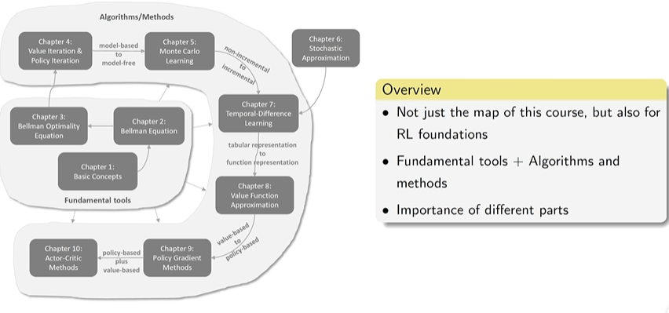

强化学习目标:求解最优策略,即贝尔曼最优公式

## 1.concepts概念

 State:the state of the agent with respect to the environment
State space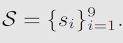状态的集合
Action:For each state,possible action
Action space of state: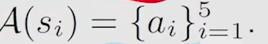对于当前state的Action Set
State transition: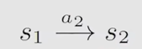like this
tabular representation:like this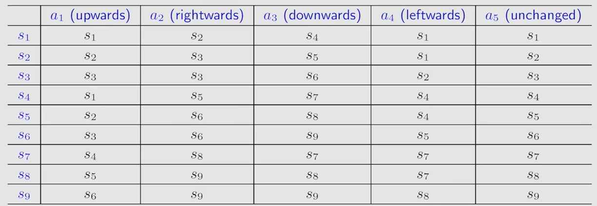
state transition prosibility:$\begin{aligned}&p(s_2|s_1,a_2)=1\\&p(s_i|s_1,a_2)=0\quad\forall i\neq2\end{aligned}$ :at  s1,use a2, arrive s2 posilibity  given is a determined example,but it could be stochastic(随机的)
**Policy**:tell agent to what action to take at a state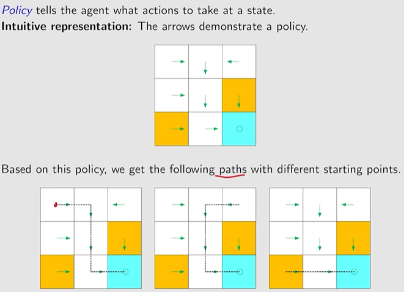
the green one is policy
**mathematical representation数学表示**:更normal,其中pi是条件概率,如图所示,$\pi(a_i|s_j)$即在任意状态下,任意action的概率,同一个$s_j$下的条件概率之和应为1 


**Reward**: a real number we get after taking an action. human-machine interface 

- A **positive** reward represents **encouragement** to take such actions.
- A **negative** reward represents **punishment** to take such actions.
- reward could be stochastic随机

​	Questions:

- What about a zero reward? No punishment.
- Can positive mean punishment? Yes.

trajectory and return  :智能体与环境在任意时间段内的交互序列
	 A trajectory is a state-action-reward chain:
	 $$s_1 \xrightarrow[a_2]{r=0} s_2 \xrightarrow[a_3]{r=0} s_5 \xrightarrow[a_3]{r=0} s_8 \xrightarrow[a_2]{r=1} s_9$$  
The return of this trajectory is the sum of all the rewards collected along the trajectory:
	 $$\text{return} = 0 + 0 + 0 + 1 = 1$$
	**better policy has a greater return**
**discounted return** :return with discount rate
折扣因子控制了智能体在选择当前动作时，**未来奖励的影响力**
 	$$ \begin{align*} \text{discounted return} &= 0 + \gamma 0 + \gamma^2 0 + \gamma^3 1 + \gamma^4 1 + \gamma^5 1 + \dots \\ &= \gamma^3(1 + \gamma + \gamma^2 + \dots) = \gamma^3 \frac{1}{1-\gamma}. \end{align*} $$
	对于这个discounted return,他的值从之前的发散变成了收敛(有上界),这显然更有助于我们研究

episode**回合**:从任务开始到结束的**完整(different to trajectory)交互过程**

###### MDP

对于MDP,其包含的要素有

1. Sets:
   - State: S
   - Action: A(s) s∈S
   - Reward : R(s,a)
2. Probability distribution
   - State transition probability
   - reward probability

### Key elements of MDP:

- **Sets:**  - **State:** the set of states $S$  
-  **Action:** the set of actions  $\mathcal{A}(s)$  is associated for state  $s \in S$.  
- **Reward:** the set of rewards$ \mathcal{R}(s,a)$ . 
-  **Probability distribution:**  
- **State transition probability:** at state  $s$ , taking action  $a$ , the probability to transit to state  $s'$  is  $p(s'|s,a) $  
- **Reward probability:** at state  $s $, taking action  $a$ , the probability to get reward  $r$  is  $p(r|s,a)$  
- **Policy:** at state  s , the probability to choose action  a  is  $\pi(a|s)$  
- **Markov property:** memoryless property  
- $$  \begin{align*}  p(s_{t+1}|a_{t+1}, s_t, \dots, a_1, s_0) &= p(s_{t+1}|a_{t+1}, s_t), \\  p(r_{t+1}|a_{t+1}, s_t, \dots, a_1, s_0) &= p(r_{t+1}|a_{t+1}, s_t).  \end{align*}  $$  All the concepts introduced in this lecture can be put in the framework in MDP.

## 2.Bellman equation贝尔曼公式

### 2.1 Motivating examples动机

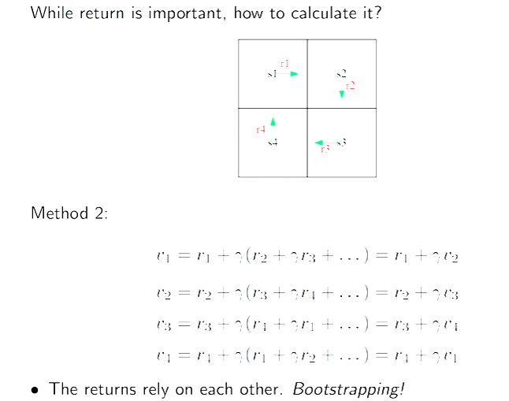

通过最高例子得到自举(bootstrapping)的定义:当前状态return依赖于其它状态(左脚踩右脚)

跟据上文,按线性代数进行矩阵运算,有$\mathbf{v} = \mathbf{r} + \gamma \mathbf{P}\mathbf{v}$,这就是贝尔曼公式的一种形式
**一个状态的value实际上依赖于其它状态的value**,通过这个公式,我们可以求解v和r的关系式(线性代数)

### 

### 2.2 State value

定义:

- $S_t \to A_t$ is governed by $\pi(A_t = a \mid S_t = s)$
- $S_t, A_t \to R_{t+1}$ is governed by $p(R_{t+1} = r \mid S_t = s, A_t = a)$
- $S_t, A_t \to S_{t+1}$ is governed by $p(S_{t+1} = s' \mid S_t = s, A_t = a)$
- $G_t = R_{t+1} + \gamma R_{t+2} + \gamma^2 R_{t+3} + \dots$

跟据上述定义,我们可以得到state value 的定义,即对$G_t$求期望(均值)
$v_\pi(s) = \mathbb{E}\left[ G_t \mid S_t = s \right]$


return:对于单个trajectory的结果
value state:对于**确定的策略**$\pi$,其return的期望

### 2.3 Bellman equation : Derivation贝尔曼公式的推导 

$$
\begin{align*}
G_t &= R_{t+1} + \gamma R_{t+2} + \gamma^2 R_{t+3} + \dots \\
&= R_{t+1} + \gamma \left( R_{t+2} + \gamma R_{t+3} + \dots \right) \\
&= R_{t+1} + \gamma G_{t+1}
\end{align*}
$$
Then, it follows from the definition of the state value that
$$
\begin{align*}
v_\pi(s) &= \mathbb{E}\left[ G_t \mid S_t = s \right] \\
&= \mathbb{E}\left[ R_{t+1} + \gamma G_{t+1} \mid S_t = s \right] \\
&= \mathbb{E}\left[ R_{t+1} \mid S_t = s \right] + \gamma \mathbb{E}\left[ G_{t+1} \mid S_t = s \right]
\end{align*}
$$
至于说是抽奖，所说的“同样的行为”是指现实世界中同样的操作，但对应概率世界的，里边的奖项是状态，你选择抽哪一个是行为，行为指的是选择而不是你抽的动作。

第一部分immediate reward 的数学表示如下所示

$\mathbb{E}[ R_{t+1} \mid S_t=s]\begin{align*}
&= \sum_{a} \pi(a \mid s) \mathbb{E}\left[ R_{t+1} \mid S_t = s,\, A_t = a \right] \\
&= \sum_{a} \pi(a \mid s) \sum_{r} p(r \mid s,\, a) r
\end{align*}$

第二部分future reward
$$
\begin{align*}
\mathbb{E}\left[ G_{t+1} \mid S_t = s \right] &= \sum_{s'} \mathbb{E}\left[ G_{t+1} \mid S_t = s,\, S_{t+1} = s' \right] p(s' \mid s) \\
&= \sum_{s'} \mathbb{E}\left[ G_{t+1} \mid S_{t+1} = s' \right] p(s' \mid s) \\
&= \sum_{s'} v_\pi(s') p(s' \mid s) \\
&= \sum_{s'} v_\pi(s') \sum_{a} p(s' \mid s,\, a) \pi(a \mid s)
\end{align*}
$$


**重期望**:期望的期望等于总期望,分解复杂的期望变简单,前一个求和遍历所有状态,后一个求和遍历所有动作

综上,贝尔曼公式的具体形式可以表示为下列狮子,并将$\pi(a|s)$提取出来
$$
\begin{align*}
v_\pi(s) &= \mathbb{E}\left[ R_{t+1} \mid S_t = s \right] + \gamma \mathbb{E}\left[ G_{t+1} \mid S_t = s \right] \\
&= \underbrace{\sum_{a} \pi(a \mid s) \sum_{r} p(r \mid s, a) r}_{\text{mean of immediate rewards}} + \gamma \underbrace{\sum_{a} \pi(a \mid s) \sum_{s'} p(s' \mid s, a) v_\pi(s')}_{\text{mean of future rewards}} \\
&= \sum_{a} \pi(a \mid s) \left[ \sum_{r} p(r \mid s, a) r + \gamma \sum_{s'} p(s' \mid s, a) v_\pi(s') \right], \quad \forall s \in \mathcal{S}
\end{align*}
$$
最后一步把 “即时奖励” 和 “未来价值” 合并到同一个动作的求和里,**对每个动作a，先计算 “选a的即时奖励期望 + 选a的未来价值期望”，再按策略选a的概率加权求和，就是当前状态s的价值**。

总结:贝尔曼公式实际上就是在描述不同状态间state value之间的关系

对应的Markdown格式（包含LaTeX公式）如下：

Put all these equations for all the states together and rewrite to a matrix-vector form

$$v_\pi = r_\pi + \gamma P_\pi v_\pi$$

where
- $v_\pi = \left[ v_\pi(s_1), \dots, v_\pi(s_n) \right]^T \in \mathbb{R}^n$ 状态价值
- $r_\pi = \left[ r_\pi(s_1), \dots, r_\pi(s_n) \right]^T \in \mathbb{R}^n$ 即时奖励期望
- $P_\pi \in \mathbb{R}^{n \times n}$, 状态转移概率矩阵

### 2.4 Bellman equation : Matrix-vector form

详细写出结果如下所示
$$
\begin{bmatrix}
v_\pi(s_1) \\
v_\pi(s_2) \\
v_\pi(s_3) \\
v_\pi(s_4)
\end{bmatrix}
=
\begin{bmatrix}
r_\pi(s_1) \\
r_\pi(s_2) \\
r_\pi(s_3) \\
r_\pi(s_4)
\end{bmatrix}
+ \gamma
\begin{bmatrix}
p_\pi(s_1 \mid s_1) & p_\pi(s_2 \mid s_1) & p_\pi(s_3 \mid s_1) & p_\pi(s_4 \mid s_1) \\
p_\pi(s_1 \mid s_2) & p_\pi(s_2 \mid s_2) & p_\pi(s_3 \mid s_2) & p_\pi(s_4 \mid s_2) \\
p_\pi(s_1 \mid s_3) & p_\pi(s_2 \mid s_3) & p_\pi(s_3 \mid s_3) & p_\pi(s_4 \mid s_3) \\
p_\pi(s_1 \mid s_4) & p_\pi(s_2 \mid s_4) & p_\pi(s_3 \mid s_4) & p_\pi(s_4 \mid s_4)
\end{bmatrix}
\begin{bmatrix}
v_\pi(s_1) \\
v_\pi(s_2) \\
v_\pi(s_3) \\
v_\pi(s_4)
\end{bmatrix}
$$


### 2.5 Bellman equation : Solve the state values

通过state values,我们才能评价一个策略到底是好还是不好

对应的Markdown格式（含LaTeX公式）如下：

```markdown
- The closed-form solution is:
  $$v_\pi = (I - \gamma P_\pi)^{-1} r_\pi$$

  In practice, we still need to use numerical tools to calculate the matrix inverse.
  Can we avoid the matrix inverse operation? Yes, by iterative algorithms.


- An **iterative solution** is:
  $$v_{k+1} = r_\pi + \gamma P_\pi v_k$$

  This algorithm leads to a sequence $\{v_0, v_1, v_2, \dots\}$. We can show that
  $$v_k \to v_\pi = (I - \gamma P_\pi)^{-1} r_\pi, \quad k \to \infty$$
```

渲染后效果：
- The closed-form solution is:闭式解
  $$v_\pi = (I - \gamma P_\pi)^{-1} r_\pi$$

  In practice, we still need to use numerical tools to calculate the matrix inverse.
  Can we avoid the matrix inverse operation? Yes, by iterative algorithms.


- An **iterative solution** is:迭代算法
  $$v_{k+1} = r_\pi + \gamma P_\pi v_k$$

  This algorithm leads to a sequence $\{v_0, v_1, v_2, \dots\}$. We can show that
  $$v_k \to v_\pi = (I - \gamma P_\pi)^{-1} r_\pi, \quad k \to \infty$$

闭式解:仅适用于**极小状态空间**,计算量为$O(n^3)$,转移矩阵较大时不好用
迭代解:适用于任意空间,时间复杂度为$O(n^2)$,环境变化时可直接基于当前 *v**k* 继续迭代更新，实时性强

一般而言**迭代解**更常用(计算量更小,而且证明可知迭代解是收敛的)


### 2.6 Action value

State value: the average return the agent can get starting from a state,
Action value: the average return the agent can get **starting from a state and taking an action**

policy实际上就是选择action,所以我们更应该关注**Action value**

Action value $q_{\pi}(s,a)$  Definition:

-  $$q_\pi(s,a) = \mathbb{E}\left[G_t \mid S_t = s, A_t = a\right]$$ 
  - $ q_\pi(s,a) $ is a function of the **state-action pair** $ (s,a)$
  - $ q_\pi(s,a)$  depends on $\pi$  
-  It follows from the properties of conditional expectation that $$\underbrace{\mathbb{E}\left[G_t \mid S_t = s\right]}_{v_\pi(s)} = \sum_{a} \underbrace{\mathbb{E}\left[G_t \mid S_t = s, A_t = a\right]}_{q_\pi(s,a)} \pi(a|s)$$ 
-  Action value和State value的联系:$$v_\pi(s) = \sum_{a} \pi(a|s) q_\pi(s,a)$$

下图中a1-a5分别为**上右下左中**顺时针方向

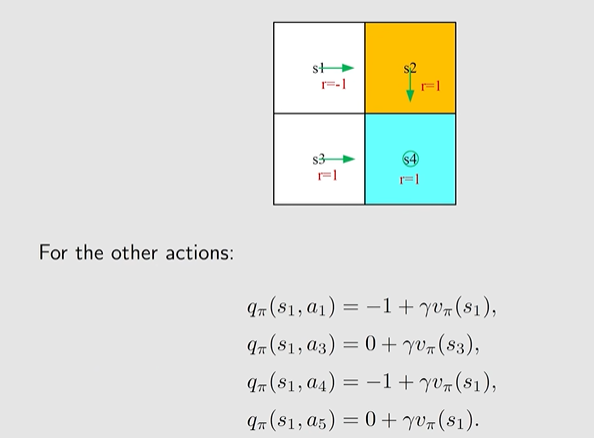

注意,虽然当前策略 $\pi$ 告诉我们应当向右走(a2),但$q_{\pi}(s1,a_i)$不为0,实际上他们都是有对应的值而且可以优化的(假设碰壁时r=-1),因此非当前策略选择的路径的Action value ≠ 0

## 3.Optimal Policy and Bellman Optimality Equation

Core concepts:**optimal state value and optimal policy**
A fundamental tool: the **Bellman optimality equation (BOE)**

### 3.1: Motivatingexample-how to improvepolicies? 

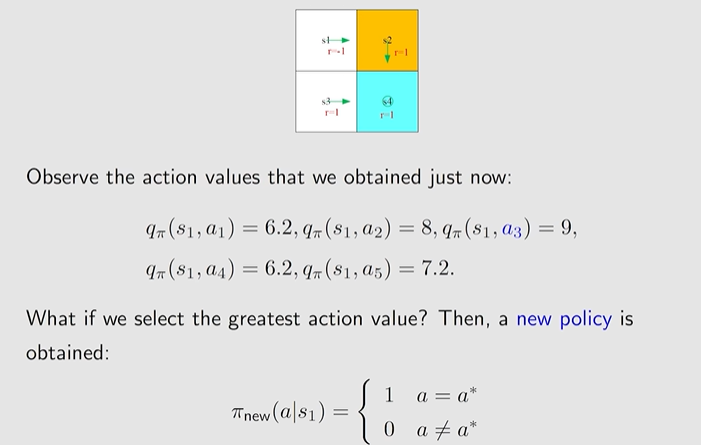

通过**选择action value更大的action,可以优化算法**,但是这里的s2,s3,s4的state value已经是最优的,所以才可以这样做,如果不是的话,应该怎么去判断?


### 3. 2: Optimal policy and Bellman optimality equation 

上述问题实际上是**收敛的**,即对策略不断优化,**使其选择action value更大的action**,**最终会收敛到最优策略**,这就是**Bellman optimality equation 贝尔曼最优公式**

#### **最优策略$\pi$的定义**

if  $$v_{\pi_1}(s) \geq v_{\pi_2}(s) \quad \text{for all } s \in S$$ then  $\pi_1$ is "better" than$ \pi_2$.

if  $\pi^*$ optimal(最优),  $$v_{\pi^*}(s) \geq v_{\pi}(s) \quad \text{for all } s \in S$$  

###  BOE的定义

$$v(s) = \max_{\pi} \sum_{a} \pi(a|s) \left( \sum_{r} p(r|s,a)r + \gamma \sum_{s'} p(s'|s,a)v(s') \right), \quad \forall s \in \mathcal{S}\\=\max_{\pi} \sum_{a} \pi(a|s)q(s,a)$$

一般而言,$p(s’|s,a)$是固定的,而随机初始化的$v(s’)$也可以视为已知的,因此$q(s,a)$是已知的,因此我们能调整的部分即$\pi(s|a)$来最优化这部分

通过一系列证明,可以得到在v最优$v^*$的前提下,对应的$\pi^{*}$是最优的,即最优策略


对于一个contraction mapping压缩映射,不断使用迭代法,最终必然可以逼近一个不动点(f(x)=x的点) (即所谓的压缩映射),下面给出了三个结论,即 
存在性,唯一性,迭代求解算法

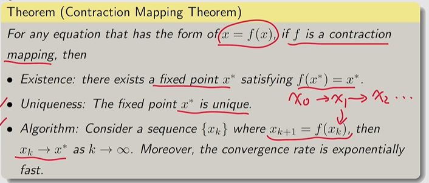

而BE本身也是一个压缩映射,因此可以得到唯一最优的$v^{*}$, 通过$v^{*}->\pi^{*}$
($v^{*}$唯一,$\pi^{*}$不一定唯一)


### 3. 3: More on the Bellman optimality equation

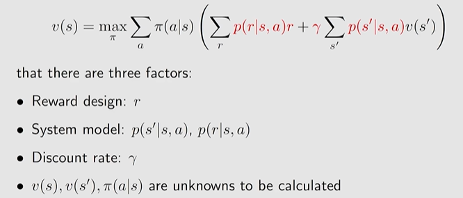

对于BOE,要的就是已知红色部分,求黑色部分,其中System model一般是不可变的,一般可以调整的只有$r$和$$\gamma$$

##### example

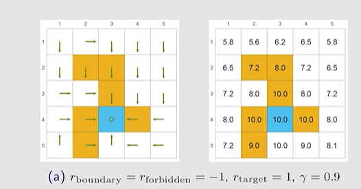

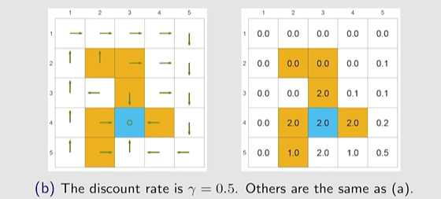

在仅改变$\gamma$的情况下,最优策略发生了改变,

从上述例子可以看到,$\gamma$较大的模型更加“**有远见**”

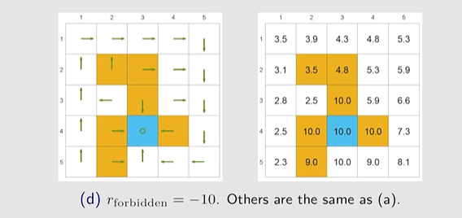

而调整reward也可以使得策略可以绕过障碍

$r^{*}=ar+b$如果对r做线性变换,实际上policy是不变的(线性映射可以很自然得出结论(a>0))

### 3.4: Interesting properties of optimal policies 

https://www.bilibili.com/video/BV1sd4y167NS?vd_source=82d188e70a66018d5a366d01b4858dc1&spm_id_from=333.788.videopod.episodes&p=13

## 4.Value Iteration and Policy Iteration值迭代和策略迭代

### 4.1 值迭代

**接迭代优化价值函数（跳过精确的策略评估），待价值函数收敛后，一次性提取最优策略。**

公式:$v_{k+1}=f(v_k)=\max_\pi(r_\pi+\gamma P_\pi v_k),\quad k=1,2,3\ldots $通过该迭代算法,从而可以找到最优策略

- Step 1: policy update.  This step is to solve (根据v优化$\pi$)

  ​		$$\pi_{k+1} = \arg\max_{\pi} \left(r_\pi + \gamma P_\pi v_k\right)$$ 

  where  $v_k $ is given.  ,$$\pi_{k+1}(a|s) =  \begin{cases}  1 & a = a^*_k(s) \\ 0 & a \neq a^*_k(s) \end{cases}$$ 通过这种**greedy**方式优化

- Step 2: value update.  (根据新$\pi$计算新$v$)

  ​		$$v_{k+1} = r_{\pi_{k+1}} + \gamma P_{\pi_{k+1}} v_k$$

当$||v_k-v_{k-1}||$很小时,可以认为迭代已经收敛


### 4.2策略迭代

**先精确计算当前策略的价值函数，再基于该价值函数优化策略**

Step 1: policy evaluation (PE) 
This step is to calculate the state value of $ \pi_k $  ($v_{\pi k}$): 
	$$v_{\pi_k} = r_{\pi_k} + \gamma P_{\pi_k} v_{\pi_k}$$ 
Note that \( v_{\pi_k} \) is a state value function.  _

Step 2: policy improvement (PI) ,
	$$\pi_{k+1} = \arg\max_{\pi} \left(r_\pi + \gamma P_\pi v_{\pi_k}\right)$$  
$$ \pi_{k+1}(s) = \arg\max_{\pi} \sum_{a} \pi(a|s) \underbrace{\left( \sum_{r} p(r|s,a)r + \gamma \sum_{s'} p(s'|s,a)v_{\pi_k}(s') \right)}_{q_{\pi_k}(s,a)}, \quad s \in S. $$ Here, $q_{\pi_k}(s,a)$ is the **action value under policy** $\pi_k$.

 Let $$ a_k^*(s) = \arg\max_{a} q_{\pi_k}(a,s) $$  

$pi_{k+1}=1 if a=a^{*}_{k}(s)$

优化流程:$$\pi_0 \xrightarrow{PE} v_{\pi_0} \xrightarrow{PI} \pi_1 \xrightarrow{PE} v_{\pi_1} \xrightarrow{PI} \pi_2 \xrightarrow{PE} v_{\pi_2} \xrightarrow{PI} \dots$$

由于优化的结果依赖于其他状态


### 4.3Truncated policy iteration algorithm截断策略迭代

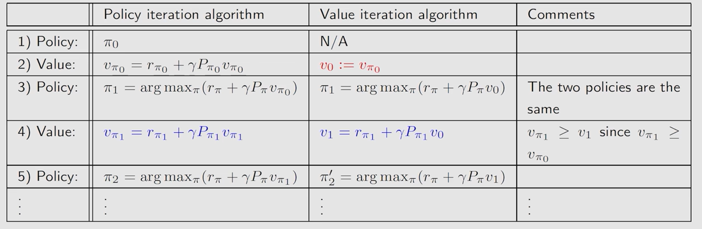

上述两种方法的比较

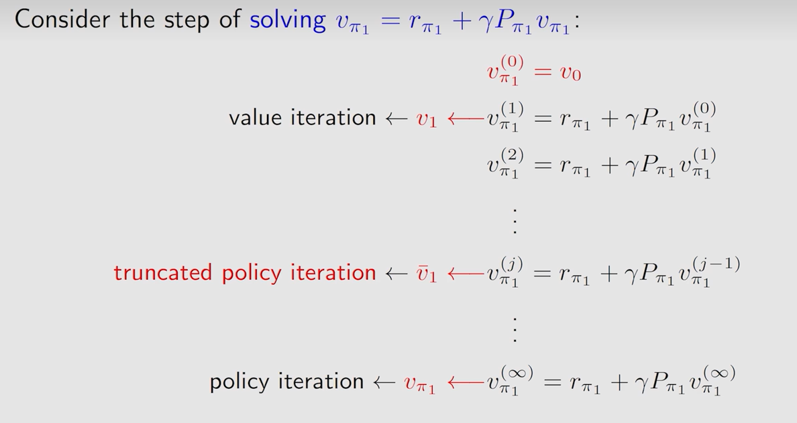

policy iteration和value iteration 分别用∞次和1次迭代来求出状态最优价值$v_{\pi_1}$,那**二者中间会不会存在一个中间步**,即**Truncated policy iteration**,它截断了迭代流程,得到 $$\bar{v}_1$$

伪代码如下:

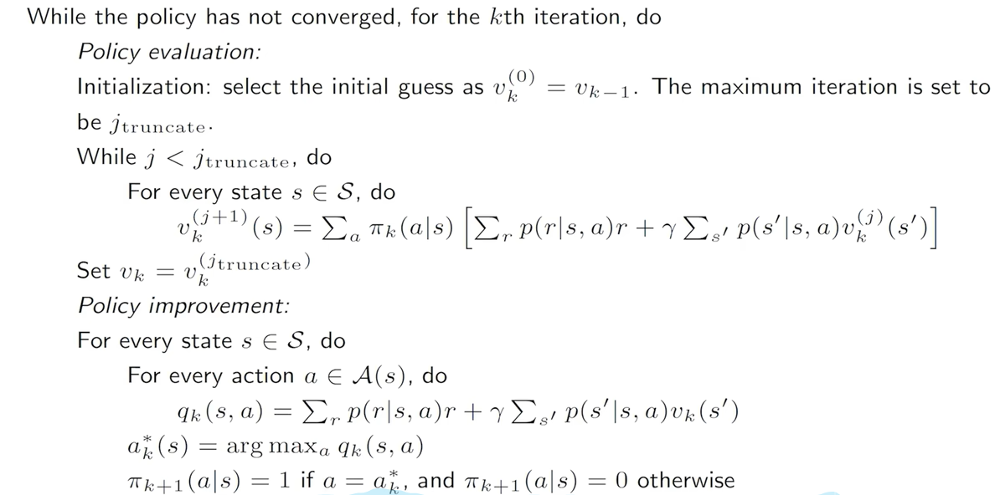

由于policy iteration和value iteration都收敛,因此Truncated policy iteration必然也收敛

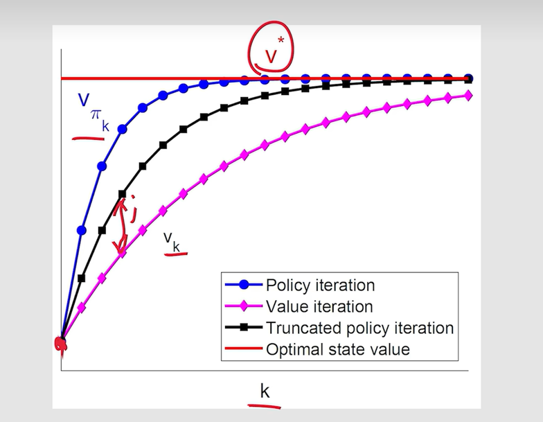


## 5.Monte Carlo Learning蒙特卡洛MC

前面提到的方法都是model-base的:system已知,求解最优策略

而**蒙特卡洛法是model-free**的,不需要事先知道所有的system状态.如根据data来predict

example1:掷硬币: $$\mathbb{E}[X] \approx \boldsymbol{\bar{x}} = \frac{1}{\boldsymbol{N}} \sum_{j=1}^{\boldsymbol{N}} x_j.$$ 通过大数定律,在N较大时有较大的P估计准确

### 5.1MC Basic

从policy-iteration修改得到MC-basic

策略迭代的公式： $$ \begin{cases} \text{Policy evaluation: } v_{\pi_k} = r_{\pi_k} + \gamma P_{\pi_k} v_{\pi_k} \\ \text{Policy improvement: } \pi_{k+1} = \arg\max_{\pi} \left( r_{\pi} + \gamma P_{\pi} v_{\pi_k} \right) \end{cases} $$ 

PI部分可以写成

$$ \begin{align*} \pi_{k+1}(s) &= \arg\max_{\pi} \sum_{a} \pi(a|s) \left[ \sum_{r} p(r|s,a)r + \gamma \sum_{s'} p(s'|s,a)v_{\pi_k}(s') \right] \\ &= \arg\max_{\pi} \sum_{a} \pi(a|s) q_{\pi_k}(s,a), \quad s \in \mathcal{S} \end{align*} $$ 

而model-free问题的一大挑战就是:如何得到$q_{\pi_k}(s,a), \quad s \in \mathcal{S}$,毕竟s不确定

所以我们使用已有的数据来估计模型,这其实就是大数定理，用很多次采样的平均值近似作为$G_t$的平均值，同时这样的方法因为理论上**在采样无穷的时候等价于无偏估计**

$$ q_{\pi_k}(s,a) = \mathbb{E}\left[ G_t \mid S_t = s, A_t = a \right] \approx \frac{1}{N} \sum_{i=1}^{N} g^{(i)}(s,a). $$ 

虽然理论上N->∞时可以做到,但是它是**low efficiency**的
而且在MC中我们不再依赖于state value 得到action value 因为$q_{\pi_k}$已经是估计值了,如果按policy iteration的方法再从sv->av显然误差会很大

### 5.2MC Exploring Starts

相较于MCB方法,效率更高:

 **用单个episode去立即估计action value,从而improve policy**,(有点类似一个epoch优化一次和一个batch优化一次的感觉,而实际上可以证明也是收敛的)

Generalized policy iteration GPI:PE-PI-PE-PI…交替进行

 轨迹与动作价值估计 原始轨迹： $$s_1 \xrightarrow{a_2} s_2 \xrightarrow{a_4} s_1 \xrightarrow{a_2} s_2 \xrightarrow{a_3} s_5 \xrightarrow{a_1} \dots \quad \text{[original episode]}$$ 
	$$s_2 \xrightarrow{a_4} s_1 \xrightarrow{a_2} s_2 \xrightarrow{a_3} s_5 \xrightarrow{a_1} \dots \quad \text{[episode starting from } (s_2,a_4)\text{]}$$ 			$$s_1 \xrightarrow{a_2} s_2 \xrightarrow{a_3} s_5 \xrightarrow{a_1} \dots \quad \text{[episode starting from } (s_1,a_2)\text{]}$$ 				$$s_2 \xrightarrow{a_3} s_5 \xrightarrow{a_1} \dots \quad \text{[episode starting from } (s_2,a_3)\text{]}$$ 					$$s_5 \xrightarrow{a_1} \dots \quad \text{[episode starting from } (s_5,a_1)\text{]}$$  

可估计的动作价值： $$q_{\pi}(s_1,a_2),\ q_{\pi}(s_2,a_4),\ q_{\pi}(s_2,a_3),\ q_{\pi}(s_5,a_1),\dots$$ 

**first-visit** :访问过的action记住其action value,**从而减少重复计算**(空间换时间)

**Exploring Starts**:因为可能未被选择的(s,a)里面存在最优解,要求探索每一个(s,a)作为start,这正是名字由来

下面是伪代码

#### 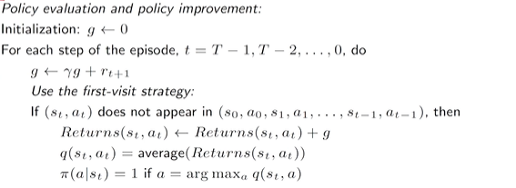


### 5.3MC Epsilon-Greedy

soft-policy:在任意状态下,有可能采取any action的概率的policy

**若干个足够长**的episode能够对(s,a)进行**足够多次的访问**。此时，我们无需让大量action从每个(s,a)开始,此时便可去掉**Exploring Starts**这个条件

#### Epsilon-Greedy

$$
\pi(a \mid s) =
\begin{cases}
1 - \frac{\varepsilon}{|\mathcal{A}(s)|} \cdot \left( |\mathcal{A}(s)| - 1 \right), & \text{for the greedy action}, \\
\frac{\varepsilon}{|\mathcal{A}(s)|}, & \text{for the other } |\mathcal{A}(s)| - 1 \text{ actions}.
\end{cases}
$$


$\frac{\epsilon}{n}$概率选随机策略,否则用贪心策略

使用Epsilon-Greedy而非Greedy,可以平衡exploitation(基于已有经验，选择当前已知能带来最大收益（或价值）的动作，优先获取确定收益) and exploration(尝试未知动作以发现更优策略)

$\epsilon=0$:greedy ; $\epsilon=1$:random


综上,MC Epsilon-Greedy和MC Basic的区别仅仅只在策略选择时加上Epsilon-Greedy即可,其余不变

$$
\bar{\pi}_{k+1}(a \mid s) =
\begin{cases}
1 - \frac{|\mathcal{A}(s)| - 1}{|\mathcal{A}(s)|} \varepsilon, & a = a^*_k, \\
\frac{1}{|\mathcal{A}(s)|} \varepsilon, & a \neq a^*_k.
\end{cases}
$$


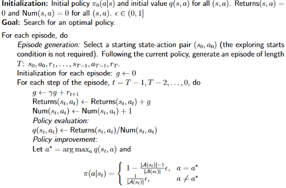


# CS285
