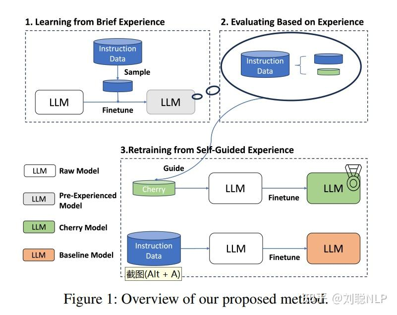
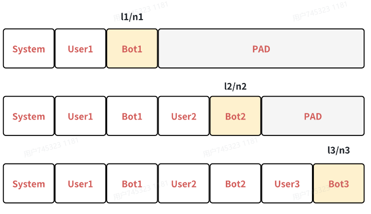
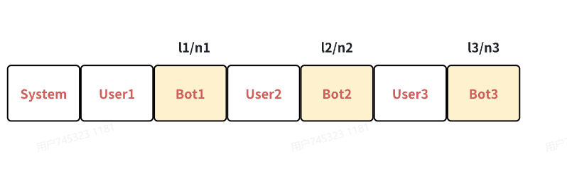
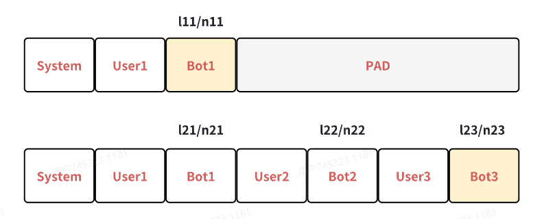

# post-train

## **1.1 SFT简介**

**监督微调（SFT）**&#x901A;过利用**特定于任务的标签数据集将预训练的LLM适应特定任务**。 预训练的LLM通过接触大量的语料库，获得了广义的语言模式理解，从而减少了对特定领域的广泛数据的依赖。模型选择是关键：较小的模型在有限数据集、在资源限制的设置中表现很好l，而较大的模型（例如GPT-4）则在复杂，数据丰富的任务中表现出色。SFT的数据集通常组织如下，一条样本包含一个**指令instruction，和对应的回答Answer：**

$$D = \{(I_K,A_K)\}^N_{K=1}$$

### **Supervised Fine-Tune 与 pretrain 的区别**

在**训练方式上没有任何区别，Loss函数长得一样**，主要区别在于

**数据的组成形式上：**

- **pretrain 的每条数据都是满长度，即达到模型设置的输入长度上限，sft 的每条数据原本多长就是多长**，不需要做packing，即每条数据不需要拼接起来
- sft 会**引入 pretrain 阶段未见过的 special\_token，来让它们学习全新的语义，**加入special\_token可以用来“构造知识”，比如"\<imd\_start>喜欢\<imd\_end>"，借助 special\_token，sft 会把**语料切分成不同的角色**，标配的有 system、user、assistant，根据业务需求也可以有“背景”、“旁白”、“事件”等等
- sft 会让模型见到最重要的 <eos\_token>，pretrain 模型因为没见过该 token 而无法停止生成
- **sft 的 prompt 部分对应的输出不做 loss**。主要原因是 prompt 的同质化比较严重，不做 loss\_mask 的话，同样的一句话会被翻来覆去的学，但如果你能保证你的每条 prompt 都是独一无二的，就完全可以省去 prompt 的 loss\_mask 环节。多轮对话数据一定要想清楚是每一个 answer 都算 loss，还是只对最后一轮的 answer 算 loss

**训练目的也不一样：**

- pretrain 是在背书，纯粹的学习知识；sft 则是在做题，学习的是**指令遵循能力**。切**勿在 sft 阶段强行给模型做知识注入**，比如训个 50W 条的 code 数据，所有的**知识注入工作应该采用 continue-pretrain 的思路进行**，**否则都会使得模型的通用能力掉点明显**（**sft 做知识注入基本上是 100% 某个知识，但 continue-pretrain 做知识注入会控制在 10% ～ 20% 左右的比例**）


## **1.2 SFT数据及处理**

业内共识

- prompt的质量和多样性远重要于数据量级，微调一个30b量级的base model只需要10w量级的数据即可**

**参考**：《LIMA: Less Is More for Alignment》

- 合成数据很重要！一般需要通过**不同方式进行多路合成**，减少合成数据的**bias**

**参考**：《Phi-3 Technical Report: A Highly Capable Language Model Locally on Your Phone》

- 可以加点预训练的数据进去，减轻灾难性遗忘现象

**参考**：《The Llama 3 Herd of Models》

- **一般训练一个epoch，垂域模型数据少训练3epoch去过拟合**
- ****可以做全量微调，就不要去做PEFT**
- SFT阶段不能太多的知识注入，**过多的知识注入，或者超过模型能力本身的回答过多会导致对齐税**(强行注入超模型能力的知识或过多新信息，模型会为了迎合这些内容牺牲原有性能)
- **由于在Pretrain阶段的退火阶段（有的基座会称为enhance，即知识富集）会加入高质量的SFT、Math、Code、STEM、Agent等数据，所以SFT阶段不用重复做知识补充类工作,只需聚焦 “偏好对齐” 的轻量优化**

### **数据飞轮**

数据飞轮的核心是**数据驱动的正向循环闭环**—— 模型 / 产品的**使用产生新数据**，这些**数据经过优化后反哺模型**，让模型性能提升，进而吸引更多使用、产生更多优质数据，形成 “越用越强” 的**自我迭代**效应。

最简单的做法，拉取线上近半个月的真实用户prompt，先用启发式规则进行清洗，然后用GPT-4o打标，留下可用的数据。

### **为什么要用数据飞轮？**

1. prompt 的生产是需要有 seed 种子的，**seed的数据量和多样性有限**，数据合成的质量不够高
2. 用户的问题千奇百怪，尤其是多轮聊天数据，自己生成的多轮对话数据，通常都默认模型回复的是正确的，用户会 follow 模型的回复。但线上可不是这种情况，你聊你的，我聊我的是时有发生的事情（伪多轮）
3. 利用数据飞轮捞取线上真实的日志，基于bad case（可来源于用户反馈、模型打标）构造高质量SFT数据修复bad case。

- **整体流程**


1. 数据收集：**首先，需要收集和获取大量的数据。这可以通过各种方式实现，例如用户近一个月赞踩、用户行为追踪、用户社交媒体数据等
2. **数据存储和处理：**收集到的数据需要进行存储和处理，以便后续的分析和应用。这可能涉及到数据仓库、数据库、云存储等技术
3. **数据分析和洞察：**通过对数据进行分析和挖掘，提取有价值的信息和洞察。这可以使用数据分析工具、机器学习算法等技术来实现，以发现数据中的模式、趋势和关联关系
4. **数据应用和价值实现：**将分析得到的洞察应用到实际场景中，创造价值。这可能包括优化业务流程、改进产品设计、个性化推荐等
5. **数据反馈和增强：**应用数据带来的改进和收益，进一步增加数据的质量和数量。这可能包括更好的数据收集方法、更准确的数据标注等

### **数据生产合成**

### **合成数据 is all you need！**

**一句话总结**：通过**不同的数据合成方法确保prompt的多样性**，满足大模型在各个专项能力的需求

- **生产合成 prompt：**

  - 比较有名的工作**Self-Instruct** ，划分技能库，即给每个数据打上task\_type ，越细越好，然后每个 task\_type 准备一些 seed prompt，然后随机采样 seed，在喂给一个能力很强的模型，让它基于这些 seed 问题再续写出一些问题
  - 利用各种**启发式规则合成数据造 prompt**，按照数据多样性，去搜集不同 task\_type 的数据集集合，然后适当做改写，改写也可以用强大模型来做，合成不同格式（纯文本、markdown、json）、行文风格的prompt

- **生产合成 answer：**

  - **GPT4 is all you need**，利用一个效果好的模型来生产 answer是不二之选，不在乎成本或者主要是英文数据，就选 GPT4 / Claude 3，在乎成本或者主要是中文数据，就在自己的机器上部署 Qwen\_72B / deepseek\_MOE。
  - **小模型 + SFT ≈ GPT4 + zero\_shot / few\_shot / cot**（复杂指令和逻辑推理可能不行）。对于某种**特殊需求的 task\_type**，利用 GPT4 生产一千条 answer，然后去训小模型，再利用小模型去预测出上万条数据
  - **专项数据：包括长文本、Agent/function\_call、RAG SFT数据**

- **工业界做法：**&#x62D2;绝“随机单一路径采样”，**主动生成多条路径后筛选优质结果**。通过Bon(Best of n,一次生成多个选择最好的)或者其他Won等方式对同一个prompt采样多个推理路径，通过人工或者verifiers挑选出最佳路径作为`Response`；或者构造`Chosen`和`Rejected`偏好数据。然后基于这些数据进行SFT或者DPO训练

  - 工业界这么做的**核心原因**

    - 数据质量可控：避免单一路径可能的错误或偏见，通过 “多路径 + 优选” 确保每条训练数据都是 “优质标杆”。
    - 适配不同训练目标：SFT 需要 “正确的最佳答案”，DPO 需要 “优劣对比的偏好数据”，这种方法能一站式生成两种数据。
    - 提升模型推理可靠性：多路径采样能覆盖更多可能的思考方式，优选后的路径会让模型学到 “更严谨、更符合需求的推理逻辑”，减少瞎猜或片面回答。

  - 与**普通数据生成的区别**

    普通数据生成是 “一个 prompt 对应一个响应”，全靠初始数据质量；而这种方法是 “一个 prompt 对应多个响应，再选最优”，通过 “多轮筛选” 主动提升数据质量，尤其适合需要强推理、高准确性的场景（如金融、医疗、垂域专业问答）。

- **Sandbox验证：**&#x901A;过数据与模型之间的专门研发工作流程，系统性地微调了数据和模型。主要是用于评估合成数据的质量和可用性。sandbox的经典流程如下图所示：

**sandbox参考工作**：https://github.com/vndee/llm-sandbox 、https://arxiv.org/abs/2410.23074、https://github.com/apple/ToolSandbox

### **数据质量过滤**

#### [IFD过滤](https://zhuanlan.zhihu.com/p/658128530)

IFD(Instruction-Following Difficulty)

- **核心点**：**根据指令跟踪难度(IFD)筛选SFT数据**
- **前置条件**：在使用精心选择的指令数据进行初步训练的阶段，LLM可以开发出一种内在的指令辨别能力，这种基础理解能力使他们具备了评估更广泛数据集质量的鉴别力，从而有可能以自我指导的方式评估指令执行难度。
- **总体流程：**
  
  - **第一步：**&#x4ECE;简单经验中学习，强迫模型首先熟悉目标数据集的一个子集，使**初始模型具备基本的指令跟随能力**。为了确保初始模型所遇到的指令足够多样性，在这些指令嵌入上使用K-Means，即在**每个聚类中只抽取几个实例**，在指令嵌入上生成100个聚类，并**在每个聚类中抽取10个实例**。然后只用这些样本对初始模型进行1个epoch的训练

 &#x20;                                            $$
\begin{cases}
\left[ h_{j_1}^Q, \dots, h_{j_m}^Q \right] = LLM_{\theta_0}\left( w_{j_1}^Q, \dots, w_{j_m}^Q \right) \\
h_j^Q = \frac{\sum_{i=1}^m h_{j_i}^Q}{m}
\end{cases}
$$

 $$w_{j,i}^Q$$表示样本j的第i个字的问题字符串，$$h_{j,i}^Q$$表示其对应的最后一个隐藏状态

- **第二步：**跟据经验评估，根据指令Q及其后续单词，通过不断预测下一个token来计算样本对(Q,A)的损失：

 &#x20;                            $$L_\theta(A|Q)=\frac{1}{N}\sum_{i=1}^N\log P(w_i^A|Q,w_1^A,w_2^A,\ldots,w_{i-1}^A;\theta)$$

 **该指标评估了模型根据所提供的指令生成适当答案的能力，用于衡量模型的输出在多大程度上与输入指令和相应的正确答案一致，即结构和相应正确答案的一致程度。&#x20;**

 由于LLM在预训练阶段已经学习了大部分知识，**只需要学习对齐和遵循指令**，所以为了估算遵循给定样本指令的难度，可以引入直接回答得分$$s_θ(A)$$，用于衡量LLM单独生成该答案的能力：

 &#x20;                                    $$s_\theta(A)=\frac{1}{N}\sum_{i=1}^N\log P(w_i^A|w_1^A,\ldots,w_{i-1}^A;\theta)$$

 **这一指标衡量的是在没有相应指令的指导下，单独生成答案所带来的内在难度或挑战，直接答案得分越高，表明模型生成答案的难度或复杂程度越高**

最终，IFD的定义为 $$r_\theta(Q,A)=\frac{s_\theta(A|Q)}{s_\theta(A)}$$


#### **[MoDS过滤](https://zhuanlan.zhihu.com/p/671183709)**

主要通过**质量、覆盖范围、必要性**三个指标来进行数据的筛选

- **质量过滤：**用OpenAssistant的reward-model-debertav3-large-v2模型对数据进行质量打分。将原始数据的Instruction、Input、Output的三个部分进行拼接，送入到奖励模型中，得到一个评分，当评分超过 $$\alpha$$时，则认为数据质量达标，构建一份高质量数据集
- **多样性筛选：**通过**K-Center-Greedy算法进行数据筛选**，在**最大化多样性的情况下，使指令数据集最小**，获取种子指令数据集
- **必要性筛选：**
  - 使用Seed Instruction Dataset对模型进行一个初始训练
  - 用训练好的初始模型对整个高质数据集中的指令进行结果预测
  - 利用奖励模型对结果进行评分，当分值小于 $$\beta$$时，说明初始模型不能对这些指令生成优质的回复，不具有处理这些类型指令的能力，获取必要性数据集(Data2)
  - 对Data2进行多样性筛选，获取增强指令数据集


### **数据多样性探索**

数据多样性主要包含三个维度，**数据用途、数据形式和数据语义**

#### 数据用途

- **数据用途**，也就是 **task_type**，可以结合这几个思路进行数据收集：
  - OpenAI 官网列出了 ChatGPT 擅长的所有任务项，诸如翻译、emoji 聊天……之类的
  - LLM 毕竟是个语言模型，**传统的每个 NLP 模型它都应该能胜任**，那就把 NER、机器阅读理解、意图识别等传统的 NLP 任务也给模型补充一点，如果已有类似任务就不补充了
  - 参考**业务需求，下游业务**需要某个特殊场景的任务，那就让 **sft 阶段提前见一见**，这种数据的典型代表就是过年前给模型灌一些对春联、猜灯谜的的数据。只要数据质量没问题，**一般都不会破坏模型能力**

在实际工作中，**双层 task\_type 都很常见**，比如“逻辑推理 - 常识推理”，“逻辑推理 - cot 多步骤推理” 这种。至于每种 task\_type 的数据量，别搞平均主义：**难 task\_type 数据多点，简单 task\_type 就数据少点**，也要**结合自己的 base 模型能力**动态调整

#### 数据形式

- **prompt 表达方式多样性**，不要千篇一律的“把中文句子 A 翻译成英文”，也要适当有一些“我在英国旅游，我现在需要向路人问路，我想表达 A 的意思，该怎么说”，“我是一个英文老师，我需要向我的学生讲解句子 A 用英文怎么写，请你用最正宗的表达方式帮我完成。”这么做的目的是**防止模型只认识 prompt 中的几个关键 token，进而导致训练过拟合**或者泛化性变差
- **prompt 难度把控**，对于prompt的难度进行把控，使得在同一个语意空间的prompt也会变得diverse。比较著名的是Wizard 方法（指令进化），**通过GPT4进行prompt难度升级，然后构成complexity丰富的prompt。**
- **prompt 长度均衡**，既要有短数据，也要有长数据，**避免模型的 attention 退化到无法聚焦长 prompt**。长数据还不能是字面意思的长，**要有那种关键信息藏在 开头 / 中间 / 结尾 的各种数据场景，避免模型在训练时偷懒，只对 prompt 的起始 token 或结束 token 有 attention**
- **answer 长度均衡**，不能让模型没出输几个 token 就停止，**适当的有一些语料让它学会输出尽量长的 answer**，否则模型会很难 follow “不少于2000字” 这种指令
- **多轮聊天的切换 topic 能力**，也就是说，有的数据当前 query 是和 session 有关系的，有的数据则是当前 query 和 session 毫无关系，**要让模型自己学会判断 query 是否和 session 有关**
- **answer 分布的多样性**，这最重要，千万别总共一万条训练数据，一千条数据的 answer 都说同一句话，answer 可是算 loss 的，**太单一的话会严重让模型过拟合**

概括起来，所有的数据形式多样性都可以总结为一句话： **数据形式不能让模型找到规律，关键信息在 prompt 中的位置分布要足够随机**。目的是避免模型在训练时退化，只聚焦于某些或某些位置的 token，而不是聚焦于完整的 prompt。**LLM-as- Judge工作尤为看重这一点，一点不能让模型学会某种Bias**

#### 数据语义

- 分析topN采样、线性采样、对数采样的利弊和指标
- 采样前后句嵌入在空间中的分布多样性变化，或者向量空间中平均距离、token出现词频这样的统计指标
- 利用simbsert获得数据的embedding，然后利用K-Menas/KNN聚类获得数据的多样性权重

这里可以参考项目：https://github.com/OFA-Sys/DiverseEvol


### **开源数据集**

## 

| 名字                  | 类型                 | 地址                                                         |
| --------------------- | -------------------- | ------------------------------------------------------------ |
| RefGPT                | 多轮对话             | https://github.com/DA-southampton/RedGPT                     |
| generated\_chat\_0.4M | 多轮对话             | <https://huggingface.co/datasets/BelleGroup/generated_chat_0.4M> |
| Alpaca-CoT            | CoT数据              | <https://github.com/PhoebusSi/Alpaca-CoT>                    |
| ShareChat             | 对话翻译             | https://paratranz.cn/projects/6725                           |
| chatgpt-corpus        | 中文对话问题         | <https://github.com/PlexPt/chatgpt-corpus>                   |
| GAOKAO                | 考试                 | https://github.com/OpenLMLab/GAOKAO-Bench                    |
| CNewSum               | 中文摘要             | https://drive.google.com/file/d/1A\_YcQ3cBAI7u9iVIoCeVLLgwU7UUzHHv/view |
| belle\_cn             | 中文对话、问答、生成 | https://huggingface.co/BelleGroup                            |
| XP3                   | 多语言、多任务       | https://huggingface.co/datasets/bigscience/xP3               |

Firefly项目整理了如下指令数据集，并将其整理成统一的数据格式：https://github.com/yangjianxin1/Firefly

| 数据集                                                       | 介绍                                                         | 地址                                                         |
| ------------------------------------------------------------ | ------------------------------------------------------------ | ------------------------------------------------------------ |
| [firefly-train-1.1M](https://huggingface.co/datasets/YeungNLP/firefly-train-1.1M) | 23种常见的中文NLP任务的数据，并且构造了许多与中华文化相关的数据，如对联、作诗、文言文翻译、散文、金庸小说等。对于每个任务，由人工书写若干种指令模板，保证数据的高质量与丰富度，数据量为115万 | https://huggingface.co/datasets/YeungNLP/firefly-train-1.1M  |
| [moss-003-sft-data](https://huggingface.co/datasets/YeungNLP/moss-003-sft-data) | 由复旦大学MOSS团队开源的中英文多轮对话数据，包含100万+数据   | https://huggingface.co/datasets/YeungNLP/moss-003-sft-data   |
| [ultrachat](https://huggingface.co/datasets/YeungNLP/ultrachat) | 由清华大学开源的英文多轮对话数据，包含140万+数据             | https://huggingface.co/datasets/YeungNLP/ultrachat           |
| [WizardLM\_evol\_instruct\_V2\_143k](https://huggingface.co/datasets/YeungNLP/WizardLM_evol_instruct_V2_143k) | 由WizardLM项目开源的英文指令微调数据集，通过Evol-Instruct方法让指令进化，加强指令的复杂度，以提升模型对复杂指令的遵循能力。包含143k条数据。 | https://huggingface.co/datasets/YeungNLP/WizardLM\_evol\_instruct\_V2\_143k |
| [school\_math\_0.25M](https://huggingface.co/datasets/YeungNLP/school_math_0.25M) | 由BELLE项目组开源的数学运算指令数据，包含25万条数据。        | https://huggingface.co/datasets/YeungNLP/school\_math\_0.25M |
| [shareAI/CodeChat](https://huggingface.co/datasets/shareAI/CodeChat) | 主要包含逻辑推理、代码问答、代码生成相关语料样本。           | https://huggingface.co/datasets/shareAI/CodeChat             |
| [shareAI/ShareGPT-Chinese-English-90k](https://huggingface.co/datasets/shareAI/ShareGPT-Chinese-English-90k) | 中英文平行双语优质人机问答数据集，覆盖真实复杂场景下的用户提问。 | https://huggingface.co/datasets/shareAI/ShareGPT-Chinese-English-90k |
| [ultrachat\_200k](https://huggingface.co/datasets/YeungNLP/ultrachat_200k) | 由Zephyr项目开源的英文指令微调数据，在ultrachat数据基础上进行清洗 | https://huggingface.co/datasets/YeungNLP/ultrachat\_200k     |
| [ultrafeedback\_binarized](https://huggingface.co/datasets/YeungNLP/ultrafeedback_binarized) | 英文偏好数据集，可用于DPO训练                                | https://huggingface.co/datasets/YeungNLP/ultrafeedback\_binarized |

> A Survey on Post-training of Large Language Models 论文中也总结了部分数据集如下：


## 1.3 SFT训练

### 训练框架

建议使用`OpenRLHF`框架，简单易用，核心是是`Ray+DeepSpeed`，https://github.com/OpenRLHF/OpenRLHF

一般而言我们很少在SFT的部分魔改loss和训练策略，一般就改改`checkpoint_path，model_path，data_path，dp，pp，lr`这几个参数

**这部分可以参考9.2.2章SFT训练**

### 参数设置

- 不管使用哪个框架，**有几个参数是着重需要注意的，每次启动训练前都要看一遍怎么设置的：**

  - **`epoch`：**&#x4E00;般就1`epoch`，如果微调垂域模型，且数据量较少（1w条以内），可以`epoch`设为3，无他，过拟合在垂域上效果好就行。

  - **`gradient_accumulation_steps`：**&#x8868;示在更新模型参数之前，梯度会在多少个小批次上累积。实际的全局批量大小等于 `gradient_accumulation_steps * per_device_batch_size * num_devices`

  - **`global_batch_size`** ( `megatron` 的参数，`deepspeed` 同学可无视）：训练过程中所有设备上的总批量大小。常可以通过每个设备批量大小（`per_device_batch_size`）、设备数量和`gradient_accumulation_steps` 计算得出。注意：使用`deepspeed`的`OpenRLHF`框架也有类似设置

    > parser.add\_argument("**--micro\_train\_batch\_size**", type=int, default=4, help="batch size per GPU")
    > parser.add\_argument("**--train\_batch\_size**", type=int, default=128, help="Global training batch size")

  - **`learning_rate`：**&#x53;FT阶段的`lr`一般是Pretrain阶段的10倍左右，如果Pretrain上 $$1.5e{-6}$$，那么SFT的`lr`为 $$3e{-5}$$这样

  - **`lr_scheduler_type`：**&#x5B66;习率调度器的类型，主要分为`constant`、`linear`、`cosine`、`exponential`**。**&#x4E00;般用`cosine`比较多

  - **`dropout`：**&#x4E00;般不用，主要是因为没啥用，并且还会拖累训练效率

- **有几个参数需要知道为什么要打开或者设置成这个值，它们会直接影响训练速度：**

  - **`zero_stage`：**`DeepSpeed`的三阶段，显卡足够的话，一般这只`zero2`即可（`zero3`由于带宽通信成本问题，训练太慢了）

  - **`max_seq_len`：**&#x6A21;型可以处理的输入序列的最大长度，一般设置4K就行

  - **`offload`：**&#x7528;于将部分计算或数据从 GPU 转移到 CPU 或 NVMe 存储设备中，一般不设置

  - **`gradient_checkpointing`：**&#x901A;过在前向传播中节省部分中间计算结果的存储，降低内存使用量

    PyTorch 通过`torch.utils.checkpoint.checkpoint`和`torch.utils.checkpoint.checkpoint_sequential`提供梯度检查点，它实现了以下功能：
    在前向传播时，PyTorch 将保存模型中的每个函数的输入元组(而不是所有的激活值)。在反向传播过程中，对于每个函数，输入元组和函数的组合以实时的方式重新计算，插入到每个需要它的函数的梯度公式中，然后丢弃（**显存中只保存输入数据和函数**）。网络计算开销大致相当于每个样本通过模型前向传播开销的两倍。
    梯度检查点算法将模型的动态内存开销从  $$O(N)$$（ $$n$$为模型中的层数）降低到 $$O(\sqrt{N})$$

  - **`seq_parallel_size`：**&#x5E8F;列并行的分块大小，用于分布式训练时将输入序列分成更小的块以实现并行化

- 有几个参数**对模型的训练影响不是那么大，但必须知道它们是什么意义，对其他参数有什么影响：**

  - **`weight_decay`：**&#x6743;重衰弱参数，默认设置为0.01
  - **`per_device_train_batch_size`：**&#x6BCF;个GPU上的训练批量大小，一般就设为1
  - **`num_warmup_steps`：**&#x901A;常设置为总训练步数的 5% 到 10%。例如，如果总步数为 10,000，可以选择 500 到 1,000 的热身步数

### **训练技巧**

- 不同 task\_type 要有不同的`channel_loss`，分别观察
- special\_token 的 loss 一开始会有点高，但是下降也是很快
- 创作类任务的 loss 会比其他任务的 loss 更高一点，这个现象很 make sense，**答案越固定，搜索结果越单一的语料，loss 越低**，反之亦然
- 只要训练语料是通用数据，且数据进行了 sample，那么模型的初始 loss 就不会特别高，7B / 13B 可能在 2 左右，数据难了也有可能到 3，72B 则大多在 1 ～ 2 之间这个水平状态；最终 loss 则大概在 0.5 左右，根据语言模型定义，**如果 loss 更低，那基本上模型只会说这一句话**了，别的 token 都没概率了
- 如果 **loss 持续升高**，不要对自己的训练数据产生任何质疑，想着是不是数据太难了不好学之类，这就是**训练代码有问题**。next\_token\_prediction 的训练方式就是在背书，它**不存在学不会的情况，只存在学会了但不会泛化的情况**。你就算是一堆随机乱码，**模型啥也学不到，它也应该是 loss 持平，而不是 loss 升高**

[Packing 是将不同长度的序列紧凑存储，避免填充，目的是减少不必要的计算和存储，提升效率。 ](https://zhuanlan.zhihu.com/p/15860313275)

另外，**不建议在SFT阶段使用packing**，不少实验表明，SFT packing 后削弱了模型对难的短query和短答案的拟合原因如下：

1. 无sft packing 情况下，假设batch\_size = 1，那么如果有个短query和短答案在这个batch里，其余补充padding，那么这个batch的gradient全是这个短文本的gradient，模型对这个query的拟合能力会变强。
2. 但SFT packing 后，**多个短文本在一个样本中，这个batch的gradient会被稀释**，短文本的拟合就不会特别强。但拟合能力似乎和泛化不可以挂钩，**初步观察sft packing和non sft packing的效果差不了很多**。在数据量小或者特定困难的数据上，sft packing是有损泛化效果的，non-packing的方式会影响模型续写的效果，因此会影响一些benchmark效果。**但在大批量数据上是无损泛化效果的**。

**参考：《Do We Really Need Packing in LLM SFT?》，《Enhancing Training Efficiency Using Packing with Flash Attention》**

**注意：**&#x4C;lama- Factory中默认会开panicking（贪心策略），不建议大家开

### 训练策略

1. 多任务学习**：直接混合不同的SFT数据源并应用SFT，如果**将每个数据源视为不同的任务，这就可以视为多任务学习**
2. **顺序训练**：在每个数据集上依次应用SFT。具体来说，**依次对编码、数学推理和综合能力数据集进行训练**
3. **混合序列训练**：该工作**先在专业数据集**（代码、数学）上应用多任务学习，**然后在通用能力数据集上应用SFT**
4. **双阶段混合微调**（DMT）：首先在专业数据集上应用SFT，这与混合序列训练策略的第一阶段相同。在第二阶段，使用混合数据源执行SFT，该数据源由普通数据以及不同比例的代码和数学数据`k（1，1/2，1/4，1/8，1/16，1/32）`组合而成。在**第二阶段加入代码和数学数据有助于模型回忆专业能力**


### **多轮对话专项提升**

可以按照以下步骤进行**多轮对话数据构造和 loss 计算：**

##### 多轮对话数据判断

首先训练一个小的判别模型，对收集到的session中的每一个turn做判断，**连续为1，不连续为0**，这项工作一般数据组的同学**在数据飞轮阶段会做**。主题没有变化的真多轮数据直接加入训练数据，主题发生变化的伪多轮数据选取一小部分加入到训练数据中
**加入伪多轮数据。适量伪多轮数据对于提升模型学习难度，改善多轮对话效果，对解决长文焦点漂移均有正向帮助**

**举个例子：**&#x4F2A;多轮数据包含了用户切换话题，一开始在问商品内容，中间切换到问天气怎么样，然后对应的response也出现了变化，**加入这部分数据可以让大模型学习到什么时候舍弃一些前面的记忆，及时调整上下文注意力**

- **多轮对话数据合成**

数据量不够的话可以利用一些单轮对话合成多轮对话数据。**利用第一轮的数据，构造第二轮的prompt，可以通过设置模版或者用GPT来合成，然后继续合成回答**

- **多轮对话数据飞轮**

持续拉取线上日志，**选取session中最靠后的真多轮对话数据，进行数据的补充**，训练模型

- **多轮计算loss：**

#### 多轮拆分样本

假设我们有一个对话，其中 user 和 bot 交互了 3 轮，我们可以根据这个对话构建三个样本：


白色部分相当于prompt，对应的SFT的labels的token_ids用-100替换表示mask，进行SFT的时候不计算loss，只计算bot response部分的loss，这样的loss可以表示为：
$$
loss = \frac{1}{3}\left( \frac{l_1}{n_1} + \frac{l_2}{n_2} + \frac{l_3}{n_3} \right)
$$
其中$  l_i  $表示第 $i$个样本的 loss，$ n_i$  表示第 $i$ 个样本输出的 token 数量，进行长度归一化之后再做平均。这样除了训练比较慢，没有什么别的问题。因为不同样本之间有很多重复计算的前缀，实际上这部分计算一次就行

#### 多轮合并加速计算

如果将三轮三个样本合并成一个样本，可以尝试这种构造形式。因为存在 causal attention mask，所以每个 token 只能看到前面的 token，计算上和之前是等价的。

但是这样有一个坑：如果还是按照刚才的方式构建 token_ids 和 labels，**loss 计算是有问题的**。pytorch中的 CrossEntropyLoss 计算 loss 按照下面的方法，默认是"mean"：
$$
\ell(x, y) = 
\begin{cases} 
\sum_{n=1}^N \frac{1}{\sum_{m=1}^V w_{n,m} \cdot \mathbb{1}_{\{y_n \neq \text{ignore_index}\}}} l_n, & \text{if reduction = `mean';} \\
\sum_{n=1}^N l_n, & \text{if reduction = `sum'.}
\end{cases}
$$
所以我们会得到这样的 loss：
$$
loss = \frac{l_1 + l_2 + l_3}{n_1 + n_2 + n_3}
$$
当**不同轮次的输出长度不同时，这种 loss 和刚才的不等价。多轮对话中输出较短的权重被降低了，输出较长的被提高了。所以结果就是短输出的数据训练不够充分**

#### Packing+加速计算

假设我们有两个对话，第一个是单轮对话，第二个是三轮对话。



**正确的 loss**：
$$
loss = \frac{1}{4}\left( \frac{l_{11}}{n_{11}} + \frac{l_{21}}{n_{21}} + \frac{l_{22}}{n_{22}} + \frac{l_{23}}{n_{23}} \right)
$$
将所有样本拼接成一条，并且加入 `attention mask` 保证后面的样本看不见前面样本的token。比如在 `flash attention` 中，可以调用 `flash_attn_varlen_qkvpacked_func`，并传入 `cu_seqlens` 参数。和之前一样，如果不修改 loss 计算方法，`packing` 的**样本之间会存在因为长度不同，导致训练不充分的问题**

### 最终方案：

一般情况下，loss 计算会经历三次平均

- **i. micro batch 维度**：分母是这个 `micro batch` 中的所有 label 不是 -100 的 token 数
- **ii. DP 维度**：分母是 DP size（和 GPU 数量相关）
- **iii. 梯度累加维度**：分母是梯度累加数

我们这里要做的就是禁用这三个平均，统一用这个 `global batch` 的对话轮数作为分母。在新版 Megatron-LM 框架中，开启开关 `--calculate-per-token-loss` 即可禁用 DP 和梯度累加的平均，然后修改 `loss_func`，每个 `micro batch` 都需要返回这个 `micro batch` 的轮数，最后框架会自动将所有轮数求和，作为分母。对于分子，需要除以这个轮次的 token 数。正确实现逻辑可表示为：

$$
\text{loss} = \frac{\sum (\text{loss}_i / \text{loss_token_num}_i)}{\sum \text{turn_num}_i}
$$

（其中 `loss_token_num`、`turn_num` 是在构建 data 的时候构建的）

```python
# 假设这里的标签构造逻辑是示例中的形式，实际需根据业务调整
loss_label = torch.tensor([-100, -100, 'a', 'a', 'a', -100, 'b', 'b', -100, -100, 'c', 'c', 'c', -100, -100], dtype=torch.long).to(output_tensor.device)
loss = torch.nn.functional.cross_entropy(losses, loss_label, reduction='none')

# 以下是示例中的loss加权逻辑，需根据实际需求调整
loss_wo_mask = [0.0, 0.1, 0.1, 0.1, 0.1, 0.0, 0.1, 0.1, 0.0, 0.0, 0.1, 0.1, 0.1, 0.0, 0.0]
loss_wo_mask = torch.tensor(loss_wo_mask).to(output_tensor.device)
losses = loss * loss_wo_mask

loss_mask_ = [0.0, 0.1, 0.1, 0.1, 0.1, 0.0, 0.1, 0.1, 0.0, 0.0, 0.1, 0.1, 0.1, 0.0, 0.0]
loss_mask_ = torch.tensor(loss_mask_).to(output_tensor.device)
losses = losses * loss_mask_

loss_token_num_ = [3.0, 3.0, 3.0, 3.0, 3.0, 2.0, 2.0, 2.0, 3.0, 3.0, 3.0, 3.0, 3.0, 2.0, 2.0]
loss_token_num_ = torch.tensor(loss_token_num_).to(output_tensor.device)

# 示例中的加权求和逻辑，实际需匹配业务场景
sum1 = 1/3 * (losses[0] + losses[1] + losses[2] + losses[3] + losses[4])
sum2 = 1/2 * (losses[5] + losses[6] + losses[7])
sum3 = 1/3 * (losses[8] + losses[9] + losses[10] + losses[11] + losses[12])
sum4 = 1/2 * (losses[13] + losses[14])
loss = sum1 + sum2 + sum3 + sum4

loss = torch.sum(losses * loss_mask / loss_token_num)
loss_and_turn_num = torch.cat([loss.view(1), turn_num.view(1)])

# 分布式环境下的reduce操作，需根据框架调整
loss = torch.distributed.reduce(loss, op=torch.distributed.ReduceOp.SUM, group=torch.distributed.group.WORLD)
turn_num = torch.distributed.reduce(turn_num, op=torch.distributed.ReduceOp.SUM, group=torch.distributed.group.WORLD)
loss_and_turn_num = torch.distributed.reduce(loss_and_turn_num, op=torch.distributed.ReduceOp.SUM, group=torch.distributed.group.WORLD)

loss = loss / torch.distributed.get_world_size()
turn_num = turn_num / torch.distributed.get_world_size()
loss_and_turn_num = loss_and_turn_num / torch.distributed.get_world_size()

# 这里返回的三个值需匹配业务日志和优化器逻辑
return loss, turn_num, loss_and_turn_num
```
### 训练启动脚本
以OpenRLHF为例，SFT训练的启动脚本如下：

```bash
set -x

read -r -d '' training_commands <<EOF
openrlhf.cli.train_sft \
    --max_len 2048 \
    --dataset xxx \                            # 需要改
    --input_key question \
    --output_key response \
    --train_batch_size 256 \
    --micro_train_batch_size 2 \
    --max_samples 500000 \
    --pretrain meta-llama/Meta-Llama-3-8B \   # 需要改
    --save_path ./checkpoint/llama3-8b-sft \   # 需要改
    --save_steps -1 \
    --logging_steps 1 \
    --eval_steps -1 \
    --zero_stage 2 \
    --max_epochs 1 \
    --bf16 \
    --flash_attn \
    --learning_rate 5e-6 \                     # 需要改
    --load_checkpoint \
    --gradient_checkpointing
EOF

# --wandb [WANDB_TOKENS]
# --packing_samples

if [[ ${1} != "slurm" ]]; then
    deepspeed --module $training_commands
fi
```


## 1.4 SFT评估

> 事先准备好一个**高质量的评测集合**，这个评测集合要和 sft 训练集合一样有**明确的 task\_type**
>
> 不同于 pretrain 的评估只需要看知识能力，sft 的评估是需要看经典的 3H 原则的：**Helpfulness、Honesty、Harmlessness，**&#x6216;者按需求制定指标：指令遵循，内容准确，是否产生幻觉，是否安全等等
>
> 评估的时候，每个维度有一个单独的得分，根据相应的加权公式来确定这条回复的可用性，当模型在某个 case 上的得分变低的时候，可以比较直观的看出是哪个维度变差了，结合训练数据做 case 分析
>
> 评估方式目前基本是两种：
>
> - **机评：在利用 GPT4、Claude进行评估的时候，prompt一定要仔细设计**。大模型的评估是有明显偏好的，对比评估的时候，A 和 B 倾向于选 A，长句子和短句子倾向于选长的；打分评估的时候，一个正确的 answer 让模型打分三次，很可能就分别是 3、4、5分。Alignbench 的机评 prompt可以进行仿照，此外给模型一个参考答案很多时候能让模型的打分更准一些，毕竟模型会考虑“候选 answer”和 “gold answer”的相似度来进行打分
> - **人评：字面意思**
>
> 关于数据集的质量评估和选择，可以参考 **论文：Instruction mining: Instruction data selection for tuning large language models**