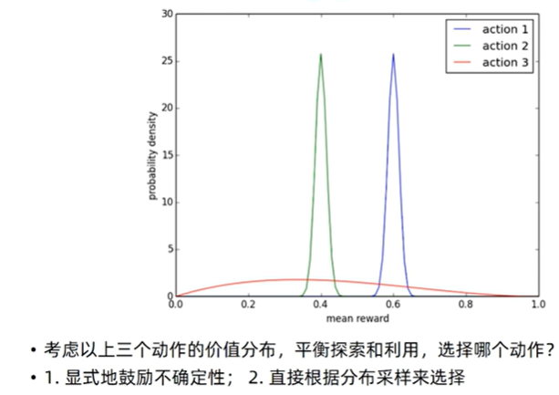
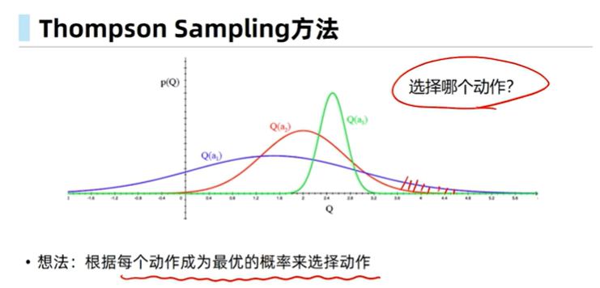
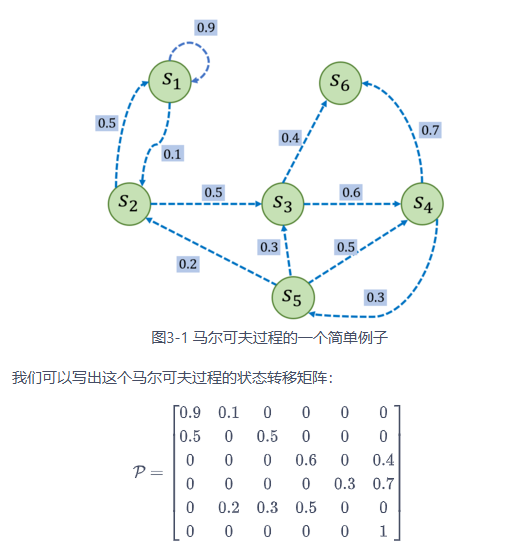

# 强化学习

这部分内容主要参考 [动手学强化学习](https://hrl.boyuai.com/chapter/1/%E5%88%9D%E6%8E%A2%E5%BC%BA%E5%8C%96%E5%AD%A6%E4%B9%A0)，可以通过该书详细入门强化学习，这里做一些**简要但是也比较全面**的介绍。**主要是想通过对强化学习有一定了解之后，看大模型强化学习会得心应手很多**

## 1. 强化学习问题、流程以及独特性

### **强化学习解决的问题**

在机器学习领域，有一类重要的任务和人生选择很相似，即序贯决策（sequential decision making）任务。决策和预测任务不同，**决策往往会带来“后果”，因此决策者需要为未来负责**，在未来的时间点做出进一步的决策**。实现序贯决策的机器学习方法就是强化学习（reinforcement learning），**预测仅仅产生一个针对输入数据的信号，并期望它和未来可观测到的信号一致，这不会使未来情况发生任何改变

强化学习（Reinforcement Learning，RL）是一种机器学习方法，用于解决需要在一定环境下**通过与环境交互来学习最优行为策略的问题**。其核心思想是**通过试错（Trial and Error）和奖励机制来指导智能体（Agent）学习如何在不同情境下采取行动，以最大化长期累积奖励**

**应用场景：**控制问题、游戏、资源管理优化、金融风险控制、推荐算法

### 强化学习流程

智能体在这个过程中学习，它的最终目标是：**找到一个策略，这个策略根据当前观测到的环境状态和奖励反馈，来选择最佳的动作**

**强化学习的独特性**

对于一般的有监督学习任务，**目标是找到一个最优的模型函数，使其在训练数据集上最小化一个给定的损失函数**。在训练数据独立同分布的假设下，这个优化目标表示最小化模型在整个数据分布上的泛化误差，用简要的公式可以概括为：

$$最优模型 = \arg\min_{模型} \mathbb{E}_{(特征, 标签)\sim 数据分布}[损失函数(标签, 模型(特征))]$$

相比之下，强化学习任务的最终优化目标是最大化智能体策略在和动态环境交互过程中的价值。**策略的价值可以等价转换成奖励函数在策略的占用度量（这里简单理解策略的占用度量是策略的分布即可）上的期望**，即：

$$最优策略 = \arg\max_{策略} \mathbb{E}_{(状态, 动作)\sim 策略的占用度量}[奖励函数(状态, 动作)]$$

- 有监督学习和强化学习的优化目标相似，即都是在**优化某个数据分布下的一个分数值的期望**。
- 二者优化的途径是不同的，**有监督学习直接通过优化模型对于数据特征的输出来优化目标，即修改目标函数而数据分布不变**；**强化学习则通过改变策略来调整智能体和环境交互数据的分布，进而优化目标，即修改数据分布而目标函数不变**

综上所述，一般有监督学习和强化学习的范式之间的区别为：

- 一般的**有监督学习关注寻找一个模型，使其在给定数据分布下得到的损失函数的期望最小**
- **强化学习关注寻找一个智能体策略，使其在与动态环境交互的过程中产生最优的数据分布，即最大化该分布下一个给定奖励函数的期望**

#### **强化学习与有监督学习的其他区别**

强化学习用智能体（agent）这个概念来表示做决策的机器。相比于有监督学习中的“模型”，强化学习中的“智能体”强调机器**不但可以感知周围的环境信息，还可以通过做决策来直接改变环境**，而不只是给出一些预测信号

> 强化学习用智能体（agent）这个概念来表示做决策的机器。相比于有监督学习中的“模型”，强化学习中的“智能体”强调机器不但可以感知周围的环境信息，还可以通过做决策来直接改变这个环境，而不只是给出一些预测信号

##### **数据类型与来源**

- 有监督学习：依赖于**标注好的数据集**，每个数据**样本**都**带有明确的标签**（目标值）
- **强化学习：不依赖预先标注的数据集，而是通过与环境交互产生数据**。智能体在每一步行动后会得到环境的反馈（奖励或惩罚），这个反馈用于指导学习

##### **学习方式**

- **有监督学习：**基于**静态数据集进行训练，学习过程通常是一次性的，即通过一个固定的数据集训练完模型**
- **强化学习：**基于动态数据进行训练，学习过程是持续的，**通过与环境不断交互、试错来更新策略****

##### **反馈机制**

- **有监督学习：**每个训练样本都有明确的标签，模型可以直接计算误差
- **强化学习：**没有明确的标签，模型通过从环境中获得的奖励信号来评估行动的好坏。奖励通常是延迟的，**不是每个行动都能立即得到反馈**

#### Hoeffding不等式

已知所有$1 \leq i \leq n$，$X_i$变量几乎必然满足$a_i \leq X_i \leq b_i$,对于所有$t > 0$有：

- $\mathbb{P}\left(S_n - \mathbb{E}[S_n] \geq t\right) \leq \exp\left(-\frac{2t^2}{\sum_{i=1}^n (b_i - a_i)^2}\right)$

- $\mathbb{P}\left(\left|S_n - \mathbb{E}[S_n]\right| \geq t\right) \leq 2\exp\left(-\frac{2t^2}{\sum_{i=1}^n (b_i - a_i)^2}\right)$

其中$\mathbb{E}[S_n]$是$S_n$的期望。

## 2.多臂老虎机

[代码](code\BernoulliBandit.py) 

多臂老虎机**不存在状态信息，只有动作和奖励**，算是最简单的“和环境交互中的学习”的一种形式

#### 定义 

我们每次拉动其中一根拉杆，就可以从该拉杆对应的奖励概率分布 $r$ 中获得一个奖励 。我们在各根拉杆的奖励概率分布未知的情况下，从头开始尝试，目标是在操作  次拉杆后获得尽可能高的累积奖励。由于**奖励的概率分布是未知**的，因此我们需要**在“探索拉杆的获奖概率”和“根据经验选择获奖最多的拉杆”中进行权衡**。“采用怎样的操作策略才能使获得的**累积奖励最高**”便是多臂老虎机问题

regret:可以理解为懊悔定义为拉动当前拉杆的动作$a$与最优拉杆的期望奖励差,即$R(a)=Q^*-Q(a)$

累积懊悔cumulative regret:即操作\( T \)次拉杆后累积的懊悔总量，对于一次完整的 $T$ 步决策 $(a_1, a_2, \dots, a_T) $，累积懊悔为 $\sigma_R = \sum_{t=1}^T R(a_t)$ 。MAB问题的目标为最大化累积奖励，**等价于最小化cumulative regret**。

 **Lai & Robbins 下界定理**:**任何**“好”的算法（即渐进一致的算法）在理论上所能达到的**最小累积懊悔（Regret）的极限**,[原理解释](./note2.assets/BernoulliBandit_low.md),总之核心公式为$$\text{Regret} \approx \log T \sum \frac{\Delta_a}{D_{KL}}$$,后面部分为常数项,因此O(log T)

#### 求解方法

0. 假设我们每次随机选择或每次都不随机选择,那么显然cumulative regret是线性的,即O(t)数量级

1. $\epsilon$贪心算法 EpsilonGreedy

   $p=\epsilon$随机选择or  $ p=1-\epsilon$当前期望最大值,期望修正公式如下:
   假设第 k 根拉杆之前被拉了 $n$ 次，平均奖励估值是 \( $Q_n$ \)，现在又得到新的奖励 \( $r$ \)，那么新的估值更新公式为：
   $Q_{n+1} = Q_n + \frac{1}{n+1}(r - Q_n) $等价于$Q_{n+1} = \frac{1}{n+1} \sum_{i=1}^{n+1} R_i $
   虽然是有偏增加采样,但仍能提高预估准确率
   贪心算法更换贪心概率 $\epsilon $可以调整regret的增长斜率,但结果仍为**线性增长**O(T)

2. 随时间降低$ \epsilon $的贪心算法

   前期收集的信息太少,使用随机算法有助于收集信息
   后期掌握了足够的信息,使用贪心算法有助于降低regret
   此时$\epsilon$=1/t

3. **上置信界**算法

   
   对于给出的三个action,我们应当**显式地鼓励不确定性**,使得我们能更显著地**获取环境信息**,如action1,2,可能会遇到完全获取不到最优解的情况

   markdown **不确定性越大**的$\hat{Q}(a^i)$，**越具有探索的价值**，有可能会是最好的策略  一个经验性指导： U(a):上置信界,N(a):执行 行动a的次数
    $N(a)$大，$U(a)$小 - $N(a)$小，$U(a)$大  
   策略$\pi$：$a = \arg\max_{a \in \mathcal{A}} \hat{Q}(a) + \bar{U}(a)$ 

   根据Hoeffding不等式,在这里,$\mathbb{P}[\mathbb{E}[x]>\bar{x}_{t}+u]\leq e^{-2tu^{2}}\mathrm{~for~}x\in[0,1]$
   对于E(X),逃出均值+u范围的可能性是$e^{-2tu^{2}}$
   有$Q_{t}(a)\leq\boxed{\hat{Q}_{t}(a)}+\widehat{U}_{t}(a)$以一个概率 $p$ 不成立,$\hat{Q}$即Q的均值
   因此我们可以依据下列原则挑选,进行决策
   $\begin{aligned}&a=\arg\max_{a\in A}\hat{Q}_{t}(a)+\widehat{U}_{t}(a)&&e^{-2N_{t}(a)U_{t}(a)^{2}}=p\quad\hat{U}_{t}(a)=\sqrt{-\frac{\log p}{2N_{t}(a)}}\\&\text{ 收敛性:}\\&\lim_{t\to\infty}\sigma_{R}\leq8\log t\sum_{a|\Delta_{a}>0}\Delta_{\alpha}\end{aligned}$

   

4. 汤普森采样算法
   第二种选择,即**直接根据分布采样选择**,这就是汤普森采样算法的成因
   
   $p(a)=\int\mathbb{I}\left[\mathbb{E}_{p(Q(a))}\left[Q(a;\theta)\right]=\max_{a^{\prime}\in\mathcal{A}}\mathbb{E}_{p(Q(a^{\prime}))}(Q(a^{\prime};\theta))\right]d\theta $

​	假设服从beta分布,然后根据采样结果调整分布形状

## 3.马尔科夫决策过程

##### 定义和性质

- $\mathcal{S}$是有限**状态的集合**。
- $\mathcal{P}$是**状态转移矩阵**。
- $r$是**奖励函数**，某个状态$s$的奖励$r(s)$指转移到该状态时可以获得奖励的期望。
- $\gamma$是**折扣因子**（discount factor），$\gamma$的取值范围为$[0,1)$。引入折扣因子的理由**为远期利益具有一定不确定性**，有时我们更希望能够尽快获得一些奖励，所以我们需要**对远期利益打一些折扣**。接近1的$\gamma$更关注长期的累计奖励，接近0的$\gamma$更考虑短期奖励。

定义:Markov Decision Process,MDP,提供了一套为在**结果部分随机、部分在决策者的控制**下的决策过程建模的数学框架,**环境完全可观测**，当前状态可以完全表示之前所有过程(无需之前的状态)（即所谓的**马尔科夫性质**)

**马尔科夫性质**的公式表达:$\mathbb{P}[S_{t+1}|S_{t}]=\mathbb{P}[S_{t+1}|S_{1},\ldots,S_{t}]$

**状态转移矩阵**:$\mathcal{P}=\begin{bmatrix}P(s_1|s_1)&\cdots&P(s_n|s_1)\\\vdots&\ddots&\vdots\\P(s_1|s_n)&\cdots&P(s_n|s_n)\end{bmatrix}$,[i,j]表示j->j的转移概率,每一行的和为1

举个例子,如上图所示

#### reward奖励

公式:$G_t=R_t+\gamma R_{t+1}+\gamma^2R_{t+2}+\cdots=\sum_{k=0}^\infty\gamma^kR_{i+k}$
其中$\gamma $为奖励衰减因子,$R_t$为t时刻获得的reward

**蒙特卡洛方法：** 玩到底，算出总分,然后从后往前计算期望

**贝尔曼期望方程：** 咱们别玩到底了，太累。这个状态的价值，其实等于 **“我现在立刻能拿到的奖励”** 加上 **“下一步那个状态的价值（打个折）”**。

## 时序差分方法

时序差分方法（Temporal Difference)TD:边走边看，**实时修正**(蒙特卡洛在一次运行结束后才能学习)  直接**从智能体与环境的交互中学习，无需知道环境的完整模型**。TD方法的核心在于**利用已有的状态估计值来更新当前状态的价值函数**，这一过程称为自举（bootstrapping）

**优点**：**单步更新**。不用走完全程，走一步就能利用下一步的信息来修正现在的想法。

TD 的核心公式长这样，它是强化学习里最著名的公式之一： $$V(S_t) \leftarrow V(S_t) + \alpha \underbrace{\left[ R_{t+1} + \gamma V(S_{t+1}) \right]}_{\text{TD 目标}} - V(S_t)$$  

1. $V(S_t)$：我原来的观点（比如：我觉得回家要30分钟）。 
2.  $R_{t+1}$：我刚刚这一步实际拿到的奖励（比如：我已经开了5分钟）
3. $V(S_{t+1})$：我对“下一步”状态的估计（比如：到了路口，我估计哪怕剩下还得开35分钟）。
4.  $R_{t+1} + \gamma V(S_{t+1})$：这是**“TD 目标”**。虽然我还没到家，但我用“刚才的真实经历”加上“对未来的估计”，拼凑出了一个新的、更靠谱的预估值（5+35=40分钟）。 
5.  $\alpha$（学习率）：我**多大程度上相信这个新发现**？  一句话总结公式：“新身价 = 旧身价 + 学习率 × (眼前的实惠 + 下一步的身价 - 旧身价)”

#### **SARSA**

更新一次所需要的**五个要素**的首字母拼写： **S**tate（状态） $\rightarrow$ **A**ction（动作） $\rightarrow$ **R**eward（奖励） $\rightarrow$ **S**tate（下个状态） $\rightarrow$ **A**ction（下个动作）

**它的工作流程是这样的：**

- 初始化 $$Q(s,a)$$
- **for 序列 $$e = 1 \to E$$ do :**

  * 得到初始状态 $$s$$

  * 用  $$\epsilon-greedy$$ 策略根据 $$Q$$ 选择当前状态 $$s$$ 下的动作 $$a$$

  * **for 时间步 $$t = 1 \to T$$ do :**

    * 得到环境反馈的 $$r, s'$$

    * 用 $$\epsilon-greedy$$ 策略根据 $$Q$$ 选择当前状态 $$s'$$ 下的动作 $$a'$$

    * $$Q(s,a) \leftarrow Q(s,a) + \alpha [r + \gamma Q(s',a') - Q(s,a)]$$

    * $$s \leftarrow s', a \leftarrow a'$$

  * **end for**

- **end for**

**拿着这五个数据 ($S_t, A_t, R_{t+1}, S_{t+1}, A_{t+1}$)，我才能进行一次更新。这就是 SARSA 名字的由来。**

运行方式:**直接使用TD算法来估计动作价值函数，然后使用贪心算法选取状态下动作价值最大的动作**

$$Q(s_{t},a_t) \leftarrow Q(s_{t},a_t) + \alpha[r_t+\gamma Q(s_{t+1},a_{t+1}) - Q(s_{t},a_t)]$$

$$\pi(a|s) = 
\begin{cases}
\epsilon/|\mathcal{A}| + 1 - \epsilon & \text{如果 } a = \arg\max_{a'} Q(s,a') \\
\epsilon/|\mathcal{A}| & \text{随机采样其他动作}
\end{cases}$$

#### **SARSA-λ**

Sarsa(lambda)算法是Sarsa 的改进版，二者的主要区别在于：

- 当 lambda 取0，更新时**只考虑上一步**，就变成了 Sarsa 的**单步更新**。
- 当 lambda 取 1, 同样地**考虑上面的所有步**，就变成了回合更新, 对所有步更新的力度都是一样。
- 当 lambda 在 0 和 1 之间，取值越大，离宝藏越近的步更新力度越大. 这样我们就不用受限于单步更新的每次只能更新最近的一步, 我们可以更有效率的更新所有相关步了。

**蒙特卡洛方法是无偏（unbiased）的，但是具有比较大的方差**，因为**每一步的状态转移都有不确定性，而每一步状态采取的动作所得到的不一样的奖励最终都会加起来，这会极大影响最终的价值估计**；**时序差分算法具有非常小的方差，因为只关注了一步状态转移，用到了一步的奖励，但是它是有偏的，因为用到了下一个状态的价值估计而不是其真实的价值**

SARSA-λ则采用两者折中的方法，考虑多步时序差分：

$$Q(s_t,a_t) \leftarrow Q(s_t,a_t) + \alpha [r_t + \gamma r_{t + 1} + \cdots + \gamma^n Q(s_{t + n},a_{t + n}) - Q(s_t,a_t)]$$

#### **Expected Sarsa**

Expected Sarsa 是基础 Sarsa 的改进版，核心思路是：**用 “后续状态下所有动作的期望动作值” 替代基础 Sarsa 中 “单个随机后续动作的动作值”**，从而减少随机噪声带来的估计方差。其中，期望动作值的计算的是当前策略π：下，$s_{t+1}$状态所有可能动作的动作值加权和（权重为策略的动作选择概率)：
$\mathbb{E}_{\pi_t}\left[q_t(s_{t+1},A)\right]=\sum_{a\in\mathcal{A}(s_{t+1})}\pi_t(a\mid s_{t+1})\cdot q_t(s_{t+1},a)$

#### **n-step Sarsa**

n-step Sarsa 是基础 Sarsa 的**广义推广**，核心思路是：结合 “n 步奖励之和 + 第 n 步的动作值估计” 来更新动作值，实现基础 Sarsa（n=1）与蒙特卡洛（MC）学习（n=∞）的统一。

你可以用以下 Markdown 格式呈现这段 n-step Sarsa 的公式与定义（包含 LaTeX 公式排版）：  其中，n-step Sarsa 的动作值更新公式

为： $$ q_{t+n}(s_t, a_t) = q_{t+n-1}(s_t, a_t) - \alpha_{t+n-1}(s_t, a_t) \left[ q_{t+n-1}(s_t, a_t) - G_t^{(n)} \right] $$  
求解:$q_{t+1}(s_t,a_t)=q_t(s_t,a_t)-\alpha_t(s_t,a_t)\Big[q_t(s_t,a_t)-[r_{t+1}+\gamma r_{t+2}+\cdots+\gamma^nq_t(s_{t+n},a_{t+n})]\Big]$

**n-step 回报（n-step return）** $G_t^{(n)}$ 是该更新的核心目标，其定义为： 

$$ G_t^{(n)} = r_{t+1} + \gamma r_{t+2} + \gamma^2 r_{t+3} + \dots + \gamma^{n-1} r_{t+n} + \gamma^n q_{t+n-1}(s_{t+n}, a_{t+n}) $$ 

MC的G:$\mathsf{MC}\longleftarrow\quad G_{t}^{(\infty)}=R_{t+1}+\gamma R_{t+2}+\gamma^{2}R_{t+3}+\ldots $因此可以视为MC+Sarsa

| 对比维度          | Expected Sarsa                                     | n-step Sarsa                                            |
| ----------------- | -------------------------------------------------- | ------------------------------------------------------- |
| 核心改进点        | 用 “动作值期望” 替代 “单个动作值”（降方差）        | 用 “n 步回报” 替代 “1 步回报”（方差 / 偏差权衡）        |
| 样本依赖          | **1 步样本**（*$s_t$*,*$a_t$* ,$r_{t+1},s_{t+1}$） | n 步样本（*$s_t$*,*$a_t$* 至 *$s_{t+n}$*,*$a_{t+n}$* ） |
| 更新时机          | 即时更新（时刻 t+1）                               | 延迟更新（时刻 t+n）                                    |
| 方差 / 偏差       | 低方差、中等偏差                                   | 随 n 增大：方差升高、偏差降低                           |
| 计算复杂度        | 依赖动作空间大小（求和计算期望）                   | 依赖 n 大小（**缓存 n 步样本** + 计算 n 步回报）        |
| 与基础 Sarsa 关系 | 同阶变体（更新目标的计算方式不同）                 | 广义推广（更新步长的扩展）                              |

 

#### **Q-learning算法**

$\begin{aligned}&q_{t+1}(s_t,a_t)=q_t(s_t,a_t)-\alpha_t(s_t,a_t)\left[q_t(s_t,a_t)-[r_{t+1}+\gamma\max_{a\in\mathcal{A}}q_t(s_{t+1},a)]\right],\\&q_{t+1}(s,a)=q_t(s,a),\quad\forall(s,a)\neq(s_t,a_t),\end{aligned}$

- The TD target in Q-learning is $\hat{r}_{t+1} + \gamma \max_{a \in \mathcal{A}} q_t(s_{t+1}, a)$  对a做优化
- The TD target in Sarsa is $r_{t+1} + \gamma q_t(s_{t+1}, a_{t+1})$.  选择一个新的$a_{t+1}$

- $\max_{a'} q_t(s_{t+1}, a')$：Q-learning 的**核心 TD 目标**——直接取“下一状态 $s_{t+1}$ 下所有动作的**最大动作值**”（对应目标策略的贪婪选择）；
- $\alpha_t(s_t, a_t)$：学习率（控制更新步长）； 
- $\gamma$：折扣因子（权衡即时与未来奖励）； - 仅更新当前访问的 $(s_t, a_t)$，其余状态-动作对的 Q 值保持不变。

行为策略（生成经验样本的策略）与目标策略（用于更新动作值的策略）分离：

- 行为策略：通常是 *ϵ*- 贪婪策略（保证探索，生成多样样本）；
- 目标策略：始终是**贪婪策略**（基于当前动作值选择最优动作，即 $π(s)=argmax_a q_t(s,a)）$。

- 区别只在 “经验来源”：On-Policy 是 “自己试出来的经验，自己用”；Off-Policy 是 “别人（或探索策略）试出来的经验，自己用”—— 后者更灵活，样本效率更高（不用重复踩别人已经踩过的坑）。对于LLM,Off-Policy收敛更快,On-Policy上限更高

可以用以下 Markdown 格式呈现这段 TD 算法的核心公式与表格（包含 LaTeX 公式排版）： 

所有时序差分（TD）算法的动作值更新可统一表示为： $$ q_{t+1}(s_t, a_t) = q_t(s_t, a_t) - \alpha_t(s_t, a_t)\left[ q_t(s_t, a_t) - \bar{q}_t \right] $$ 
其中，$\bar{q}_t$ 被称为 **TD 目标（TD target）**——不同 TD 算法的核心差异，正是 $\bar{q}_t$ 的定义不同。 

| Algorithm      | Expression of $\bar{q}_t$                                    |
| -------------- | ------------------------------------------------------------ |
| Sarsa          | $\bar{q}_t=r_{t+1}+\gamma q_t(s_{t+1},a_{t+1})$              |
| *n*-step Sarsa | $\bar{q}_t=r_{t+1}+\gamma r_{t+2}+\cdots+\gamma^nq_t(s_{t+n},a_{t+n})$ |
| Expected Sarsa | $\bar{q}*t = r*{t+1} + \gamma \sum_a \pi_t(as_{t+1}) q_t(s_{t+1}, a)$ |
| Q-learning     | $\bar{q}_t=r_{t+1}+\gamma\max_aq_t(s_{t+1},a)$               |
| Monte Carlo    | $\bar{q}_t=r_{t+1}+\gamma r_{t+2}+\ldots $                   |

## 强化学习分类

**几个强化学习中比较重要的分类概念：Online\&Offline、On-Policy\&Off-Policy、Model-based\&Model-free和Value-based\&Policy-based**

#### **以数据来源划分**

* **Online：**&#x41;gent一边与环境交互收集轨迹样本$$<s_1,a_1,r_1,\cdots,s_T,a_T,r_T>$$，**一边学习策略**

* **Offline：**&#x41;gent学习用到的轨迹样本是提前收集好的，**作为一个Offline dataset提供给Agent，学习策略过程不涉及环境交互**

#### **以需不需要环境动态划分**

* **Model-based：**&#x73AF;境动态已知，或者通过学习得到一个环境状态转移方程、奖励函数的模型，然后通过动态规划或者树搜索等方法直接求解最优策略，Agent不需要真正与环境交互采样

* **Model-free：**&#x73AF;境动态未知，不需要学习状态转移，通过Agent与环境交互采样学习策略

#### **以采样策略和更新策略划分**

* **On-Policy**：用来采样的**行为策略 Behavior Policy和用这些数据更新的目标策略 Target Policy是同一个策略，**&#x4F8B;如SARSA，更新的时候需要使用到当前行为策略采样得到的五元组数&#x636E;**&#x20;**$$(s,a,r,s',a')$$
* **Off-Policy：**&#x7528;来采样的**行为策略 Behavior Policy和用这些数据更新的目标策略 Target Policy不是同一个一个策略，**&#x4F8B;如Q-learning，更新使用当前行为策略采样的四元组 $$(s,a,r,s')$$ ，$$a'$$是通过 $$\max (Q)$$得到的，而**不是行为策略采样得到**的

## **动态规划方法**

基于**动态规划（Dynamic Programming）**&#x7684;强化学习算法主要有两种：一是**策略迭代（policy iteration）**，二是**价值迭代（value iteration）**

动态规划是一种**model-based方法（环境动态已知或者有训练好的环境模拟器），要求事先知道环境的状态转移函数和奖励函数，即MDP过程已知**，**环境动态完全已知**，这种情况下**Agent并不需要与环境真正交互（例如迷宫、既定规则网格），直接利用DP就可以求解最优策略**

* **Value-based：**&#x5148;学习值函数，然后**从值函数导出策略**，学习过程中**不存在显式的策略**

  - 不关心具体的“攻略”是啥，它只关心**“价值表”**（$V$ 值）。

  - 它在更新某个状态的价值时，直接看：**“下一步去哪儿得分最高？我就假设我去哪儿！”**
  - **特点：** 每一轮算得很快（不用解方程，直接取个最大值就行），但因为是“估算”，所以要**迭代很多轮才能稳定**下来

* **Policy-based：**&#x76F4;接**显式的学习一个目标策略**
  1. 选择一个策略,然后一直执行直至结束,得到最终得分
  2. 根据状态情况,修正策略,使得reward增加
  3. **特点：** 每一轮都很慢，但收敛很快
  4. **适用场景** :状态少，想精确求解时。

**On-Policy与Off-Policy对比示意图**

### 

