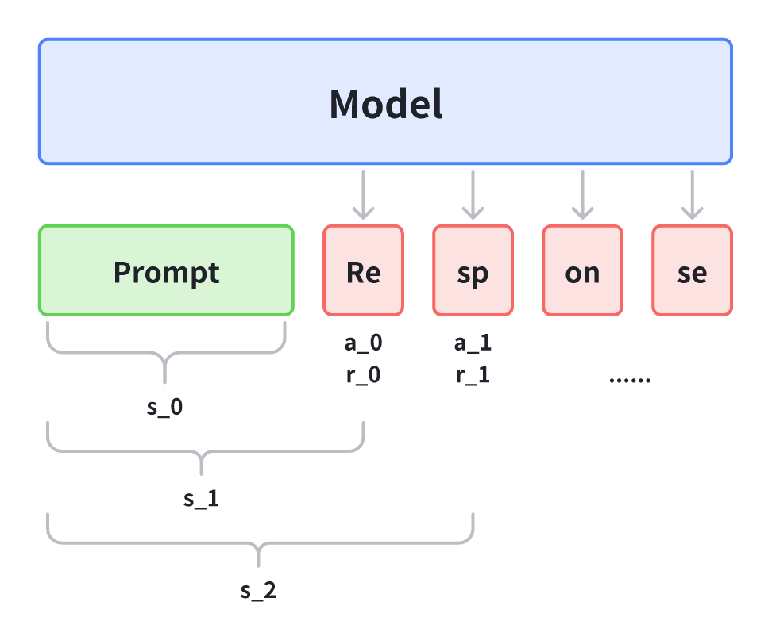

LLM可以视为上图, 给定一个prompt，大模型会**在 $$t$$时刻生成一个token，然后下一个时刻根据prompt+上一时刻的token再去生成下一个token**，进行自回归的生成，所以可以定义**强化学习**中的各个概念为：

* **动作$$a_t$$：**&#x751F;成的 `token`，动作空间就是整个词表，动作空间大小就是词表大小$$|V|$$

* **策略$$\pi(a_t|s_t)$$：**&#x6839;据当前状态$$s_t$$生成动作`token`$$a_t$$的概率&#x20;

* **状态$$s_t$$：**&#x4E0A;文以及$$t$$时刻前生成的**所有 token concat的 token 序列，**&#x521D;始状态 $$s_0$$就是prompt的token序列

* **状态转移：**&#x8FD9;里的强化学习状态转移是确定性的，定义为**当前状态和动作的concat的token序列为下一个状态**，即$$s_{t+1}=[s_t,a_t]$$

* **奖励$$r_t$$和价值 $$V_t$$：**&#x8FD9;里的定义就是一般强化学习的定义，**即时奖励以及状态价值函数**

## [RLHF](https://arxiv.org/pdf/1706.03741)

### 问题

* 强化学习在许多任务中面临**目标复杂、难以定义奖励函数**的问题，导致**难以将人类实际目标传达给智能体**

* 不正确的、有偏的奖励函数会导致**智能体过分利用(exploit)奖励函数**，产生**reward hacking**问题，即**实际学到的行为与人类期望不符合，甚至有害**

* 奖励函数的设计工程需要**大量的专业人士的精力**

* 现有方法如**逆强化学习和模仿学习在处理复杂行为时存在局限性，直接使用人类反馈作为奖励函数成本过高**

### 目标

用于**解决没有明确定义奖励函数的强化学习**问题，需要满足以下几点：

* 能够解决那些人类**只能识别期望行为**，但**不一定能提供demonstration的任务**

* 允许**非专家用户对智能体进行教导**

* 能够**扩展到大型问题**

* 在**用户反馈方面经济高效

### 方法

将**奖励函数与人类偏好进行拟合**，同时**用RL算法训练一个策略来优化当前预测的奖励函数**。**给人类提供两个智能体行为轨迹的片段(一般来说是视频、动图)，让人给出自己的偏好标签(就是那个片段更好)，而不是提供绝对数值分数**。

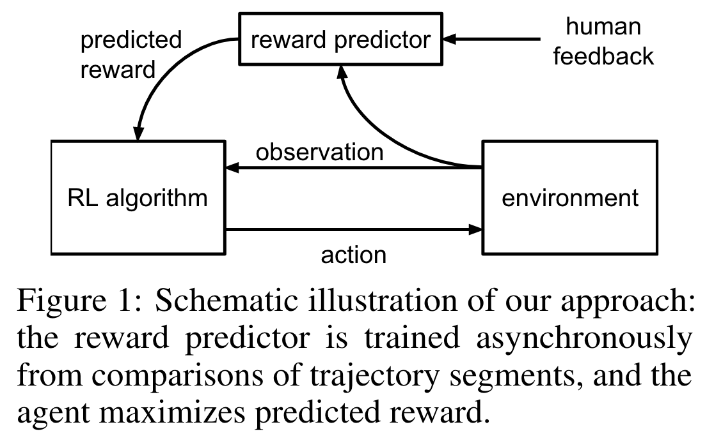


* **对比标签：**&#x5BF9;于智能体轨迹片段 $$\sigma^1$$和 $$\sigma^2$$来说，下面的式子表示 $$\sigma^1$$比 $$\sigma^2$$更被人偏好，得到的标签 $$y$$也可以表示如下，0.5代表同等偏好程度。**&#x20;$$s,a$$分别表示智能体的观测/状态和动作**

**&#x20;**$$\sigma^1\succ\sigma^2=
\left(\left(s_{0}^{1}, a_{0}^{1}\right), \ldots,\left(s_{k - 1}^{1}, a_{k - 1}^{1}\right)\right) \succ\left(\left(s_{0}^{2}, a_{0}^{2}\right), \ldots,\left(s_{k - 1}^{2}, a_{k - 1}^{2}\right)\right) 
\\ \\
y = \{0,1,0.5\} \text{  if  } \{\sigma^1\succ\sigma^2, \sigma^2\succ\sigma^1, \sigma^1=\sigma^2\}$$

* **偏好建模：**&#x7531;于RLHF的一个目标是将**奖励函数与人类偏好进行拟合，**&#x5C31;是**利用人类的比较偏好标签来学出一个reward model**，那就涉及到了奖励函数和偏好之间的关联问题，这里给出的方法是，将奖励函数视为解释人类判断的潜在因素，并**假设人类偏好一个片段的概率与潜在奖励在该片段长度上的总和呈指数相关**，基于 **Bradley-Terry 模型**，可以给出**人类偏好片段 $$\sigma^1$$超过 $$\sigma^2$$的概率**：

$$\hat{P}[\sigma^{1} \succ \sigma^{2}] = \frac{\exp \sum \hat{r}(s_{t}^{1}, a_{t}^{1})}{\exp \sum \hat{r}(s_{t}^{1}, a_{t}^{1}) + \exp \sum \hat{r}(s_{t}^{2}, a_{t}^{2})}$$

* **奖励学习：**&#x5F97;到这个偏好建模以及收集到的人类偏好标签之后，就可以简单的使用**二分类的思路来隐式的学习我们的奖励函数**了，损失函数是分类常用的**交叉熵，**&#x7136;后利用这个loss训练优化得到最后的符合人类偏好的奖励函数

 $$ \mathrm{loss}(\hat{r}) = - \mathbb{E}_{(\sigma^{1}, \sigma^{2}, y) \in \mathcal{D}} \left[y(\sigma^1\succ\sigma^2) \log \hat{P}[\sigma^{1} \succ \sigma^{2}] + y(\sigma^2\succ\sigma^1) \log \hat{P}[\sigma^{2} \succ \sigma^{1}]\right]$$

  如果将正样本（被偏好）和负样本（不被偏好）记为 $$\sigma^+,\sigma^-$$，则上述loss可以写成：


 $$ \mathrm{loss}(\hat{r}) = - \mathbb{E}_{(\sigma^{+}, \sigma^{-}, y) \in \mathcal{D}} \left[ \log \hat{P}[\sigma^{+} \succ \sigma^{-}] \right] = \\ - \mathbb{E}_{(\sigma^{+}, \sigma^{-}, y) \in \mathcal{D}} \left[ \log \frac{\exp \sum \hat{r}(s_{t}^{+}, a_{t}^{+})}{\exp \sum \hat{r}(s_{t}^{+}, a_{t}^{+}) + \exp \sum \hat{r}(s_{t}^{-}, a_{t}^{-})}\right]$$

* **策略学习：**&#x5F97;到奖励函数之后就可以应用任何一个强化学习算法去**最大化奖励用来产出相应的策略**了

* **在线学习：**&#x8FD9;篇文章提出的方法是在线RLHF(Online RLHF)，就是**奖励函数和策略学习是交替同时进行的**，伴随着智能体不断的和环境交互产生新的轨迹数据用来给人类打反馈标签

## 研究**总结**

* **算法原理：**算法通过将奖励函数与人类偏好进行拟合，**使智能体的行为朝着符合人类期望的方向发展**。在训练过程中，同时优化策略以最大化预测的奖励，从而在没有明确奖励函数的情况下，让智能体学会做出符合人类偏好的决策

* **反馈方式优势：**

  * **易于提供：**&#x76F8;比提供绝对数值分数，**人类更容易对智能体轨迹片段进行比较**，降低了反馈的难度，使得非专家用户也能更轻松地参与到智能体的训练过程中

  * **信息丰富：**&#x667A;能体轨迹片段包含了一定的行为序列信息，**比单个状态更能反映智能体的行为特点和趋势**，因此在学习人类偏好方面更有帮助，能够**为奖励函数的拟合提供更有价值的信息**

  * **在线反馈的好处：**&#x5728;线收集反馈意味着系统可以**实时获取人类的偏好信息**，并**根据新的反馈及时调整策略和奖励函数**。这样可以**避免系统过度依赖之前学习到的奖励函数**，**防止因奖励函数的不准确性或局限性而导致的不良行为**，从而持续提高系统的性能，使其更好地适应复杂多变的任务环境；缺点就是**实时收集人类偏好标签成本很高**，所以之后在LLM中应用的时候，很多工作都在研究**自动化偏好标签，比如RLAIF，利用大模型代替人类给偏好**


# RLHF+PPO

## RLHF+PPO的简化理解

包括各个模型的loss等

### 参考文献:

https://zhuanlan.zhihu.com/p/677607581 :直觉和实践,这个更好用

https://zhuanlan.zhihu.com/p/7461863937 :原理,结合b站 强化学习数学原理看

https://github.com/wlll123456/study_rlhf 代码

上面两篇文章讲的非常好,建议多看看

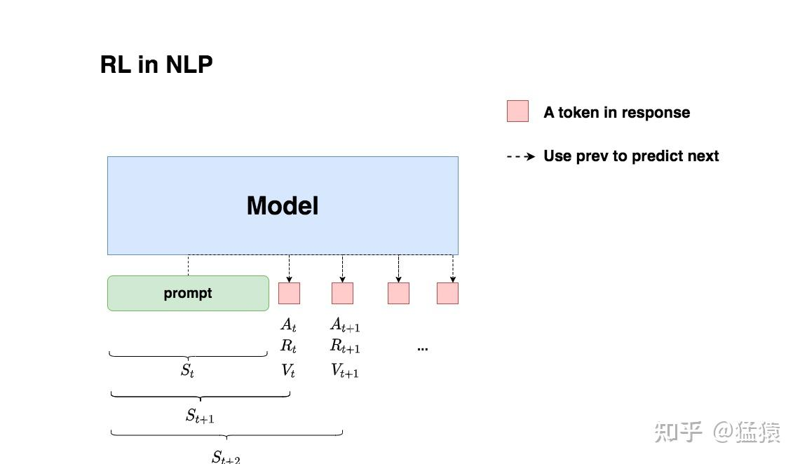

LLM可以视为上图, 给定一个prompt，大模型会**在 $$t$$时刻生成一个token，然后下一个时刻根据prompt+上一时刻的token再去生成下一个token**，进行自回归的生成，所以可以定义**强化学习**中的各个概念为：

- **动作$$a_t$$：**&#x751F;成的 `token`，动作空间就是整个词表，动作空间大小就是词表大小$$|V|$$
- **策略$$\pi(a_t|s_t)$$：**&#x6839;据当前状态$$s_t$$生成动作`token`$$a_t$$的概率&#x20;
- **状态$$s_t$$：**&#x4E0A;文以及$$t$$时刻前生成的**所有 token concat的 token 序列，**&#x521D;始状态 $$s_0$$就是prompt的token序列
- **状态转移：**&#x8FD9;里的强化学习状态转移是确定性的，定义为**当前状态和动作的concat的token序列为下一个状态**，即$$s_{t+1}=[s_t,a_t]$$
- **奖励$$r_t$$和价值 $$V_t$$：**&#x8FD9;里的定义就是一般强化学习的定义，**即时奖励以及状态价值函数**

 $A_t$是由我们的语言模型产生的，$R_t$ ，$V_t$ 则分别由另外两个模型来产生 (Actor Model和Critic model)

## 工作流程


- 第一步，我们准备一个batch的prompts
- 第二步，我们将这个batch的prompts喂给Actor模型，让它生成对应的responses
- 第三步，我们把prompt+responses喂给我们的Critic/Reward/Reference模型，让它生成用于计算actor/critic loss的数据，按照强化学习的术语，我们称这些数据为经验（experiences）。critic loss我们将在后文做详细讲解，目前我们只把目光聚焦到actor loss上
- 第四步，我们根据这些经验，实际计算出actor/critic loss，然后更新Actor和Critic模型


### 四个角色


如上图，**在RLHF-PPO阶段，一共有四个主要模型**，分别是：

- **Actor Model：演员模型**，这就是我们想要训练的目标语言模型 s->a ,强化学习中的策略$\pi$
- **Critic Model：评论家模型**，它的作用是预估总收益 s-> $V_t$
- **Reward Model：奖励模型**，它的作用是计算即时收益 a-> $R_t$
- **Reference Model：参考模型**，它的作用是在RLHF阶段**给语言模型增加一些“约束”**，防止语言模型训歪（朝不受控制的方向更新，效果可能越来越差）

其中:

- **Actor/Critic Model**在RLHF阶段是**需要训练**的（图中给这两个模型加了粗边，就是表示这个含义）；而**Reward/Reference Model**是**参数冻结**的。
- Critic/Reward/Reference Model共同组成了一个“奖励-loss”计算体系（我自己命名的，为了方便理解），我们综合它们的结果计算loss，用于更新Actor和Critic Model

#### Actor Model :  LLM

即我们要训练的LLM,**用SFT阶段产出的SFT模型来对它做初始化**

训练的最终目的是让Actor模型能**产生符合人类喜好的response**。所以我们的策略是，先喂给Actor一条prompt （这里假设batch_size = 1，所以是1条prompt），让它生成对应的response。然后，我们再将“prompt + response"送入我们的“奖励-loss”计算体系中去算得最后的loss，用于更新actor。


#### Reference Model

**我们希望训练出来的Actor模型既能达到符合人类喜好的目的，又尽量让它和SFT模型不要差异太大**。简言之，**我们希望两个模型的输出分布尽量相似**。那什么指标能用来衡量**输出分布的相似度**呢？我们自然而然想到了**KL散度**。

- **对Actor模型**，我们喂给它一个prompt，它正常输出对应的response。那么response中每一个token肯定有它对应的log_prob结果呀，我们把这样的结果记为**log_probs**
- **对Ref模型**，我们把Actor生成的"prompt + response"喂给它，那么它同样能给出每个token的log_prob结果，我们记其为**ref_log_probs** (类比`teacher forcing,用于计算**输出概率的kl散度**)

#### Critic Model

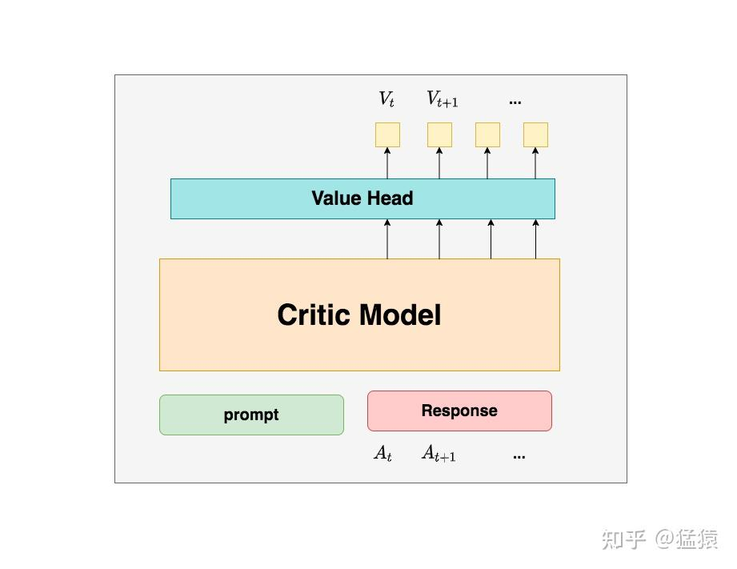

用于预测期望总收益 $V_{t}$  **，和Actor模型一样，它需要做参数更新**。实践中，Critic Model的设计和初始化方式也有很多种，例如和Actor共享部分参数、从RW阶段的Reward Model初始化而来等等。我们讲解时，和deepspeed-chat的实现保持一致：从RW阶段的Reward Model初始化而来。

**也就是在**  $t$ **时刻，我们给不出客观存在的总收益** $V_t$ **，我们只能训练一个模型去预测它。**
**在RLHF中，我们不仅要训练模型生成符合人类喜好的内容的能力（Actor），也要提升模型对人类喜好量化判断的能力（Critic）**

####  Reward Model（奖励模型）

Reward Model用于计算生成token $A_{t}$ 的即时收益 $R_{t}$ ，它就是**RW阶段所训练的奖励模型**(可以由SFT model训练得到,也可以像deepseek--R1-Zero一样,使用基于规则的代码得到)，在RLHF过程中，**它的参数是冻结的**。

**你可能想问：为什么Critic模型要参与训练，而同样是和收益相关的Reward模型的参数就可以冻结呢？**
这是因为，Reward模型是站在上帝视角的。这个上帝视角有两层含义：

- 第一点，Reward模型是经过和“估算收益”相关的训练的，因此在RLHF阶段它可以直接被当作一个能产生客观值的模型。
- 第二点，Reward模型代表的含义就是“即时收益”，你的token $A_{t}$  已经产生，因此即时收益 $R_{t}$ 自然可以立刻算出。

### Loss设计

#### Actor loss

Actor loss : $actor\_loss = \sum -A_t \log P(A_t | S_t)$

$A_t = R_t + \gamma * V_{t+1} - V_t$

$A_t >0$意味着Critic对Actor当前采取的动作给了正向反馈，因此我们就需要在训练迭代中提高$P(A_t | S_t)$,从而减少loss (上面的$V_t$用动作优势 $A_t$ 替代)
$A_t<0$则相反,不赘述


deepspeed-chat的 $R_t$ 设计：

$R_t =
\begin{cases}
-kl\_ctl \cdot \left( \log \frac{P(A_t|S_t)}{P_{ref}(A_t|S_t)} \right), & t \neq T \\
-kl\_ctl \cdot \left( \log \frac{P(A_t|S_t)}{P_{ref}(A_t|S_t)} \right) + R_t, & t = T
\end{cases}$

$kl\_ctl$用于控制kl散度缩放比例, ( ) 中的内容即两个模型输出的kl散度 
t=T : 在最后一步，模型既要受到“是否偏离原模型”的约束（前半部分），又要接收“**这句话写得好不好”的最终评价**（后半部分）。

为什么只有最后一个时刻的 $R_t$ 被纳入了考量呢？这是因为在Reward模型训练阶段，就是用这个位置的 $R_t$ 来表示对完整的prompt + response的奖励预测（但不妨碍你理解成是执行完 $a_T$  的即时奖励），然后用这个指标来做模型eval的（但是Reward训练阶段算loss时，还是考虑了response部分所有token输出的reward值）。所以到了RLHF的场景下，**其余时刻**的即时奖励，我们就用“Actor**是否遵循了Ref的约束**”来进行评价。

而且, $R_t$的设计并不只有一种,可以尝试把最后一个时刻的 $R_T$ 替换成所有token的即时奖励的平均值。如果站在这个角度理解的话，我们同样也可以尝试在每一个位置的奖励衡量上引入 $R_T$ ,

##### $R_t$计算代码

```python
def compute_rewards(self, prompts, log_probs, ref_log_probs, reward_score,
                        action_mask):
        """
        reward_function：计算最终的reward分数
        复习一下几个相关参数的默认值：
        self.kl_ctl = 0.1
        self.clip_reward_value = 5
        
        对于batch中的某个prompt来说，它最终的reward分数为：
        (1) 先计算actor和ref_model的logit相似度： -self.kl_ctl * (log_probs - ref_log_probs)
            其实写成self.kl_ctl * (ref_log_probs - log_probs)更好理解些
            这个值越大，说明ref_model对actor生成的结果的认可度越高（即表明rlhf没有训歪），
            没有训歪的情况下我们也应该给模型一些奖励，这个奖励就是self.kl_ctl * (ref_log_probs - log_probs)
            
        （2）由于我们只取最后一个token对应位置的分数作为reward_score，因此我们只需要：
            self.kl_ctl * (ref_log_probs - log_probs)的最后一位 + reward_score
         
         (3) 同时我们对reward_score也做了大小限制，最大不超过self.clip_reward_value（超过统一给成self.clip_reward_value），
             最小不低于-self.clip_reward_value（低于统一给成-self.clip_reward_value）
        
         (4) 最后返回的rewards大小为：（batch_size, 各条数据的长度），对batch中的每条数据来说：
             - response的最后一位：self.kl_ctl * (ref_log_probs - log_probs)的最后一位 + reward_score
             - response的其余位置：self.kl_ctl * (ref_log_probs - log_probs)
        
        """

        kl_divergence_estimate = -self.kl_ctl * (log_probs - ref_log_probs)
        rewards = kl_divergence_estimate
        # ---------------------------------------------------------------------------------------------------
        # response开始的位置
        # （因为我们对prompt做过padding处理，因此batch中每个prompt长度一致，也就意味着每个response开始的位置一致）
        # （所以这里start是不加s的，只是一个int）
        start = prompts.shape[1] - 1
        # ---------------------------------------------------------------------------------------------------
        # response结束的位置
        # （因为一个batch中，每个response的长度不一样，所以response的结束位置也不一样）
        # （所以这里end是加s的，ends的尺寸是(batch_size,)
        # ---------------------------------------------------------------------------------------------------
		#从 Response 开始往后有多少个真实的 Token（即 Response 的实际长度）
        ends = start + action_mask[:, start:].sum(1) + 1
        # ---------------------------------------------------------------------------------------------------
        # 对rewards_score 做clip
        # ---------------------------------------------------------------------------------------------------
        reward_clip = torch.clamp(reward_score, -self.clip_reward_value,
                                  self.clip_reward_value)
        batch_size = log_probs.shape[0]
        #遍历 Batch 中的每一条数据，只在 Response 的最后一个 Token 上，加上 Reward Model 的打分
        for j in range(batch_size):
            rewards[j, start:ends[j]][-1] += reward_clip[j] # 

        return rewards
```

有了$R_t$,我们可以计算动作优势$A_t$然后引入GAE降低方差(推理具体看上一节RL),有下述代码

##### $A_t$计算代码

```python
 def get_advantages_and_returns(self, values, rewards, start):
        """
        Adopted from https://github.com/CarperAI/trlx/blob/main/trlx/models/modeling_ppo.py#L134
        
        没有引入GAE前的t时刻的优势值：
        detal_t = r_t + gamma * V_t+1 - V_t
        其中：
            - r_t表示t时刻的即时收益
            - V_t+1表示未来时刻的预期收益
            - r_t + gamma * V_t+1可理解成t时刻的实际预期收益
            - V_t可理解成t时刻的预估预期收益（是模型，例如critic model自己估算出来的）
        
        引入GAE后的t时刻的优势值：
        A_t = delta_t + gamma * lambda * A_t+1
        粗暴理解为在t时刻时，不仅考虑当下优势，还考虑了未来的优势
        为了知道A_t, 我们得知道A_t+1，所以在本算法中采取了从后往前做动态规划求解的方法，也即：
        假设T是最后一个时刻，则有A_T+1 = 0, 所以有: A_T = delta_T
        知道了A_T, 就可以依次往前倒推，把A_t-1, A_t-2之类都算出来了
        
        引入GAE后t时刻的实际预期收益
        returns_t = A_t + V_t
                  = delta_t + gamma * lambda * A_t+1 + V_t
                  = r_t + gamma * V_t+1 - V_t + gamma * lambda * A_t+1 + V_t
                  = r_t + gamma * (V_t+1 + lambda * A_t+1)
        
        注意，这里不管是advantages还是returns，都只算response的部分
        """
        
        # Adopted from https://github.com/CarperAI/trlx/blob/main/trlx/models/modeling_ppo.py#L134
        lastgaelam = 0
        advantages_reversed = []
        length = rewards.size()[-1]
        # 注意这里用了reversed，是采取从后往前倒推计算的方式
        for t in reversed(range(start, length)):
            # 往后挪,用于下一步差分
            nextvalues = values[:, t + 1] if t < length - 1 else 0.0
            #detal_t= r_t + gamma * V_t+1 - V_t
            delta = rewards[:, t] + self.gamma * nextvalues - values[:, t]
            #GAE 优势:A_t= detal_t + gamma * lambda * A_t+1 
            lastgaelam = delta + self.gamma * self.lam * lastgaelam
            advantages_reversed.append(lastgaelam)
        # 反转列表变回正序
        advantages = torch.stack(advantages_reversed[::-1], dim=1) # 优势
        # Returns = Advantage + Value
        returns = advantages + values[:, start:] # 实际收益
        # values: 预期收益
        return advantages.detach(), returns
```


##### PPO-epoch: 引入新约束

目前的actor_loss

$actor\_loss = -A_t \log P(A_t | S_t)$

其中，
$$
A_t = \left( R_t + \gamma * V_{t+1} - V_t \right) + \gamma * \lambda * A_{t+1}
$$
同时：
- 我们已经对  $R_t$  进行来改造，使其能够衡量Actor模型是否遵从了Ref模型的约束。
- 我们已经对  $A_t$  进行改造，使其不仅考虑了当前时刻的优势，还考虑了未来的优势

1个batch的经验，用于计算ppo-epochs次loss，更新ppo-epochs次Actor和Critic模型 , 所以通过重要性采样 , 即可实现一次经验多次loss , 然后通过clip确保两个模型输出区别不太大,修正后有a_loss

$$actor\_loss = -\min\left( Adv_t * \frac{P(A_t|S_t)}{P_{old}(A_t|S_t)}, \ Adv_t * \text{clip}\left( \frac{P(A_t|S_t)}{P_{old}(A_t|S_t)}, 1-\epsilon, 1+\epsilon \right) \right)$$

综合上面的计算结果,有

```python
    def actor_loss_fn(self, logprobs, old_logprobs, advantages, mask):
        """
        logprobs: 实时计算的，response部分的prob（只有这个是随着actor实时更新而改变的）
        old_logprobs：老策略中，response部分的prob （这个是固定的，不随actor实时更新而改变）
        advantages： 老策略中，response部分每个token对应的优势（这个是固定的，不随actor实时更新而改变）
        mask：老策略中，response部分对应的mask情况这个是固定的，不随actor实时更新而改变）
        
        之所以要引入logprobs计算actor_loss，是因为我们不希望策略每次更新的幅度太大，防止模型训歪
        
        self.cliprange: 默认值是0.2
        """
        ## policy gradient loss
        # -------------------------------------------------------------------------------------
        # 计算新旧策略间的KL散度
        # -------------------------------------------------------------------------------------
        log_ratio = (logprobs - old_logprobs) * mask
        ratio = torch.exp(log_ratio)
        # -------------------------------------------------------------------------------------
        # 计算原始loss和截断loss
        # -------------------------------------------------------------------------------------
        pg_loss1 = -advantages * ratio
        pg_loss2 = -advantages * torch.clamp(ratio, 1.0 - self.cliprange, 1.0 + self.cliprange)
        pg_loss = torch.sum(torch.max(pg_loss1, pg_loss2) * mask) / mask.sum() # 最后是取每个非mask的response token的平均loss作为最终loss
        return pg_loss
```

#### Critic Loss

Critic Loss应为预测V和实际V的MSE,即 $Critic\_loss = \left( R_t + \gamma * V_{t+1} - V_t \right)^2$ ,那么接下来优化实际收益和预估收益

##### 实际收益(优化后的critic网络输出)优化

$R_t + \gamma * V_{t+1}$ -> $A_t + V_t$

##### 预估收益(优化前critic网络输出)优化


取实际收益和预估收益的MSE做为loss , 加上clip,**防止value剧烈变化**导致loss骤减

```python
def critic_loss_fn(self, values, old_values, returns, mask):
        """
        values: 实时critic跑出来的预估预期收益（是变动的，随着ppo epoch迭代而改变）
        old_values：老critic跑出来的预估预期收益（是固定值）
        returns：实际预期收益
        mask：response部分的mask
        
        self.cliprange_value = 0.2
        """
        ## value loss
        # 用旧的value去约束新的value
        values_clipped = torch.clamp(
            values,
            old_values - self.cliprange_value,
            old_values + self.cliprange_value,
        )
        
        #用fp64计算防止下溢
        if self.compute_fp32_loss:
            values = values.float()
            values_clipped = values_clipped.float()
        
        # critic模型的loss定义为（预估预期收益-实际预期收益）**2
        #计算两个均方差,并取最大值
        vf_loss1 = (values - returns)**2
        vf_loss2 = (values_clipped - returns)**2
        vf_loss = 0.5 * torch.sum(
            torch.max(vf_loss1, vf_loss2) * mask) / mask.sum() # 同样，最后也是把critic loss平均到每个token上
        return vf_loss
```

#### Reward Loss

PPO训练过程中 Reward Model参数被冻结,一般是在SFT model的基础上加上Value Head进行训练

**Reward Model训练的loss如下：**

$$\text{Reward_loss}=- \mathbb{E}_{(x,y_w,y_l)\sim D} \left[\log\left(\sigma\left(r(x,y_w)-r(x,y_l)\right)\right)\right]$$

其中$$x,y_w,y_l$$分别表示  prompt、 chosen response 和  rejected response


sigmoid函数： $$\sigma(x)=\frac{1}{1+\exp(-x)}$$，所以 $$\sigma(r(x,y_w)-r(x,y_r))=\frac{\exp(r(x,y_w))}{\exp(r(x,y_w))+\exp(r(x,y_l))}$$

最后的reward loss为

$$\text{Reward_loss}=- \mathbb{E}_{(x,y_w,y_l)\sim D} \left[\log\frac{\exp(r(x,y_w))}{\exp(r(x,y_w))+\exp(r(x,y_l))}\right]$$

```python
class PairWiseLoss(nn.Module):
    """
    Pairwise Loss for Reward Model
    """
    def forward(self, chosen_reward, reject_reward, margin):
        if margin is not None:
            loss = -F.logsigmoid(chosen_reward - reject_reward - margin)
        else:
            loss = -F.logsigmoid(chosen_reward - reject_reward)
        return loss.mean()
```

和RL中的episode中每个action都求loss想比, LLM中RLHF**仅对整个response进行求loss** , 


对比一下我们前面**3.3.2章节[ 3.3 RLHF 基于人类反馈的强化学习](https://kcnd4kn8i6ap.feishu.cn/wiki/TQqTwh2uwiSrqYktIPccTQOcn0g?fromScene=spaceOverview#share-Wq9IdaBcnoFbVNxMffzcxW2xnMd)**&#x4F20;统强化学习的RLHF的loss：

$$\text{Reward_loss}  =- \mathbb{E}_{(\sigma^{+}, \sigma^{-}, y) \in \mathcal{D}} \left[ \log \frac{\exp \sum r(s_{t}^{+}, a_{t}^{+})}{\exp \sum r(s_{t}^{+}, a_{t}^{+}) + \exp \sum r(s_{t}^{-}, a_{t}^{-})}\right]$$

**传统强化学习的RLHF是对一条轨迹里的所有 $$(s,a)$$状态动作对的奖励进行了加和，而大模型Reward model这里则只有一个针对整个response的奖励值；传统强化学习对比的两个片段轨迹初始状态 $$s^+_0,s^-_0$$不一定是相同的，而大模型的偏好数据这里初始状态prompt $$x$$ 是相同的**

更一般的，我们可以**把传统强化学习RLHF loss中的奖励加和换成一个聚合操作 `AGG`**，其中聚合操作可以取多种 $$\text{AGG}=[\sum,\sum\beta,-1,\text{Transformer()}]$$，这里列举的聚合操作分别是加和、加权和、取最后和Transformer聚合


1. 加和:传统的 RL 设置。认为每一步的贡献是独立的、累积的。
2. 加权和: 标准 RL 中的折扣因子 $\gamma$ 就是一种加权,也可以设置其它权重
3. 取最后:只在乎最终结果，中间过程不管 (稀疏奖励 , 结果导向)
4. Transformer 聚合 : reward序列输入给这个 Transformer，让它输出一个最终价值。


**从这里可以延伸出对大模型Reward model训练loss的两个理解**，首先我们看一下**Reward Model训练的时候的操作**如下图，对于**每一个response只取最后一个token位置对应的value作为整个response的reward值即 $$r(x,y)$$** ,
**

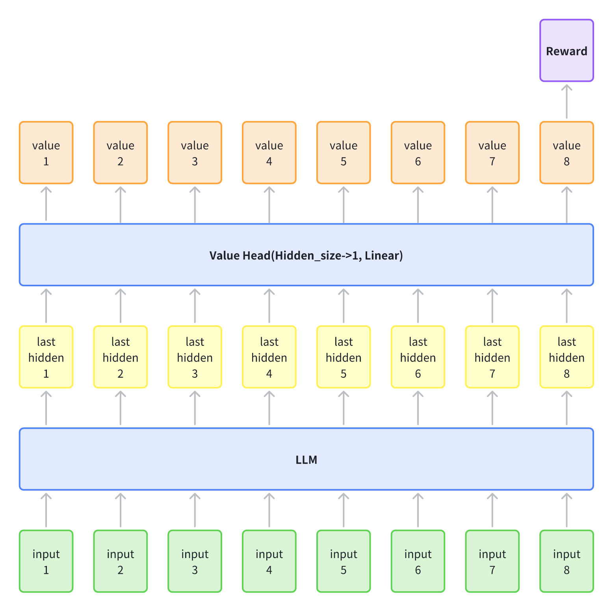

1. 如果你把 LLM 看作**单步决策**，聚合就是取**最终结果（Last/-1）**。
2. 如果你把 LLM 看作**多步决策**，且使用 Reward Model 打分，那么本质上你是在用 **Transformer 自动聚合** 整个序列的信息来得出一个分数。

**为什么要用代表整个句子的奖励值？因为偏好标签是句子级别的** ,当然到了PRM过程奖励模型的时候也会有中间过程的偏好标签(比如数学题解题步骤的对错)

#### **Reference Model**

PPO训练过程中，它的参数是冻结的，用来产生per-token 的KL约束项，**防止策略导致偏离SFT模型太远**

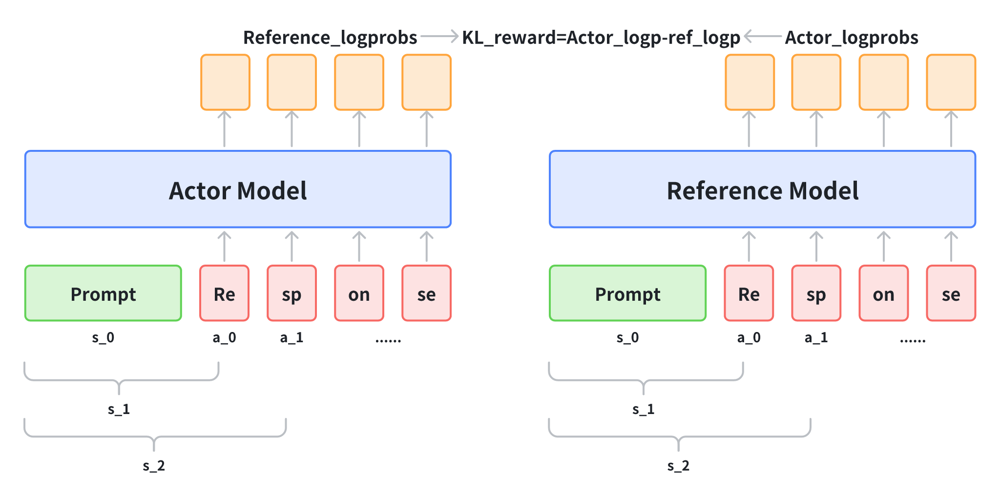

然后根据优化目标$$\max _\pi \mathbb{E}_{x \sim \mathcal{D}} \mathbb{E}_{y \sim \pi(y|x)} \left[ r(x, y) - \beta \log \frac{\pi(y|x)}{\pi_{\text{ref}}(y|x)} \right] \\$$，新的奖励可以写成 $$r(x,y)-\beta KL\_reward$$

所以新的t**oken-level reward** 可以表示成$$\left\{\begin{array}{l}
r_{t}=-\beta *\left(\log \frac{\pi\left(a_{t} \mid s_{t}\right)}{\pi_{r e f}\left(a_{t} \mid s_{t}\right)}\right), t \neq T \\
r_{t}=r(x,y) -\beta *\left(\log \frac{\pi\left(a_{t} \mid s_{t}\right)}{\pi_{r e f}\left(a_{t} \mid s_{t}\right)}\right), t=T
\end{array}\right.$$，其中$$T$$表示终止状态时间，也就是**句子末尾的token**，或者表示为$$r(s_t, a_t) = \textbf{I}(s_t =[\text{EOS}])r(x,y)-\beta \text{KL}(t)$$，具体如下图所示：

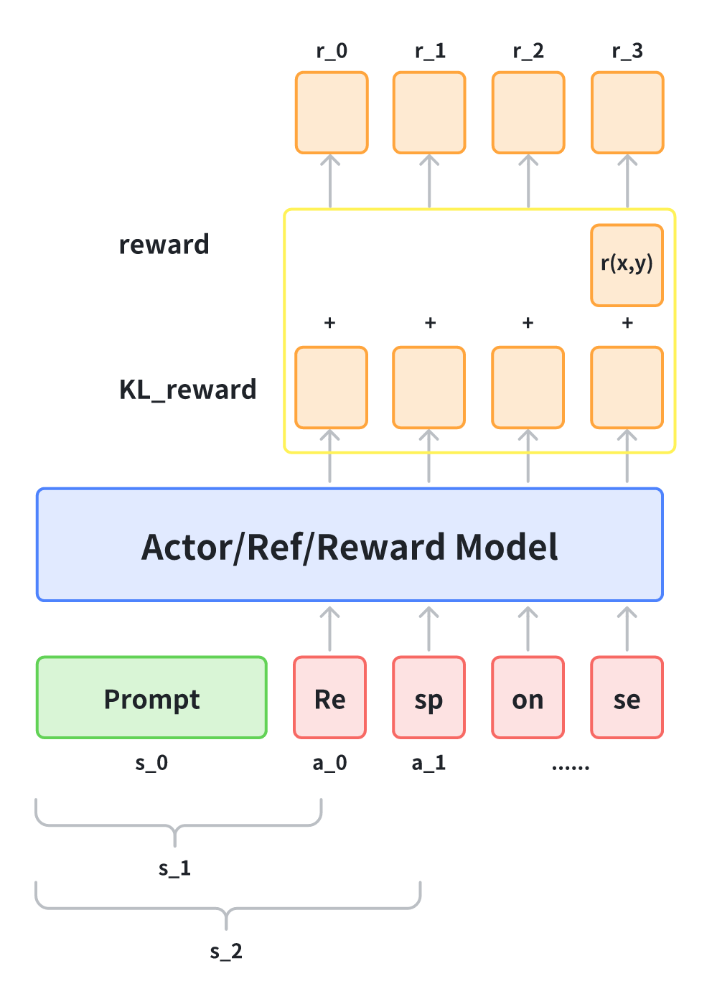


## **Online & Offline RLHF**

> **参考链接：https://www.zhihu.com/question/651021172/answer/3513159005**
>
> **Online和 Offline**也可以**回顾3.2.7章[ 3.2 RL 强化学习基础](https://kcnd4kn8i6ap.feishu.cn/wiki/Cz5YwDjdpiPbIFkiqWecXt0EnNb?fromScene=spaceOverview#share-QwGzdNFoxoeBOox3odmcUjhPnec)**
>
> - **Online 的核心思路就是：让模型自己做生成，我们根据模型生成结果的好坏来打分，用于指导模型进行更新**。Online 需要模型亲自输出答案，然后根据反馈学习；
> - **Offline 的方法：**&#x6A21;型不需要亲自输出答案，根据提前收集好的Offline数据集中的给定的「好坏样本」来进行模拟学习。Off Policy 的训练速度能够更快（只用forward看大量的样本来学习，不用generate），但非常依赖给定的数据是否和「模型自身能力」足够相近。最理想的效果就是，找到大量和你自身水平差不多的玩家的对局资料给你学习，这些训练样本的利用率才是最高的。反之，对于 Online 所有的训练样本都是模型自己生成的


## PPO Trick和问题

### 模型层面:

1. Token Level KL-Penalty: 引入一个“参考模型”,计算当前 PPO 模型输出的概率分布与 SFT 模型输出概率分布之间的 **KL 散度 , 强迫 PPO 模型不要离“初心”（SFT 模型学习到的人类语言规范）太远
2. GAE $\lambda=1$: GAE用于在 PPO 中估计逐个 token 的奖励 ,将 GAE 方法转变为蒙特卡洛估计方法,  
   $\lambda=1$ 可以减少由于 Value Model 估计不准带来的偏差，让模型更真实地依据最终结果来调整策略。
3.  Adding SFT Loss :  PPO 训练时，模型一门心思只想提高“回答问题的满意度”（Reward）, 会导致模型忘记最基本的语言能力 ,  变成了一个“偏科生 ,在 PPO 的 Loss 函数中，强行加回原始的语言建模 Loss ,**可以保留SFT模型的既有能力**

### PPO层面

PPO-ptx(Pretraining Mix):PPO-ptx就是在原本的PPO优化目标（带KL行为约束的最大化累积奖励）基础上，**增加了一项当前policy在pretrain数据集上的优化目标**，或者说加了在pertain数据集上的预训练loss，即ptx loss，**用于避免策略遗忘预训练阶段学习到的知识**：

$$\mathrm{objective}(\phi) = E_{(x,y)\sim D_{\pi_{\phi}^{\mathrm{RL}}}} \left[r_{\theta}(x,y) - \beta \log \left(\pi_{\phi}^{\mathrm{RL}}(y|x)/\pi^{\mathrm{SFT}}(y|x)\right)\right] +  \gamma E_{x\sim D_{\mathrm{pretrain}}} \left[\log(\pi_{\phi}^{\mathrm{RL}}(x))\right]$$

$$\gamma E_{x\sim D_{\mathrm{pretrain}}} \left[\log(\pi_{\phi}^{\mathrm{RL}}(x))\right]$$这部分介绍ptx添加的loss

目的是为了**减轻对齐税（Alignment Tax）**，即**RLHF 虽然有助于对齐人类偏好，但也可能导致模型在某些 NLP 基准上的性能下降**

对较小的模型来说，会有对齐税，但**对较大模型来说，对齐只有好处**，尤其是参数量在 13B 到 52B 之间的模型，**即只要模型够大，PPO 本身就能在 NLP 下游任务上带来对齐的好处**，他们还确定了强化学习策略训练中 KL 散度系数的最优参数为 β = 0.001

4. KL Reward：**&#x7B2C;二项的 KL reward前面有一个系数 beta，从实际训练的体验来说 beta的设置非常重要，可以有效避免策略走的太远（走太远容易导致策略过拟合和坍塌），这里beta的设定通常要结合target KL的设定，即我们可以通过实验确定KL变化多大模型的表现比较好，然后根据这个 target KL来决定 beta的大小，但是这种方式通常需要大量的实验比较。

   

5. **PTX Loss：**&#x6700;后一项是预训练的 Loss，同样这一项有一个系数 $$\gamma$$，InstructGPT 种将 $$\gamma$$设为 27.8，但在我的实验经历中，通常这一项应结合 policy loss 和 pretrain loss 的大小综合设定。在我的实验中，gamma < 1 模型才能比较好的收敛

6. **Reward Normalization：**&#x5728; RLHF 的训练&#x4E2D;**&#x20;reward normalization 非常有助于训练的稳定性**，毕竟我们的 reward 不像在游戏环境中那么规则，而是通过一个模型学出来的中间层输出（这就意味着输出范围可能会很大）

7. **Distributed Advantage Normalization：**&#x540C;&#x6837;**&#x20;Advantage Normalization 也是PPO训练中常用的稳定训练的技术**，我们在使用 DeepSpeed 等类似 DDP 的训练手段时应注意做全局样本的 Advantage Normalization，而不是某个DDP进程只针对自己的样本做归一化。这一点目前的 RLHF 开源框架都没有充分考虑进来

8. **Model Initialization：**&#x5177;体来说，用监督微调（SFT）模型初始化 Actor 模型，用奖励模型初始化 Critic 模型，以确保高效的PPO训练。也是一般默认的操作

9. **Adam Learning Rate：**&#x41;ctor model的Adam学习率大约是SFT模型学习率的十分之一。例如，在OpenRLHF中，SFT model的Adam学习率为5e−6，而actor model的学习率为5e−7。此外，评论者模型的Adam学习率大约是SFT model的两倍，一般设置学习率为9e−6

10. **Value Function Loss Clipping：**$$Loss_v = \max[(V_{\theta_t} - V_{targ})^2, (\text{clip}(V_{\theta_t}, V_{\theta_{t-1}} - \epsilon,  V_{\theta_{t-1}} + \epsilon) - V_{targ})^2]$$，这个在前面3.3.3章节中的代码部分已经涉及到了

11. **Advantage Normalization：**&#x5728;使用均方损失训练值网络的过程中，算法对一些大值敏感。标准化优势可以减轻这些大值的影响。实践中，我们还采用Z分数标准化方法，𝑟=(𝑟−𝜇)/𝛿，其中𝜇是一个批次样本的均值，𝛿是标准差

## **奖励利用和泛化问题**

持续在一个训练集合上做RL训练，发现train reward持续在涨，但是在测试集合上人**工测试效果会下跌**。总的来说，这是Reward hacking和Generalization问题导致的

- **Reward hacking问题：**&#x5F53;train reward在增长的时候，但reward model被hack了，因此看似train reward增长，但其实人工评估的时候效果在下降。
- **Generalization问题：**&#x5F53;train reward在增长的时候，假如test dataset的人工评估依然在上涨，那么reward hacking没有发生。此时此刻如果测试集合上效果却在下降，那么就是**模型overfit训练集合**，有泛化问题

## **SFT 与 RLHF 的本质区别**

### 分析

- **SFT优化目标**：给定prompt和对应output，最大化LLM策略 $$π_θ$$输出output中每个token的条件概率，**output是数据集带的**
- **RLHF优化目标**：PPO为例，可以简化为给定prompt目标为最大化优势 $$A_t$$，采以重要性采样比值 $$\frac{\pi_\theta(o_t|p,o_1,...,o_{t-1})}{\pi_{\theta_{old}}(o_t|p,o_1,...,o_{t-1})}$$，**output是 $$\pi_{\theta_{old}}$$采样得来**

**梯度公式**

$$\nabla_\theta J_{SFT}(\theta) = \mathbb{E}\left[\frac{1}{T}\sum_{t=1}^{T} \nabla_\theta \log \pi_\theta(o_t|p,o_1,...,o_{t-1})\right]$$

$$\nabla_\theta J_{PPO}(\theta) = \mathbb{E}\left[\frac{1}{T}\sum_{t=1}^{T} A_t \nabla_\theta \log \pi_\theta(o_t|p,o_1,...,o_{t-1})\right]$$

### 结论

- SFT本质上在进行**模仿学习**，且所有token对应的**梯度系数为1**，对策略优化的贡献相同
- RLHF-PPO本质上是在进行**探索和利用**，通过自身采样得到输出样本，然后**利用优势函数评判当前动作相对平均动作的价值,调整策略优化的方向和幅度**，优势的正负代表方向，绝对值代表幅度，梯度系数为$$A_t$$

##### **RLAIF 基于AI反馈的强化学习**

> 基于AI反馈（RLAIF）的强化学习，通过使用LLM来生成反馈信号来扩展RLHF范式。这种方法可以补充或替代人类反馈，在**人类标注稀缺、昂贵或不一致**的任务中提供更可扩展的低成本偏好数据

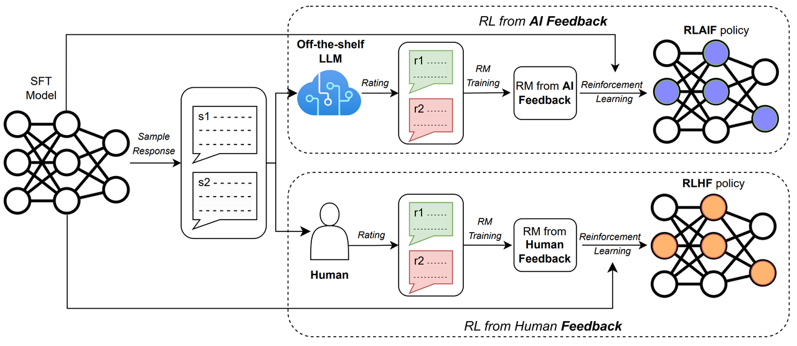

> 大规模应用RLHF的主要挑战在于**RLHF依赖人类生成的偏好标签**，这需要大量资源。标注数据的过程既**时间密集型又昂贵**，并且人类评估人员可能会引入**不一致**的地方。这些约束大大限制了RLHF的可扩展性和效率。RLAIF 利用LLM作为反馈的来源，减少了对人类标注的依赖，提供了传统RLHF的可行替代方案。这种方法可实现连续的反馈生成，可显著提高可扩展性，同时保留人类引导模型优化的灵活性
>
> **RLHF和RLAIF之间的关键区别在于反馈的来源：RLHF取决于人类生成的偏好，而RLAIF使用AI生成的反馈来指导策略更新**。RLAIF可以实现与RLHF相当甚至优于RLHF的性能（**其实现在大部分偏好标签都会通过蒸馏GPT、Claude、Gemini等强模型来生成**）
>
> **AI feedback collect：**&#x4C;LM基于预先定义的标准（Prompt）生成**反馈标签**，标准可以包括**特定于任务的指标、response的长度等**

## GRPO

可以节省critic模型 , 大大节约显存, 节省的显存可以用于增大generate_batch_size , 降低平均分数的方差

常用的便是用优势函数Advantage来指导，**优势函数原始定义为 $$A_t = Q(s_t,a_t)-V(s_t)$$即当前动作的价值比平均动作价值高出的部分 **

#### GRPO的优势函数估计

GRPO通过**对相同问题 $$q$$用 $$\pi_{\theta_{old}}$$采样的多个一组输出 $$\{o_1, o_2, \ldots, o_G\}$$，然后Reward model对这些回答都给出奖励值**，然后给出优势函数的估计 , 公式如下

$$\hat{A}_i = \frac{r_i - \text{Mean}(\mathbf{r})}{\text{Std}(\mathbf{r}) + \epsilon}$$ ,**这就是对采样的这一组输出的奖励计算归一化奖励作为输出的优势函数，同时赋值给输出中每一个token作为该token处的优势函数。简单理解就是当前第$$i$$个输出的奖励 $$r_i(q,o_i)$$比所有输出的奖励平均值高出的优势（可以为负）**

用 $$r_i(q,o_i)$$估计 $$Q(q,o_i)$$，用 $$\text{mean}(\bold{r})=\frac{1}{G}\sum_i^G r(q,o_i)$$来估计 $$V(q)$$是合理的，前提是group采样足够多，然后得到优势函数的估计 $$A(q,o_i)=Q(q,o_i)-V(q)$$。除以 $$\text{std}(\bold{r})$$是为了归一化

但是这样得到的优势是整个 $$(q,o_i)$$的优势值，**GRPO在这里则将整个优势值用在了输出$$o_i$$每一个的每一个token上（广播broadcast操作）**，相当于当前policy去更新输出 $$o_i$$中每一个token的条件输出概率 $$\pi_\theta(a_t|s_t)$$的**更新幅度和方向是一致的**

 奖励是针对**整句话**的（比如 +10 分），但模型参数更新是针对**每个字（Token）**的。我怎么知道这句话里哪个字写得好:  **这句话中所有 Token 的出现概率都会被同幅度、同方向地提高** 虽然简单粗暴,但平均下来确实会让好的token出现概率提升

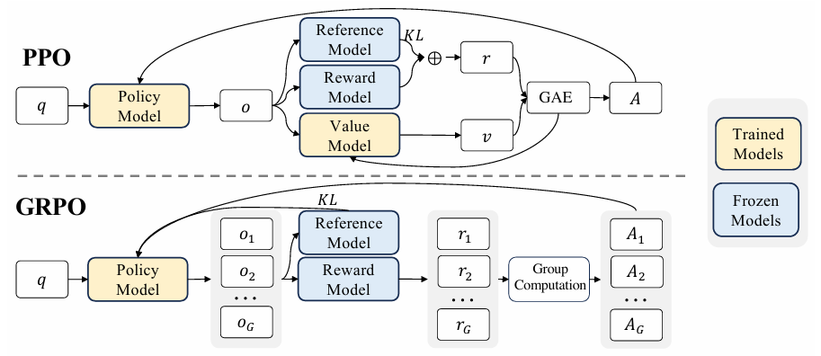


### ORM 结果奖励监督RL

**即使用传统的ORM（Outcome Reward Model）来进行强化学习过程，针对这种情况，模型对一组输出生成一组奖励值 $$\bold{r}=\{r_1, r_2,\cdots,r_G\}$$，然后通过下式对优势函数进行估计：**

**$$\hat{A}_{i,t}=\hat{r_i}=\frac{r_i-\text{mean}(\bold{r})}{\text{std}(\bold{r})}$$**

**上述式子就是对采样的这一组输出的奖励计算归一化奖励作为输出的优势函数，同时赋值给输出中每一个token作为该token处的优势函数。简单理解就是当前第$$i$$个输出的奖励 $$r_i(q,o_i)$$比所有输出的奖励平均值高出的优势（可以为负）**

#### **为什么可以这么做？**

回顾强化学习中价值函数的定义为回报（折扣累积奖励）的期望：

在**结果奖励监督RL**的设定下，就是从问题$$q$$到输出 $$o$$，状态是 $$q$$，动作是 $$o$$，**只有一步奖励**即 $$r(q,o)$$，所以价值函数可以进一步写成：

$$ V(s) = \mathbb{E}_\pi[R_t|s_t=s]$$

$$Q(s,a)=\mathbb{E}_\pi[R_t|s_t=s,a_t=a]=R(s,a)$$

所以用 $$r_i(q,o_i)$$估计 $$Q(q,o_i)$$，用 $$\text{mean}(\bold{r})=\frac{1}{G}\sum_i^G r(q,o_i)$$来估计 $$V(q)$$是合理的，前提是group采样足够多，然后得到优势函数的估计 $$A(q,o_i)=Q(q,o_i)-V(q)$$。除以 $$\text{std}(\bold{r})$$是为了归一化

但是这样得到的优势是整个 $$(q,o_i)$$的优势值，**GRPO在这里则将整个优势值用在了输出$$o_i$$每一个的每一个token上（广播broadcast操作）**，相当于当前policy去更新输出 $$o_i$$中每一个token的条件输出概率 $$\pi_\theta(a_t|s_t)$$的**更新幅度和方向是一致的**

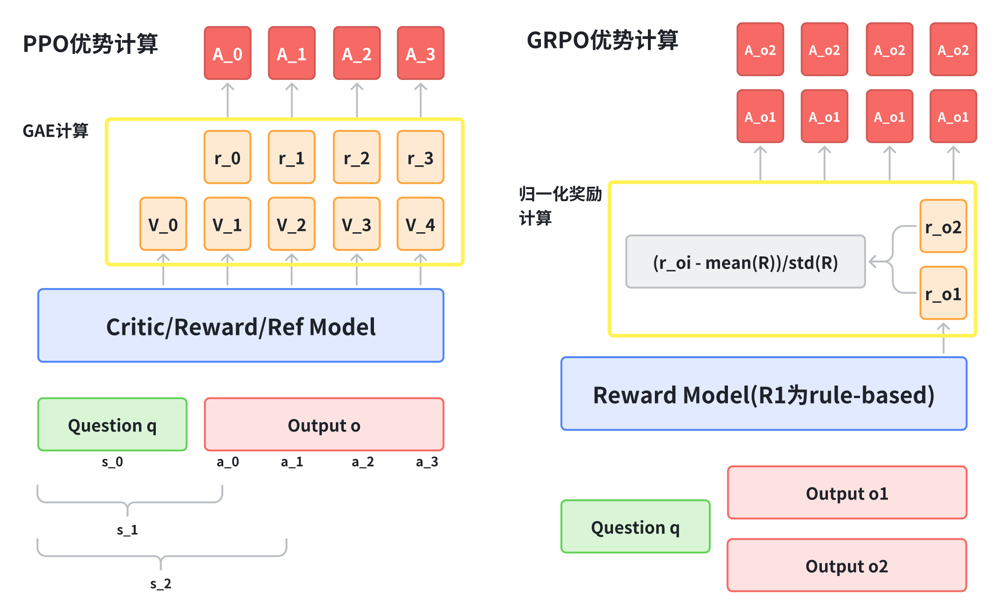

### PRM 过程奖励监督RL

使用PRM来进行强化学习，同样采样group输出，对应的一组奖励值为 :
$$
\mathbf{R}=\left\{\left\{r_{1}^{\mathrm{index}(1)},\cdots,r_{1}^{\mathrm{index}(K_1)}\right\},\cdots,\left\{r_{G}^{\mathrm{index}(1)},\cdots,r_{G}^{\mathrm{index}(K_G)}\right\}\right\}
$$
其中 $$index(j)$$为第 $$j$$个步骤的 end token的index， $$K_i$$是第 $$i$$个输出的步骤个数，GRPO计算优势如下：

$$\hat{A}_{i,t}=\sum_{\mathrm{index}(j)\geq t} \widetilde{r}_{i}^{\mathrm{index}(j)} =\sum_{\mathrm{index}(j)\geq t} \frac{{r}_{i}^{\mathrm{index}(j)}-\text{mean}(\bold{r})}{\text{std}(\bold{r})}$$

GRPO 中的 PRM 处理逻辑其实就是两步走：

1. **横向比较  $$\widetilde{r}_{i}^{\mathrm{index}(j)} = \frac{{r}_{i}^{\mathrm{index}(j)}-\text{mean}(\bold{r})}{\text{std}(\bold{r})}$$ （Normalization）：** 先看你在同伴中排老几。把每一步的原始分变成相对分（`rh`）。这是为了消除题目难度的影响。
2. **纵向累加  $\sum$ （Aggregation/Summation）：** 再看你的长远贡献。每一个步骤的最终优势（`A`），等于它**这一刻的相对分**加上**未来所有时刻的相对分**。这是为了符合强化学习“回报（Return）”的定义，确保模型有长远眼光。


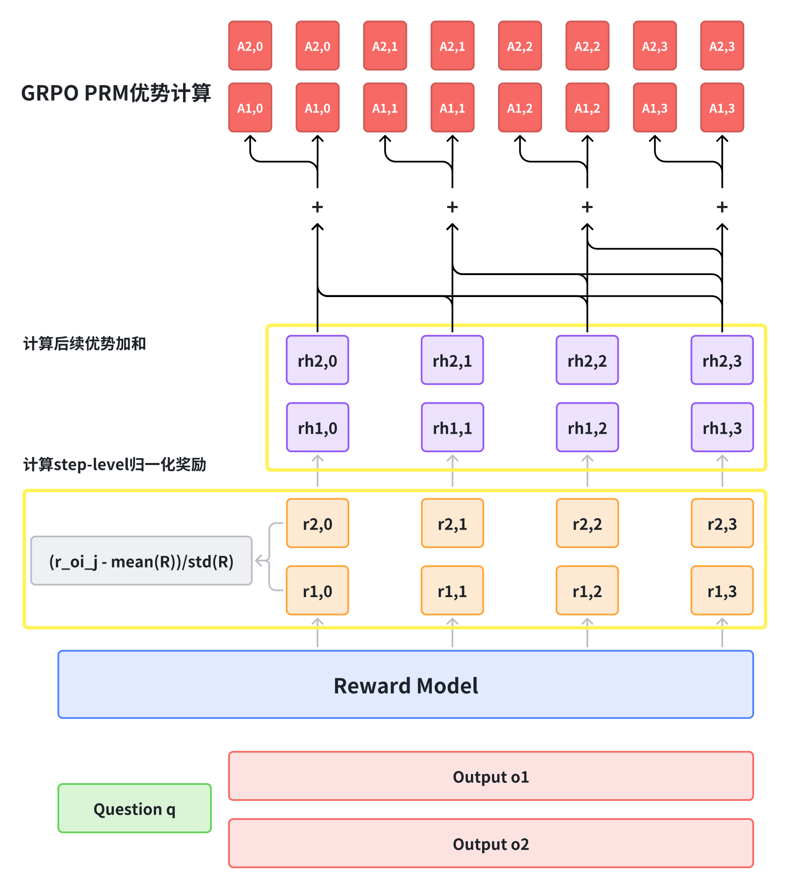


最后不管是ORM还是PRM进行强化学习，都用下式进行策略更新：

主体依然是 PPO 的形式：`min(ratio * A, clip(ratio) * A)`,使用clip防止过大更新 , 
 根据你是用 ORM 还是 PRM，代入上面不同的 $A$ 计算方法(ORM PRM)
KL 散度采用了一个**无偏估计等式**:$$D_{KL} = \frac{\pi_{ref}}{\pi} - \log \frac{\pi_{ref}}{\pi} - 1$$  ,[Schulman 近似的KL散度]([近似 KL 散度 --- Approximating KL Divergence](http://joschu.net/blog/kl-approx.html)),计算量低,始终非负且凸,方差更小 ; 且和PPO   $R = R_{raw} - \beta \log(\pi/\pi_{ref})$   不同 ,
GRPO的 KL 作为一个独立的正则项减在 Loss 后面(而不是reward的一部分) ,

1. 如果放在奖励R里面,由于$A = \frac{R - \text{Mean}}{\text{Std}}$ , 会掩盖KL偏离(哪怕KL偏离很大,也因为正则化消去)

2. GRPO **没有 Critic**。它不需要预测未来价值。因此，不需要费尽心机地把 KL 塞进奖励里让 Critic 去学。直接在更新梯度的 Loss 阶段加上 KL 正则项，是最直接、最高效的手段。

3. 将这个严格非负的数学项直接作为 Loss 的一部分，在数学性质上比“在奖励里减去一个可能是负数的 $\log p - \log q$”更加稳定（参考之前的讨论，直接采样的 KL 可能为负，导致奖励变成正向激励）。

   把它放在 Loss 端，作为一个明确的优化目标（Minimization Objective），比作为奖励信号（Reward Signal）更容易控制优化的幅度。


$$
\mathcal{J}_{GRPO}(\theta)=\mathbb{E}[q\sim P(Q),\{o_i\}_{i = 1}^{G}\sim\pi_{\theta_{old}}(O|q)]\\
\quad\quad\frac{1}{G}\sum_{i = 1}^{G}\frac{1}{|o_i|}\sum_{t = 1}^{|o_i|}\left\{\min\left[\frac{\pi_{\theta}(o_{i,t}|q,o_{i,<t})}{\pi_{\theta_{old}}(o_{i,t}|q,o_{i,<t})}\hat{A}_{i,t},\mathrm{clip}\left(\frac{\pi_{\theta}(o_{i,t}|q,o_{i,<t})}{\pi_{\theta_{old}}(o_{i,t}|q,o_{i,<t})},1 - \varepsilon,1+\varepsilon\right)\hat{A}_{i,t}\right]-\beta\mathbb{D}_{KL}[\pi_{\theta}||\pi_{ref}]\right\}
$$

$$
\text{GRPO}:\quad
\mathbb{D}_{KL}[\pi_{\theta}||\pi_{ref}]=\frac{\pi_{ref}(o_{i,t}|q,o_{i,<t})}{\pi_{\theta}(o_{i,t}|q,o_{i,<t})}-\log\frac{\pi_{ref}(o_{i,t}|q,o_{i,<t})}{\pi_{\theta}(o_{i,t}|q,o_{i,<t})}-1
$$

$$
\text{PPO}:\quad
r_t = r_{\varphi}(q, o_{\leq t}) - \beta \log \frac{\pi_{\theta}(o_t|q, o_{<t})}{\pi_{ref}(o_t|q, o_{<t})}
$$
下面是trl中的grpo代码 , 参考理解一下

```python
def compute_loss(self, model, inputs, return_outputs=False, num_items_in_batch=None):
    if return_outputs:
        raise ValueError("The GRPOTrainer does not support returning outputs")
    # 计算模型的每个 token 的对数概率

    prompt_ids, prompt_mask = inputs["prompt_ids"], inputs["prompt_mask"]
    completion_ids, completion_mask = inputs["completion_ids"], inputs["completion_mask"]
    input_ids = torch.cat([prompt_ids, completion_ids], dim=1)
    attention_mask = torch.cat([prompt_mask, completion_mask], dim=1)
    logits_to_keep = completion_ids.size(1)  # 我们只需要计算生成部分（completion）token 的 logits

    per_token_logps = self._get_per_token_logps(model, input_ids, attention_mask, logits_to_keep)

    # 计算模型与参考模型之间的 KL 散度
	# Schulman 近似的KL散度,计算量低,始终非负且凸,方差更小
    ref_per_token_logps = inputs["ref_per_token_logps"]
    per_token_kl = torch.exp(ref_per_token_logps - per_token_logps) - (ref_per_token_logps - per_token_logps) - 1

    # x - x.detach() 允许保留来自 x 的梯度
    advantages = inputs["advantages"]
    per_token_loss = torch.exp(per_token_logps - per_token_logps.detach()) * advantages.unsqueeze(1)
    per_token_loss = -(per_token_loss - self.beta * per_token_kl)
    loss = ((per_token_loss * completion_mask).sum(dim=1) / completion_mask.sum(dim=1)).mean()

    # 记录指标
    completion_length = self.accelerator.gather_for_metrics(completion_mask.sum(1)).float().mean().item()
    self._metrics["completion_length"].append(completion_length)

    mean_kl = ((per_token_kl * completion_mask).sum(dim=1) / completion_mask.sum(dim=1)).mean()
    self._metrics["kl"].append(self.accelerator.gather_for_metrics(mean_kl).mean().item())

    return loss
    
def _get_per_token_logps(self, model, input_ids, attention_mask, logits_to_keep):
    # 我们在 `logits_to_keep` 上加 1，因为序列的最后一个 logit 稍后会被排除
    logits = model(
        input_ids=input_ids, attention_mask=attention_mask, logits_to_keep=logits_to_keep + 1
    ).logits  # (批大小, 长度, 词表大小)
    logits = logits[:, :-1, :]  # (B, L-1, V), 排除最后一个 logit：它对应于下一个 token 的预测

    # 计算输入 token 的对数概率。使用循环以降低内存峰值。
    per_token_logps = []
    for logits_row, input_ids_row in zip(logits, input_ids[:, -logits_to_keep:]):
        log_probs = logits_row.log_softmax(dim=-1)
        token_log_prob = torch.gather(log_probs, dim=1, index=input_ids_row.unsqueeze(1)).squeeze(1)
        per_token_logps.append(token_log_prob)
    return torch.stack(per_token_logps)

def _prepare_inputs(self, inputs: dict[str, Union[torch.Tensor, Any]]) -> dict[str, Union[torch.Tensor, Any]]:
    device = self.accelerator.device
    prompts = [x["prompt"] for x in inputs]
    prompts_text = [maybe_apply_chat_template(example, self.processing_class)["prompt"] for example in inputs]
    prompt_inputs = self.processing_class(
        prompts_text, return_tensors="pt", padding=True, padding_side="left", add_special_tokens=False
    )
    prompt_inputs = super()._prepare_inputs(prompt_inputs)
    prompt_ids, prompt_mask = prompt_inputs["input_ids"], prompt_inputs["attention_mask"]

    if self.max_prompt_length is not None:
        prompt_ids = prompt_ids[:, -self.max_prompt_length :]
        prompt_mask = prompt_mask[:, -self.max_prompt_length :]
        
    # 组采样:对每个prompt生成n个回复
    with unwrap_model_for_generation(self.model, self.accelerator) as unwrapped_model:
        prompt_completion_ids = unwrapped_model.generate(
            prompt_ids, attention_mask=prompt_mask, generation_config=self.generation_config
        )

    # 计算提示长度并提取 completion ids
    prompt_length = prompt_ids.size(1)
    prompt_ids = prompt_completion_ids[:, :prompt_length]
    completion_ids = prompt_completion_ids[:, prompt_length:]
    prompt_mask = prompt_mask.repeat_interleave(self.num_generations, dim=0)

    # 屏蔽第一个 EOS token 之后的所有内容
    is_eos = completion_ids == self.processing_class.eos_token_id
    eos_idx = torch.full((is_eos.size(0),), is_eos.size(1), dtype=torch.long, device=device)
    eos_idx[is_eos.any(dim=1)] = is_eos.int().argmax(dim=1)[is_eos.any(dim=1)]
    sequence_indices = torch.arange(is_eos.size(1), device=device).expand(is_eos.size(0), -1)
    completion_mask = (sequence_indices <= eos_idx.unsqueeze(1)).int()

    # 将 prompt_mask 与 completion_mask 拼接用于 logit 计算
    attention_mask = torch.cat([prompt_mask, completion_mask], dim=1)  # (B*G, P+C)

    logits_to_keep = completion_ids.size(1)  # 我们只需要计算 completion tokens 的 logits

    with torch.inference_mode():
        ref_per_token_logps = self._get_per_token_logps(
            self.ref_model, prompt_completion_ids, attention_mask, logits_to_keep
        )
    # 解码生成的 completions
    completions = self.processing_class.batch_decode(completion_ids, skip_special_tokens=True)
    if is_conversational(inputs[0]):
        completions = [[{"role": "assistant", "content": completion}] for completion in completions]

    # 计算奖励
    prompts = [prompt for prompt in prompts for _ in range(self.num_generations)]  # 重复 prompts

    rewards_per_func = torch.zeros(len(prompts), len(self.reward_funcs), device=device)
    for i, (reward_func, reward_processing_class) in enumerate(
        zip(self.reward_funcs, self.reward_processing_classes)
    ):
        if isinstance(reward_func, nn.Module):  # 使用 Module 而不是 PretrainedModel 以兼容编译模型
            if is_conversational(inputs[0]):
                messages = [{"messages": p + c} for p, c in zip(prompts, completions)]
                texts = [apply_chat_template(x, reward_processing_class)["text"] for x in messages]
            else:
                texts = [p + c for p, c in zip(prompts, completions)]
            reward_inputs = reward_processing_class(
                texts, return_tensors="pt", padding=True, padding_side="right", add_special_tokens=False
            )
            reward_inputs = super()._prepare_inputs(reward_inputs)
            with torch.inference_mode():
                rewards_per_func[:, i] = reward_func(**reward_inputs).logits[:, 0]  # Shape (B*G,)
        else:
            # 重复所有输入列（除了 "prompt" 和 "completion"）以匹配生成数量
            reward_kwargs = {key: [] for key in inputs[0].keys() if key not in ["prompt", "completion"]}
            for key in reward_kwargs:
                for example in inputs:
                    # Repeat each value in the column for `num_generations` times
                    reward_kwargs[key].extend([example[key]] * self.num_generations)
            output_reward_func = reward_func(prompts=prompts, completions=completions, **reward_kwargs)
            rewards_per_func[:, i] = torch.tensor(output_reward_func, dtype=torch.float32, device=device)

    # 对所有奖励函数的奖励求和
    rewards = rewards_per_func.sum(dim=1)

    # 计算组内奖励
    mean_grouped_rewards = rewards.view(-1, self.num_generations).mean(dim=1)
    std_grouped_rewards = rewards.view(-1, self.num_generations).std(dim=1)

    # 归一化奖励以计算优势
    mean_grouped_rewards = mean_grouped_rewards.repeat_interleave(self.num_generations, dim=0)
    std_grouped_rewards = std_grouped_rewards.repeat_interleave(self.num_generations, dim=0)
    advantages = (rewards - mean_grouped_rewards) / (std_grouped_rewards + 1e-4)
   
    return {"prompt_ids": prompt_ids,"prompt_mask": prompt_mask,"completion_ids": completion_ids,"completion_mask": completion_mask,"ref_per_token_logps": ref_per_token_logps,
        "advantages": advantages,
    }
```

#### GRPO实际训练中的问题及解法

LLM通过GRPO 这种 On-Policy 方法进行RL训练时，普遍存在Policy Collapse问题，即策略熵急剧下降。这一现象直接导致模型生成内容的探索性丧失和多样性不足，最终表现为**大量重复或模式化的输出**。具体表现来说，可能有下面两种情况：

**Entropy Collapse**：GRPO通常采用 Critic-Free设计，使其策略梯度对长序列任务中**高方差、稀疏的奖励信号极其敏感**。策略为规避这种不确定性，会倾向于快速收缩至低熵、高确定性的模式，即策略熵单调递减。 

**Reward Hacking**：**重复性内容**是模型最大化RM评分的一种**低成本作弊策略**。若 RM 隐性地将回复长度或冗余信息与高奖励关联，GRPO将精确遵循此信号，鼓励模型生成重复且更长的文本。

**其他可能的原因**：在做RLVR时，标注者倾向选择常见答案，这会加剧模式坍塌，即使奖励模型完美也无法消除。该偏差在最优策略中表现为对常见模式的“温度锐化”，促使模型输出向偏好的单一模式收敛。

| **解法**        | **核心机制**         | **主要解决的问题**                              |
| --------------- | -------------------- | ----------------------------------------------- |
| **1. AEPO**     | 温度调整 + 梯度重构  | 🛑 **彻底根治 Entropy Collapse** (不让熵掉下来)  |
| **2. Clip-Cov** | Token级裁剪高协方差  | 🔄 **缓解 Reward Hacking** (特别是 Token 级重复) |
| **3. PF-PPO**   | 策略过滤低信噪比样本 | 📉 **防止过拟合导致的 Hacking 和 Collapse**      |
| **4. 调参**     | 温度/KL/Clip         | ⚖️ **平衡探索与利用** (综合治理)                 |

# RLHF-PPO的缺点**

- **两阶段训练带来的信息损失：**LHF的过程是先利用偏好数据训练一个奖励函数模型，然后再用PPO或者其他强化学习算法训练最后的策略。这个过程中如果**奖励函数模型学习存在偏差**，比如奖励实际上并没有和人类偏好对齐的很好，那么后续的强化学习过程也会导致策略陷入次优
- **PPO算法带来的额外训练资源需求：**强化学习的训练会伴随着探索和利用（explore and exploit）的过程，一般会较不稳定，PPO算法在工程实现上利用了很多trick去保障训练的稳定和收敛。但是**<span style="color: inherit; background-color: rgba(255,246,122,0.8)">PPO仍然引入了Actor、Critic、Reward和Reference四个模型</span>**，在传统强化学习环境中，Actor和Critic以及Reference都是简单的网络实现，reward是环境自带的人为设计好的，所以并不存在大规模的资源需求，而到了LLM这里，所有的模型都是基于LLM（SFT）模型初始化或者改进的，那么即使在PPO训练过程中只有Actor和Critic需要更新参数，四个模型的推理和训练就需要大量的计算资源，以及四个模型也会带来更多的累积误差


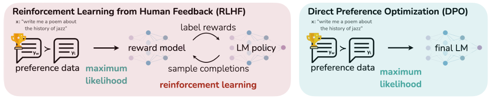

## [DPO]([arxiv.org/pdf/2305.18290](https://arxiv.org/pdf/2305.18290))

虽然DPO不是RL方法,它优化了RL部分(把actor部分优化了)

#### DPO公式

RLHF 的标准目标函数：

$$\max _\pi \mathbb{E}_{x \sim \mathcal{D}, y \sim \pi} [r(x, y)] - \beta D_{\text{KL}} [\pi(y|x) \| \pi_{\text{ref}}(y|x)]$$

这个公式的意思是：我们希望训练一个策略 $\pi$，使其生成的回答 $y$ 能获得**最高的奖励 $r$**（符合人类偏好），同时**不能偏离**原始模型 $\pi_{\text{ref}}$ 太多

经过(取负号将 $\max$ 变为 $\min$，将 $r$ 放入 $\log$ 中等)变换 , 目标函数重写为：

$$\min _\pi \mathbb{E}_{x \sim \mathcal{D}} \mathbb{E}_{y \sim \pi(y|x)} \left[ \log \frac{ \pi(y|x) }{\frac{1}{Z(x)} \pi_{\text{ref}}(y|x)\exp \left( \frac{1}{\beta} r(x, y) \right)} - \log Z(x) \right]$$ ,$\pi_{\text{ref}} \cdot \exp(r)$ 这一项积分不等于 1，不是一个合法的概率分布。除以归一化因子 $Z(x)$ 后，它就变成了一个合法的概率分布

定义一个理想的策略 $\pi^*$：$$\pi^*(y|x) = \frac{1}{Z(x)} \pi_{\text{ref}}(y|x) \exp \left( \frac{1}{\beta} r(x, y) \right)$$

最优策略 $\pi^*$ 其实就是“原始模型 $\pi_{\text{ref}}$”加上“奖励信号 $r$”的加权修正

跟据$\pi^*$的定义式 , 推理得$$r^*(x, y) = \beta \log \frac{\pi^*(y|x)}{\pi_{\text{ref}}(y|x)} + \beta \log Z(x)$$ 把奖励函数 $r(x,y)$，转化为了“**当前策略”和“参考策略”的比**。

Bradley-Terry 模型（用于判断 $y_1$ 比 $y_2$ 好的概率）
$$p(y_1 \succ y_2 | x) = \sigma(r(x, y_1) - r(x, y_2))$$
将第三步推导出的 $r^*(x, y)$ 代入：有

$$r(x, y_1) - r(x, y_2) = \left( \beta \log \frac{\pi^*(y_1|x)}{\pi_{\text{ref}}(y_1|x)} + \beta \log Z(x) \right) - \left( \beta \log \frac{\pi^*(y_2|x)}{\pi_{\text{ref}}(y_2|x)} + \beta \log Z(x) \right)$$

由于 $Z(x)$ 只和 Prompt $x$ 有关，和具体的回答 $y$ 无关，所以在相减的过程中，**$\beta \log Z(x)$ 这一项直接抵消（Cancel out）了**

$$r(x, y_1) - r(x, y_2) = \beta \log \frac{\pi^*(y_1|x)}{\pi_{\text{ref}}(y_1|x)} - \beta \log \frac{\pi^*(y_2|x)}{\pi_{\text{ref}}(y_2|x)}$$ 从而有
$$\mathcal{L}_{\text{DPO}}(\pi_{\theta}, \pi_{\text{ref}}) = - \mathbb{E}_{(x, y_w, y_l) \sim \mathcal{D}} \left[ \log \sigma \left( \beta \log \frac{\pi_{\theta}(y_w | x)}{\pi_{\text{ref}}(y_w | x)} - \beta \log \frac{\pi_{\theta}(y_l | x)}{\pi_{\text{ref}}(y_l | x)} \right) \right]$$

- **Policy to optimize ($\pi_\theta$)**: 当前正在训练的模型。
- **Reference policy ($\pi_{\text{ref}}$)**: 参考模型（通常是 SFT 之后的原始模型，训练过程中参数冻结不变）。它的作用是防止训练后的模型偏离原始分布太远（起到 KL 散度约束的作用）。
- **Aggregation over preference data**: 表示我们在人类偏好数据集 $\mathcal{D}$ 上计算期望，数据包含提示词 $x$、被选中的回答 $y_w$ (winner/chosen) 和被拒绝的回答 $y_l$ (loser/rejected)。
- **Shift in preferred/dispreferred completion**:
  - 公式的核心在于比较 **“选中回答”的隐式奖励** 和 **“拒绝回答”的隐式奖励**。
  - $\log \frac{\pi_\theta(y | x)}{\pi_{\text{ref}}(y | x)}$ 这一项其实代表了模型相对于参考模型对某个回答的“信心提升程度”。
- **Logistic function ($\sigma$)**: Sigmoid 函数，将数值映射到 (0, 1) 之间，用于计算概率。

**去除了复杂的 PPO：** 由于没有了显式的 Reward 模型，我们不需要 Critic，不需要 GAE 估计，不需要处理复杂的强化学习采样循环。训练过程变成了类似“加权交叉熵”的监督学习，极其稳定。

**隐式奖励的直观理解：** DPO Loss 实际上在鼓励模型：对于由 $x$ 生成的 $y$，如果它是优选答案 ($y_w$)，就**提高**它的概率（相对于 $\pi_{\text{ref}}$）；如果是劣选答案 ($y_l$)，就**降低**它的概率。$\beta$ 参数控制了这种奖励/惩罚的力度。

下面两张图是DPO的流程图

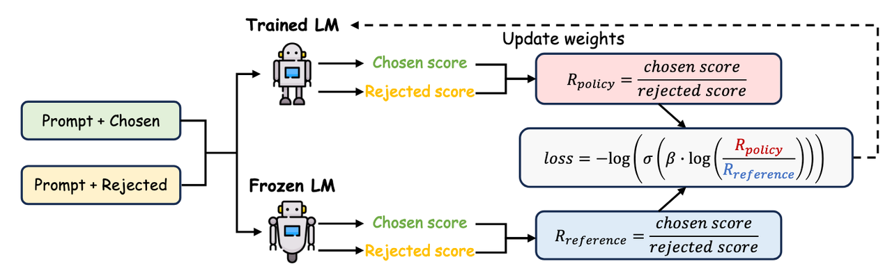

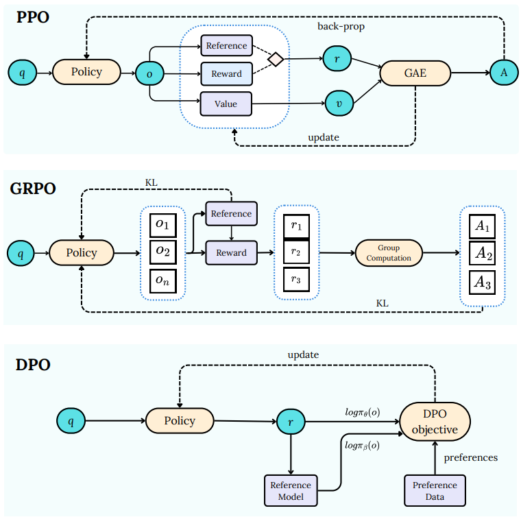

**微调流程图**


DPO Loss:DPO 本质上像是一种对比学习,希望拉大“好回答”和“坏回答”之间的概率差值,实践中可能会出现 `Chosen` 和 `Reject` 的概率**都下降**的情况。这没关系，只要 `Reject` 下降得比 `Chosen` 更厉害，差值变大了，Loss 依然会降低，模型依然在学习区分好坏

为了防止模型“为了降低 Loss 而把所有生成概率都降得很低”，有些后续工作会加入 NLL Loss（负对数似然损失）来辅助，强制模型保持一定的生成能力

#### DPO 的工作流

**输入成对的偏好数据 -> 同时经过当前模型和参考模型 -> 计算对数概率比值 -> 通过 Loss 函数拉大好坏回答的差距**

[dpoLoss代码](code\dpo_loss.py)


TODO

ReMax往后先放一放

DPO代码往后的部分先略过