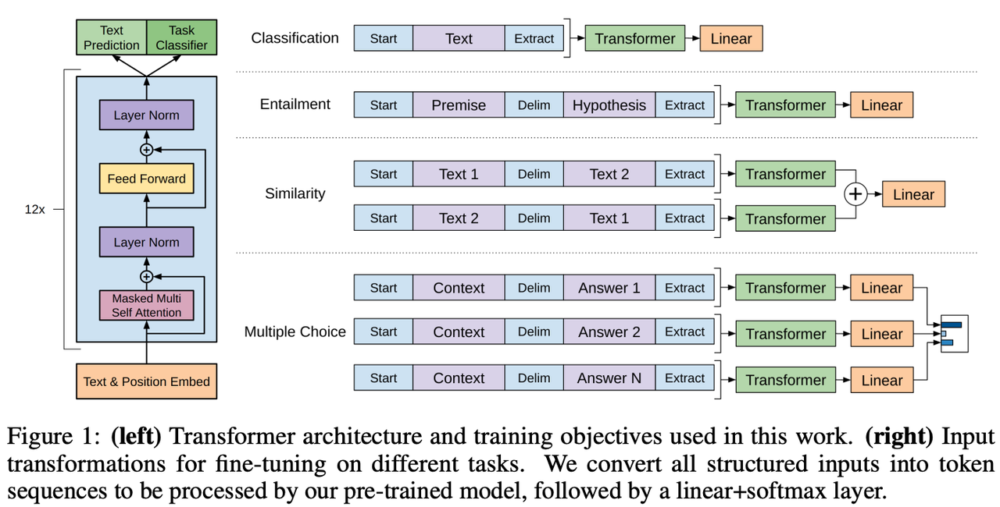
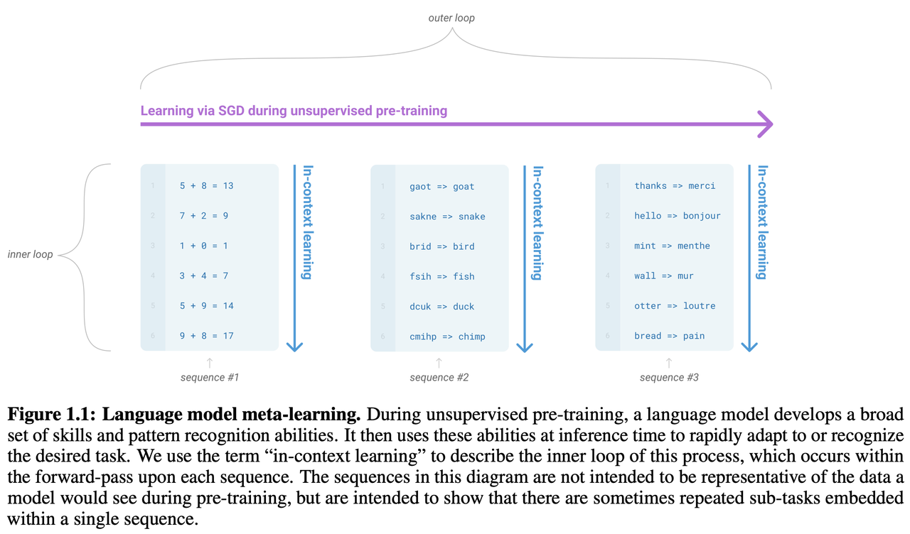

# GPT1

**Transformer decoder-only** 12层，具体细节跟transformer一样，但是位置编码是可训练的。原transformer的decoder包含2个attention：cross-attention(k,v来自encoder，q来自decoder)，mask multi-head attention。gpt只用了mask multi-head attention

## 训练范式

**自监督预训练 + 有监督fine-tune**  **主要思想是无监督学习**

- **预训练的标准语言模型目标函数**，根据前面K个词预测下一个词

$$  L_1(\boldsymbol{u}) = \sum_{i} \log P(u_i|u_{i - k}, \ldots, u_{i - 1}; \Theta)  $$

- 微调的目标函数：**&#x7528;的是完整的输入序列加标签，有监督目标函数加无监督的目标函数，y是标签，**加入无监督目标函数的作用：1. 增加SFT模型的泛化性，2. 加速收敛**

$$  L_2(C) = \sum_{(x,y)} \log P(y|x^1, \ldots, x^m) \\
L_3(C) = L_2(C) + \lambda * L_1(C)  $$

- 改变输入形式【通过在序列前后添加 \[Start] 和 \[Extract] **特殊标识符来表示开始和结束**，序列之间添加必要的 \[Delim] 标识符来**表示分隔**】，接上对应下游任务的层，就可实现不同下游任务。【**注：利用最后一层的最后一个token的输出，接下游层即可完成各类任务** (class token)
- 

# GPT2

### **模型结构**

与GPT1基本一致，但**post-norm改为pre-norm，输入序列512改为1024，48层**

### 训练范式

预训练 + zero-shot  **主要思想是多任务学习**

- 学习目标是**使用无监督的预训练模型做有监督的任务。**基于上面的思想，当一个**语言模型的容量足够大时，它就足以覆盖所有的有监督任务，也就是说所有的有监督学习都是无监督语言模型的一个子集**。
- GPT-2可以在**zero-shot**设定下实现下游任务，即**不需要用有标签的数据再微调**训练
- 为实现zero-shot，下游任务的输入就不能像GPT那样在构造输入时加入开始、中间和结束的特殊字符，这些是模型在预训练时没有见过的，而是**应该和预训练模型看到的文本一样**，更像一个自然语言
- 可以**通过做prompt的方式来zero-shot**。例如机器翻译和阅读理解，可以把输入构造成，“请将下面的一段英语翻译成法语，英语，法语”

### 与GPT-1的区别

- 模型结构上，**layer-norm的位置**有所调整；**参数初始化的方式**有所改变
- 数据量增大
- gpt2最大模型为15亿参数，gpt1最大模型为1亿参数

**GPT-2的最大贡献是验证了通过海量数据和大量参数训练出来的词向量模型有迁移到其它类别任务中而不需要额外的训练**

# **4.3.3 GPT3**

**论文：Language Models are Few-Shot Learners**

### **模型结构**

与GPT-2一样，但是应用了 **Sparse attention**

- Dense attention：每个 token 之间两两计算 attention，**复杂度 O(n²)**
- Sparse attention：每个 token **只与其他 token 的一个子集计算 attention**，**复杂度 O(n\*logn)**

使用 sparse attention 的好处主要有以下两点：

- **减少注意力层的计算复杂度，节约显存和耗时**，从而能够处理**更长的输入序列**
- 具有“局部紧密相关和远程稀疏相关”的特性，对于**距离较近的上下文关注更多，对于距离较远的上下文关注较少**

### **训练范式**

预训练 + **few-shot / in-context learning**

### **与GPT-2区别**

- 模型结构上来看，在gpt2的基础上，将**attention改为了sparse attention**
- 效果上远超gpt2，生成的内容更为真实
- **gpt3主推few-shot，而gpt2主推zero-shot**
- 数据量远大于gpt2：gpt3(45T，清洗后570G)，gpt2(40G)
- gpt3最大模型参数为1750亿，gpt2最大为15亿
- **GPT-3的 In-context learning 与 元学习的关联：外循环Unsupervised Learning、内循环In-context learning**

解释:pre-train过程就是自监督学习;语料中的信息引入了隐式的 In-context 从而可以实现zero-shot (GPT2的zero shot几乎不成立)

