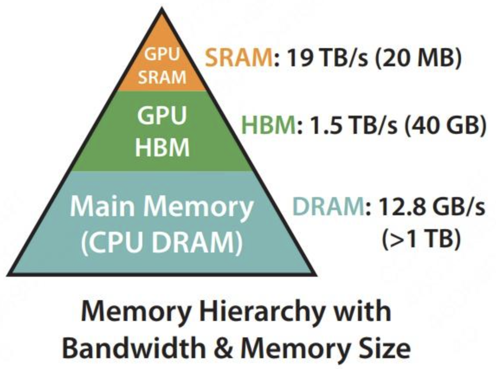
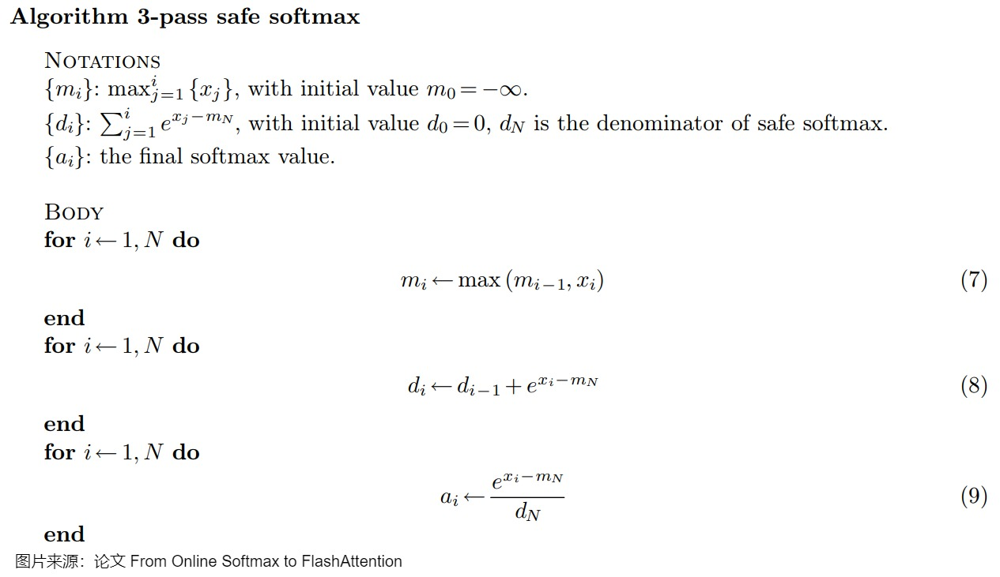

论文：FlashAttention: Fast and Memory-Efficient Exact Attention with IO-Awareness**

> **参考阅读：**&#x68;ttps://zhuanlan.zhihu.com/p/669926191 ，https://zhuanlan.zhihu.com/p/676655352，https://zhuanlan.zhihu.com/p/663932651

标准Attention计算的时间复杂度为$O(N^2)$ , 随着序列增长 , 这个计算的时间大大变长

FlashAttention提出了一种加速计算，节省显存，IO感知的精确注意力，可以有效地缓解transformer模型的计算量和储存复杂度随着序列长度 N 呈二次方增长带来的资源和效率问题，而且FlashAttention在训练和推理都可以用

- **加快了计算（Fast）：**Flash Attention并没有减少计算量FLOPs，而是从IO感知出发，**减少了HBM访问次数，从而减少了计算时间**。减少HBM访问次数，是通过**tiling技术分块和算子融合(**kernel fusion)**来实现的
- **节省了显存（Memory-efficient）：**Flash Attention通过引入统计量，改变注意力机制的计算顺序，**避免了实例化注意力矩阵**，**将显存复杂度从 O(N^2) 降低到了 O(N)&#x20;**
- **精确注意力（Exact Attention）：**不同于稀疏注意力，Flash Attention只是分块计算，而不是近似计算，**Flash Attention与原生注意力的结果是完全等价的**

##  计算与内存限制

self-attention块的**计算复杂度和空间复杂度是序列长度 N 的二次方**，有许多近似注意力的方法尝试减少attention的计算和内存要求。例如，稀疏近似和低秩近似的方法，将计算复杂度降低到了序列长度的线性或亚线性，但这些方法并没有得到广泛应用，因为这些方法过于关注FLOPs(浮点数计算次数)的减少，而忽略了**IO读写的内存访问开销**。在现代GPU中，**<span style="color: rgb(216,57,49); background-color: inherit">计算速度已经远超过了显存访问速度，transformer中的大部分计算操作的瓶颈是显存访问</span>**

对于self-attention块，除了大矩阵乘法是计算受限，其他操作**计算softmax，dropout，mask都是内存受限的**



**GPU内存分级**

GPU内存由多个不同大小和不同读写速度的内存组成。内存越小，读写速度越快。

- **片上内存：**&#x4E3B;要用于缓存（cache）及少量特殊存储单元（例如 texture），其特点是“存储空间小，但带宽大”。对应到上图中，**SRAM 就属于片上内存，它的存储空间只有 20MB，但是带宽可以达到 19TB/s**
- **片下内存：**&#x4E3B;要用于全局存储（global memory），即我们常说的显存，其特点是“存储空间大，但带宽小”，对应到上图中，**HBM 就属于片下内存（也就是显存），它的存储空间有 40GB（A100 40GB），但带宽相比于 SRAM 就小得多，只有 1.5TB/s，因此减少对HBM的读写次数，有效利用更高速的SRAM来进行计算是非常重要的**

GPU有大量的线程来执行某个操作，称为kernel。执行操作分为三步：

- **每个kernel将输入数据从低速的HBM中加载到高速的SRAM中**
- 在**SRAM中进行计算**
- 将**计算结果从SRAM中写入到HBM中**

**kernel 融合**

对于性能受限于内存带宽的操作，进行加速的常用方式就是**<span style="color: rgb(216,57,49); background-color: inherit">kernel融合</span>，避免反复执行“从HBM中读取输入数据，执行计算，将计算结果写入到HBM中”**，将多个操作融合成一个操作，**减少读写HBM的次数。**例来说，我现在要做计算 A 和计算 B。在老方法里，我做完 A 后得到一个中间结果，写回显存，然后再从显存中把这个结果加载到 SRAM，做计算 B。但是现在我发现 SRAM 完全有能力存下我的中间结果，那我就可以把 A 和 B 放在一起做了，这样就能节省很多读取时间


## **标准Safe softmax**

对于**float32和bfloat16**来说，&#x5F53;**&#x20;x≥89 时，exp(x) 就会变成inf，发生数据上溢的问题**。为了避免发生数值溢出的问题，保证数值稳定性，计算时通常会减去最大值，称&#x4E3A;**<span style="color: rgb(216,57,49); background-color: inherit">safe softmax</span>**：

$$ 
 m = \max_i (x_i) ,\quad
 \text{softmax}(x_i) = \frac{e^{x_i - m}}{\sum_{j = 1}^{d} e^{x_j - m}}  $$



简单代码实现如下：

```python
from datasets.formatting.torch_formatter import torch
import torch
a=torch.tensor([1.,2.,3.,4.,5.])

def online_softmax(x):
    m = torch.tensor(-1000.0)
    d = 0
    N = len(x)
    a = torch.zeros(N)
    
    for i in range(N):
        m_pre = m
        m = torch.max(m, x[i])
        d = d * (m_pre - m).exp() + (x[i] - m).exp()

    for i in range(N):
        a[i] = (x[i] - m).exp() / d

    return a

def online_softmax2(x):
    
    m=max(x)
    d=torch.sum((x-m).exp())

    x=(x-m).exp()/d

    return x

print(torch.softmax(a,dim=-1))
print(online_softmax(a))
```

online_softmax2(x)函数更容易理解,但是在实际操作中,由于SRAM大小问题,通常需要将矩阵分块计算(Tilling),所以实际操作更类似`online_softmax(x)`这个函数

### Tiling 分块计算**

SRAM的读写速度比HBM高一个数量级，但内存小很多。通过kernel融合的方式，将多个操作融合为一个操作，利用高速的SRAM进行计算，可以减少读写HBM的次数，从而有效减少内存受限操作的运行时间。但SRAM的内存大小有限，不可能一次性计算完整的注意力，因此必须进行分块计算，使得分块计算需要的内存不超过SRAM的大小

#### **分块计算的难点**

注意力计算流程&#x662F;**&#x20;矩阵乘法-->scale-->mask-->softmax-->dropout-->矩阵乘法**，**矩阵乘法和逐点操作的分块计算是容易实现**的，但&#x662F;**<span style="color: rgb(216,57,49); background-color: inherit">softmax由于分母需要完整输入数据，所以分块计算很难</span>**

#### **FlashAttention的做法**

引入**额外的统计量 $$m(x),l(x)$$**&#x6765;进行解耦

- **求Safe Softmax**

$$m(x) := \max_i x_i,\quad
f(x) := [e^{x_1 - m(x)}, \ldots, e^{x_B - m(x)}],\quad
l(x) := \sum_i f(x)_i,\quad
\text{softmax}(x) := \frac{f(x)}{l(x)}$$

- **解耦拼接向量的Softmax计算** (重缩放,公式等价于上面的safe softmax代码

$$m(x) = m([x^{(1)}, x^{(2)}]) = \max(m(x^{(1)}), m(x^{(2)}))\\
f(x) = [e^{m(x^{(1)}) - m(x)} f(x^{(1)}), e^{m(x^{(2)}) - m(x)} f(x^{(2)})]\\
l(x) = l([x^{(1)}, x^{(2)}]) = e^{m(x^{(1)}) - m(x)} l(x^{(1)}) + e^{m(x^{(2)}) - m(x)} l(x^{(2)})\\
\text{softmax}(x) = \frac{f(x)}{l(x)}$$

通过保持额外的两个统计量可以实现softmax的分块计算，同时**注意，多个block的softmax，GPU 是可以做并行计算的(各自维护一个局部最大值,计算全局最大值后再进行重缩放)，这也提升了计算效率**

- **kernel融合**

把mask和dropout加上的forward：

$$ S = \frac{1}{\sqrt{d_k}} Q K^{\top} \in \mathbb{R}^{N \times N} \\
S_{\text{masked}} = \text{MASK}(S) \in \mathbb{R}^{N \times N} \\
P = \text{softmax}(S_{\text{masked}}) \in \mathbb{R}^{N \times N} \\
P_{\text{dropped}} = \text{dropout}(P, p_{\text{drop}}) \in \mathbb{R}^{N \times N} \\
O = P_{\text{dropped}} V \in \mathbb{R}^{N \times d} \\$$

tiling分块计算使得可以用一个CUDA kernel来执行注意力的所有操作，从HBM中加载输入数据，在SRAM中执行所有的计算操作（矩阵乘法，mask，softmax，dropout，矩阵乘法），再将计算结果写回到HBM中，通过kernel融合将多个操作融合为一个操作，避免了反复地从HBM中读写数据

### 一个分块计算Softmax的例子

> 对向量\[1, 2, 3, 4]计算softmax，分成两块\[1, 2]和\[3, 4]进行计算
>
> **计算block1：**
>
> &#x20;                                         $$m_1 = \max(\{1, 2\}) = 2 \\
> f_1 = [e^{1 - 2}, e^{2 - 2}] = [e^{-1}, e^0] \\
> l_1 = \sum f_1 = e^{-1} + e^0 \\
> o_1 = \frac{f_1}{l_1} = \frac{[e^{-1}, e^0]}{e^{-1} + e^0} $$
>
> **计算block2：**
>
> &#x20;                                         $$ m_2 = \max(\{3, 4\}) = 4 \\
> f_2 = [e^{3 - 4}, e^{4 - 4}] = [e^{-1}, e^0] \\
> l_2 = \sum f_2 = e^{-1} + e^0 \\
> o_2 = \frac{f_2}{l_2} = \frac{[e^{-1}, e^0]}{e^{-1} + e^0} \\$$
>
> **合并得到完整的结果：**
>
> &#x20;                                   $$  m = \max(m_1, m_2) = 4 \\
> f = [e^{m_1 - m} f_1, e^{m_2 - m} f_2] = [e^{-3}, e^{-2}, e^{-1}, e^0] \\
> l = e^{m_1 - m} l_1 + e^{m_2 - m} l_2 = e^{-3} + e^{-2} + e^{-1} + e^0 \\
> o = \frac{f}{l} = \frac{[e^{-3}, e^{-2}, e^{-1}, e^0]}{e^{-3} + e^{-2} + e^{-1} + e^0}  $$
>
> 在忽略mask和dropout的情况下，Flash Attention算法的前向计算在K, V的维度上做外循环，在Q的维度上做内循环