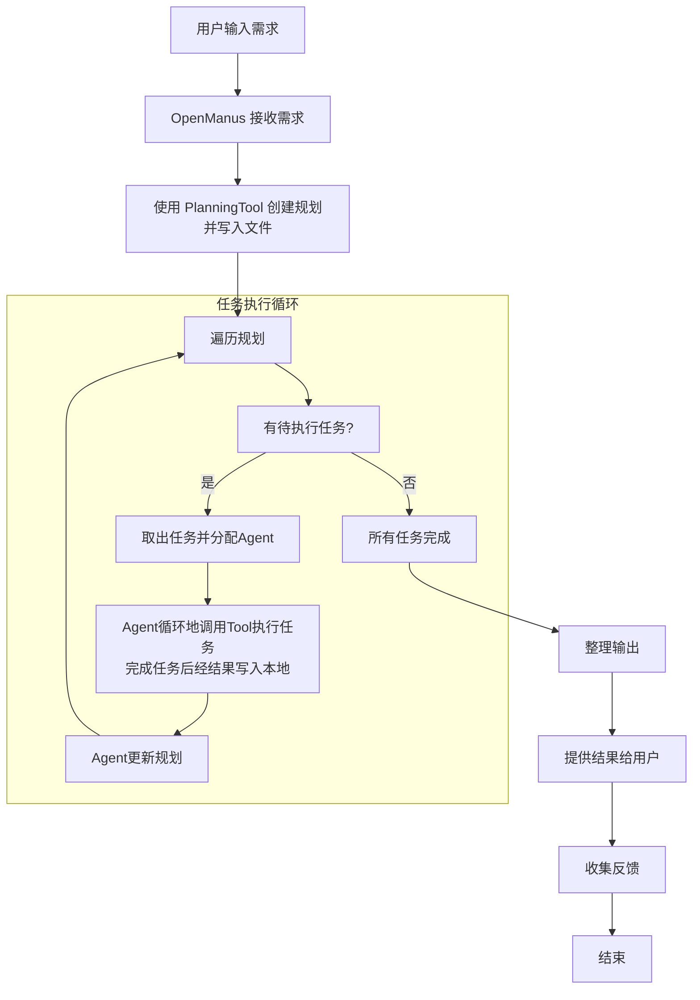
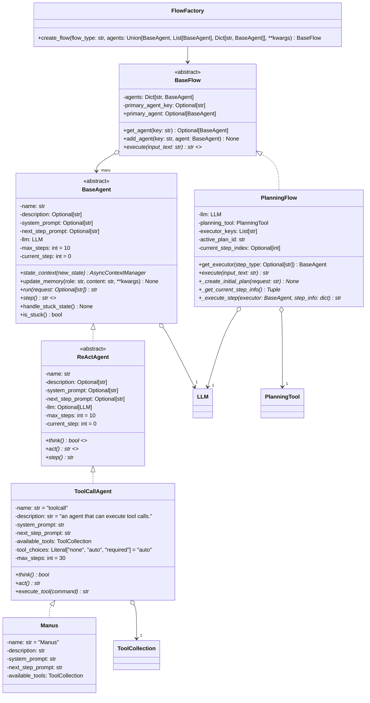

# **6.2.1 智能体（Agent）的定义与历史沿革**

## **OpenAI 在 AGI 五级分类中对于 agent 的定义**

* Level 1: Conversational AI。可以与人类进行对话互动的AI系统，例如 ChatGPT，仅限于基于语言的任务，并且缺乏执行复杂问题的能力。

* Level 2: Reasoners。在学术和专业领域中表现出色，无需外部工具即可解决复杂的问题。

* **Level 3: Agents。能够代表用户长时间自主行动的AI系统，可以在长达数天的时间内执行各种任务，做出决定并执行行动，而无需监督。**

* Level 4: Innovators。AI系统产生新的创新和思想，通过开发原创方案来推动科学技术等领域的突破。

* Level 5: Organizers。AI可以管理整个组织，协调复杂的过程并超过高价值任务中的人类绩效。


## **智能体的核心定义**

**智能体（Agent）为能感知环境、自主决策、主动行动和学习进化的AI程序**

* **感知：智能体的“眼睛”：**&#x667A;能体通过传感器感知环境,如摄像头捕捉图像、麦克风接收声音

* **决策：智能体的“大脑”：**&#x667A;能体的决策基于复杂的算法和模型，如深度学习、强化学习

* **执行：智能体的“手”：**&#x667A;能体通过执行器完成任务,如机械臂操作、软件指令执行

* **学习：智能体的自主进化：**&#x667A;能体可以通过过往的经验迭代更新自己的策略


## **智能体的历史沿革**

从早年的规则驱动，到强化学习驱动，再到如今的**大模型驱动（LLM-based Agents）**，智能体的能力在不断的提升，应用场景也大幅扩展


## **与其讨论 Agent，不如讨论 Agentic**

大模型领域发展的太快， Agent的定义其实还没有一个统一的说法（这里主要指现在主流的LLM-based Agents），所以吴恩达和 Horrison等人非常认同的一个观点：与其争论某一个东西属于、还是不属于智能体，不如承认这个世界并不是一个非黑即白的世界，系统可以是渐进的，可以**具备不同程度的智能体属性（Agentic）**，就像自动驾驶汽车有L1-L4不同级别的自主性一样。

**系统的 Agentic 程度取决于LLM对系统行为的决策权重：**

* 使用LLM将输入路由到特定下游工作流具备初步的Agentic，对应图中&#x7684;**"路由器"（Router）层级**。

* 使用多个LLM进行多级路由决策，这将介于"路由器"&#x548C;**"状态机"（State Machine）**&#x4E4B;间。

* 如果某个步骤需要决定继续执行还是终止——即允许系统循环运行直至完成任务，这属&#x4E8E;**"状态机"**&#x8303;畴。

* 当系统能自主构建工具、记忆工具并在后续步骤中使用，属于顶层&#x7684;**"自主Agent"（Autonomous Agent）**


# **6.2.2 基于大模型的智能体的原理**

LLM Agent是一种超越简单文本生成的人工智能系统。它使用LLM作为其核心计算引擎，使其能够进行对话、执行任务、推理并展现一定程度的自主性。简而言之，Agent是一个具有**复杂推理能力、记忆和执行任务手段**的系统

.jpg>)

**LLM Agent的定义**：通过与GenAI本身之外的系统交互的操作来服务于用户的目标的GenAI系统

Agent LLMs 可能涉及单个外部系统（计算器），或者需要解决routing问题决定要去用哪个外部系统（经常包含memory、planning）

> **基于大模型的智能体（LLM-based Agent） = LLM + 工具调用 + 规划 + 记忆**


## **规划（planning）**

* **子目标分解：**&#x61;gent将大任务拆分为更小的可管理的子目标，使得可以有效处理复杂任务

  * **目的：一项复杂任务通常会包含很多步骤，Agent需要了解这些步骤是什么并提前规划。**&#x524D;面**6.1.2章提到的CoT以及改进方法，可以看作是在做任务分解。**

  * **任务分解实现：​**

    * 给LLM一个简单的提示词“Steps for XYZ.\n1.”，“What are the subgoals for achieving XYZ?”​

    * 使用针对具体任务的指令，例如对一个写小说的任务先给出“Write a story outline.”指令

    * 使用者直接输入

    > 无论是CoT还是ToT，本质上是通过Prompt的精心设计，激发出模型原有的 Metacognition，只是如何通过某条神经元的线索能更加精准的调动出大脑中最擅长Planning的部分

  * **LLM+P** 来进行一个更加长序列的整体规划。这种方法利用规划域定义语言作为中间接口来描述规划问题。整个使用过程，首先LLM将问题翻译成“问题PDDL”，接着请求经典Planner根据现有的“领域PDDL”生成一个PDDL Plan，最后将PDDL计划翻译回自然语言（LLM做的）。根本上讲，Planning Step是外包给外部工具的，当然也有一个前提：需要有特定领域的PDDL和合适的Planner

    

* **反思与完善：**&#x61;gent对历史动作可以自我批评和自我反思，从错误中学习并在后续步骤里完善，从而改善最终结果的质量。Self-reflection是非常重要的一环，它允许Agent通过完善过去的行动决策和纠正以前的错误来不断改进。现实世界中的任务中，试错仍然是无法避免的，自我反思在其中发挥着至关重要的作用

  ReAct （**也分类在5.2.3章Observation-based Agent中**）即 Reson+Act 通过将Action Space扩展为特定任务的离散动作和语言空间的组合，在LLM内部整合了Reasoning和行动Action。前者使LLM能够与环境交互，后者通过提示词使得LLM用自然语言生成整体的推理过程。ReAct提示词模板包含了提供LLM思考的明确步骤，其大致格式为：

  ```plain&#x20;text
  Thought: ...​
  Action: ...​
  Observation: ...
  ```

  在知识密集型任务和决策任务的两个实验中，ReAct的表现比去掉 `Thought...`的单一`Act...`方式更加优异Reflexion是一个让Agent具备动态记忆和自我反思能力以提高推理能力的框架。Reflexion采用标准的RL设置，其中奖励模型提供简单的二进制奖励，而Action Space则采用ReAct中的设置，即在特定任务的行动空间中加入语言，以实现复杂的推理步骤。在每一个Action a(t)之后，Agent会计算一个启发式函数h(t)，并根据自我反思的结果决定是否重置环境以开始一个新的循环。

  

  启发式函数判断何时整个循环轨迹是低效的或者何时因为包含了幻觉需要停止。低效规划指的是耗时过长却未成功的循环轨迹。幻觉是指在环境中遇到一连串相同的行动，而这些行动会导致相同的观察结果

  自我反思过程通过给LLM一个two-shot例子创造，每个例子都是一对（失败的轨迹、在计划中指导进一步变化的理想反思）。接着，reflections将会被添加到Agent的工作记忆中作为查询LLM的上下文，最多三个

## **记忆（Memory）**

* **短期记忆：上下文学习**即是利用模型的短期记忆学习

* **长期记忆：**&#x4E3A;agent提供保留和召回长期信息的能力，通常利用**外部向量存储和检索实现**


记忆可以定义为用于获取、存储、保留和随后检索信息的过程。人脑中有多种类型的记忆：

1. 感官记忆：这是记忆的最早期阶段，在接受了原始刺激后保留的感官信息（视觉、听觉等）印象的能力。感官记忆通常只能持续几秒钟。其中包含图标记忆（视觉）、回声记忆（听觉）和触碰记忆（触觉）。

2. 短时记忆（STM)或工作记忆：它存储了我们当前意识到的信息，以及执行复杂认知任务（如学习和推理）所需的信息。短期记忆被认为有大约7个项目的容量，并能够持续20-30秒。

3. 长时记忆（LTM）：长时记忆可以将信息存储很长时间，从几天到几十年不等，存储容量基本上是无限的。长时记忆分为两种：​

   1. 显性/陈述性记忆：对事实和事件的记忆，指那些可以有意识地回忆起的记忆，包括外显记忆（事件和经历）和语义记忆（事实和概括）。

   2. 隐形/程序性记忆：这种记忆是无意识的，设计自动执行的技能和例行程序，如骑车、在键盘上打字。

* **最大内部产品搜索（Maximum Inner Product Search，MIPS）​：**&#x901A;过使用外部存储器可以缓解关注范围有限的限制。为了优化检索速度，常见的选择是ANN算法，返回近似的top k个近邻，用损失少量的精度来换取速度的巨大提升。几种常见的ANN算法选择进行快速MIPS

  * **LSH ：**&#x5B83;引入了一种哈希函数，这种哈希函数能够最大限度地将相似的输入项映射到同一个桶中，其中桶的数量要远小于输入内容的数量

  * **ANNOY：**&#x6838;心数据结构是随机投影树,它是一个二叉树集合,每个非叶子节点表示将输入空间划分为两半的一个超平面,每个叶子节点存储一个数据点。这些树是独立随机构建的,在某种程度上,它模拟了一个哈希函数的作用。ANNOY 的搜索发生在所有树中,迭代地搜索最接近查询的那一半,然后聚合结果。其思想与 KD 树非常相关,但是可扩展性更强

  * **HNSW ：**&#x48;NSW的设计思想来源于小世界网络，在小世界网络中，每个节点只需要通过很少的步数就可以连接到任何其他节点。比如社交网络中的“六度分隔”理论。HNSW构建了多层的小世界网络结构,底层包含实际的数据点。中间层创建了一些“快捷键”来加速搜索过程。在进行搜索时，HNSW从顶层的一个随机节点开始，逐步导航向目标节点移动。如果在一层无法接近目标，它就会下降到下一层，直到到达底层。在上层每一步导航都能潜在地跨越数据空间中的大距离,而在下层每一步导航可以提高搜索的质量

  * **FAISS：**&#x5B83;基于这样一个假设,即在高维空间中,节点之间的距离遵循高斯分布,因此应该存在数据聚类。FAISS通过向量量化来实现,先将向量空间划分为若干集群,然后在每个集群内进行更精细的量化。在搜索时,首先使用粗粒度的量化查找可能的集群候选,然后在每个候选集群内使用更细致的量化进行进一步查找

  * **ScaNN：**&#x53;caNN算法的主要创新在于使用了各向异性向量量化。他对数据点到进行向量化，使得内积\<q,>尽可能与∠q和的原始距离相似，而不是选择最接近的量化质心点

> 记忆的获取在某种程度上会提高Planning整体质量，但同时也会拉长整体服务的时延，因此如何快速且精准的捕捉相关的记忆至关重要。Vector Search和Attention Mechanism之间的平衡也是速度与准确性之间的平衡。当然都是因为没有无限的上下文学习

## **工具使用（tool use）**

* 对模型权重丢失的信息，**agent学习调用外部API获取额外信息，包括当前信息、代码执行能力、专有信息源的访问**等等

## **智能体与LLM的区别**

**和LLM的对话就是：**&#x4F60;输入一个提示，大模型生成一个回答。


**和Agent的对话就是：**&#x4F60;有一个助手，你不是简单地直接写，先询问你是否需要进行一些网络研究，然后写下初稿，然后**回顾**初稿，并**思考**哪些部分需要修改，然后**修改**草稿，不断进行思考和迭代这个过程。 这个流程是一个**思考+迭代**的过程


## **与强化学习智能体的区别**

* **强化学习智能体：**&#x8F93;入为**预设好的向量化的环境状态（或者图像）**，策略通常由**简单的神经网络结构进行初始化**，输出**动作多为底层控制**（移动、攻击等）


* **基于大模型的智能体：**&#x8F93;入为**文字（多模态场景下也会有视觉、语音等信息）**，策略为**预训练的具备世界知识的大语言模型**，输出动作为**文本，但可以通过结构化输出和提取实现function\_call，进一步与现实环境进行交互**


# 6.**2.3 智能体分类**


## **按照数量分类**

* **SingleAgent：单个智能体进行任务规划与行动**

* **MultiAgent：**&#x5F3A;调**多样化的agent profiles**，agents间**交流相互作用和集体决策过程**。更多动态和复杂的任务可以通过**多个自主智能体的协作、辩论、讨论来完成，每个智能体都具有独特的策略和行为，并相互之间进行通信**


## **按照行为模式分类**

### **Tool Use Agent**

* **MRKL system：Modular Reasoning, Knowledge, and Language** 模块化推理、知识和语言。一个LLM作为router提供对多种工具的访问，然后router可以多次调用工具获取诸如时间、天气等信息，然后结合这些信息给出回复。下面的相关工作都是类似的技术，大部分还包含了微调：**Toolformer、Gorilla、Act-1、Hugging-gpt、ToolkenGPT**

* **CRITIC：Self-Correcting with Tool-Interactive Critiquing&#x20;**&#x5229;用工具交互评价来自我修正。首先根据prompt生成回答，然后同样的LLM对答案中可能出现的错位进行criticize，最后使用相应的外部工具，如联网搜索、代码解释器对部分回答进行验证或修正。**CRITIC流程图：**

  

### **Code Generation Agent**

代码编写和执行能力也是一项重要的Agent能力，**也可以被划分为 Tool Use Agents（Tool就是代码解释器等）**

* **Program-aided LM：**&#x5C06;问题直接转换为code，然后利用Python解释器生成答案


* **Tool-Integrated Reasoning Agent：**&#x7C7B;似PAL，但是code和推理多步交叉直到解决问题，PAL是单个code-gen step。下图是CoT、PAL和本文的对比


* **TaskWeaver：**&#x4E5F;是类似PAL，但是可以利用用户定义的插件

  

### **Observation-based Agent**

一些Agents被**设计为通过与toy env(gym之类的环境)交互来解决问题**，这些基于Obs的Agent会将**接收到的观测插入到Prompt中**

| 技术                           | 背景                                                             | 简介                                                                                                                                                                                                                              | 具体方法                                           |
| ---------------------------- | -------------------------------------------------------------- | ------------------------------------------------------------------------------------------------------------------------------------------------------------------------------------------------------------------------------- | ---------------------------------------------- |
| **Reasoning and Acting**     | 传统CoT中存在的幻觉和错误传播问题; Act- only的方法不能充分利用LLM reasoning的高层目标规划能力   | 结合LLM推理和生成动作的能力，交替生成推理轨迹和特定任务的动作，重复 **产生一个thought -> 采取一个动作 -> 接收一个观测** 的流程，然后所有的信息加入prompt中，相当于保存了过去的经历的记忆。支持外部工具访问。ReAct仅需学习一到六个context examples即可泛化到新任务实例                                                                    | **流程及与CoT和Act-only方法的对比**                      |
| **Reflexion**                | LLM快速的从trial-and-error 中学习仍然很有挑战性，因为传统的强化学习方法需要大量的训练样本和昂贵的模型微调 | 由三个不同的模型组成：**Actor、Evaluator和Self-Reflection**。相比ReAct，多了Evaluator和Reflection。Actor来生成文本和动作，并在环境中接收观察结果。Evaluator评估Actor产生的轨迹的质量，并计算一个奖励分数以反映其性能。Self-Reflection模型则对反馈内容进行反思（做了什么，什么出错了），然后加入prompt作为memory，在任务中不断迭代优化，从而提高决策能力 | **流程图**内部反馈是Evaluator给出的反馈，外部反馈是环境给出的标量奖励之类的反馈 |
| **Lifelong Learning Agents** | 可以在需要终身学习的真实世界任务中探索的Agents（MC等任务环境）                            | **Voyager：**&#x4E3B;要包含三个部分，自动课程任务生成来探索开放世界，迭代式的生成code与环境交互执行动作，Self-Verification new skill加入skill library用于技能召回。实验中对比了ReAct、Reflexion和AutoGPT，效果碾压                                                                             | **流程图****实验结果**                                |
|                              |                                                                |                                                                                                                                                                                                                                 |                                                |
|                              |                                                                | **Ghost in the Minecraft (GITM)：**&#x5229;用LLM将一开始的goal分解为subgoals，然后迭代的进行plan和执行structured text（action）。同时GITM还用了外部的知识库辅助目标分解以及存储经验                                                                                            | **流程图****LLM Planner 示例**                      |

### **RAG Agent**

从外部来源（本地知识库等）检索信息并插入prompt的范式，可以提高知识密集型任务的性能。**RAG其实也是一种特殊的Agent，一般都是调用外部数据库/向量库作为工具**

| **技术**                               | **背景**                                                                          | **简介**                                                                                                                                                                                                                       | **具体方法**                                                                                                                                                                                                                                                                          |
| ------------------------------------ | ------------------------------------------------------------------------------- | ---------------------------------------------------------------------------------------------------------------------------------------------------------------------------------------------------------------------------- | --------------------------------------------------------------------------------------------------------------------------------------------------------------------------------------------------------------------------------------------------------------------------------- |
| **Verify-and-Edit**                  | CoT 通过生成可解释的推理链来提高复杂推理任务的信任和模型性能，但在知识密集型任务中仍然存在事实性问题                            | 生成多条CoT，选择一些进行编辑，编辑是通过对外部信息检索然后允许LLM对这些进行增强                                                                                                                                                                                  | **流程图**                                                                                                                                                                                                                                                   |
| **Demonstrate-Search-Predict**       | 现有工作简单将 RM 检索插入到 LM prompt中在multi-hop问题中效果不是很好                                  | 利用few-shot将一个问题分解为子问题，然后将对应的子问题的回答结合为最终的answer                                                                                                                                                                               | **示例流程**                                                                                                                                                                                                                                                  |
| **Iterative Retrieval Augmentation** | 之前的一些检索增强LM存在两个方面的限制：一次性生成文本在long-form生成任务中容易产生幻觉采用概括性的topic作为query导致查询不到相关细节内容 | **FLARE：**&#x8FED;代的检索生成，先生成一个临时句子，然后检查句子中是否包含低可信度的token，如果有就进行检索然后重新生成句子，重复这个步骤直到完成生成                                                                                                                                       | 示例检索query生成：隐式query通过mask掉临时句子中的probs低于阈值的token生成；显式query通过要求LM生成 答案为临时句子中probs低于阈值的span 的问题，这些问题作为query去进行检索，然后将检索文档加入prompt重新生成句子**流程图**                                                                                                                |
|                                      |                                                                                 | **IRP：**&#x8BF4;明性文本生成任务。包含三个组件，Imitator、Retriever和Paraphraser。Imitator首先生成一个stylistic content plan，概述要包含在下一句中的事实，然后Retriever根据plan在语料库中检索相关facts，最后Paraphraser以plan的风格重新表述这些facts，加到输出后面作为下一个的prefix。sentence-by-sentence生成 | **流程：**&#x49;mitator是用训练集中说明性文本的expert content plan进行训练的；Retriever部分为了减轻plan中的幻觉事实entity损害模型的检索能力，文章用DistilBERT在训练集上进行了分类任务微调，即预测这个文本中的句子的index（第几个句子），因为来自不同文本的同样index的句子的事实相关entity肯定是不同的，所以这样会使得模型对于事实entity的token的attribution scores更低 训练集GT示例**流程图** |

# 6.**2.4 智能体系统分类**

从架构上看，Agentic system 可以分为两大类系统：

* **工作流（Workflow）：**&#x901A;过预定义代码路径编排 LLM 和工具，适用于**任务明确、步骤可预定义的场景**

* **自主智能体（Autonomous Agent）：**&#x4C;LM 动态控制决策和工具使用，自主规划任务，适用于任务步骤难以预知、需长期自主规划的场景

## **基础构建模块：增强型 LLM**


## **自主智能体（Autonomous Agent）**

随着LLM在复杂输入理解、规划、工具使用和错误恢复能力的成熟，自主智能体开始在生产中得到应用。自主智能体的工作可能以用户的一次指令或与用户的互动开始。一旦任务明确，自主智能体便会独立规划并执行，关键特征包括：

* 执行过程中获取环境真实反馈：在执行过程中，每一步都需要根据环境中获得的“真实反馈”（例如工具调用的结果或代码执行情况）来评估自身的进度。

* 支持人工检查点干预：可在检查点或遇到阻碍时暂停，等待人类反馈，与用户沟通以获取信息或进行决策。

* 设置终止条件：任务通常在完成时终止，但也常常设置停止条件（如最大迭代次数）以保证正常运行。


## **工作流（Work Flow）**

### **工作流：提示链 Prompt Chaining**

Prompt Chaining 将任务分解为顺序执行的子步骤，每一步都由一个 LLM 调用来处理上一步骤的输出。你可以在任意中间步骤添加程序检查（见下图中的“gate”）以确保整个过程依然按计划执行。


**适用场景：** 当一个任务将任务分解为顺序执行的子步骤时，可以使用此工作流。其主要目标是通过将每次 LLM 调用简化为一个更容易处理的任务，从而以牺牲延迟换取更高的准确性。

**示例：**

* 先生成市场营销文案，再将其翻译成另一种语言。

* 编写文档提纲、检验提纲是否符合某些标准，然后再根据提纲写出完整文档。

### **工作流：路由 Routing**

Routing 先对输入进行分类，再将其分配到专门的后续任务中。这让我们能更好地实现任务分工，以及针对不同类型的输入构建更为专门化的提示（prompt）。若没有这种路由机制，针对某类输入的优化可能会损害其他输入的性能。


### **工作流：并行 Parallelization**

有时，LLM 可以同时执行多个任务，然后将它们的输出以编程方式聚合在一起，这就是并行化（Parallelization）工作流。它有两个主要变体：

* 分段**Sectioning**：将任务划分为可以并行运行的独立子任务。

* 投票**Voting**：对同一任务进行多次执行，从而获得多样化的输出，以进行对比或投票。


**适用场景：** 当将任务分解后，子任务可以并行执行以提高速度，或者当需要通过多角度、多次尝试来提高结果置信度时，并行化非常有效。对于包含多个考虑因素的复杂任务，当每个因素由独立的 LLM 调用处理时，模型通常能更专注地解决每个问题。

**示例：**

* **Sectioning**：

  * 并行内容审核与主任务处理：一个模型实例负责处理用户查询，另一个模型实例同时对查询进行不恰当内容或非法请求筛查。相比让一个 LLM 同时处理主要回复及安全防护，这种做法表现更优。

  * 自动化多维度模型评估：自动化评估（evals）LLM 的性能，每次调用一个 LLM 来评估模型在某个方面的表现。

* **Voting**：

  * 审查代码是否存在漏洞：多个不同提示审查代码，发现问题时进行标记。

  * 评估某段内容是否不当：多个提示从不同角度评估，或设定不同的投票阈值以平衡误报与漏报。

### **工作流：协调者-工作者 Orchestrator-Workers**

在 Orchestrator-Workers 工作流中，“协调者”LLM 会动态拆解任务、将其分配给“工作者”LLM，然后再将结果综合起来。


Orchestrator-Workers 工作流

**适用场景：** 这种方式非常适合子任务不可预知的复杂任务（例如在编程中，每次可能需要修改多少文件以及每个文件的修改方式都要视具体任务而定）。它与并行化在拓扑结构上类似，但二者的关键区别在于灵活性——并行化的子任务是预定义的，而 Orchestrator-Workers 模式下的子任务则是由中心 LLM 根据具体输入来动态决定。

**示例：**

* 多文件代码修改：每次都需要对多个文件进行复杂改动的编程产品。

* 多源信息搜索分析：在多源信息中搜索并分析可能相关的信息来完成搜索任务。

### **工作流：评估-优化循环 Evaluator-Optimizer**

在 Evaluator-Optimizer 工作流中，一个 LLM 用于生成响应，另一个 LLM 用于对该响应进行评估并给出反馈，二者循环往复。


Evaluator-Optimizer 工作流

**适用场景：** 存在明确评估标准且迭代优化有效。判断是否适用的两大标准是：

1. 当人类给出反馈时，LLM 的输出能明显改进；

2. LLM 本身也有能力生成这类反馈。
   这类似于一个人编写文档时反复修改、润色的过程。

**示例：**

* 文学翻译润色：一些细微的语言差异可能在初稿中并未充分体现，而评估者 LLM 可以指出这些不足并给出改进意见。

* 复杂搜索任务的多轮优化：需要多轮搜索和分析以收集全面信息，由评估者判断是否需要进一步搜索。

# **6.2.5 智能体的框架、应用**

## **&#x20;智能体框架**

构建智能体系统的框架：

* **全代码框架：**

  * **Langchain & LangGraph**

  * **LlamaIndex**

  * 多智能体协作框架：**AutoGen、CrewAI、Swarm、CAMEL**

* **可视化低代码平台：**

  * **DIfy**（开源（有修改的Apache 2.0 协议），超出免费额度后需要购买套餐）

  * **Coze**（闭源，超出免费额度后需要购买套餐）

  * 毕昇（开源（Apache 2.0 协议），面向企业场景，个人可在其 demo 平台免费体验）

这些框架虽能**简化基础任务（LLM调用、工具定义、调用链构建等）**，但可能会因为抽象层遮蔽底层提示与响应，**增加调试难度，以及定制化修改的难度**


## **智能体应用**

### **RAG应用**

* **GraphRAG：**&#x901A;过构建知识图谱增强RAG检索准确率

* **LightRAG：**&#x8F7B;量化的GraphRAG实现

* **DeepSearcher：**&#x91C7;用树状结构而非图结构存储

**传统RAG:**

* 优点：架构简单、性能优越

* 缺点：不够精准

**GraphRAG:**

* 优点：图谱知识点关联性强，知识粒度小，检索精准

* 缺点：图谱构建耗时、知识更新难、检索耗时长

**DeepSearcher:**

* 优点：树形知识结构代替图谱结构，也可以缩小知识粒度，也能精准检索。能并行检索性能优越

* 缺点：跨文档知识关联性不强，对推理性查询不友好


### **单智能体应用**

**BabyAGI、AutoGPT、HuggingGPT等，通过设计不同的prompt和工作流，利用OpenAI模型或者huggingface上的模型，实现任务规划、任务执行、任务排序等功能**


### **多智能体应用**

**generative\_agents、MetaGPT、GPT-researcher、STORM / Co-STORM，多智能体协作交流完成任务**


## Agent+RL框架

> RL和Agent作为目前基座训练和应用最重要的两个方向，开发者们将 LLM 当作 Agent 来进行 RL 后训练，有望进一步提升其回答质量、交互表现，或在特定任务上进一步微调，获得更适合应用场景的行为；另一方面，LLM 也能帮助 RL。当 RL 系统遇到输入的复杂信，LLM 可以用其强大的表示与推理能力来预处理信息，或者充当奖励函数、世界模型等各种模块，让 RL Agent 更快地学会完成任务。

### **GAIR/ToRL**

> **一句话总结**：**ToRL**通过RL使LLM能够自主探索和改进工具使用策略，让LLM能够自主学习何时以及如何调用工具，减少对人类策划工具使用模式的依赖。

**具体做法**

* **工具调用频率控制**：为了平衡训练效率，引入超参数 C，表示每次响应生成允许的最大工具调用次数；

* **执行环境选择**：选择稳定、准确和响应迅速的代码解释器实现；

* **错误消息处理**：提取关键错误信息，减少上下文长度；

* **沙盒输出掩码**：在损失计算中掩盖沙盒环境的输出，提高训练稳定性。

**奖励设计**：实现了基于规则的奖励函数，正确答案获得 + 1 奖励，错误答案获得 - 1 奖励。此外，研究还尝试探究了基于执行的惩罚：含有不可执行代码的响应会导致 - 0.5 的奖励减少。在默认实验设置中，仅使用了答案正确性的 reward。

### **OpenManus/OpenManus-RL**

> **一句话总结**：借鉴了RAGEN的RICO，并在这一基础上进一步探索了新的算法结构、多样化的推理范式、复杂的奖励策略以及丰富的基准测试环境。

**具体总结**

1. 推理模型探索

为了全面评估推理能力，选用了以下最先进的推理模型进行基准测试：

* GPT-O1、Deepseek-R1、QwQ-32B

- 替代展开策略

为了提升代理的规划效率和推理鲁棒性，实验了多种展开策略：

* ToT、GoT、DFSDT、MCTS

- 多样化的推理格式

* ReAct、Outcome-based Reasoning

- Post-Training Strategies

研究了多种后训练方法，进一步优化推理能力：

* SFT、GRPO、PPO、DPO、PRM

- 奖励模型的训练

基于注释数据训练专门的奖励模型，精准量化复杂的奖励信号，从而在训练与评估阶段指导代理的轨迹选择。

* 动作空间意识与策略探索

赋予代理动作空间的意识，并设计了系统性的探索策略，有效适配复杂任务空间，从而最大化预期奖励。

* 与强化学习调优框架的集成

- Verl、TinyZero、OpenR1、Trlx

### **RAGEN**

> **一句话总结**：**RAGEN**通过MDP框架及其独特的"推理-交互链优化"算法，解决了多轮交互和随机环境中的关键挑战；其进阶奖励归一化策略进一步增强了模型在不同复杂任务中的稳定性和表现。

**具体实现**

* 使用MDP将模型学习建模为状态和动作序列，以最大化多轮交互中的累计奖励。

* RICO算法在"生成阶段"生成推理驱动的行动轨迹，并在"更新阶段"调整策略以优化整条轨迹的奖励。

* 模型采用渐进的奖励归一化策略（例如 ARPO、BRPO 和 GRPO）来平衡多难度任务下的学习稳定性。

* 不同模型评估表明，大规模模型具有更好的性能，但训练仍需平衡提示多样性与数据新鲜性。

### **eleurent/RL-Agents（经典框架）**

> **一句话总结**：**RL-Agents**为研究人员提供了一个全面的框架来实现和测试多种先进的强化学习算法，包括值迭代、蒙特卡罗树搜索和深度Q网络等。

**具体实现**：

1. 规划算法

* 值迭代、交叉熵法、MCTS、乐观规划算法

- 安全规划

* 稳健值迭代、离散稳健乐观规划、基于区间的稳健规划

- 基于值的算法

* DQN、Fitted-Q

- 安全基于值的方法

* Budgeted Fitted-Q

# 6.2.6 Agent评估框架汇总

> Agent可以用于解决一些更复杂且更贴近现实的任务，这些任务往往没有唯一的正确答案。例如，Agent能够通过命令行执行任务，而软件开发相关的Agent甚至能够与计算机接口进行交互。**与LLM调用相比，Agent调用的成本更高，且缺少丰富的针对场景的基准、很难提供统一的评估标准和方法等**。因此，Agent的评估与LLM的评估在本质上存在差异。本文将介绍三种Agent评估框架。

## **AgentBench**


> `AgentBench`的核心思想是，将LLM作为Agent进行评估。
>
> 其**8种**实际场景可以归为**三类**：
>
> * 编码：让LLM生成代码，操作系统、数据库和知识图片属于编码类型。
>
> * 游戏：让LLM扮演游戏角色，数字卡牌游戏、横向思维谜题、持家游戏属于游戏类型。
>
> * Web：让LLM完成与网页相关的任务，网购和浏览网页属于Web类型。

> `AgentBench`通过**对不同的LLM在不同环境中的表现进行评分**，不同的实际环境会根据场景使用不同的评分标准。例如对于操作系统、数据库使用成功率作为主要评估指标，对知识图谱场景使用F1作为评估指标。AgentBench在论文中还通过一种归一化的算法比较公平地对每个LLM在8个环境的表现给出了一个总得分。

## **ToolEmu**


> `ToolEmu` 主要是对基于大模型 Agent 的安全测试。
>
> 通过模拟多样化的工具集，检测 LLM-Base Agent 在各种场景下的表现，旨在自动化地发现真实世界中的故障场景，为 Agent 执行提供了一个高效的沙盒环境。**ToolEmu 包括一个对抗性仿真器，专门用于模拟可能导致大模型代理故障的情景**，从而让开发者更好地理解并改善代理的弱点，这种方式可以有效地识别真实世界中潜在的严重故障。此外还有自动安全评估器，通过分析代理执行过程中的潜在危险操作，来量化风险的严重性。

## **AgentBoard**


> `AGENTBOARD` 的核心目标是解决当前 LLM 智能体评估中存在的几个关键问题：
>
> 1. 任务多样性不足： 现有的评估框架往往缺乏对不同类型智能体任务的覆盖，例如具身智能、网页智能和工具智能等。
>
> 2. 缺乏多轮交互能力评估： 大多数评估侧重于单轮任务，而现实世界的智能体应用通常涉及多轮交互。
>
> 3. 部分可观测环境的缺失： 许多评估在完全可观测的环境中进行，这与实际应用中智能体需要主动探索环境的情况不符。
>
> 4. 评估指标单一： 当前评估主要依赖最终成功率，无法深入了解模型在过程中的表现和能力。

> AgentBoard从多个角度对LLM的Agent能力进行了分析和评估：
>
> * 处理率（process rate）：AgentBoard除了使用任务成功率之外，还提出了一个叫”处理率“的指标，该指标用来表示LLM对任务的处理程度，传统的成功率只会根据处理结果是否成功进行分类，而处理率则会计算对任务处理到了什么程度，比如一开始就失败和处理到95%才失败是完全不同的两种情况。
>
> * grounding精度：AgentBoard将LLM处理任务采取行动（action）的错误分为两类：grounding erros指的是由LLM生成的行动本身无法执行，planning errors指的是LLM生成的行动是正确的但是对处理任务没有任何帮助。grounding精度指的是生成的正确的行动的比率，这个值越高说明LLM执行工具的能力越好。
>
> * 简单和困难任务区分：AgentBoard根据任务的子目标数量将它们分为简单和困难两个级别。实验结果表明所有的模型在困难任务的处理能力比简单任务要低很多，这也符合基本常识。
>
> * 多回合交互：AgentBoard研究了交互步骤数与处理率的关系，结果发现对于具身智能和游戏等场景处理率随交互步骤数收敛更慢，而对于WebArena和Tool-Query之类的任务，处理率会在前面几个交互步骤很快收敛到一个较大值。
>
> * 各项子能力分析：AgentBoard为Agent定义了记忆、规划、grounding、反思、知识获取等能力，并基于成功率使用加权平均算法对LLM计算了各项子能力的得分。
>
> * 探索能力：AgentBoard针对特定场景对比了不同模型的探索能力，不同场景定义探索能力的方式不同，比如BabyAI中的房间、AlfWorld中的容器以及Jericho 中的地点。

# **6.2.7 智能体实践**

## **基于OpenAI接口的简单Agent**

实现一个简单的查询天气的Agent，核心在于**tools参数的设定**

```python
from openai import OpenAI
import json

client = OpenAI(api_key="sk-api_key")

tools = [{
    "type": "function",
    "function": {
        "name": "get_weather",
        "description": "Get current temperature for a given location.",
        "parameters": {
            "type": "object",
            "properties": {
                "location": {
                    "type": "string",
                    "description": "City and country e.g. Bogotá, Colombia"
                }
            },
            "required": [
                "location"
            ],
            "additionalProperties": False
        },
        "strict": True
    }
}]
messages = [{"role": "user", "content": "What's the weather like in Paris today?"}]

completion = client.chat.completions.create(
    model="gpt-4o",
    messages=messages,
    tools=tools,
)
print(completion.choices[0].message.content)
```

## **基于Langchain实现一个简单的ReAct Agent**

```python
from langchain.chains import LLMMathChain, LLMChain
from langchain.agents import Tool, initialize_agent, AgentType
from langchain.prompts import PromptTemplate

from langchain import OpenAI
import os

os.environ["OPENAI_API_KEY"]="your api key"

llm = OpenAI(temperature=0)

# 接下来开始制作第一个工具，我们先制作一个llm_math工具Chain，其能够解决数学问题
llm_math = LLMMathChain(llm=llm)

# 初始化math_tool
math_tool = Tool(
    name='Calculator',
    func=llm_math.run,
    description='Useful for when you need to answer questions about math.'
)

# 接下来制作第二个工具，制作一个LLMChain来专门进行翻译
prompt = PromptTemplate(
    input_variables=["input"],
    template="""
     你需要根据以下信息回复用户关于商品价格的查询，如果你无法从以下信息中解答用户问题，请说我不知道。
     商品信息列表如下：
      可口可乐5元1瓶
      百事可乐3元1瓶
     
     这是用户输入的问题：
    {input}"""
)

search_chain = LLMChain(llm=llm, prompt=prompt)

# 初始化查询工具
search_tool = Tool(
    name='商品信息查询工具',
    func=search_chain.run,
    description='用于专门查询商品的价格信息'
)

# 接下来，我们tool kit,即将所有工具存进一个数组中
tools = [math_tool,search_tool]

# 初始化zero-shot agent

zero_shot_agent = initialize_agent(
    agent=AgentType.ZERO_SHOT_REACT_DESCRIPTION,
    tools=tools,
    llm=llm,
    verbose=True,
)

#8.来试运行一下吧1
zero_shot_agent("可口可乐的价格减去百事可乐的价格得到的结果的三次方是多少？")
```

```bash
> Entering new AgentExecutor chain...
 我需要先查询可口可乐和百事可乐的价格，然后计算出差价，最后再计算出三次方的结果。
Action: 商品信息查询工具
Action Input: 可口可乐和百事可乐的价格是多少？
Observation:可口可乐5元1瓶，百事可乐3元1瓶。
Thought: 我现在可以计算出差价
Action: Calculator
Action Input: 5-3

Observation: Answer: 2

Thought: 我现在可以计算出三次方的结果
Action: Calculator
Action Input: 2^3

Observation: Answer: 8

我现在知道最终答案
Final Answer: 可口可乐的价格减去百事可乐的价格得到的结果的三次方是8。

> Finished chain.
```

## **基于Langchain实现一个简单的多Agent系统**

定义一个函数来创建智能体：

```python
from langchain.prompts import ChatPromptTemplate
from langchain.chat_models import ChatOpenAI
from langchain.schema import BaseMessage, HumanMessage, MessagesPlaceholder
def create_agent(llm, system_message: str):
    """创建一个智能体。"""
    prompt = ChatPromptTemplate.from_messages(
        [
            (
                "system",
                "你是一个协作的AI助手，负责执行分配的任务并提供有用的输出。"
                "在完成任务后，请在回复前加上'FINAL ANSWER'。以下是你的任务：{system_message}",
            ),
            MessagesPlaceholder(variable_name="messages"),
        ]
    )
    prompt = prompt.partial(system_message=system_message)
    return prompt | llm
```

定义两个智能体的任务：

```python
llm = ChatOpenAI(model="gpt-4", temperature=0)
agent_1 = create_agent(llm, "请生成10个随机数字。")
agent_2 = create_agent(llm, "请将提供的数字每个都乘以10。")
```

定义工作流，使用LangGraph的StateGraph实现，智能体作为工作流中的节点，之间的转换基于路由器逻辑

```python
from langgraph.graph import StateGraph, END
from langgraph.graph import MessagesState
graph_builder = StateGraph(MessagesState)
graph_builder.add_node("Agent_1", agent_1)
graph_builder.add_node("Agent_2", agent_2)
def router(state):
    messages = state["messages"]
    last_message = messages[-1]
    if "FINAL ANSWER" in last_message.content:
        if state["sender"] == "Agent_1":
            return "Agent_2"
        return END
    return "continue"
graph_builder.add_conditional_edges("Agent_1", router)
graph_builder.add_conditional_edges("Agent_2", router)
graph = graph_builder.compile()
```

最后，初始化工作流，并根据用户的初始输入执行

```python
initial_state = {
    "messages": [
        HumanMessage(content="请生成10个随机数字，并将每个数字乘以10。")
    ],
    "sender": "Agent_1",
}
events = graph.stream(initial_state, {"recursion_limit": 150})
for event in events:
    print(event)
    print("----")
```

```sql
{'messages': [HumanMessage(content='请生成10个随机数字，并将每个数字乘以10。'), AIMessage(content='FINAL ANSWER: [3, 7, 1, 9, 4, 6, 2, 8, 5, 0]')], 'sender': 'Agent_1'}
----
{'messages': [HumanMessage(content='请生成10个随机数字，并将每个数字乘以10。'), AIMessage(content='FINAL ANSWER: [3, 7, 1, 9, 4, 6, 2, 8, 5, 0]'), AIMessage(content='FINAL ANSWER: [30, 70, 10, 90, 40, 60, 20, 80, 50, 0]')], 'sender': 'Agent_2'}
----
```

## **Manus 分析 & OpenManus 技术方案**

Manus 在完成我们提出的问题的时候会**首先对任务进行任务拆分，之后形成一个 TODO.md 用来记录自己已经完成的进度**


Manus 是一个**多智能体系统**，它首先先使用**PlanningTool做规划**，形成一个包含多个任务的线性结构的计划，然后顺序执行每一个任务并动态分配给相应的 Agent。Agent 在执行每个任务的过程中，以 ReAct 循环的形式调用工具以完成每一个任务。

* **规划能力：**&#x4D;anus 将 PlanningTool 规划工具引入多智能体框架。Planning 规划很重要，Claude-3.7 在 SWEBench 上达到了，70% 解决率的效果，此前是49% 的 解决率。一部分提升来源于模型，另一部分就来源于规划。

* **工具使用能力：**&#x4D;anus应该是Claude+一些其它自己post train的模型，在工程上做了很大程度上的优化，增强了它在不同场景下的工具使用能力。

**OpenManus** 继承了 Manus 的规划优势，通过 PlanningTool实现任务分解，可以处理现实世界中的复杂问题。在 React Agent 的基础上，基于Function Call 实现了一个轻量的 ToolCall Agent。它的设计思路可以概括为以下几点：

1. **极简可插拔框架**
   OpenManus的核心是一个精简的Agent框架，强调模块化和可扩展性。通过Prompt和Tools的自由组合，开发者可以快速定义Agent的行为逻辑和功能。比如，Prompt决定了Agent的思考方式，而Tools则提供了具体的行动能力（如代码执行、搜索、文件操作等）。

2. **工具驱动的ReAct Agent**
   OpenManus基于**ReAct（Reason + Act）模式**，以工具为核心驱动Agent的行动。Prompt引导Agent的推理和逻辑，而Tools则赋予Agent行动能力。这种设计让Agent不仅能“想”，还能“做”。

3. **规划能力处理复杂任务**
   OpenManus延续了Manus的多智能体规划优势，通过**PlanningTool**对用户需求进行高层规划。它将复杂任务分解为线性的子任务计划，显著提升了任务的成功率。这种“先规划，后执行”的思路，在处理长链任务时尤为有效。

4. **动态Agent分配与工具调度**
   当一个任务被拆解为多个子任务后，系统会根据任务类型，动态分配给预先定义或适配的Agent。这种“临时分配 + 工具协作”的机制，最大化利用了多模型、多工具的组合优势，提高了系统的灵活性和效率。

**OpenManus的运行流程**非常清晰，可以概括为以下几个步骤：

1. **用户需求输入**
   用户在前端或命令行中输入复杂需求，比如“写一段代码并自动部署到服务器上”。

2. **PlanningTool规划**
   系统调用PlanningTool，对需求进行分析与分解，形成一个线性结构的任务序列。比如，将需求拆解为“分析需求→编写代码→测试修复→部署验证”。

3. **任务分配与执行**
   系统根据任务类型，动态分配给最合适的Agent。每个Agent采用ReAct循环与Tools交互，完成子任务。

4. **结果汇总与状态更新**
   子任务执行完毕后，系统会将结果进行总结与压缩，存入共享内存。如果任务顺利完成，进入下一子任务；如果失败，系统会进行自动调试或重新规划。

5. **整体产出**
   所有子任务执行完毕后，系统对整体结果进行汇总并返回给用户。



**OpenManus的工程结构**非常简洁，截止到目前核心仅包含约30个文件，依赖库也相对简单（如pydantic、openai、playwright等）。它的架构由四个主要模块构成：

1. **核心多智能体框架（Agent）**
   采用清晰的继承层次，自底向上逐步增强功能。从BaseAgent到ReActAgent，再到ToolCallAgent，最后到Manus，每一层都通过定制Prompt和Tools赋予Agent不同的能力。

2. **工具层（Tools）**
   工具模块是OpenManus的行动基础，包括Python执行、网络搜索、文件读写、任务规划等。每个工具都继承自BaseTool，具有高度的可扩展性。

3. **提示词模块（Prompt）**
   Prompt模块包含了各种Agent使用的指令模板，定义了Agent的行为逻辑和思考方式。

4. **执行流程模块（Flow）**
   Flow模块负责任务的高层编排和执行流程管理，确保任务按计划逐步完成。



**OpenManus代码细节**


