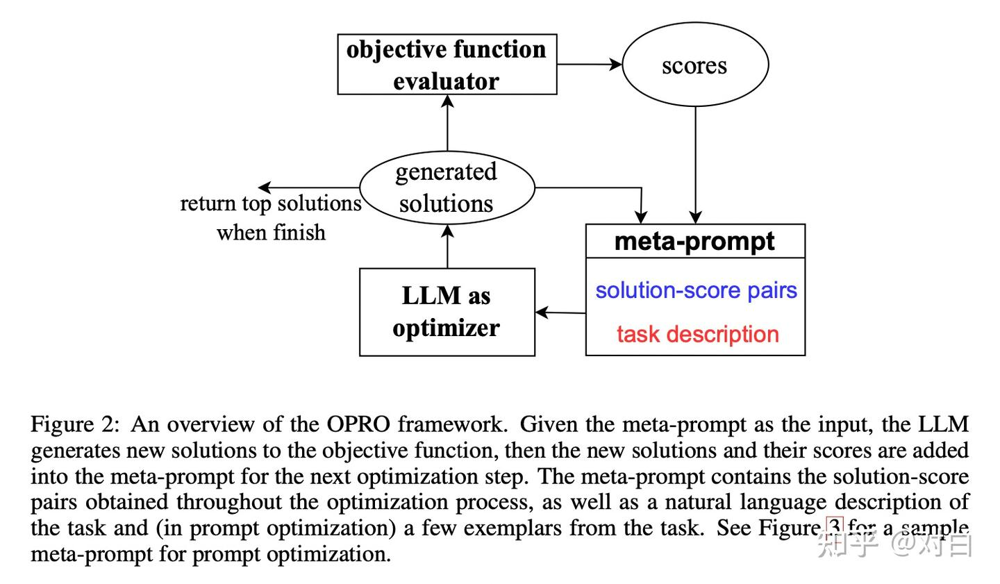

# 1. In-Context Learning上下文学习(ICL)

最简单的ICL即**Few-shot Learning** , 模型**在给定的上下文中进行学习和推理**，而无需真正更新模型参数 , 通过在推理阶段提供相关的上下文信息来生成或调整模型输出

## 示例设计:

1. 启发式方法
   1. 基于语义相似度(用embedded tensor 进行查询,knn等距离方法得到相似的例子
   2. 基于多样性(embedded tensor 进行查询,当两个demostration高度语义相似时，剔除其中一个

2. **LLM-based方法：直接用LLM来生成Demonstration**

   1. 基于prompt召回: 

      1. 先对训练集进行一轮粗糙的“召回”，筛选出一个较小的**候选示例集** (如BM25 or SBERT)

      2. 将训练集中的每一个样本都当作示例（Demonstration），连同当前的输入（Input）一块输入给 LLM。

         观察 LLM 得到正确输出（Output）的**概率大小**。概率越高，说明在这个示例的帮助下，LLM 越容易答对，因此这个示例就越好。 筛选**正例和负例 各k个**

      3. 利用构建好的正负例数据，训练一个专门的检索模型(**Retriever**)。比如使用对比学习Contrastive Learning 进行训练 , 类比一个embedding model , 使得 imput和good answer 更近 , 和wrong answer 更远

      4. 结合 **Faiss** 等相似度计算框架 , 利用**Retriever** 快速找出匹配的 Demonstrations , 加入 prompt 中

   2. 基于**主动学习 (Active Learning)** 或 **RL**  

      1. **主动学习是“指导思想”：** 它定义了问题的本质——我们需要从海量数据中“主动挑选”出能带来最大收益（准确率）的样本。

         **强化学习是“解题工具”：** 它解决了“怎么挑”的问题。因为组合太多，无法通过穷举来挑选，所以使用 RL 的序列决策能力，一步步试错并优化，最终找到符合主动学习目标的那组示例。

      2. 在 ICL 示例选择中，我们借鉴了**主动学习**的思路去寻找高价值样本，但为了解决搜索空间过大的难题，我们使用了**强化学习**算法来进行具体的搜索和决策。

   3. 基于自生成

      1. 利用LLM的能力, 设计合适的prompt, 让LLM生成k个合适示例
      2. 在原prompt上加上上述示例, 让LLM预测结果

## 示例格式:

有何上述的demonstrations , 如何整合他们形成一个自然语言的 prompt

### 1.核心结构拆解

你需要将你的 Prompt 分为以下 6 个明确的模块：

- **Title (任务标题)**
  - **作用：** 用一句话定义任务的高层目标。
  - **写法：** 简洁明了，包含核心技能点（例如：常识理解、问题生成）。
- **Definition (详细定义)**
  - **作用：** 对任务进行细化，解释任务中涉及的专有名词或具体执行细节。
  - **关键点：** 如果任务中有模糊概念（如图中的 "Event Duration"），必须在这里给出明确定义（例如：“刷牙通常只需要几分钟”）。
- **Emphasis & Caution / Things to avoid (强调与避坑)**
  - **作用：** 设立“护栏”，明确告诉模型**什么不能做**或**必须遵守的规则**。
  - **图片案例：** “生成的问题不能在原文中找到显式的答案”，必须依赖常识推理。
- **Positive Examples (正例)**
  - **作用：** 提供符合预期的输入输出对，帮助模型理解任务模式。
  - **高阶技巧（重要）：** 必须包含 **Reason (理由)**。不仅仅给答案，还要解释*为什么*这个答案是对的。这能激活模型的思维链（CoT）能力。
- **Negative Examples (负例)**
  - **作用：** 展示典型的错误，并指出错误原因，防止模型犯类似错误。
  - **结构：** 错例 + **Reason (错误原因)** + **Suggestion (修改建议)**。
- **Prompt (最终指令)**
  - **作用：** 最后的一句命令，触发模型开始工作，通常位于输入示例之前。

------

### **2. 实践模板**

结合你的科研背景（Python/ML），假设你要让模型**“解释一段 Python 代码的作用”**，你可以套用该模式如下：

**Title:** Python Code Functionality Explanation

**Definition:** In this task, you need to explain the functionality of a given Python code snippet. The explanation should focus on the *logic* and *data flow*, not just translating syntax into English.

**Things to avoid:**

- Do not explain line-by-line (e.g., "Line 1 imports numpy").
- Do not use vague terms like "It does some math." Be specific about the algorithm.

**Positive Example:**

- **Input:** `x = [i**2 for i in range(10) if i % 2 == 0]`
- **Output:** This code generates a list of squares for all even numbers between 0 and 9.
- **Reason:** It correctly identifies the list comprehension logic, the squaring operation, and the conditional filtering for even numbers.

**Negative Example:**

- **Input:** `def add(a, b): return a + b`
- **Output:** This function takes a and b and returns a + b.
- **Reason:** This is a literal translation of syntax, not a functional explanation.
- **Suggestion:** Instead, say "This function calculates the sum of two input arguments."

**Prompt:** Based on the code provided below, explain its functionality following the guidelines above.


## **ICL的挑战**

* **长上下文问题：**&#x5927;规模模型对上下文长度有一定的限制，处理非常长的上下文可能会受到影响

* **选择适当的上下文：**&#x786E;定哪些信息应该包含在上下文中，以及如何组织这些信息，是ICL的关键挑战之一

* **输出一致性：**&#x5728;不同上下文中，模型生成的内容可能会有所不同，确保生成结果的一致性和准确性是需要关注的问题

# 2 Chain-of-Thought 思维链

通过让**大模型逐步参与将一个复杂问题分解为一步一步的子问题并依次进行求解的过程可以显著提升大模型的性能**。区别于传统的 Prompt 从输入直接到输出的映射 \<input——>output> 的方式，CoT 完成了从**输入到思维链再到输出**的映射，&#x5373;**<input——>reasoning chain——>output>**


如图, 通过在prompt中添加 reasoning chain ,使得模型的能力大大增加(前提是模型足够大且有过SFT , 3B以下的模型由于scale 问题不太好学习reasoning ,SFT 有助于 reasoning 成功率)

## 1.zero-shot-CoT

最简单的方法即 **let’s think step-by-step** , 仅通过生成一些思考过程,从而使得LLM利用思考过程中的内容 , 更好地生成最终答案

## 2.few-shot-CoT :

如上面的demo , 在**prompt中给出详细步骤**,让模型照猫画虎得到推理能力

## 3.CoT-SC

**多路径生成：** 传统的 CoT 通常是贪婪解码（Greedy Decoding），即只生成一条最可能的推理路径。而 CoT-SC 提出要**独立生成多个思维链**（Reasoning Paths）。

**多数投票 (Majority Vote)：** 模型不仅仅看哪条路径概率最高，而是看这些不同的推理路径最终得出的**答案**哪一个出现次数最多。通过对答案进行“多数投票”，来确定最终结果。

**容错率更高：** 大模型在推理复杂问题时，单次生成可能会因为某一步推导错误而导致结果错误。但如果生成多次，正确的推理过程通常会导致相同的正确答案，而错误的推理过程往往会导致各种各样不同的错误答案。

## 4.ToT


相比于传统的线性 CoT，ToT 引入了更高级的搜索策略：

- **多路径探索：** 它允许模型同时探索**不同的思维路径**，而不是局限于单一的生成流。
- **回溯能力 (Backtracking)：** 这是 ToT 的核心特性。如果模型发现当前的推理路径导致了“不好的结果”，它可以**反向回溯**，回到上一个节点重新选择路径。
- **全局规划：** 这种结构让模型具备了类似“全局规划”或“前瞻”的能力，能够通过评估不同分支的前景来决定下一步怎么走。


## 5.GoT


GoT 的设计初衷是为了解决 ToT 严格树状结构的局限性。ToT 虽然允许回溯，但无法实现思维的“融合”。

**思维聚合 (Aggregation)：** 这是 GoT 最大的特点。它可以通过构建具有多条输入边的顶点，将任意多个思维**聚合**起来。

- *例子：* 就像写文章，你可以先写三个不同的段落（三个独立节点），然后将它们总结融合为一篇结论（聚合节点）。

**分治算法 (Divide and Conquer)：** 得益于聚合操作，GoT 能够真正实现分治策略，将复杂问题拆解后并行解决，最后再合并结果。

**泛化能力：** GoT 可以无缝地将 CoT 和 ToT 作为特例包含在内，支持更复杂的思维模式，且无需更新模型参数。


# **3. Prompt WorkFlow：Prompt自动优化框架 工作梳理**

目标 : **设计出一套自动优化Prompt的管线**，利用大模型本身的特性和能力**自动优化基座和业务上原本的Prompt**

## OPRO: 基于提示的迭代优化 (Optimization by PROmpting)

paper : **《LANGUAGE MODELS AS OPTIMIZERS》**

通过自然语言描述优化任务，在每次优化步骤中，基于包含之前生成的解及其价值的提示，让LLM生成新的解决方案，然后评估新解的价值并将其加入提示中（**注意，OPRO 是直接生成新的 prompt，而不是更改现有的 prompt**），为下一步优化做准备，直到LLM无法提出更优的解或达到最大迭代次数。

 

```python
def opro_optimization(initial_solutions, scorer, max_steps=200):
    # 初始化 meta-prompt, 包含问题描述和初始解
    meta_prompt = build_meta_prompt(problem_description, initial_solutions)
    
    for step in range(max_steps):
        # 使用 LLM 生成新的候选解
        new_solutions = llm_generate_solutions(meta_prompt)
        
        # 评估新解
        new_solutions_with_scores = evaluate_solutions(new_solutions, scorer)
        
        # 更新 meta-prompt , 加入新解及其评估值
        meta_prompt = update_meta_prompt(meta_prompt, new_solutions_with_scores)
        
        # 检查是否满足终止条件
        if termination_condition_met(meta_prompt):
            break
            
    # 返回优化后的解
    return extract_best_solution(meta_prompt)
```


## **APE: 自动提示工程师 (Automatic Prompt Engineer)**


paper : **《Large language models are human-level prompt engineers》**

APE的核心思路是**从候选集中选出好的prompt，再在好的prompt附近进行试探性地搜索**。

它的目的是将提示工程视为自然语言程序合成，将任务抽象为寻找最优指令 $$\rho$$，使得模型 M 在输入 $$\mathrm[\rho;Q]$$ 时输出正确答案 A。目标是最大化期望得分函数：

$$\rho^*=\arg\max_\rho\mathbb{E}_{(Q,A)}[f(\rho,Q,A)]$$

其中 $$f$$ 可以是执行准确率（如  $$f_{\text{exec}} = \mathbb{1}[M([\rho; Q])=A]$$）或对数概率（ $$\log P(A|[\rho; Q])$$）。

### 

APE 将 Prompt 工程视为“程序合成”问题，目标是寻找最优指令 $\rho$。它的工作流分为三个阶段：

- **第一阶段：提案 (Proposal)**
  - 利用 LLM 生成候选指令集。
  - **正向生成：** 根据输入-输出示例，让 LLM 直接写出指令。
  - **反向生成：** 利用 T5/GLM 等模型的填充能力，推断指令缺失的部分。
- **第二阶段：评分 (Scoring)**
  - **指标：** 使用**执行准确率（是否匹配答案）**或对数概率（Log Probability）来评估。
  - **高效策略：** 采用自适应过滤（Adaptive Filtering）和多阶段策略。先在小数据集上快速过滤掉低质量候选，再对高质量候选进行全量评估，以节省计算成本。
- **第三阶段：搜索 (Search)**
  - **迭代蒙特卡洛搜索：** 基于当前的高分候选，让 LLM **生成语义相似的新指令**（变体），逐步提升候选质量。

#### find_prompts：生成提示并对其进行评估

```python
def find_prompts(eval_template,
                  demos_template,
                  prompt_gen_data,
                  eval_data,
                  conf,
                  base_conf='configs/default.yaml',
                  few_shot_data=None,
                  prompt_gen_template=None):
    conf = config.update_config(conf, base_conf)
    # Generate prompts
    eval_template = template.EvalTemplate(eval_template)
    demos_template = template.DemosTemplate(demos_template)
    if prompt_gen_template is None:
        prompt_gen_template = eval_template.convert_to_generation_template()
    else:
        prompt_gen_template = template.GenerationTemplate(prompt_gen_template)

    if few_shot_data is None:
        few_shot_data = prompt_gen_data

    print('Generating prompts...')
    prompts = generate.generate_prompts(
        prompt_gen_template, demos_template, prompt_gen_data, conf['generation'])

    print("I got {} prompts. Deduplicating...".format(len(prompts)))
    prompts = list(set(prompts))
    print("Deduplicated to {} prompts.".format(len(prompts)))

    print('Evaluating prompts...')
    res = evaluate.evaluate_prompts(prompts, eval_template, eval_data, demos_template, few_shot_data,
    							conf['evaluation']['method'], conf['evaluation'])

    print("Finished evaluating.")

    demo_fn = evaluate.demo_function(eval_template, conf['demo'])

    return res, demo_fn
```

#### evaluate_prompts：用于评估给定的提示列表

```python
def evaluate_prompts(prompts, eval_template, eval_data, demos_template, few_shot_data, conf,
                     base_conf='configs/default.yaml'):
    conf = config.update_config(conf, base_conf)
    # Generate prompts
    eval_template = template.EvalTemplate(eval_template)
    demos_template = template.DemosTemplate(demos_template)
    
    print('Evaluating prompts...')
    res = evaluate.evaluate_prompts(
        prompts, eval_template, eval_data, demos_template, few_shot_data, conf['evaluation']['method'], conf['evaluation'])
    return res
```


#### estimate_cost：估计生成和评估提示的成本

```python
def find_prompts(eval_template,
                  demos_template,
                  prompt_gen_data,
                  eval_data,
                  conf,
                  base_conf='configs/default.yaml',
                  few_shot_data=None,
                  prompt_gen_template=None):
    conf = config.update_config(conf, base_conf)
    # Generate prompts
    eval_template = template.EvalTemplate(eval_template)
    demos_template = template.DemosTemplate(demos_template)
    
    if prompt_gen_template is None:
        prompt_gen_template = eval_template.convert_to_generation_template()
    else:
        prompt_gen_template = template.GenerationTemplate(prompt_gen_template)

    if few_shot_data is None:
        few_shot_data = prompt_gen_data

    prompts = generate.generate_prompts(
        prompt_gen_template, demos_template, prompt_gen_data, conf['generation'])

    prompts = list(set(prompts))

    res = evaluate.evaluate_prompts(prompts, eval_template, eval_data, demos_template, few_shot_data,
conf['evaluation']['method'], conf['evaluation'])

    demo_fn = evaluate.demo_function(eval_template, conf['demo'])

    return res, demo_fn
```

## **EvoPrompt: 结合进化算法的优化 (Evolutionary Algorithms)**

该框架将 Prompt 视为进化的“个体”，利用进化算法（GA/DE）的框架，配合 LLM 的语义处理能力进行优化。

- **初始化种群：** 混合使用人工设计的 Prompt 和 LLM 随机生成的 Prompt。
- **LLM 驱动的进化操作：**
  - **选择 (Select)：** 基于验证集得分，使用轮盘赌算法选择父代。
  - **交叉 (Crossover)：** 利用 LLM 将两个父代 Prompt 的关键短语融合，生成子代。例如将“分类情感”和“仅返回标签”融合成“分类情感并返回标签”。
  - **变异 (Mutation)：** 利用 LLM 对 Prompt 进行局部改写（如同义词替换、句式调整）。
  - *(如果是差分进化 DE，则计算两个 Prompt 的差异向量并重组)*。
- **种群更新：** 评估新生成的 Prompt，保留得分最高的 N 个个体进入下一代。

------

## **PromptWizard: 任务感知的反馈优化框架**

这是一个更精细的框架，通过**“批判-合成”**机制，同时优化 Prompt 指令和上下文示例（Few-shot Examples）。

- **核心组件循环：**
  1. **变异 (Mutate)：** 根据预设风格（如“简化问题”）生成 Prompt 变体。
  2. **评分 (Score)：** 在小批量样本上评估变体性能。
  3. **批判 (Critique)：** 分析成功和失败的案例，提取具体的改进方向（例如指出 Prompt 缺少了“百分比处理”的要求）。
  4. **合成 (Synthesize)：** 根据批判意见重构 Prompt，增强任务特异性。
- **双线优化 (Sequential Optimization)：**
  - **优化示例：** 挑选多样化的正负例，甚至通过分析不足来“合成”新的困难示例（如增加分数的算术题）。
  - **优化指令：** 基于优化后的示例，再次批判并调整指令。
- **增强特性：** 自动生成思维链（CoT）步骤，并为 Prompt 设定专家角色（如“数学教育者”）。                                                                                                                                                                                                              
