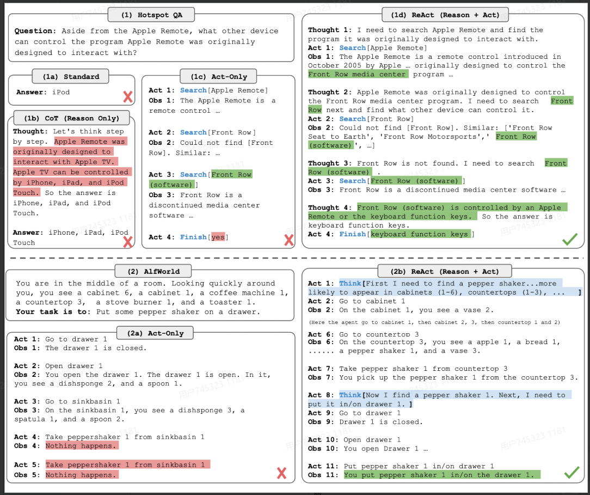
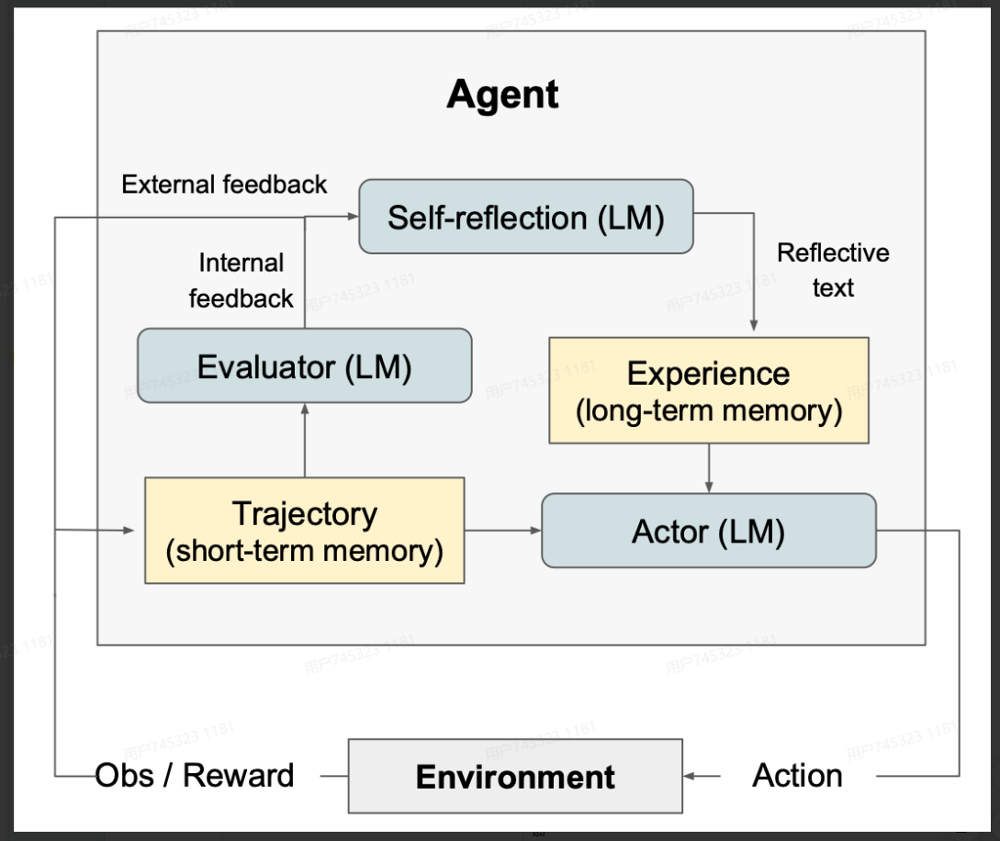

# LLM-base Agent 基于大模型的智能体

智能体（Agent）为能**感知**环境、自主**决策**、主动**行动**和**学习**进化的AI程序**

- **感知：智能体的“眼睛”：**&#x667A;能体通过传感器感知环境,如摄像头捕捉图像、麦克风接收声音
- **决策：智能体的“大脑”：**&#x667A;能体的决策基于复杂的算法和模型，如深度学习、强化学习
- **执行：智能体的“手”：**&#x667A;能体通过执行器完成任务,如机械臂操作、软件指令执行
- **学习：智能体的自主进化：**&#x667A;能体可以通过过往的经验迭代更新自己的策略

**系统的 Agentic 程度取决于LLM对系统行为的决策权重：**

- 使用LLM将输入路由到特定下游工作流具备初步的Agentic，对应图中&#x7684;**"路由"（Router）层级**。
- 使用多个LLM进行多级路由决策，这将介于"路由"&#x548C;**"状态机"（State Machine）**&#x4E4B;间。
- 如果某个步骤需要决定继续执行还是终止——即允许系统循环运行直至完成任务，这属&#x4E8E;**"状态机"**&#x8303;畴。
- 当系统能自主构建工具、记忆工具并在后续步骤中使用，属于顶层&#x7684;**"自主Agent"（Autonomous Agent）**

# **2 基于大模型的智能体的原理**

LLM Agent是一种超越简单文本生成的人工智能系统。它使用**LLM作为其核心计算引擎**，使其能够进行对话、执行任务、推理并展现一定程度的自主性。简而言之，Agent是一个具有复杂推理能力、记忆和执行任务手段的系统

.jpg>)

**LLM Agent的定义**：通过与GenAI本身之外的系统交互的操作来服务于用户的目标的GenAI系统

Agent LLMs 可能涉及单个外部系统（计算器），或者需要解决routing问题**决定要去用哪个外部系统**（经常包含memory、planning）

> **基于大模型的智能体（LLM-based Agent） = LLM + 工具调用 + 规划 + 记忆**

## 规划（planning）

**子目标分解：**&#x61;gent将大任务拆分为更小的可管理的子目标，使得可以有效处理复杂任务

- **目的：一项复杂任务通常会包含很多步骤，Agent需要了解这些步骤是什么并提前规划。**&#x524D;面**提到的CoT以及改进方法，可以看作是在做任务分解。**

例如:

- 给LLM一个简单的提示词“Steps for XYZ.\n1.”，“What are the subgoals for achieving XYZ?”​
- 使用针对具体任务的指令，例如对一个写小说的任务先给出“Write a story outline.”指令
- 使用者直接输入大任务,Agent自己分解小任务

**无论是CoT还是ToT，本质上是通过Prompt的精心设计，激发出模型原有的 Metacognition，只是如何通过某条神经元的线索能更加精准的调动出大脑中最擅长Planning的部分**

LLM擅长理解和生成自然语言，但面对 **多步骤、有约束、要最优解** 的长序列任务 , 纯 LLM 容易犯两个错：

1. 步骤混乱；
2. 忽略约束。

### LLM+P

LLM+P(lanning) ，就是让 LLM “借力”，把 “制定长序列规划” 这个它不擅长的事，交给更专业的工具(规划域定义语言 PDDL)做，最终既保留 LLM 的自然语言交互能力，又获得精准、最优的规划结果

首先LLM将问题翻译成“问题PDDL”，接着请求经典Planner根据现有的“领域PDDL”生成一个PDDL Plan，最后将PDDL计划翻译回自然语言（LLM做的）。根本上讲，Planning Step是外包给外部工具的，当然也有一个前提：**需要有特定领域的PDDL和合适的Planner**

如上图所示,通过 ICL+Planner ,实现了对LLM更强大的规划约束,使得操作过程更加符合实际需求

**反思(Self-reflection)：**Agent 通过回顾历史动作，自我批评、纠正错误、优化决策，应对现实任务中的试错场景，提升最终结果质量。

ReAct  : Reason（推理）+ Act（行动），扩展 Action Space 为 “特定任务离散动作 + 语言空间”，在 LLM 内整合推理与交互。

- **提示词模板**：固定为 `Thought: 推理过程 → Action: 执行动作 → Observation: 环境反馈` 的步骤化格式。
- **优势**：在知识密集型任务和决策任务中，比仅保留`Act`的单一方式表现更优。

## 记忆(memory)

- **短期记忆：上下文学习**即是利用模型的短期记忆学习
- **长期记忆：**&#x4E3A;agent提供保留和召回长期信息的能力，通常利用**外部向量存储和检索实现**

记忆可以定义为用于获取、存储、保留和随后检索信息的过程。上图是人脑中有多种类型的记忆：

**最大内部产品搜索（MIPS）**:  由于大模型（LLM）的上下文窗口有限，无法记住所有历史信息，因此需要外挂一个“大脑”（外部向量存储器）。
为了在这个巨大的存储器中**快速**找到与当前问题最相关的记忆，系统采用了一类统称为 **ANN（Approximate Nearest Neighbor，近似最近邻）** 的算法。

它的核心逻辑是：**牺牲一点点精度（不一定非要找到绝对最相似的那个），换取检索速度的巨大提升**。

> **LSH ：**它引入了一种哈希函数，这种哈希函数能够最大限度地将相似的输入项映射到同一个桶中，其中桶的数量要远小于输入内容的数量
>
> **ANNOY：**核心数据结构是随机投影树,它是一个二叉树集合,每个非叶子节点表示将输入空间划分为两半的一个超平面,每个叶子节点存储一个数据点。这些树是独立随机构建的,在某种程度上,它模拟了一个哈希函数的作用。ANNOY 的搜索发生在所有树中,迭代地搜索最接近查询的那一半,然后聚合结果。其思想与 KD 树非常相关,但是可扩展性更强
>
> **HNSW ：**HNSW的设计思想来源于小世界网络，在小世界网络中，每个节点只需要通过很少的步数就可以连接到任何其他节点。比如社交网络中的“六度分隔”理论。HNSW构建了多层的小世界网络结构,底层包含实际的数据点。中间层创建了一些“快捷键”来加速搜索过程。在进行搜索时，HNSW从顶层的一个随机节点开始，逐步导航向目标节点移动。如果在一层无法接近目标，它就会下降到下一层，直到到达底层。在上层每一步导航都能潜在地跨越数据空间中的大距离,而在下层每一步导航可以提高搜索的质量
>
> **FAISS：**它基于这样一个假设,即在高维空间中,节点之间的距离遵循高斯分布,因此应该存在数据聚类。FAISS通过向量量化来实现,先将向量空间划分为若干集群,然后在每个集群内进行更精细的量化。在搜索时,首先使用粗粒度的量化查找可能的集群候选,然后在每个候选集群内使用更细致的量化进行进一步查找
>
> **ScaNN：**ScaNN算法的主要创新在于使用了各向异性向量量化。他对数据点到进行向量化，使得内积\<q,>尽可能与∠q和的原始距离相似，而不是选择最接近的量化质心点

记忆的获取在某种程度上会提高Planning整体质量，但同时也会拉长整体服务的时延，因此如何快速且精准的捕捉相关的记忆至关重要。Vector Search和Attention Mechanism之间的平衡也是速度与准确性之间的平衡。当然都是因为没有无限的上下文学习

## **工具使用（tool use）**

- 对模型权重丢失的信息，**agent学习调用外部API获取额外信息，包括当前信息、代码执行能力、专有信息源的访问**等等

**和Agent的对话就是：**&#x4F60;有一个助手，你不是简单地直接写，先询问你是否需要进行一些网络研究，然后写下初稿，然后**回顾**初稿，并**思考**哪些部分需要修改，然后**修改**草稿，不断进行思考和迭代这个过程。 这个流程是一个**思考+迭代**的过程

### **与强化学习智能体的区别**

- **强化学习智能体：**输入为**预设好的向量化的环境状态（或者图像）**，策略通常由**简单的神经网络结构进行初始化**，输出**动作多为底层控制**（移动、攻击等）

- **基于大模型的智能体：**输出为**文字（多模态场景下也会有视觉、语音等信息）**，策略为**预训练的具备世界知识的大语言模型**，输出动作为**文本，但可以通过结构化输出和提取实现function\_call，进一步与现实环境进行交互**

# 3 Agent分类

### **Tool Use Agent**

- **MRKL system：Modular Reasoning, Knowledge, and Language** 模块化推理、知识和语言。一个LLM作为router提供对多种工具的访问，然后router可以多次调用工具获取诸如时间、天气等信息，然后结合这些信息给出回复。下面的相关工作都是类似的技术，大部分还包含了微调：**Toolformer、Gorilla、Act-1、Hugging-gpt、ToolkenGPT**
- **CRITIC：Self-Correcting with Tool-Interactive Critiquing&#x20;**&#x5229;用工具交互评价来自我修正。首先根据prompt生成回答，然后同样的LLM对答案中可能出现的错位进行criticize，最后使用相应的外部工具，如联网搜索、代码解释器对部分回答进行验证或修正。**CRITIC流程图：**

### **Code Generation Agent**

代码编写和执行能力也是一项重要的Agent能力，**也可以被划分为 Tool Use Agents（Tool就是代码解释器等）**

- **Program-aided LM(PAL)：**&#x5C06;问题直接转换为code，然后利用Python解释器生成答案

- **Tool-Integrated Reasoning Agent：**&#x7C7B;似PAL，但是**code和推理多步交叉**直到解决问题，P**AL是单个code-gen step**。下图是CoT、PAL和Tool-Integrated Reasoning Agent的对比

- **TaskWeaver：**&#x4E5F;是类似PAL，但是可以利用**用户定义的插件**

  

### Observation-based Agent

一些Agents被**设计为通过与toy env(gym之类的环境)交互来解决问题**，这些基于Obs的Agent会将**接收到的观测插入到Prompt中**

| 技术                     | 背景                                                         | 简介                                                         | 具体方法                                                     |
| ------------------------ | ------------------------------------------------------------ ------------------------------------------------------------| ------------------------------------------------------------ | ------------------------------------------------------------ |
| **Reasoning and Acting** | 传统CoT中存在的幻觉和错误传播问题; Act- only的方法不能充分利用LLM reasoning的高层目标规划能力 | 结合LLM推理和生成动作的能力，交替生成推理轨迹和特定任务的动作，重复 **产生一个thought -> 采取一个动作 -> 接收一个观测** 的流程，然后所有的信息加入prompt中，相当于保存了过去的经历的记忆。支持外部工具访问。ReAct仅需学习一到六个context examples即可泛化到新任务实例 | **流程及与CoT和Act-only方法的对比** |
| **Reflexion**            | LLM快速的从trial-and-error 中学习仍然很有挑战性，因为传统的强化学习方法需要大量的训练样本和昂贵的模型微调 | 由三个不同的模型组成：**Actor、Evaluator和Self-Reflection**。相比ReAct，多了Evaluator和Reflection。Actor来生成文本和动作，并在环境中接收观察结果。Evaluator评估Actor产生的轨迹的质量，并计算一个奖励分数以反映其性能。Self-Reflection模型则对反馈内容进行反思（做了什么，什么出错了），然后加入prompt作为memory，在任务中不断迭代优化，从而提高决策能力 | **流程图**内部反馈是Evaluator给出的反馈，外部反馈是环境给出的标量奖励之类的反馈 |

以及Lifelong Learning Agents (Voyager),   Ghost in the Minecraft等,不赘述

### **RAG Agent**

从外部来源（本地知识库等）检索信息并插入prompt的范式，可以提高知识密集型任务的性能。**RAG其实也是一种特殊的Agent，一般都是调用外部数据库/向量库作为工具**

| **技术**                             | **背景**                                                     | **简介**                                                     | **具体方法**                                                 |
| ------------------------------------ | ------------------------------------------------------------ | ------------------------------------------------------------ | ------------------------------------------------------------ |
| **Verify-and-Edit**                  | CoT通过生成**可解释的推理链**来提高复杂推理任务的信任和模型性能，但在知识密集型任务中仍然存在事实性问题(幻觉,信息不相关) | 生成**多条CoT，选择一些进行编辑**，编辑是通过对外部信息检索然后允许LLM对这些进行增强 | **流程图**           |
| **Demonstrate-Search-Predict**       | 现有工作简单将 RM 检索插入到 LM prompt中在multi-hop问题中效果不是很好 | 利用**few-shot将一个问题分解为子问题**，然后将对应的子问题的回答结合为最终的answer | **示例流程**         |
| **Iterative Retrieval Augmentation** | 生成之前的一些检索增强LM存在两个方面的限制：一次性生成文本在long-form生成任务中容易产生幻觉采用概括性的topic作为query导致查询不到相关细节内容 | **FLARE：**&#x8FED;代的检索生成，先生成一个临时句子，然后检查句子中是否包含低可信度的token，如果有就进行检索然后重新生成句子，重复这个步骤直到完成 | 示例检索query生成：隐式query通过mask掉临时句子中的probs低于阈值的token生成；显式query通过要求LM生成 答案为临时句子中probs低于阈值的span 的问题，这些问题作为query去进行检索，然后将检索文档加入prompt重新生成句子**流程图** |

​    **IRP：**说明性文本生成任务。包含三个组件，Imitator、Retriever和Paraphraser。Imitator首先生成一个stylistic content plan，概述要包含在下一句中的事实，然后Retriever根据plan在语料库中检索相关facts，最后Paraphraser以plan的风格重新表述这些facts，加到输出后面作为下一个的prefix。sentence-by-sentence生成  **流程：**&#x49;mitator是用训练集中说明性文本的expert content plan进行训练的；Retriever部分为了减轻plan中的幻觉事实entity损害模型的检索能力，文章用DistilBERT在训练集上进行了分类任务微调，即预测这个文本中的句子的index（第几个句子），因为来自不同文本的同样index的句子的事实相关entity肯定是不同的，所以这样会使得模型对于事实entity的token的attribution scores更低 训练集GT示例**流程图**如下所示

#  4 Agentic system分类**

从架构上看，Agentic system 可以分为两大类系统：

- **工作流（Workflow）：**&#x901A;过预定义代码路径编排 LLM 和工具，适用于**任务明确、步骤可预定义的场景**
- **自主智能体（Autonomous Agent）：**&#x4C;LM 动态控制决策和工具使用，自主规划任务，适用于任务**步骤难以预知、需长期自主规划**的场景

**基础构建模块：增强型 LLM**

综合使用上面提到的几种工具的LLM,利用tools提升能力

## **工作流（Work Flow）**

### **工作流：提示链 Prompt Chaining**

Prompt Chaining 将任务分解为顺序执行的子步骤，每一步都由一个 LLM 调用来处理上一步骤的输出。你可以在任意中间步骤添加程序检查（见下图中的“gate”）以确保整个过程依然按计划执行。

**适用场景：** 当一个任务将任务分解为**顺序执行的子步骤**时，可以使用此工作流。其主要目标是通过将每次 LLM 调用简化为一个更容易处理的任务，从而以牺牲延迟换取更高的准确性。

**示例：**

- 先生成市场营销文案，再将其翻译成另一种语言。
- 编写文档提纲、检验提纲是否符合某些标准，然后再根据提纲写出完整文档。

### **工作流：路由 Routing**

Routing 先对**输入进行分类**，再将其分配到专门的后续任务中。这让我们能更好地实现任务分工，以及**针对不同类型的输入构建更为专门化的提示（prompt）**。若没有这种路由机制，针对某类输入的优化可能会损害其他输入的性能。

### **工作流：并行 Parallelization**

有时，LLM 可以同时执行多个任务，然后将它们的输出以编程方式聚合在一起，这就是并行化（Parallelization）工作流。它有两个主要变体：

- 分段**Sectioning**：将任务划分为可以并行运行的独立子任务。
- 投票**Voting**：对同一任务进行多次执行，从而获得多样化的输出，以进行对比或投票。

**适用场景：** 当将任务分解后，子任务可以并行执行以提高速度，或者当需要通过**多角度、多次尝试来提高结果置信度时，并行化非常有效**。对于包含多个考虑因素的复杂任务，当**每个因素由独立的 LLM 调用处理**时，模型通常能更专注地解决每个问题。

**示例：**

- **Sectioning**：
  - 并行内容审核与主任务处理：一个模型实例负责处理用户**查询**，另一个模型实例同时对查询进行不恰当内容或非法请求**筛查**。相比让一个 LLM 同时处理主要回复及安全防护，这种做法表现更优。
  - 自动化多维度模型评估：**自动化评估（evals）LLM 的性能，每次调用一个 LLM 来评估模型在某个方面的表现**。
- **Voting**：
  - 审查代码是否存在漏洞：多个不同提示审查代码，发现问题时进行标记。
  - 评估某段内容是否不当：多个提示从不同角度评估，或设定不同的**投票阈值**以平衡误报与漏报。

### **工作流：协调者-工作者 Orchestrator-Workers**

在 Orchestrator-Workers 工作流中，“协调者”LLM 会动态拆解任务、将其分配给“工作者”LLM，然后再将结果综合起来。

Orchestrator-Workers 工作流

Orchestrator作为整个架构的 “大脑”，负责**全局管控与调度**，不直接执行具体任务 , 跟据workers的负载状态(空闲/忙碌) ,性能(编程优/对话优/架构优) , 将任务分配给workers  ;  任务失败时自动重试 or 中断 , 最终整合为完整结果 , 反馈给用户 or 上层系统 

**适用场景：** 这种方式非常适合**子任务不可预知的复杂任务**（例如在编程中，每次可能需要修改多少文件以及每个文件的修改方式都要视具体任务而定）。它与并行化在拓扑结构上类似，但二者的关键区别在于灵活性——并行化的子任务是预定义的，而 Orchestrator-Workers 模式下的子任务则是由中心 LLM 根据具体输入来动态决定。

**示例：**

- 多文件代码修改：每次都需要对多个文件进行复杂改动的编程产品。
- 多源信息搜索分析：在多源信息中搜索并分析可能相关的信息来完成搜索任务。

### **工作流：评估-优化循环 Evaluator-Optimizer**

在 Evaluator-Optimizer 工作流中，一个 LLM 用于生成响应，另一个 LLM 用于对该响应进行评估并给出反馈，二者循环往复。

Evaluator-Optimizer 工作流

**适用场景：** 存在**明确评估标准且迭代优化有效**。判断是否适用的两大标准是：

1. 当人类给出反馈时，LLM 的输出能**明显改进**；
2. LLM 本身也有能力生成这类反馈。
   这类似于一个人编写文档时反复修改、润色的过程。

**示例：**

- 文学翻译润色：一些细微的语言差异可能在初稿中并未充分体现，而评估者 LLM 可以指出这些不足并给出改进意见。
- 复杂搜索任务的多轮优化：需要多轮搜索和分析以收集全面信息，由评估者判断是否需要进一步搜索。

Evaluator-Optimizer 是一个**持续迭代的闭环流程**，并非一次性操作，典型工作步骤如下：

1. **初始系统执行任务**：RAG-Agent 接收用户查询（如 “2025 年智能家居市场规模”），执行基础 RAG 流程，生成初步回答。
2. Evaluator 评估结果：
   - 评估维度：回答准确率（量化）、是否存在幻觉（定性）、信息完整性（定性）；
   - 评估结果：准确率 60%，存在幻觉（将 2024 年数据误标为 2025 年），缺少 “区域市场分布” 信息，不符合要求。
3. Optimizer 分析与优化：
   - 根源分析：幻觉源于 “知识库缺少 2025 年数据，Agent 借用了 2024 年数据”；信息缺失源于 “检索关键词过于单一，未覆盖‘区域分布’”；
   - 优化策略：① 补充 2025 年智能家居行业报告到知识库；② 调整 RAG 检索策略，增加 “区域市场” 相关关键词扩展；③ 降低 LLM 温度系数（从 0.7 降至 0.3），减少幻觉生成；
   - 执行优化：自动化更新知识库、调整检索与模型参数。
4. **优化后系统再次执行任务**：RAG-Agent 基于优化后的配置，重新生成针对 “2025 年智能家居市场规模” 的回答。
5. **Evaluator 验证优化效果**：再次评估，准确率提升至 95%，无幻觉，包含区域市场分布信息，符合指标要求。
6. **循环终止 / 迭代**：若优化效果达标，循环终止；若未达标（如准确率仍低于 90%），重复步骤 2-5，直到满足性能要求；对于动态场景（如知识库需定期更新），可设置定时循环，持续优化。

## 5 智能体框架

构建智能体系统的框架：

- **全代码框架：**
  - **Langchain & LangGraph**
  - **LlamaIndex**
  - 多智能体协作框架：**AutoGen、CrewAI、Swarm、CAMEL**
- **可视化低代码平台：**
  - **DIfy**（开源（有修改的Apache 2.0 协议），超出免费额度后需要购买套餐）
  - **Coze**（闭源，超出免费额度后需要购买套餐）

## **Agentic应用**

### **RAG应用**

- **GraphRAG：**&#x901A;过构建知识图谱增强RAG检索准确率

- **LightRAG：**&#x8F7B;量化的GraphRAG实现

- **DeepSearcher：**&#x91C7;用树状结构而非图结构存储

  

**GraphRAG:**

- 优点：图谱知识点关联性强，**知识粒度小**，**检索精准**
- 缺点：图谱构建耗时、知识更新难、检索耗时长

**DeepSearcher:**

- 优点：树形知识结构代替图谱结构，也可以缩小知识粒度，也能精准检索。能**并行检索**性能优越
- 缺点：**跨文档知识关联性不强**，对推理性查询不友好

| **特性**      | **GraphRAG**                             | **LightRAG**                         | **DeepSearcher (Tree/RAPTOR)**                  |
| ------------- | ---------------------------------------- | ------------------------------------ | ----------------------------------------------- |
| **核心结构**  | **知识图谱 (Graph)**                     | **图 + 向量 (Hybrid)**               | **递归树 (Tree/Hierarchy)**                     |
| **最强能力**  | **全局概览** (Q: "数据集的主题是什么？") | **高性价比** (平衡成本与效果)        | **长文理解 & 向下钻取** (Q: "细节依据是什么？") |
| **索引机制**  | 社区发现 + 层级摘要 (Leiden算法)         | 双层索引 (实体+关系)，增量更新       | 递归聚类 + 摘要 (Bottom-up)                     |
| **成本/速度** | 高成本 / 慢                              | 低成本 / 快                          | 中高成本 / 取决于深度                           |
| **适用场景**  | 金融研报分析、情报分析、大规模文献综述   | 企业级实时知识库、动态更新的业务文档 | 法律文书审查、书籍问答、学术论文深度研读        |

**图（Graph）侧重于实体之间的横向联系**（A 认识 B，B 投资 C）。

**树（Tree）侧重于内容的纵向归纳**（主题 A -> 子主题 B -> 细节 C）。

如果你需要**最高质量**的跨文档关联分析，且不在乎成本，选 **GraphRAG**。

如果你需要在生产环境落地，要求**响应快、成本低**且数据经常变动，选 **LightRAG**。

如果你主要处理**长篇大论**（如几百页的合同或书），需要从宏观到微观的精准定位，选 **DeepSearcher (Tree/RAPTOR)** 模式。

单智能体应用

BabyAGI、AutoGPT、HuggingGPT等，通过设计不同的prompt和工作流，利用OpenAI模型或者huggingface上的模型，实现任务规划、任务执行、任务排序等功能**

这张图生动地解释了 **"Agent = LLM + Memory + Planning + Tools"** 这个公式中的动态过程：

1. **感知与执行** (Execution Agent)：手和脚，负责干活。
2. **记忆存储** (Vector DB + Context Agent)：大脑皮层，负责记住干过什么，避免重复劳动。
3. **认知与规划** (Task Creation + Prioritization Agent)：前额叶，负责根据反馈调整计划，决定下一步做什么。

**应用场景举例：** 如果你给这个系统一个目标：“帮我写一份关于英伟达财报的市场分析报告”。

1. 它会先拆解任务（搜索财报 -> 阅读财报 -> 撰写分析）。
2. **Step 1** 执行“搜索财报”。
3. **Step 2** 记住搜索到的财报链接。
4. **Step 3** 发现还没内容，于是创建新任务“读取链接内容”，并将其优先级排到最高。
5. **Loop** 回到开头，开始执行“读取链接内容”。

这就是当前大热的 **Agentic Workflow（智能体工作流）** 的雏形。

## Agent+RL框架

### GAIR/ToRL 框架

**ToRL**聚焦解决「智能体如何**高效选择、调用、适配外部工具**（如浏览器、代码执行器、API 等）」的核心问题，填补了传统 RL 在工具协同场景的空白。

**具体做法**

- **工具调用频率控制**：为了平衡训练效率，引入超参数 C，表示每次响应生成允许的最大工具调用次数；
- **执行环境选择**：选择稳定、准确和响应迅速的代码解释器实现；
- **错误消息处理**：提取关键错误信息，减少上下文长度；
- **沙盒输出掩码**：在损失计算中掩盖沙盒环境的输出，提高训练稳定性。

**奖励设计**：实现了基于规则的奖励函数，正确答案获得 + 1 奖励，错误答案获得 - 1 奖励。此外，研究还尝试探究了基于执行的惩罚：含有不可执行代码的响应会导致 - 0.5 的奖励减少。在默认实验设置中，仅使用了答案正确性的 reward。

**局限**：仅聚焦工具使用场景，不支持无工具的纯决策任务，对工具接口标准化要求较高。

### OpenManus/OpenManus-RL 框架

multi-agentic + RL  的融合框架，核心是用 RL 优化 OpenManus 的任务规划能力。

在 OpenManus 原有 “思考 - 规划 - 执行 - 反馈” 循环中，引入 RL 策略（DQN/PPO）优化任务规划步骤，减少无效操作（如冗余工具调用、错误任务拆分）

- **局限**：RL 策略收敛速度较慢（复杂任务下需大量迭代）、多智能体协作的稳定性弱于商业闭源方案。

### RAGEN 框架

**RAG（检索增强生成）+ 轻量 RL** 的融合方案，解决大模型 “知识遗忘”“幻觉生成”“专业知识不足” 的问题。

- **优势**：生成内容幻觉少、知识准确性高、支持多模态知识、可本地部署；
- **局限**：知识库构建与维护成本较高、RL 检索策略在海量知识库下效率下降、对 embedding 模型的依赖较强。

### eleurent/RL-Agents 框架

- **多 RL 算法原生支持**：内置 DQN、DDQN、PPO、SAC、TD3 等主流强化学习算法，无需手动实现核心逻辑，可快速切换算法进行对比实验。

- **优势**：轻量化、算法丰富、环境适配广、调试便捷、适合快速迭代实验；
- **局限**：不支持多智能体协同训练（仅支持单智能体）、工程化落地能力较弱（无成熟的部署工具链）、缺乏大规模工业场景验证。

| 框架名称               | 核心定位                      | 核心优势                         | 核心适用场景                 | 开源协议           |
| ---------------------- | ----------------------------- | -------------------------------- | ---------------------------- | ------------------ |
| GAIR/ToRL              | 工具导向强化学习框架          | 工具协同高效、稀疏奖励优化好     | 智能助手、机器人工具调用     | 学术开源（非商用） |
| OpenManus/OpenManus-RL | 多智能体 RL 增强 AI 代理框架  | 开源免费、本地部署、扩展性强     | 办公自动化、轻量级智能运维   | MIT（商用友好）    |
| RAGEN                  | 检索增强生成框架（含轻量 RL） | 知识准确性高、幻觉少、多模态支持 | 专业问答、知识密集型内容生成 | Apache 2.0         |
| eleurent/RL-Agents     | 自主智能体轻量化 RL 框架      | 算法丰富、环境适配广、调试便捷   | 机器人控制、自动驾驶仿真     | MIT                |